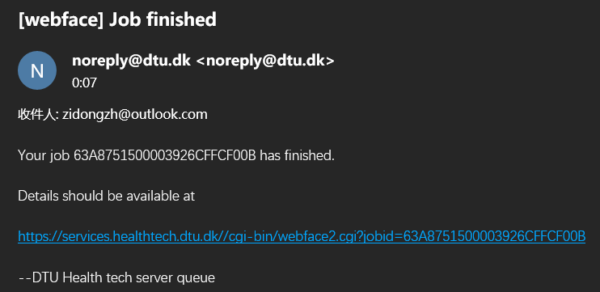
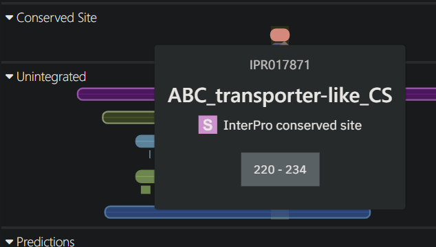
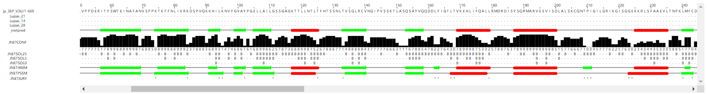

# 蛋白质性质和结构分析

> 日期：2022-12-7
>
> 实验者：生信 2001 张子栋
>
> [MarkdownNotes/软件第8次作业.md at main · Bluuur/MarkdownNotes (github.com)](https://github.com/Bluuur/MarkdownNotes/blob/main/生物信息学原理/软件第8次作业.md)
> [生物信息学原理/软件第8次作业.md · blur/MarkdownNotes - 码云 - 开源中国 (gitee.com)](https://gitee.com/bluur/MarkdownNotes/blob/main/生物信息学原理/软件第8次作业.md)

[toc]

## 实验目的

+ 熟悉蛋白质序列和结构的主要分析内容。
+ 在实践中逐步理解蛋白质序列和结构的主要分析算法的基本原理。

## 实验内容

+ 综合使用多种在线工具，对蛋白质的一级、二级和三级结构进行分析和预测。
+ 综合使用多种在线工具，对蛋白质的跨膜结构、翻译后修饰、亚细胞定位等进行分析和预测。

## 实验步骤

### Nanog 

1. **Nanog 是 2003 年 5 月发现的一种转录因子，是一个有助于胚胎干细胞自我更新的关键因子，被认为在胚胎干细胞的全能性维持中起关键作用。人源 Nanog 基因，通常写成 Nanog1，位于 12 号染色体上。针对该基因（`AY230262`），请完成以下分析：**

#### **预测该基因编码产物的亚细胞定位。（至少使用两种预测方法，并比较不同方法的预测结果是否一致）**

  检索 `AY230262` 蛋白质序列 [NANOG [Homo sapiens\] - Protein - NCBI (nih.gov)](https://www.ncbi.nlm.nih.gov/protein/AAP49529.1?report=fasta)

```FASTA
  >AAP49529.1 NANOG [Homo sapiens]
  MSVDPACPQSLPCFEASDCKESSPMPVICGPEENYPSLQMSSAEMPHTETVSPLPSSMDLLIQDSPDSST
  SPKGKQPTSAEKSVAKKEDKVPVKKQKTRTVFSSTQLCVLNDRFQRQKYLSLQQMQELSNILNLSYKQVK
  TWFQNQRMKSKRWQKNNWPKNSNGVTQKASAPTYPSLYSSYHQGCLVNPTGNLPMWSNQTWNNSTWSNQT
  QNIQSWSNHSWNTQTWCTQSWNNQAWNSPFYNCGEESLQSCMQFQPNSPASDLEAALEAAGEGLNVIQQT
  TRYFSTPQTMDLFLNYSMNMQPEDV
```

  ​           

##### PSORT [WoLF PSORT: Protein Subcellular Localization Prediction (hgc.jp)](https://wolfpsort.hgc.jp/)

+ 粘贴序列并提交 
  
+ 预测结果为 `nucl` ，对照 WoLF PSORT 细胞定位缩写表，即亚细胞定位为细胞核。
  

##### Yloc [YLoc (uni-tuebingen.de)](https://abi-services.informatik.uni-tuebingen.de/yloc/webloc.cgi)

+ 粘贴序列，选择预测模型、物种后进行预测。
  
+ 亚细胞定位为细胞核。
  QuaryID: `ec8ab61daa7d0a3892ba1830b4268aa2`
  

##### DeepLoc

+ 输入序列后提交。[DeepLoc - 1.0 - Services - DTU Health Tech](https://services.healthtech.dtu.dk/service.php?DeepLoc-1.0)
  
+ 预测结果为细胞核。
  
  
  

#### **人 Nanog 基因产物是否是糖蛋白？什么类型的糖蛋白？**

##### GlycoEP [Prediction of Glycosysylation sites in Eukaryotics Proteins (osdd.net)](http://crdd.osdd.net/raghava/glycoep/submit.html)

粘贴序列后提交。


##### NetOGlyc [NetOGlyc - 4.0 - Services - DTU Health Tech](https://services.healthtech.dtu.dk/service.php?NetOGlyc-4.0)

粘贴序列后提交。

显示 POSITIVE 的位点可能会被糖基化（Potential > 0.5）


         ```GFF
         ##gff-version 2
         ##source-version NetOGlyc 4.0.0.13
         ##date 22-12-25
         ##Type Protein
         #seqname	source	feature	start	end	score	strand	frame	comment
         AAP49529_1	netOGlyc-4.0.0.13	CARBOHYD	2	2	0.593531	.	.	#POSITIVE
         AAP49529_1	netOGlyc-4.0.0.13	CARBOHYD	10	10	0.35134		.	.	
         AAP49529_1	netOGlyc-4.0.0.13	CARBOHYD	17	17	0.124292	.	.	
         AAP49529_1	netOGlyc-4.0.0.13	CARBOHYD	22	22	0.397592	.	.	
         AAP49529_1	netOGlyc-4.0.0.13	CARBOHYD	23	23	0.601683	.	.	#POSITIVE
         AAP49529_1	netOGlyc-4.0.0.13	CARBOHYD	37	37	0.608048	.	.	#POSITIVE
         AAP49529_1	netOGlyc-4.0.0.13	CARBOHYD	41	41	0.823332	.	.	#POSITIVE
         AAP49529_1	netOGlyc-4.0.0.13	CARBOHYD	42	42	0.657648	.	.	#POSITIVE
         AAP49529_1	netOGlyc-4.0.0.13	CARBOHYD	48	48	0.816338	.	.	#POSITIVE
         AAP49529_1	netOGlyc-4.0.0.13	CARBOHYD	50	50	0.787776	.	.	#POSITIVE
         AAP49529_1	netOGlyc-4.0.0.13	CARBOHYD	52	52	0.922385	.	.	#POSITIVE
         AAP49529_1	netOGlyc-4.0.0.13	CARBOHYD	56	56	0.860595	.	.	#POSITIVE
         AAP49529_1	netOGlyc-4.0.0.13	CARBOHYD	57	57	0.885228	.	.	#POSITIVE
         AAP49529_1	netOGlyc-4.0.0.13	CARBOHYD	65	65	0.899472	.	.	#POSITIVE
         AAP49529_1	netOGlyc-4.0.0.13	CARBOHYD	68	68	0.892244	.	.	#POSITIVE
         AAP49529_1	netOGlyc-4.0.0.13	CARBOHYD	69	69	0.991003	.	.	#POSITIVE
         AAP49529_1	netOGlyc-4.0.0.13	CARBOHYD	70	70	0.868445	.	.	#POSITIVE
         AAP49529_1	netOGlyc-4.0.0.13	CARBOHYD	71	71	0.982961	.	.	#POSITIVE
         AAP49529_1	netOGlyc-4.0.0.13	CARBOHYD	78	78	0.974264	.	.	#POSITIVE
         AAP49529_1	netOGlyc-4.0.0.13	CARBOHYD	79	79	0.990992	.	.	#POSITIVE
         AAP49529_1	netOGlyc-4.0.0.13	CARBOHYD	83	83	0.936976	.	.	#POSITIVE
         AAP49529_1	netOGlyc-4.0.0.13	CARBOHYD	98	98	0.311117	.	.	
         AAP49529_1	netOGlyc-4.0.0.13	CARBOHYD	100	100	0.546425	.	.	#POSITIVE
         AAP49529_1	netOGlyc-4.0.0.13	CARBOHYD	103	103	0.138478	.	.	
         AAP49529_1	netOGlyc-4.0.0.13	CARBOHYD	104	104	0.717357	.	.	#POSITIVE
         AAP49529_1	netOGlyc-4.0.0.13	CARBOHYD	105	105	0.126528	.	.	
         AAP49529_1	netOGlyc-4.0.0.13	CARBOHYD	121	121	0.0999028	.	.	
         AAP49529_1	netOGlyc-4.0.0.13	CARBOHYD	129	129	0.0246992	.	.	
         AAP49529_1	netOGlyc-4.0.0.13	CARBOHYD	135	135	0.0108395	.	.	
         AAP49529_1	netOGlyc-4.0.0.13	CARBOHYD	141	141	0.0336472	.	.	
         AAP49529_1	netOGlyc-4.0.0.13	CARBOHYD	150	150	0.365898	.	.	
         AAP49529_1	netOGlyc-4.0.0.13	CARBOHYD	162	162	0.724423	.	.	#POSITIVE
         AAP49529_1	netOGlyc-4.0.0.13	CARBOHYD	166	166	0.862944	.	.	#POSITIVE
         AAP49529_1	netOGlyc-4.0.0.13	CARBOHYD	170	170	0.797324	.	.	#POSITIVE
         AAP49529_1	netOGlyc-4.0.0.13	CARBOHYD	173	173	0.74059		.	.	#POSITIVE
         AAP49529_1	netOGlyc-4.0.0.13	CARBOHYD	176	176	0.768598	.	.	#POSITIVE
         AAP49529_1	netOGlyc-4.0.0.13	CARBOHYD	179	179	0.160221	.	.	
         AAP49529_1	netOGlyc-4.0.0.13	CARBOHYD	180	180	0.482741	.	.	
         AAP49529_1	netOGlyc-4.0.0.13	CARBOHYD	190	190	0.136736	.	.	
         AAP49529_1	netOGlyc-4.0.0.13	CARBOHYD	197	197	0.169051	.	.	
         AAP49529_1	netOGlyc-4.0.0.13	CARBOHYD	200	200	0.087622	.	.	
         AAP49529_1	netOGlyc-4.0.0.13	CARBOHYD	204	204	0.143784	.	.	
         AAP49529_1	netOGlyc-4.0.0.13	CARBOHYD	205	205	0.0481689	.	.	
         AAP49529_1	netOGlyc-4.0.0.13	CARBOHYD	207	207	0.113265	.	.	
         AAP49529_1	netOGlyc-4.0.0.13	CARBOHYD	210	210	0.0859972	.	.	
         AAP49529_1	netOGlyc-4.0.0.13	CARBOHYD	215	215	0.158727	.	.	
         AAP49529_1	netOGlyc-4.0.0.13	CARBOHYD	217	217	0.189561	.	.	
         AAP49529_1	netOGlyc-4.0.0.13	CARBOHYD	220	220	0.139987	.	.	
         AAP49529_1	netOGlyc-4.0.0.13	CARBOHYD	223	223	0.0932478	.	.	
         AAP49529_1	netOGlyc-4.0.0.13	CARBOHYD	225	225	0.0317189	.	.	
         AAP49529_1	netOGlyc-4.0.0.13	CARBOHYD	228	228	0.117951	.	.	
         AAP49529_1	netOGlyc-4.0.0.13	CARBOHYD	230	230	0.101636	.	.	
         AAP49529_1	netOGlyc-4.0.0.13	CARBOHYD	238	238	0.0321494	.	.	
         AAP49529_1	netOGlyc-4.0.0.13	CARBOHYD	247	247	0.0359253	.	.	
         AAP49529_1	netOGlyc-4.0.0.13	CARBOHYD	250	250	0.0473348	.	.	
         AAP49529_1	netOGlyc-4.0.0.13	CARBOHYD	258	258	0.224786	.	.	
         AAP49529_1	netOGlyc-4.0.0.13	CARBOHYD	261	261	0.0486538	.	.	
         AAP49529_1	netOGlyc-4.0.0.13	CARBOHYD	280	280	0.595211	.	.	#POSITIVE
         AAP49529_1	netOGlyc-4.0.0.13	CARBOHYD	281	281	0.660622	.	.	#POSITIVE
         AAP49529_1	netOGlyc-4.0.0.13	CARBOHYD	285	285	0.753219	.	.	#POSITIVE
         AAP49529_1	netOGlyc-4.0.0.13	CARBOHYD	286	286	0.733299	.	.	#POSITIVE
         AAP49529_1	netOGlyc-4.0.0.13	CARBOHYD	289	289	0.294352	.	.	
         AAP49529_1	netOGlyc-4.0.0.13	CARBOHYD	297	297	0.170629	.	.	
         ```


 

##### NetNGlyc [Services- DTU Health Tech](https://services.healthtech.dtu.dk/service.php?NetNGlyc-1.0)

粘贴序列后提交。


+ 有四个位点可能糖基化（Potential > 0.5）

#### **分析人 Nanog 基因产物的亲水性和疏水性，列出最亲水和最疏水的位点。**

+ ProtScale 粘贴序列后提交。[Expasy - ProtScale](https://web.expasy.org/protscale/)
  

+ 最亲水位点：`Position: 105     Score:  1.300 (max)`

+ 最疏水位点：`Position: 153     Score: -3.156 (min)`

+ ```
  MIN: -3.156, MAX: 1.300
  Sequence: 
  MSVDPACPQSLPCFEASDCKESSPMPVICGPEENYPSLQMSSAEMPHTETVSPLPSSMDLLIQDSPDSSTSPKGKQPTSAEKSVAKKEDKVPVKKQKTRTVFSSTQLCVLNDRFQRQKYLSLQQMQELSNILNLSYKQVKTWFQNQRMKSKRWQKNNWPKNSNGVTQKASAPTYPSLYSSYHQGCLVNPTGNLPMWSNQTWNNSTWSNQTQNIQSWSNHSWNTQTWCTQSWNNQAWNSPFYNCGEESLQSCMQFQPNSPASDLEAALEAAGEGLNVIQQTTRYFSTPQTMDLFLNYSMNMQPEDV
  
  Scale: Hydropathicity.
  
  Window size: 9
  Scale not normalized.
  Relative weight for window edges: 100 %
  Weight variation model: linear
  
  
  Position:   5     Score: -0.067
  Position:   6     Score: -0.367
  Position:   7     Score:  0.144
  Position:   8     Score: -0.500
  Position:   9     Score:  0.167
  Position:  10     Score:  0.656
  Position:  11     Score:  0.067
  Position:  12     Score: -0.011
  Position:  13     Score:  0.078
  Position:  14     Score:  0.078
  Position:  15     Score:  0.444
  Position:  16     Score: -0.411
  Position:  17     Score: -0.622
  Position:  18     Score: -0.989
  Position:  19     Score: -1.389
  Position:  20     Score: -1.178
  Position:  21     Score: -1.167
  Position:  22     Score: -1.256
  Position:  23     Score: -0.400
  Position:  24     Score: -0.178
  Position:  25     Score:  0.533
  Position:  26     Score:  0.878
  Position:  27     Score:  0.789
  Position:  28     Score:  0.489
  Position:  29     Score:  0.278
  Position:  30     Score: -0.322
  Position:  31     Score: -0.289
  Position:  32     Score: -0.933
  Position:  33     Score: -1.522
  Position:  34     Score: -1.378
  Position:  35     Score: -1.722
  Position:  36     Score: -1.333
  Position:  37     Score: -1.033
  Position:  38     Score: -0.733
  Position:  39     Score: -0.144
  Position:  40     Score: -0.389
  Position:  41     Score: -0.000
  Position:  42     Score: -0.089
  Position:  43     Score: -0.867
  Position:  44     Score: -0.556
  Position:  45     Score: -1.156
  Position:  46     Score: -1.144
  Position:  47     Score: -0.589
  Position:  48     Score: -0.878
  Position:  49     Score: -0.667
  Position:  50     Score: -0.456
  Position:  51     Score: -0.456
  Position:  52     Score: -0.189
  Position:  53     Score: -0.200
  Position:  54     Score:  0.400
  Position:  55     Score:  0.089
  Position:  56     Score:  0.044
  Position:  57     Score:  0.556
  Position:  58     Score:  1.233
  Position:  59     Score:  0.422
  Position:  60     Score:  0.211
  Position:  61     Score:  0.211
  Position:  62     Score:  0.122
  Position:  63     Score: -0.478
  Position:  64     Score: -0.178
  Position:  65     Score: -0.689
  Position:  66     Score: -1.189
  Position:  67     Score: -1.778
  Position:  68     Score: -1.567
  Position:  69     Score: -1.611
  Position:  70     Score: -1.567
  Position:  71     Score: -1.822
  Position:  72     Score: -1.822
  Position:  73     Score: -1.911
  Position:  74     Score: -1.900
  Position:  75     Score: -1.911
  Position:  76     Score: -1.622
  Position:  77     Score: -1.833
  Position:  78     Score: -1.833
  Position:  79     Score: -1.878
  Position:  80     Score: -0.978
  Position:  81     Score: -0.389
  Position:  82     Score: -0.644
  Position:  83     Score: -1.000
  Position:  84     Score: -1.300
  Position:  85     Score: -1.889
  Position:  86     Score: -1.933
  Position:  87     Score: -1.033
  Position:  88     Score: -1.122
  Position:  89     Score: -1.122
  Position:  90     Score: -1.756
  Position:  91     Score: -1.756
  Position:  92     Score: -1.711
  Position:  93     Score: -1.756
  Position:  94     Score: -1.444
  Position:  95     Score: -1.511
  Position:  96     Score: -2.056
  Position:  97     Score: -1.411
  Position:  98     Score: -1.567
  Position:  99     Score: -1.222
  Position: 100     Score: -0.878
  Position: 101     Score: -0.567
  Position: 102     Score: -0.522
  Position: 103     Score: -0.022
  Position: 104     Score:  0.756
  Position: 105     Score:  1.300 (max)
  Position: 106     Score:  1.256
  Position: 107     Score:  0.556
  Position: 108     Score:  0.256
  Position: 109     Score: -0.156
  Position: 110     Score:  0.233
  Position: 111     Score:  0.233
  Position: 112     Score: -0.689
  Position: 113     Score: -1.356
  Position: 114     Score: -2.256
  Position: 115     Score: -2.822
  Position: 116     Score: -2.011
  Position: 117     Score: -1.711
  Position: 118     Score: -0.789
  Position: 119     Score: -1.489
  Position: 120     Score: -1.489
  Position: 121     Score: -0.778
  Position: 122     Score: -0.778
  Position: 123     Score: -0.733
  Position: 124     Score: -0.167
  Position: 125     Score: -0.678
  Position: 126     Score: -0.978
  Position: 127     Score: -0.900
  Position: 128     Score: -0.089
  Position: 129     Score: -0.089
  Position: 130     Score:  0.122
  Position: 131     Score:  0.422
  Position: 132     Score:  0.667
  Position: 133     Score: -0.189
  Position: 134     Score: -0.489
  Position: 135     Score:  0.367
  Position: 136     Score: -0.567
  Position: 137     Score: -1.067
  Position: 138     Score: -0.778
  Position: 139     Score: -0.889
  Position: 140     Score: -1.189
  Position: 141     Score: -1.433
  Position: 142     Score: -1.389
  Position: 143     Score: -1.500
  Position: 144     Score: -1.756
  Position: 145     Score: -1.756
  Position: 146     Score: -1.767
  Position: 147     Score: -2.100
  Position: 148     Score: -2.911
  Position: 149     Score: -2.622
  Position: 150     Score: -2.622
  Position: 151     Score: -2.667
  Position: 152     Score: -2.556
  Position: 153     Score: -3.156 (min)
  Position: 154     Score: -2.822
  Position: 155     Score: -2.911
  Position: 156     Score: -2.911
  Position: 157     Score: -2.800
  Position: 158     Score: -2.789
  Position: 159     Score: -2.789
  Position: 160     Score: -2.400
  Position: 161     Score: -1.544
  Position: 162     Score: -1.233
  Position: 163     Score: -1.522
  Position: 164     Score: -1.778
  Position: 165     Score: -1.144
  Position: 166     Score: -0.844
  Position: 167     Score: -0.556
  Position: 168     Score: -0.344
  Position: 169     Score: -0.378
  Position: 170     Score: -0.989
  Position: 171     Score: -1.089
  Position: 172     Score: -0.789
  Position: 173     Score:  0.067
  Position: 174     Score: -0.278
  Position: 175     Score: -0.278
  Position: 176     Score: -0.567
  Position: 177     Score: -0.533
  Position: 178     Score: -0.811
  Position: 179     Score: -1.056
  Position: 180     Score: -0.922
  Position: 181     Score: -0.556
  Position: 182     Score: -0.556
  Position: 183     Score:  0.056
  Position: 184     Score: -0.244
  Position: 185     Score: -0.333
  Position: 186     Score: -0.267
  Position: 187     Score:  0.044
  Position: 188     Score:  0.044
  Position: 189     Score:  0.511
  Position: 190     Score:  0.056
  Position: 191     Score: -0.156
  Position: 192     Score: -0.722
  Position: 193     Score: -0.422
  Position: 194     Score: -0.633
  Position: 195     Score: -0.944
  Position: 196     Score: -0.978
  Position: 197     Score: -0.689
  Position: 198     Score: -1.500
  Position: 199     Score: -1.711
  Position: 200     Score: -2.011
  Position: 201     Score: -1.989
  Position: 202     Score: -2.000
  Position: 203     Score: -1.700
  Position: 204     Score: -1.700
  Position: 205     Score: -2.011
  Position: 206     Score: -1.989
  Position: 207     Score: -1.989
  Position: 208     Score: -1.989
  Position: 209     Score: -1.400
  Position: 210     Score: -1.711
  Position: 211     Score: -1.700
  Position: 212     Score: -1.711
  Position: 213     Score: -1.411
  Position: 214     Score: -1.411
  Position: 215     Score: -1.689
  Position: 216     Score: -1.389
  Position: 217     Score: -1.100
  Position: 218     Score: -1.989
  Position: 219     Score: -1.678
  Position: 220     Score: -1.978
  Position: 221     Score: -1.956
  Position: 222     Score: -1.967
  Position: 223     Score: -1.300
  Position: 224     Score: -1.022
  Position: 225     Score: -1.322
  Position: 226     Score: -1.311
  Position: 227     Score: -1.022
  Position: 228     Score: -1.333
  Position: 229     Score: -1.333
  Position: 230     Score: -1.644
  Position: 231     Score: -1.344
  Position: 232     Score: -1.722
  Position: 233     Score: -2.033
  Position: 234     Score: -1.733
  Position: 235     Score: -1.822
  Position: 236     Score: -1.411
  Position: 237     Score: -1.167
  Position: 238     Score: -1.167
  Position: 239     Score: -0.500
  Position: 240     Score: -0.744
  Position: 241     Score: -1.033
  Position: 242     Score: -1.033
  Position: 243     Score: -1.033
  Position: 244     Score: -0.433
  Position: 245     Score: -1.133
  Position: 246     Score: -1.078
  Position: 247     Score: -0.411
  Position: 248     Score: -0.478
  Position: 249     Score: -0.822
  Position: 250     Score: -0.122
  Position: 251     Score: -0.122
  Position: 252     Score: -0.211
  Position: 253     Score: -1.022
  Position: 254     Score: -0.722
  Position: 255     Score: -0.811
  Position: 256     Score: -0.889
  Position: 257     Score: -1.189
  Position: 258     Score: -1.189
  Position: 259     Score: -1.078
  Position: 260     Score: -1.078
  Position: 261     Score: -0.700
  Position: 262     Score: -0.111
  Position: 263     Score:  0.400
  Position: 264     Score:  0.189
  Position: 265     Score:  0.189
  Position: 266     Score:  0.478
  Position: 267     Score:  0.822
  Position: 268     Score:  0.011
  Position: 269     Score:  0.356
  Position: 270     Score:  0.578
  Position: 271     Score: -0.011
  Position: 272     Score:  0.033
  Position: 273     Score:  0.922
  Position: 274     Score:  0.333
  Position: 275     Score: -0.256
  Position: 276     Score: -0.289
  Position: 277     Score:  0.022
  Position: 278     Score: -0.433
  Position: 279     Score: -1.000
  Position: 280     Score: -0.300
  Position: 281     Score: -0.856
  Position: 282     Score: -1.433
  Position: 283     Score: -1.222
  Position: 284     Score: -1.222
  Position: 285     Score: -1.222
  Position: 286     Score: -0.933
  Position: 287     Score: -0.822
  Position: 288     Score: -0.256
  Position: 289     Score: -0.256
  Position: 290     Score:  0.256
  Position: 291     Score: -0.056
  Position: 292     Score: -0.022
  Position: 293     Score:  0.278
  Position: 294     Score:  0.567
  Position: 295     Score: -0.033
  Position: 296     Score:  0.567
  Position: 297     Score: -0.244
  Position: 298     Score: -0.733
  Position: 299     Score: -1.544
  Position: 300     Score: -1.544
  Position: 301     Score: -0.933
  ```

+ 
  

### 分析甲虫基因 `AF422804`

**分析一个甲虫基因（`AF422804`）编码的蛋白质的化学性质和结构特点（请注明分析方法名称）。**

获取蛋白质序列 [ABC transmembrane transporter white [Tribolium castaneum\] - Protein - NCBI (nih.gov)](https://www.ncbi.nlm.nih.gov/protein/AAL56571.1?report=fasta)
```FASTA
>AAL56571.1 ABC transmembrane transporter white [Tribolium castaneum]
MENETEPLLSGVVSQINGNSGDSTSSATSIDLSTFRVPTYGTTSHPTSKLVPPDERITYSWTEINAFANV
SPPKTKFFNLIKRKDSPVQKKHILKNVFGVAYPGELLAILGSSGAGKTTLLNTLTFHTSSNLTVSGLRCV
NGIPVSSKTLASQSAYVQQDDLFIGTLTVKEHLIFQALLRMDRDISYSQRMARVEEVISDLALSKCQNTP
IGILGRIKGISGGEKKRLSFAAEVLTNPKLMFCDEPTSGLDSFMALTVMQVLKEMAMTGKTVICTIHQPS
SEVYSMFDKLLLMSEGRTAFLGSPEEAETFFRELEAPCPRNYNPADYFIQLLAIVPEKEESSRQAVNLIC
DKFERSNIGVKIALEAATTEREGGYHDIWMSGESFKSPYKASCWAQFKAVLWRSILAVFKEPLLIKVRLL
QTLIISLVIGAIYFGQDLNQDGVMNINGVLFVFLTNMTFQNVFAVINVFSGELPVFLQEHRNGMYRPSIY
FISKTLAESPIFIIIPVTLTSVCYFMIGLNSHGFRFYIACGIMILVANVAISFGYLISCVSRSVSMALSI
GPPLVIPFLLFGGFFLNVSSIPIYFKWLSFLSWFRYGNGALMINQWENVTNIQCPNADLPCPKDGHVILE
TFHFSEADFVMDVVMLAVLIVGFRLVAFLALLVKTWRFK
```


#### **等电点是多少？分子量是多少？是否含有 pfam 保守结构域？如有，列出登录号。**

##### [Expasy - ProtParam tool](https://web.expasy.org/protparam/)

粘贴序列并提交。


```
Number of amino acids: 669

Molecular weight: 74351.58

Theoretical pI: 7.52

Amino acid composition: 
Ala (A)  41	  6.1%
Arg (R)  25	  3.7%
Asn (N)  31	  4.6%
Asp (D)  21	  3.1%
Cys (C)  12	  1.8%
Gln (Q)  20	  3.0%
Glu (E)  35	  5.2%
Gly (G)  42	  6.3%
His (H)  10	  1.5%
Ile (I)  52	  7.8%
Leu (L)  72	 10.8%
Lys (K)  32	  4.8%
Met (M)  20	  3.0%
Phe (F)  46	  6.9%
Pro (P)  32	  4.8%
Ser (S)  61	  9.1%
Thr (T)  40	  6.0%
Trp (W)   8	  1.2%
Tyr (Y)  18	  2.7%
Val (V)  51	  7.6%
Pyl (O)   0	  0.0%
Sec (U)   0	  0.0%

 (B)   0	  0.0%
 (Z)   0	  0.0%
 (X)   0	  0.0%


Total number of negatively charged residues (Asp + Glu): 56
Total number of positively charged residues (Arg + Lys): 57

Atomic composition:

Carbon      C	      3394
Hydrogen    H	      5311
Nitrogen    N	       855
Oxygen      O	       952
Sulfur      S	        32

Formula: C3394H5311N855O952S32
Total number of atoms: 10544

Extinction coefficients:

Extinction coefficients are in units of  M-1 cm-1, at 280 nm measured in water.

Ext. coefficient    71570
Abs 0.1% (=1 g/l)   0.963, assuming all pairs of Cys residues form cystines


Ext. coefficient    70820
Abs 0.1% (=1 g/l)   0.953, assuming all Cys residues are reduced

Estimated half-life:

The N-terminal of the sequence considered is M (Met).

The estimated half-life is: 30 hours (mammalian reticulocytes, in vitro).
                            >20 hours (yeast, in vivo).
                            >10 hours (Escherichia coli, in vivo).


Instability index:

The instability index (II) is computed to be 37.71
This classifies the protein as stable.


Aliphatic index: 100.52

Grand average of hydropathicity (GRAVY): 0.259
```

##### 等电点

+ `Theoretical pI: 7.52`

##### 分子量

+ `Molecular weight: 74351.58`

##### 保守结构域 

+ The Pfam website will be decommissioned in January 2023. [Pfam is now hosted by InterPro (xfam.org)](http://pfam.xfam.org/null)
  改用 InterProScan [InterPro (ebi.ac.uk)](https://www.ebi.ac.uk/interpro/)
+ 
+ 全部结果：
  

#### **是否膜蛋白质？如果是膜蛋白质，请注明跨膜结构位点。是否具有 GPI 固定（anchor）的蛋白质？**

##### [Services- DTU Health Tech](https://services.healthtech.dtu.dk/service.php?TMHMM-2.0) 

粘贴序列并提交。

+ 
  

+ 是膜蛋白，共有 6 个跨膜螺旋。

+ 以下为跨膜位点
  

+ 分析 GPI 位点 [GPI Modification Site Prediction (imp.ac.at)](https://mendel.imp.ac.at/gpi/gpi_server.html)
  粘贴序列并提交
  

+ 是无 GPI 固定的蛋白质
  Output of the prediction tool:

  ```
  ~~~~~~~~~~ ~~~~~~~~~~ ~~~~~~~~~~ ~~~~~~~~~~ ~~~~~~~~~~ ~~~~~~~~~~
  
  Query sequence AAL56571.1 (length 669 amino acids): 
  MENETEPLLS GVVSQINGNS GDSTSSATSI DLSTFRVPTY GTTSHPTSKL VPPDERITYS 
  WTEINAFANV SPPKTKFFNL IKRKDSPVQK KHILKNVFGV AYPGELLAIL GSSGAGKTTL 
  LNTLTFHTSS NLTVSGLRCV NGIPVSSKTL ASQSAYVQQD DLFIGTLTVK EHLIFQALLR 
  MDRDISYSQR MARVEEVISD LALSKCQNTP IGILGRIKGI SGGEKKRLSF AAEVLTNPKL 
  MFCDEPTSGL DSFMALTVMQ VLKEMAMTGK TVICTIHQPS SEVYSMFDKL LLMSEGRTAF 
  LGSPEEAETF FRELEAPCPR NYNPADYFIQ LLAIVPEKEE SSRQAVNLIC DKFERSNIGV 
  KIALEAATTE REGGYHDIWM SGESFKSPYK ASCWAQFKAV LWRSILAVFK EPLLIKVRLL 
  QTLIISLVIG AIYFGQDLNQ DGVMNINGVL FVFLTNMTFQ NVFAVINVFS GELPVFLQEH 
  RNGMYRPSIY FISKTLAESP IFIIIPVTLT SVCYFMIGLN SHGFRFYIAC GIMILVANVA 
  ISFGYLISCV SRSVSMALSI GPPLVIPFLL FGGFFLNVSS IPIYFKWLSF LSWFRYGNGA 
  LMINQWENVT NIQCPNADLP CPKDGHVILE TFHFSEADFV MDVVMLAVLI VGFRLVAFLA 
  LLVKTWRFK
  
  The site with the best score is shown in black.
  
  ~~~~~~~~~~ ~~~~~~~~~~ ~~~~~~~~~~ ~~~~~~~~~~ ~~~~~~~~~~ ~~~~~~~~~~
      Prediction of potential C-terminal GPI-Modification Sites
  ~~~~~~~~~~ ~~~~~~~~~~ ~~~~~~~~~~ ~~~~~~~~~~ ~~~~~~~~~~ ~~~~~~~~~~
  
  Use of the prediction function for METAZOA
  
  
  None potential GPI-modification site was found.
  Among all positions checked, sequence position 638 had the best score.
  
  
  Total Score.................................................:  -21.03 (PValue = 2.419695e-02)
  Components of the Score Function:
  Profile Score...............................................:   -9.72
  Term  0  Contents and Windows of DE in Region [-11..1]......:    0.00
  Term  1  Hydrophilicity of N-terminal Region [-11..1].......:   -0.00
  Term  2  Penalty for low Profile Score in Region [0..2].....:   -4.00
  Term  3  Volume Limitation [-1..+2].........................:   -2.24
  Term  4  Volume Compensation (-1, 1, 2).....................:   -2.02
  Term  5  Volume Compensation (-1, 2)........................:   -0.02
  Term  6  Backbone Flexibility [-1..2].......................:    0.00
  Term  7  Propeptide Length..................................:    0.00
  Term  8  Hydrophilicity of Spacer Region [3..8].............:   -0.48
  Term  9  Volume Limitation [3..8]...........................:   -0.74
  Term 10  Penalty for charged AAs in Spacer Region [3..10]...:    0.00
  Term 11  Backbone Flexibility [3..8].... ...................:    0.00
  Term 12  Penalty for low Profile Score in Region [10..end]..:    0.00
  Term 13  Hydrophobicity of Tail [10..end]...................:   -0.34
  Term 14  Hydrophobicity of Tail [26..end]...................:   -1.47
  Term 15  Even Distribution of Hydrophobicity [9..end].......:    0.00
  Term 16  Penalty for polar Windows in Region [10..end]......:    0.00
  Term 17  Penalty for SGC-Windows in Region [10..end]........:    0.00
  Term 18  LVI Contents [10..end].............................:    0.00
  Term 19  Penalty for FYHW - Sections in Region [10..end]....:    0.00
  Term 20  Penalty for Windows with small Volume [10..end]....:    0.00
  Profile independent Score...................................:   -7.31
  ```

#### **预测该蛋白序列的二级结构，并简述预测结果（至少使用两种预测方法，并比较不同方法的预测结果是否一致）。**

##### JPred [JPred: A Protein Secondary Structure Prediction Server (dundee.ac.uk)](http://www.compbio.dundee.ac.uk/jpred4/index.html) 

1. 输入序列并提交。
   

2. 提示 PDB 数据库中存在已知结构，继续预测。
   

3. 预测结果
   

   + ```
     MENETEPLLSGVVSQINGNSGDSTSSATSIDLSTFRVPTYGTTSHPTSKLVPPDERITYSWTEINAFANVSPPKTKFFNLIKRKDSPVQKKHILKNVFGVAYPGELLAILGSSGAGKTTLLNTLTFHTSSNLTVSGLRCVNGIPVSSKTLASQSAYVQQDDLFIGTLTVKEHLIFQALLRMDRDISYSQRMARVEEVISDLALSKCQNTPIGILGRIKGISGGEKKRLSFAAEVLTNPKLMFCDEPTSGLDSFMALTVMQVLKEMAMTGKTVICTIHQPSSEVYSMFDKLLLMSEGRTAFLGSPEEAETFFRELEAPCPRNYNPADYFIQLLAIVPEKEESSRQAVNLICDKFERSNIGVKIALEAATTEREGGYHDIWMSGESFKSPYKASCWAQFKAVLWRSILAVFKEPLLIKVRLLQTLIISLVIGAIYFGQDLNQDGVMNINGVLFVFLTNMTFQNVFAVINVFSGELPVFLQEHRNGMYRPSIYFISKTLAESPIFIIIPVTLTSVCYFMIGLNSHGFRFYIACGIMILVANVAISFGYLISCVSRSVSMALSIGPPLVIPFLLFGGFFLNVSSIPIYFKWLSFLSWFRYGNGALMINQWENVTNIQCPNADLPCPKDGHVILETFHFSEADFVMDVVMLAVLIVGFRLVAFLALLVKTWRFK
     --------------------------------------------------------EEEEEEEEEEEEE----EEEEEEEEEEE------EEEE----EEEE--EEEEEE------HHHHHHHHH-------EEEEEEEE------------EEEEEE----------HHHHHHHHHHH-------HHHHHHHHHHHHHH------------------------HHHHHHHHHHH----EEEE------HHHHHHHHHHHHHHHHHH---EEEEEE----HHHHHHH-EEEEE---EEEEE-----HHHHH------------HHHHHHHHH-------------HHHHHHHHHHHHHHHHHHHHHH-------------------------HHHHHHHHHHHHHHHHH--HHHHHHHHHHHHHHHHHHHHH-------HHHHHHHHHHHHHHHHHHHHHHHHHHHHH-----HHHHHHHH-----HHHHHHHHHHHHHHHHHHHHHHHHHHHHHH-------HHHHHHHHHHHHHHHHHHHHHHHHHHHH--HHHHHHHHHHHHHHHHHHHH----------HHHHHHHHHHHHHHHHHHHHEEE------------------HHHHHHH--------HHHHHHHHHHHHHHHHHHHHHHHHHH----
     ```

   + 红色的为 $\alpha$ Helix

   + 绿色的为 $\beta$ Sheet

   + 其他未无规则卷曲

   + $\alpha$ Helix 较多

##### PSIRPRED [PSIPRED Workbench (ucl.ac.uk)](http://bioinf.cs.ucl.ac.uk/psipred/)

1. 输入序列后提交
   
2. 预测结果
   
   + Helix 较多

##### PredictProtein [Welcome to PredictProtein!](https://open.predictprotein.org/index.html)

1. 网站下线
   

#### **使用 Swiss-Model 预测该蛋白质序列的三级结构，并简述预测结果；该蛋白在 AlphaFoldDB 中是否有预测结果？如有，简述预测结果。**

##### [SWISS-MODEL Interactive Workspace (expasy.org)](https://swissmodel.expasy.org/interactive) 

1. 输入序列并提交。
   

2. 预测结果
   

   


##### SWISS-MODLE 结果分析

+ 模板一致度较低，为 27.18%
+ GMQE: 可信度为 0.55
+ 

##### Alpha Fold

在 UniProt 中找到该蛋白 [w - ABC transmembrane transporter white - Tribolium castaneum (Red flour beetle) | UniProtKB | UniProt](https://www.uniprot.org/uniprotkb/Q8WRR1/entry#structure)


1. 在 AlphaFold 中打开
   


##### Alpha Fold 结果分析

+ 不同区域的可信度通过不同de
+ 

## 讨论

### Nanog

+ 亚细胞定位
  + Deeploc 结果最清晰明了。
+ 是否糖蛋白
  + GlycoEP 相比其他两种方法运行较慢。提交此实验报告时未受到结果邮件。

### 分析甲虫基因 `AF422804`

+ 二级结构预测
  + PSIRPRED 预测结果更直观。
  + PredictProtein 网站下线
+ 三级结构预测
  + 不知道怎么在 Alpha Fold DB 中直接搜索该蛋白，最后通过 UniProt 搜索转到 Alpha Fold 中。

