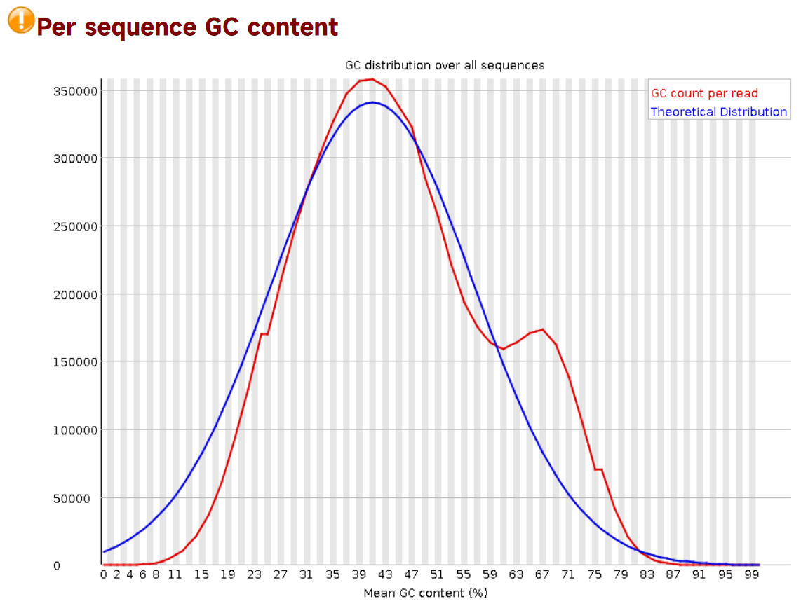
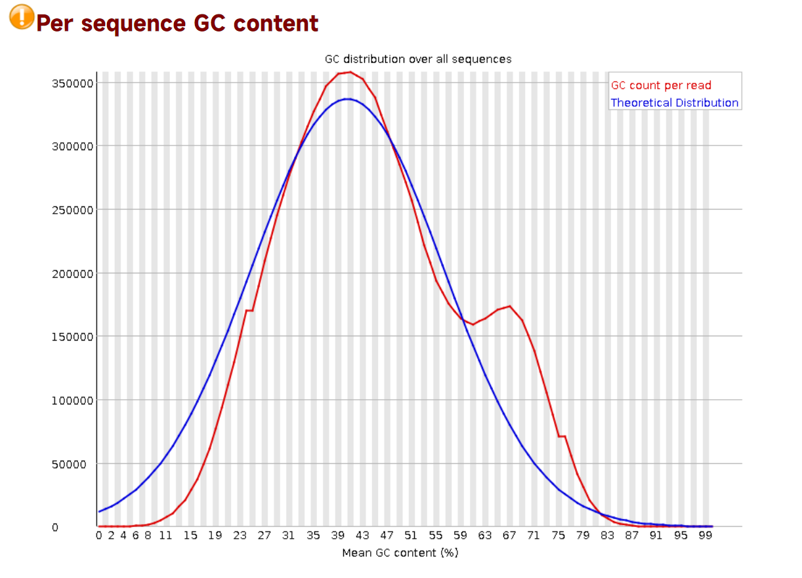
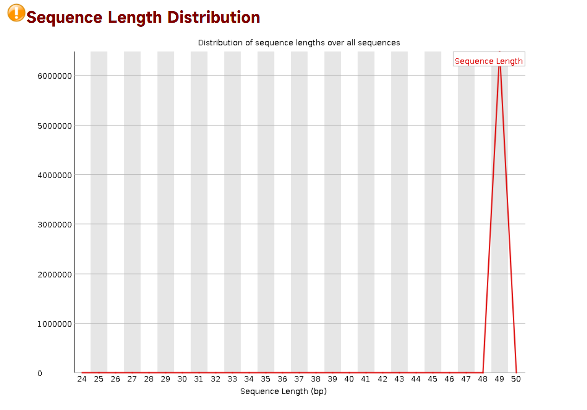

<center><font face = "楷体" size = 7><b>生物信息学进展</b></font></center>


<center><font face = "楷体" size = 6><b>实验报告</bb></font></center>


<center><font face = 华文黑体><b>题目：ChIP-Seq 数据分析 - 中期报告</b></font></center>

<center><font face = 华文黑体><b>姓名：张子栋</b></font></center>

<center><font face = 华文黑体><b>学号：2020317210101</b></font></center>

<center><font face = 华文黑体><b>学院：信息学院</b></font></center>


<center><font face = 华文黑体><b>湖北·武汉</b></font></center>

<center><font face = 华文黑体><b>2023 年 2 月 23 日</b></font></center>


<div STYLE="page-break-after: always;"></div>

<div STYLE="page-break-after: always;"></div>

<font face = 华文黑体 size = 4><b>目录</b></font>

[toc]

<div STYLE="page-break-after: always;"></div>

## 实验材料

### PubMed 数据库中搜索数据文献

#### 选定研究物种

​	选定研究物种为线虫（$nematode,\ Caenorhabditis\ Elegans$）。

#### 在 PubMed 中检索文献

​	在 [PubMed (nih.gov)](https://pubmed.ncbi.nlm.nih.gov/) 中搜索关键字 `Caenorhabditis Elegans ChIP seq`. 并选定文献为 [The hypoxia response pathway promotes PEP carboxykinase and gluconeogenesis in C. elegans - PubMed (nih.gov)](https://pubmed.ncbi.nlm.nih.gov/36257965/)（Nat Commun. 2022 Oct 18;13(1):6168. DOI: [10.1038/s41467-022-33849-x](https://doi.org/10.1038/s41467-022-33849-x)）. 

​	这篇文章研究的内容是在线虫中，缺氧应答通路如何通过激活 HIF-1 转录因子来调节 PEP 羧激酶和糖异生的基因表达和代谢流动，从而提高对氧化应激和缺氧应激的抵抗力。PEP 羧激酶是糖异生过程中的限速酶，可以将草酰乙酸转化为磷酸烯醇式丙酮酸。

​	作者利用基因组编辑、转录组分析、代谢组分析和行为实验等方法来揭示 HIF-1 直接或间接调控的上百个基因的功能。这篇文章使用 ChIP-Seq 的目的是为了发现 HIF-1 直接调控的基因，并分析它们在缺氧应答通路中的功能。


### 数据获取

​	文章中的 ChIP-seq 数据上传至 NIH/NCBI 数据库，登录号为 [GSE173333](https://www.ncbi.nlm.nih.gov/geo/query/acc.cgi?acc=GSE173333)。SRA 数据库对应登录号为 [SRP316378 - SRA - NCBI (nih.gov)](https://www.ncbi.nlm.nih.gov/sra?term=SRP316378)，最终选择 `SRR14325856` 作为研究数据。

​	登录服务器后，使用以下命令下载数据：

```shell
wget https://trace.ncbi.nlm.nih.gov/Traces/sra-reads-be/fastq?acc=SRR14325856
```


## 实验流程

### 使用 FastQC 分析数据

#### FastQC 简要说明

​	FastQC 是一个质量控制分析工具，用于检测高通量测序数据中的潜在问题。它提供了一系列的分析模块，可以帮助快速了解数据是否有任何需要注意的问题，以便进行进一步的分析。FastQC 可以处理 `fastq` 或 `bam` 格式的原始序列文件，并生成一个报告，总结分析结果。

​	FastQC 的报告是一个 HTML 文件，包含了各种分析模块的结果和图表。FastQC 的报告中，每个分析模块都有一个结果图和一个状态图标。状态图标表示该模块的结果是否正常（绿色）、需要注意（黄色）或有问题（红色）。

​	FastQC 有以下几个分析模块：

+ 基本统计：显示输入文件的名称、编码类型、总读数、读长和 GC 含量等信息。
+ 每碱基质量分布：显示每个位置的平均质量得分，以及上下四分位数的范围。
+ 每序列质量分布：显示每个序列的平均质量得分的频率分布，以及对应的合格率。
+ 每碱基序列内容：显示每个位置的 A、T、G 和 C 的比例，以及与理论值的偏差。
+ 每序列 GC 含量：显示每个序列的 GC 含量的频率分布，以及与整体 GC 含量的比较。
+ 每碱基 N 含量：显示每个位置包含 N（未知）碱基的比例。
+ 序列长度分布：显示不同长度序列出现的频率，以及平均长度和最大长度。
+ 序列重复度：显示不同重复次数序列出现的频率，以及总重复度和最大重复度。
+ 过表示 kmer 内容：显示在所有序列中过表达（出现次数超过预期）或者欠表达（出现次数低于预期）的 kmer（一般为 7 或 8 bp），以及它们在序列中出现的位置和比例。
+ 适配器内容：检测输入文件中是否包含常见 adapter 序列，并显示它们在不同位置出现的比例。

#### FastQC 命令格式

FastQC 的基本命令格式是：

```shell
fastqc [-o output dir] [--(no)extract] [-t thread num] [-f fastq|bam|sam] [-c contaminant file] seqfile1.. seqfileN
```

其中：

+ `-o` 用来指定输出文件的所在目录
+ `--(no)extract` 用来控制是否解压缩输出的 `.zip` 文件
+ `-t` 用来选择程序运行的线程数，即同时处理的文件数目。这样可以提高 fastqc 的运行速度，但也会占用更多的内存资源。
+ `-f` 用来强制指定输入文件格式，默认会自动检测
+ `-c` 用来指定污染物文件，用于检测序列中是否含有不期望的序列
+ `seqfile1.. seqfileN` 表示可以输入多个序列文件，支持 fastq，bam 和 sam 格式

#### 具体步骤

1. 创建目录用于存放输出结果：

   ```shell
   mkdir fastqc.test
   ```

2. 使用 FastQC 命令：

   ```shell
    fastqc -o fastqc.test/ -t 4 SRR14325856.fastq.gz 
   ```

3. 输出文件：

   ```
   fastqc.test/
   |-- SRR14325853_fastqc.html
   |-- SRR14325853_fastqc.zip
   |-- SRR14325854_fastqc.html
   |-- SRR14325854_fastqc.zip
   |-- SRR14325856_fastqc.html
   |-- SRR14325856_fastqc.zip
   ```

   在选定 SRR14325856 作为研究数据前，还尝试了另外几个数据，但这几个数据均没有过表达序列。


### 使用 Trimmomatic 去除 adapter 序列

#### Trimmomatic 简要说明

​	Trimmomatic 是一个快速的多线程命令行工具，于 2014 年首次发表在 Bioinformatics 期刊上，它可以用来整理和裁剪 Illumina (FASTQ) 数据以及删除 adapter。

​	Trimmomatic有两种过滤模式，分别对应单末端（SE）和双末端（PE）测序数据，同时支持 gzip 和 bzip 压缩文件。它还支持 phred-33 和 phred-64 格式互相转化，目前多数 Illumina 测序数据为 phred-33 格式。

​	Trimmomatic的主要功能包括：

- 去除 adapter 序列以及测序中其他特殊序列
- 采用滑动窗口的方法，切除或者删除低质量碱基
- 去除头（尾）部低质量以及 N 碱基过多的 reads
- 截取固定长度的 reads
- 丢掉小于一定长度的 reads
- Phred 质量值转换

#### Trimmomatic 命令格式

​	Trimmomatic 的命令格式根据您使用的是双端模式（PE）还是单端模式（SE）而不同。一般来说，命令格式为：

```shell
java -jar <trimmomatic.jar> PE|SE [-threads <threads>] [-phred33|-phred64] [-trimlog <logFile>] <input 1> [<input 2>] <output 1> [<output 2>] <step 1> …
```

​	其中：

+ `java -jar <trimmomatic.jar>` 是运行 Trimmomatic 的 Java 命令，需要指定 `trimmomatic.jar` 文件的路径。
+ `PE|SE ` 是选择双端模式或单端模式，如果是双端模式，需要提供两个输入文件和两个输出文件；如果是单端模式，只需要提供一个输入文件和一个输出文件。
+ `[-threads <threads>]` 是可选参数，用于设置线程数，默认为1。
+ `[-phred33|-phred64]` 是可选参数，用于设置碱基质量值的编码系统，默认为 phred64。自 v0.32 版本之后，Trimmomatic 可以自动识别是 phred33 还是 phred64。
+ `[-trimlog <logFile>]` 是可选参数，用于设置日志文件的路径和名称。日志文件记录了每个reads的修剪情况。
+ `<input 1> [<input 2>]` 是输入文件的路径和名称，可以是压缩或非压缩的FASTQ文件。如果是双端模式，需要提供两个输入文件；如果是单端模式，只需要提供一个输入文件。
+ `<output 1> [<output 2>]` 是输出文件的路径和名称。如果是双端模式，需要提供两个输出文件；如果是单端模式，只需要提供一个输出文件。
+ `<step 1> …` 是指定要执行的修剪步骤和参数。每个步骤之间用空格隔开。目前支持以下几种步骤：
  + `ILLUMINACLIP`: 去除接头序列
  + `SLIDINGWINDOW`: 滑动窗口裁剪低质量碱基
  + `MAXINFO`: 基于信息熵裁剪低质量碱基
  + `LEADING`: 去除开头低质量碱基
  + `TRAILING`: 去除结尾低质量碱基
  + `CROP`: 裁剪 reads 到指定长度
  + `HEADCROP`: 去除 reads 开头指定长度
  + `MINLEN`: 过滤掉小于指定长度的 reads

#### 具体步骤

在终端中输入以下命令，文件路径均使用绝对路径：

```shell
java -jar /home/software/Trimmomatic-0.39/trimmomatic-0.39.jar SE -phred33 -trimlog test.log.txt /Bioinfo/bio_2022_2023_2/bio_zdzhang/SRR14325856.fastq /Bioinfo/bio_2022_2023_2/bio_zdzhang/SRR14325856.processed.fastq ILLUMINACLIP:/home/software/Trimmomatic-0.39/adapters/TruSeq3-SE.fa:2:30:10 LEADING:3 TRAILING:3 MINLEN:25 
```

生成 `SRR14325856.processed.fastq` 文件。


### 使用 FastQC 分析处理后的数据

#### 具体步骤

1. 在终端中输入以下命令：

   ```shell
   fastqc -o fastqc.test/ -t 4 SRR14325856.processed.fastq 
   ```

2. 生成文件：

   ```
   fastqc.test/
   |-- SRR14325853_fastqc.html
   |-- SRR14325853_fastqc.zip
   |-- SRR14325854_fastqc.html
   |-- SRR14325854_fastqc.zip
   |-- SRR14325856_fastqc.html
   |-- SRR14325856_fastqc.zip
   |--SRR14325856.processed_fastqc.html
   |-- SRR14325856.processed_fastqc.zip
   ```


## 实验结果

实验结果同步至 GitHub: [MarkdownNotes/生物信息学进展/fastqc.test at main · Bluuur/MarkdownNotes (github.com)](https://github.com/Bluuur/MarkdownNotes/tree/main/生物信息学进展/fastqc.test)

### FastQC 对原数据的分析结果

#### 每序列 GC 含量



+ 每序列 GC 含量略微偏离正态分布。

#### 过表达序列


+ 过表达序列为 adapter


### FastQC 对处理后数据的分析结果

#### 每序列 GC 含量



+ 每序列 GC 含量略微偏离正态分布。

#### 序列长度分布



+ 序列长度分布集中于 49 bp，相比原数据，多了 25 bp 长度的序列。
+ 根据 Trimmomatic 文档，在使用该工具时，会经历以下步骤：
  + 首先，测试每个接头的短片段（最大 16 bp）在读段中的每个可能位置。
  + 如果这个短对齐（称为「种子」）是完美或足够接近的匹配，那么就会进行第二步，即 Smith-Waterman 对齐算法来找到最佳比对。
+ 多增的 25 bp 序列，可能是因为这个序列是接头或者其他污染物，并且与读段有足够高的匹配分数。


## 实验总结

​	本次实验主要完成了 ChIP-Seq 数据分析中的第一步：对原始数据进行质量评估和去接头处理。了解了 FastQC 和 Trimmomatic 软件的使用流程：

- fastqc 是一个用于检测测序数据质量的工具，可以直接对压缩文件进行操作，生成质量报告。可以根据报告中的各项指标来判断数据是否需要进行去接头和质量过滤。
- trimmomatic 是一个用于修剪和裁剪测序数据的工具，支持多线程和双端模式。可以使用该工具去除技术序列（如接头、PCR 引物等）和低质量碱基。
- 使用 trimmomatic 时，需要提供序列文件，并指定相应的参数，如最小重叠碱基数、最多错配数、最小长度等。还可以选择不同的裁剪策略，如滑动窗口法、平均质量法等。
- 使用 trimmomatic 后，再次使用 fastqc 检测处理后的数据质量，并与原始数据进行比较。

<div STYLE="page-break-after: always;"></div>

本文同步至 GitHub: [MarkdownNotes/生信进展实验1.pdf at main · Bluuur/MarkdownNotes (github.com)](https://github.com/Bluuur/MarkdownNotes/blob/main/生物信息学进展/生信进展实验1.pdf) 

All Rights Reserve (C) 2023 Zidong Zh.

<a rel="license" href="http://creativecommons.org/licenses/by-nc/4.0/"></a><br />This work is licensed under a <a rel="license" href="http://creativecommons.org/licenses/by-nc/4.0/">Creative Commons Attribution-NonCommercial 4.0 International License</a>.

