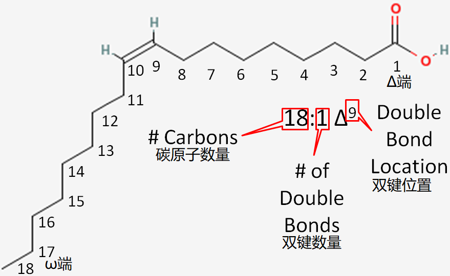
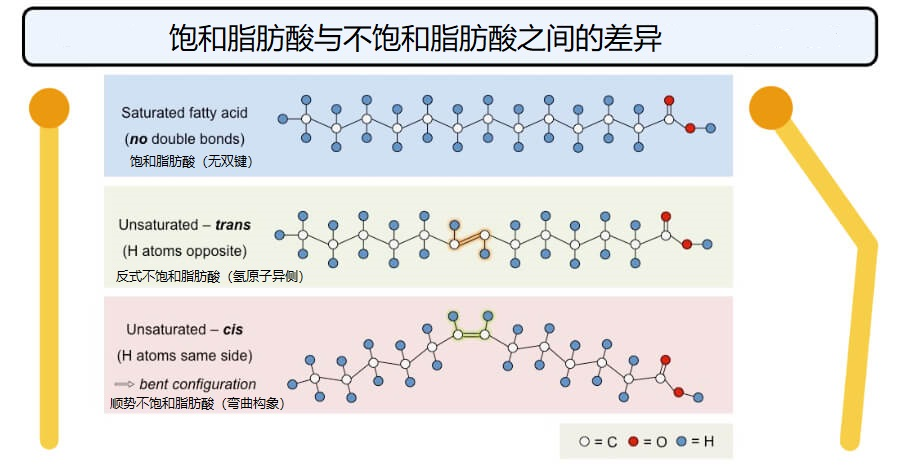
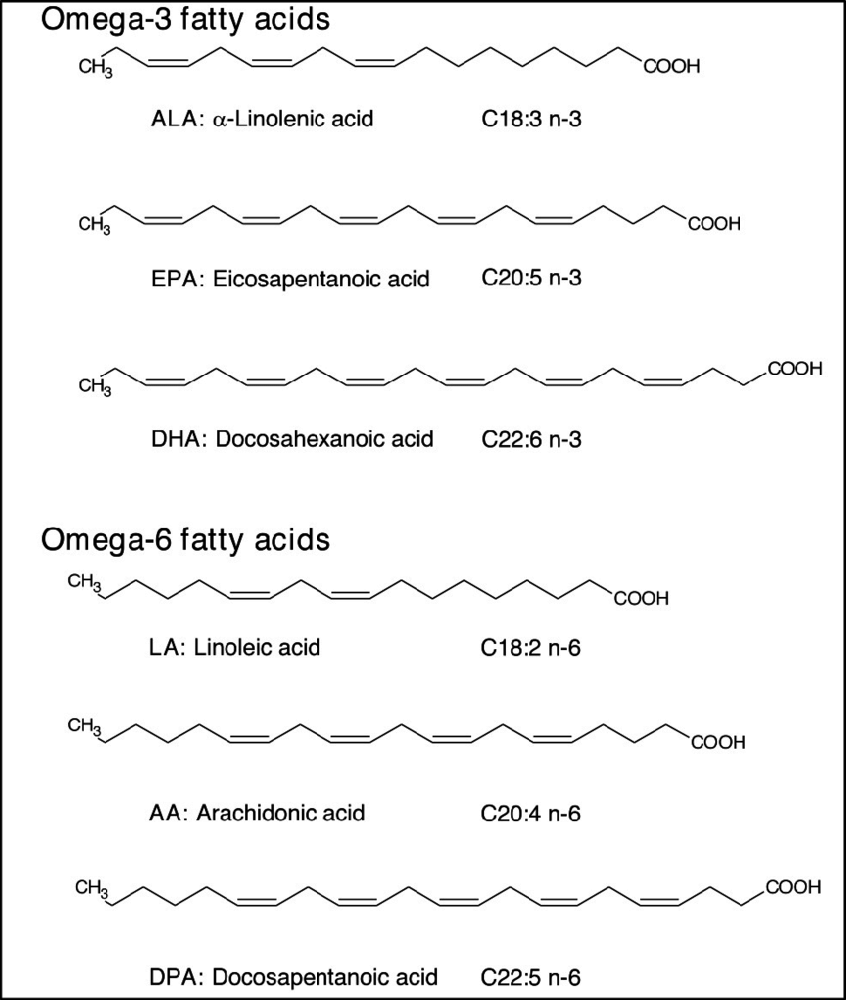
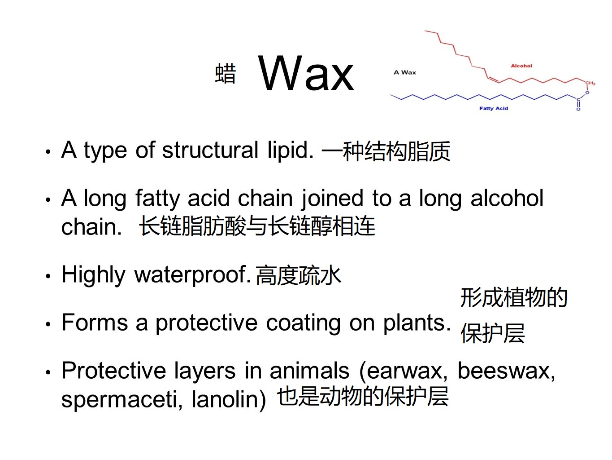
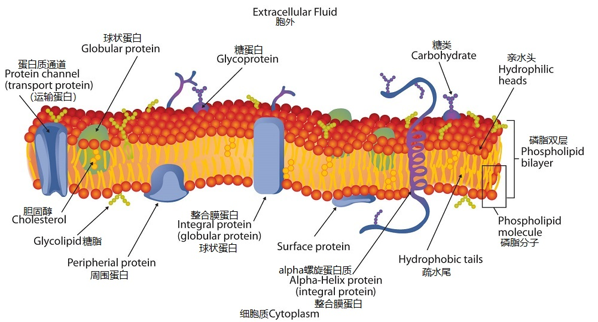
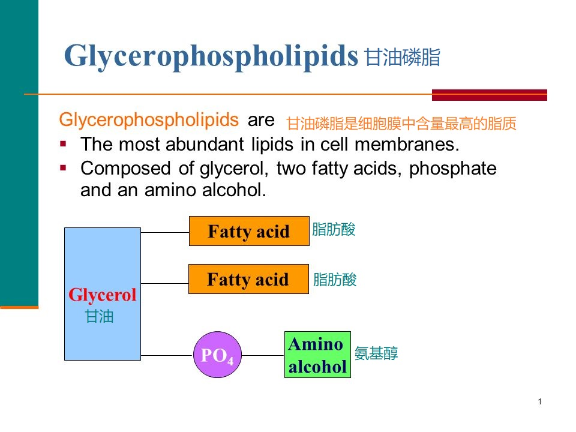
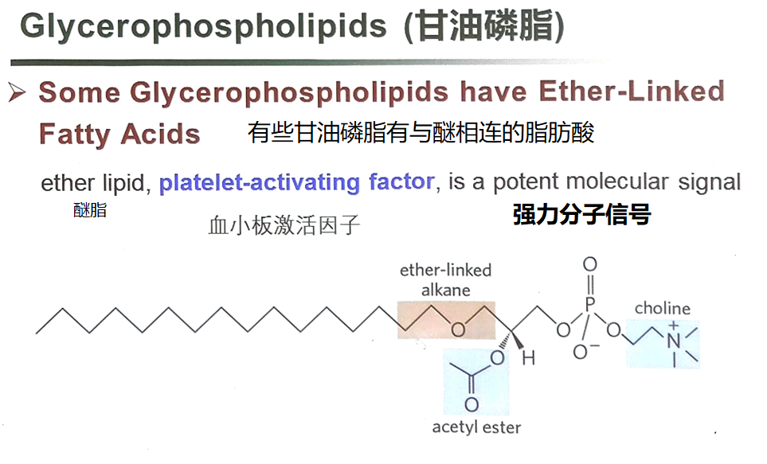

[toc]

# 定义

含多重官能团的化合物，特点是疏水
脂肪酸与醇(主要是丙三醇)缩合形成脂质

脂质能够通过有机溶剂提取

# 功能

+ 储存能量
+ 膜结构
+ 保护器官
+ 产生激素
+ 信号分子

## 贮存脂质

贮存脂质主要包含脂(fats)，油(oils)，蜡(wax)

脂由脂肪酸和丙三醇形成

### 脂肪酸 Fatty Acid

脂肪酸是含有4~36个碳

饱和脂肪酸
	
不饱和脂肪酸
	单不饱和
	多不饱和

$\omega \& \Delta$
十八碳二烯酸 表示方法
$\omega$,$\Delta$表示编号方向

碳链长度：12-24个碳之间

顺反异构$\longleftrightarrow$光敏感
视黄醇(VA)
视黄醛
$\beta-$胡萝卜素

GPCR

#### 物理性质
头部亲水
尾部疏水

#### 必须脂肪酸
人或动物无法自身合成

主要来源：植物
DHA二十二碳六烯酸Docosahexaenoic acid

Omega-3
Omega-6

> 碳链增长  2个碳

人类能通过ALA合成EPA,DHA

## 三酰甘油 Tricylglycerols

人体脂肪最重要的组成成分

### 主要作用

#### 储存能量

动物：adipose tissue

植物：子叶

#### 保温

## 蜡 Wax

## 结构脂质
bilayer

### 甘油磷脂 Glycerophospholipids

#### 结构

命名： 磷脂酰(phosphatiyl-) P387

> 不同环境条件下，膜组分变化

#### 降解磷脂的酶 Phospholipases

### 半乳糖脂 Galctolipids

### 硫脂 Sulfolipids

###  鞘脂 Sphingolipids

由一分子鞘氨醇(Sphingosine)和一分子长链脂肪酸组成

有一个极性头基和两个非极性尾部

#### 神经酰胺 Ceramides

鞘磷脂 Sphingomyelins 鞘糖脂 Glycosphingolipids
> 鞘糖脂决定血型

### 固醇 Sterols

>   环戊烷过氢苯-茶

---

#### 胆固醇 Cholesterol

+   动物组织中的主要固醇
+   既是膜成分,也是大部分类固醇的前体

---

#### Lipoproteins 脂蛋白

运输胆固醇，三酰甘油等 P402-404
球状，外部亲水，内部疏水

---

+  反式脂肪酸
+  提高低密度脂蛋白含量
+  降低高密度脂蛋白含量

## 活性脂质

含量低，代谢运输中起重要作用

### 信号分子

+ Intracellular signals 细胞内信号
  PIP2 and IP3

+ signal to nearby cell
  非甾体类抗炎药

  + 类二十烷酸(Eicosanoids)是旁分泌激素,仅在周围细胞起作用

    + 生殖功能
    + 炎症,发烧和疼痛
    + 形成血栓,调节血压
    + 胃酸分泌

  + 四种主要的类二十烷酸(Eicosanoids)

    + 前列腺素
    + 凝血噁烷
    + 白三烯
    + 脂氧素

  + >   非甾体类抗炎药(NSAIDs)阻止花生四烯酸向前列腺素和凝血噁烷转化

+ signals between tissues
  + 类固醇 Steroid
      + 固醇的氧化形式
    + 油菜素内酯(Brassinolide)
    + 

### 辅酶

茉莉酸

### 色素

# 动物细胞结构

生物膜是脂双层

# 生物膜

+ 由多种脂质和蛋白质组成

## 膜的基本结构

流动镶嵌模型
Fluid mosaic model for ths structure od biological membranes

A lipid bilayer is the basic structural element of membranes

---

Three types of lipid aggregation 脂质的三种聚集形式

+ Micelles 微团
    + 
    + 每个微团由几十到几千个脂质分子组成
    + 形成头大于尾的两亲性分子溶液
    + 高于临界胶团浓度时发生聚集
    + CMC临界胶团浓度
+ Bilayer 脂双层
+ Vesicle or liposome 脂质体

去垢剂
模拟生物膜  

## 膜蛋白

+ 内在膜蛋白 Integral membrane proteins
    + 疏水区域与膜脂相连
+ 外周膜蛋白
+ 兼在膜蛋白

## 膜的流动性

Transmembrane movement 跨膜运动

Flippases 翻转酶

Floppases 转出酶

Scramblases 促翻转酶

研究膜运动的方法 : FRAP 光漂白荧光恢复法

   

