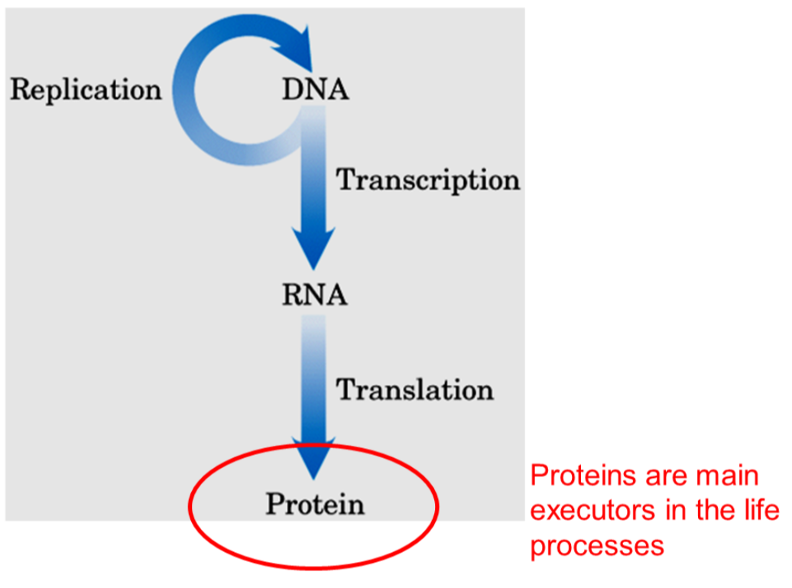
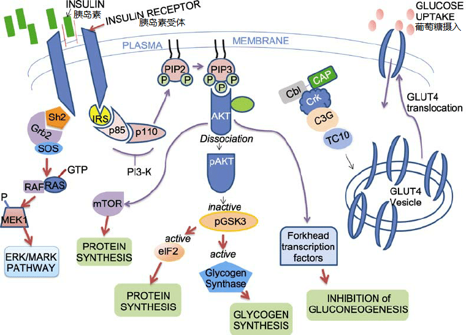
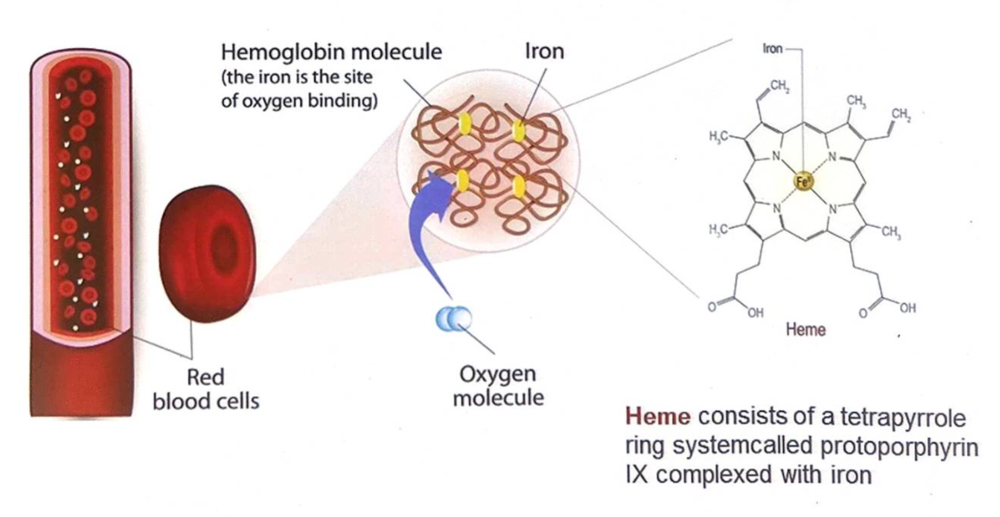
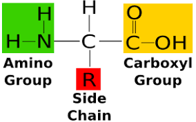
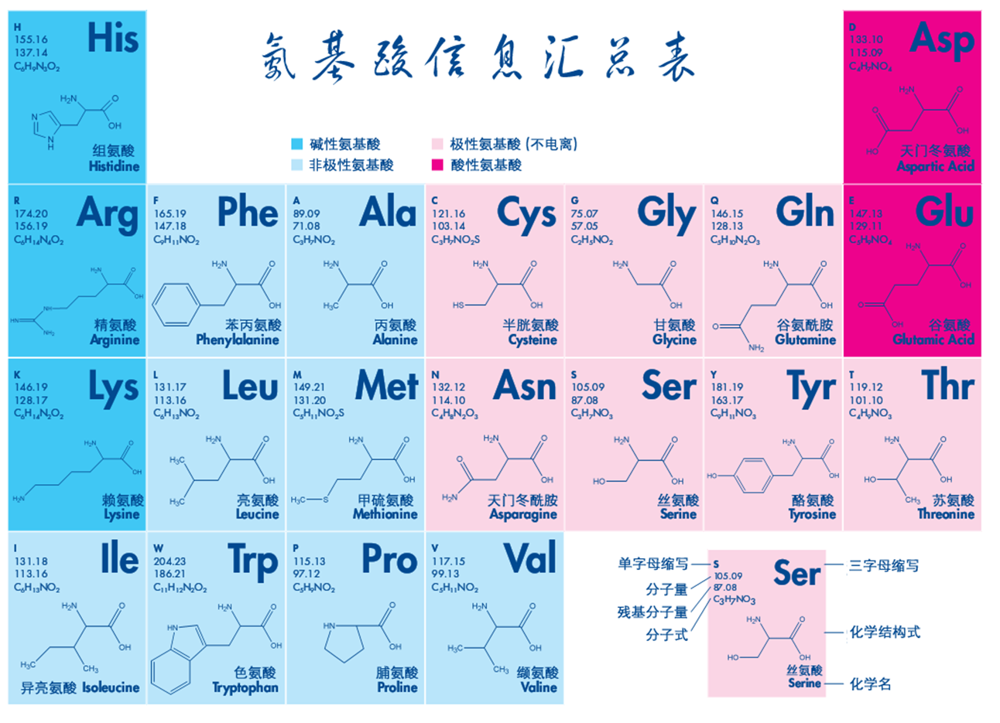
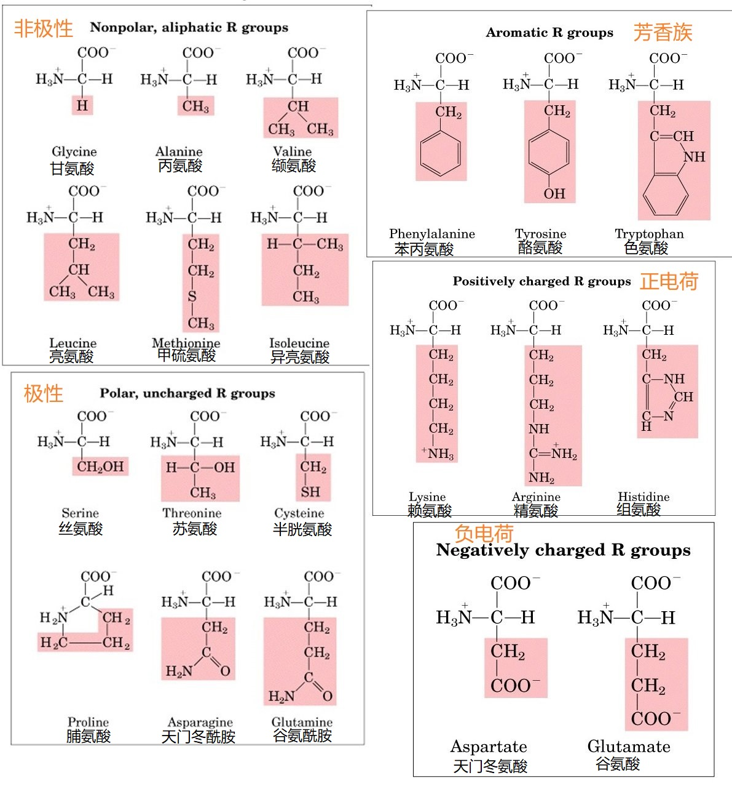

[toc]

> 中心法则

## Hormonal Proteins 激素蛋白 

+ Insulin 胰岛素是一种重要的激素 控制体内葡萄糖水平

## Transport Proteins 转运蛋白

### Hemoglobin 血红蛋白

+ 红细胞中携带氧气($or \ CO_2$)的蛋白
+ Hemoglobin(血红蛋白)is the protein molecule in red blood cells that carries oxygen from the lungs to the body's tissues and returns carbon dioxide from the tissues back to the lungs.

## Protection Proteins

### Immunoglobulins 免疫球蛋白

+ $a.k.a.$抗体 Antibodies
+ 特异性识别并与抗原分子结合

## Storage Proteins

### Ferritins 铁蛋白

+   重要的储存/解毒蛋白

## Enzyme 酶

### Luciferase 荧光素酶

+ 氧化荧光素,副产物为光

+ GFP Green fluorescent protein

## Contractile Proteins 收缩蛋白

### Actin 肌动蛋白 & Myosin 肌球蛋白

肌肉细胞中的纤维状蛋白,在收缩系统中起作用

## 结构蛋白

### Collagen 胶原蛋白 & Elastin 弹力蛋白

+ 结缔组织的纤维成分

### Keratin 角蛋白

+   毛发,指甲等成分

## Receptor Proteins 受体蛋白

### G protein-coupled receptors   GPCRs G蛋白偶联受体

+ receptors that act through a member of the guanosine nucleotide-binding protein, or G protein, family
+ 鸟苷酸结合蛋白

# Amino Acids 氨基酸

+   蛋白质的基本单元,通过肽键(peptide bond)连接 蛋白质是氨基酸的多聚体
+   自然界中有约300中氨基酸,只有20中出现在蛋白质中

+   所有20中常见氨基酸是 $\alpha$ 氨基酸,有一个羧基和一个氨基结合在同一个碳原子($\alpha$ 碳原子)上
+   20种氨基酸的区别是他们的侧链(R基), 其结构,大小,电荷量都会影响氨基酸的水溶性

## 基本结构

### Configuration构型 : Enantiomer对映体

+   天然氨基酸都是L型,除了甘氨酸没有D/L构型
+   除了甘氨酸(Glycine), 氨基酸的 $\alpha$ 碳原子是手性中心

## 分类

通过R基分类

>   上图中正/负电荷是指在pH=7时R基所带电荷

### Nonpolar, Aliphatic Amino Acids 非极性脂[肪]族氨基酸

+ 甘氨酸 Glycine
+ 丙氨酸 Alanine
+ 脯氨酸 Proline 
    + 有一个环状极性侧链
    + 五元环 刚性构象 无法旋转 一般出现在二级结构相邻的位置
    + 
+ 缬氨酸 Valine
+ 亮氨酸 Leucine
+ 异亮氨酸 Isoleucine
+ 甲硫氨酸 Methionine
    + 甲基供体 甲基化修饰
    + 

#### 非极性脂[肪]族氨基酸总结

+   侧链是中性烷基
+   从 $Gly$ 到 $Ile$ ,疏水性(hydrophobic)增加
+   一般位于蛋白质分子内部,侧链不被修饰
+   $Pro$ 的 $\alpha-$氨基成环,在蛋白质空间结构中具有重要的作用
+   $Met$ 含有甲硫基($-S-CH_3$),是重要的甲基供体,合成乙酰胆碱和乙烯

### Acidic Amino Acids 酸性氨基酸

酸性氨基酸:R基在pH=7.0时净电荷为负电

天门冬氨酸和谷氨酸有第二个羧基

+ 天门冬氨酸 Aspartate
    + 
+ 谷氨酸 Glutamate
    + 

### Basic Amino Acids 碱性氨基酸 

酸性氨基酸:R基在pH=7.0时净电荷为正电

+ 赖氨酸 Lysine
    + 
+ 精氨酸 Arginine 
    + 碱性最强的氨基酸$\Longleftrightarrow$胍基
    + 
+ 组氨酸 Histidine 
+ 
    +   咪唑

#### 碱性氨基酸总结

+ $Lys$ 侧链氨基 $pKa$ 是 $10.53$，生理条件下带一个正电荷；侧链有 $4$ 个 $C$，柔性大，氨基的反应活性大
+ $Arg$ 是碱性最强的氨基酸，$pKa$ 是 $12.48$ ，生理条件下完全质子化
+ $His$ 的咪唑基 $pKa$ 在游离氨基酸中是 $6.00$ , 在多肽链中是 $7.35$ ; 在 $20$ 种氨基酸中, $His$ 侧链 $pKa$ 值最接近生理 $pH$ 具有缓冲能力

### Aromatic Amino Acid 芳香族氨基酸

相对非极性（疏水）
都能参与疏水相互作用(hydrophobic interactions)

+ 苯丙氨酸 Phenylalanine
+ 酪氨酸 Tyrosine
    + 
+ 色氨酸 Tryptophan
    + 

#### 光吸收性

$Lambert-Beer$
$$
A=-\lg \frac{I}{I_{0}}=\lg \frac{1}{T}=\varepsilon \cdot c \cdot L
$$

>   $\varepsilon$ : 摩尔吸收系数

蛋白质的紫外吸收 主要取决于酪氨酸($Tyr$)和色氨酸($Trp$)

#### 共轭$\pi$电子体系

苯环产生共轭 $\pi$ 电子体系 容易与其他负电基团形成电子转移复合物(charge-transfer complex), 作为分子间识别位点

##### $cation-\pi\ interactions$

+   阳离子$-\pi$ 相互作用
+   

##### $\pi-\pi\ stacking$

+   $\pi-\pi$ 堆积

---

蛋白质之间相互作用

---

蛋白质核酸之间相互作用

---

核酸之间相互作用 P430

### Polar, Uncharged Amino Acid 极性不带电氨基酸

R基比非极性氨基酸在水中更易溶(更亲水)
因为极性不带电氨基酸含有可与水形成氢键的官能团

+ 丝氨酸 Serine
    + 在许多酶的催化作用中其重要作用
        被证实出现在糜蛋白酶(chymotrypsin),胰蛋白酶(trypsin)等其他酶的活性位点
        + 一下虚线表示非共价键
    + 
    + 蛋白质-DNA识别机制
        + 
    + 蛋白质-RNA识别机制
        + 
+ 苏氨酸 Threonine
+ 半胱氨酸 Cysteine 
    + 含巯基，2个Cys形成二硫键，利于稳定蛋白质结构 角蛋白中富含此种氨基酸
    + 
+ 脯氨酸 Proline
+ 天门冬酰胺 Asparagine
+ 谷氨酰胺 Glutamine

#### 极性不带电氨基酸总结

+ Ser的羟基是极性集团，易形成氢键，频繁出现在酶的活性中心
+ Thr的羟基是仲醇，具有亲水性，形成氢键的能力较弱
+ Cys含巯基，2个Cys形成二硫键，利于稳定蛋白质结构
    侧链是巯基 巯基具有氧化还原性 二硫键的生成与断开是可逆的
+ 天冬酰胺(Asn)和谷氨酰胺(Gln)在氨基酸代谢中起重要作用

催化三联体

#### 不常见的氨基酸

除上述 20 种常见的基本氨基酸外，在某些蛋白质中还存在一些不常见的氨基酸它们是由**己参入多肽链的相应的常见氨基酸残基修饰**而来的

>   氨基酸残基 : 组成蛋白质的, 非游离的氨基酸, 因为羧基和氨基参与肽链的形成 而不完整了, 所以叫做氨基酸残基

>   上图: 蛋白质活动调节涉及的可逆的蛋白质修饰

尿氨酸和瓜氨酸不是形成蛋白质的氨基酸 是(生物合成精氨酸)和(尿素循环)的中间物

## 非天然氨基酸

标记作用 

非天然氨基酸介导的生物正交化学标记 特异性定点标记

## 性质

### Amino Acid Zwitterion 兼性离子

+   氨基酸的氨基和羧基，还有可电离的R基，共同作用为**弱的酸和碱**

+   R基不含可解离基团的氨基酸溶于中性pH水中,占优势的分子形式是**兼性离子**(zwitterion,德文"杂合离子"的意思)或称偶极离子(dipolar ion),极少数以非离子形式存在
    
    依照酸碱质子理论,兼性离子既起酸(质子供体)的作用,又起碱(质子接纳体)的作用.具有这样双重性质的物质称为两性电解质(ampholyte).

+   简单的单氨基单羧基氨基酸,例如丙氨酸(Ala)在完全质子化的时候是双质子酸
    丙氨酸有两个官能团($-COOH$和$-NH_{3}^{+}$)
    因此能释放两个质子

    

### 等电点Isoelectric Point  pI

蛋白质所带净电荷为0的时候的pH值为等电点
$$
\begin{aligned}
\text{Neutral Amino Acid}\quad pI&=\frac{pK_{a-COOH}+pK_{a-NH_3}}{2}\\
\text{Acidic Amino Acid}\quad pI&=\frac{pK_{a-COOH}+pK_{R}}{2}\\
\text{Basic Amino Acid}\quad pI&=\frac{pK_{a-NH_3}+pK_R}{2}
\end{aligned}
$$

### 侧链R基参与的反应

#### 用与蛋白质的化学修饰

#### Phosphorylation 磷酸化 

+ Serine 丝氨酸
    
+ Threonine 苏氨酸
    
+ Tyrosine 色氨酸
    

#### Methylation 甲基化 

+ Lysine 赖氨酸
    
+ Arginine 精氨酸
    

#### Glycosylation 糖基化 

+ Serine 丝氨酸
    
+ Asparagine 天冬氨酸
    

# 肽与蛋白质
肽和蛋白质是氨基酸的多聚体

## 成肽反应

## 简单肽的结构

>    肽的命名从氨基端开始

通过电离行为分类

## 具有生物活性的肽和多肽

+ 一个肽分子本身可能具有生物活性或者作为一个更大分子的亚基具有生物活性
+ 肽是激素，毒素，蛋白质，酶，细胞和身体组织的基本单元

噬菌体

## 多肽与蛋白质

多肽是一个长而连续无支链的肽
蛋白质由一个或多个多肽排列成具有生物功能的结构

  

