Proteins Conformation Three-Dimensional Structure 蛋白质的构象/三维结构

## 结构层次

+ 一级结构 Primary Structure
    + 氨基酸顺序
+ 二级结构 Secondary Structure
    + 
+ 三级结构 Tertiary Structure
    + 球状结构
+ 四级结构 Quaternary Structure
     + 多亚基聚集

## The most stable conformations of a typical proteins 典型蛋白质的稳定构象

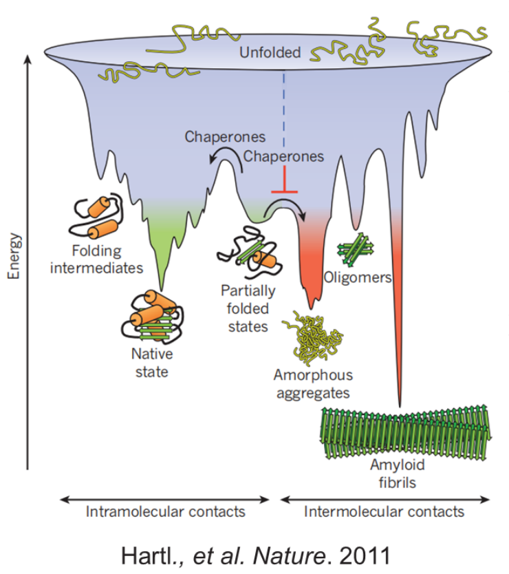

+   The conformations existing under a given set of conditions are usually the ones that are thermodynamically the most stable-that is, having the lowest Gibbs free energy ($G$).
    在给定的一套条件下存在的构象一般是热力学上最稳定的构象, 也即吉布斯自由能 $(G)$ 最低的构象
+   Proteins in any of their functional, folded conformations are called native proteins(天然蛋白质).
    任何这一种处于有功能的折叠构象的蛋白质称为**天然蛋白质 (Native Proteins)**

# Overview of Protein Structure 蛋白质结构概述

## A protein's conformation is stabilized largely by weak interactions 蛋白质构象主要由弱相互作用稳定

+   Stability (稳定性)
    +   The tendency to maintain a native conformation
        维持一个天然构象的趋势或倾向
+   The protein conformation with the lowest energy(i.e., the most stable conformation) is the one with the maximum number of weak interaction.
    具有最低自由能的蛋白质构象(即最稳定的构象)是弱相互作用数目达到最大的构象

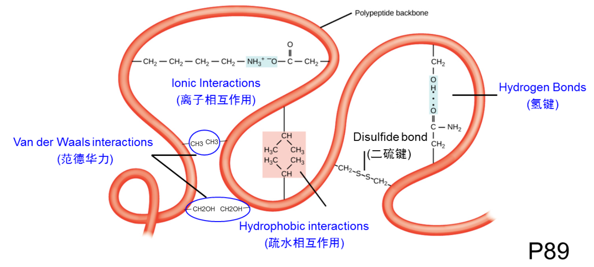

+   For all proteins of all organisms, weak interactions are especially important in the folding of polypeptide chains into their secondary and tertiary structures. The association of multiple polypeptides to form quaternary structures also relies on these weak interactions.
    对所有生物的所有蛋白质来说, 弱相互作用在多肤链折叠成二, 三级结构方面显得特别重要, 多个多多肽链缔合成四级结构也是依靠这些相互作用

## The peptide bond is rigid and planar 肽键具有刚性和平面的性质

+   Peptide bonds have considerable double-bond character - resonance hybrid(共振杂化体)
    肽键具有重要的双键性质: 共振杂化体

+   Peptide plane (肽平面), 6 atoms($C_\alpha,C,O,N,H\ and\ C_\alpha$) of the peptide group(肽基) lie in a single plane
    肽基的六个原子在同一个平面内
+   No free rotation of peptide C-N bond
    肽的 $C-N$ 键不能自由旋转

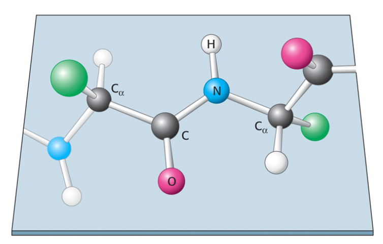

### Rotation of peptide chain 肽链的旋转

+   The $N-C_\alpha$ and $C_\alpha-C$ bonds can rotate, described by dihedral angles designated $\Phi $ and $\Psi$, respectively.
    多肤链主链的构象是由 个二面角 (dihedral angle) , 也称扭角 (torsion angle) : $\Phi$ 角, $\Psi$ 角和 $\omega$ 角规定的. 它们各自反映了绕主链上 3 个重复键中的一个键的旋转状况. 二面角定义为两个平面相交的角 在肤的场合．这 些平面由多肤主链中的键矢量来确定 
+   $\Phi$ (phi): Rotation angle of $N-C_\alpha$
    $\Phi$ 角涉及 $C-N-C_\alpha-C$ 键, 绕中央 $N-C_\alpha$ 键发生旋转
+   $\Psi$(psi): Rotation angle of $C_\alpha-C$
    $\Psi$ 角涉及 $N-C_\alpha-C-N$ 键, 绕中央 $C_\alpha-C$ 键旋转

+   Both $\Phi$ and $\Psi$ are defined as $\pm 180\degree$ when the polypeptide is fully extended and all peptide groups are in the same plane.
    按照习惯, 当主链完全伸展且所有肽基处于同一平面时 $\Phi$ 角和 $\Psi$ 角两者被定义为 $\pm 180°$

## The folding of the polypeptide backbone is restricted by steric constraints 多肽主链的折叠受到空间位阻的限制

+   In principle, $\Phi$ and $\Psi$ can have any value between $-180\degree$ and $+180\degree$, but many values are prohibited by steric interference between atoms in the polypeptide backbone and amino acid side chains.
    理论上 $\Phi$ 和 $\Psi$ 可以为 $-180\degree$ 到 $+180\degree$ 之间的任何值, 但是因为多肽骨架和氨基酸侧链位阻的存在, 实际上不是任意的  $\Phi$ 和 $\Psi$ 值所决定的肽链构象都是立体化学所允许的.
+   In a protein, some of the conformations shown here (e.g. , $0\degree$) are prohibited by steric overlap of atoms.
    蛋白质中,  $\Phi$ 和 $\Psi$ 同时为 $0\degree$ 的那种构象就不能存在

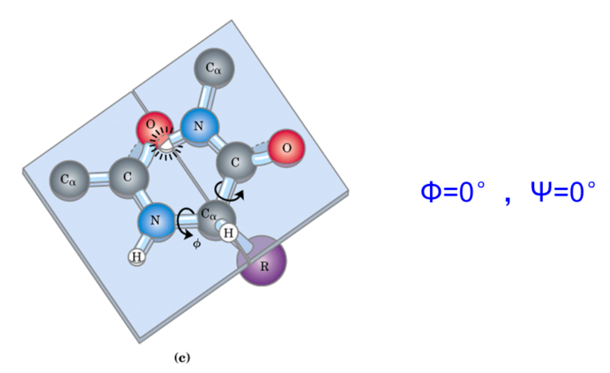

### Ramachandran Plot 拉氏构象图

+   根据非共价键合原子之间的最小接触距离, 确定哪些 $C_\alpha$ 的成对二面角 ($\Phi, \Psi$) 所规定的两个相邻肽基的构象是被允许的, 哪些是不允许的, 并在 $\Phi$ (横坐标) 对 $\Psi$ (纵坐标) 所作的 $\Phi-\Psi$ 图上标出

+   拉氏构象图展示了 蛋白质能稳定存在的二级结构

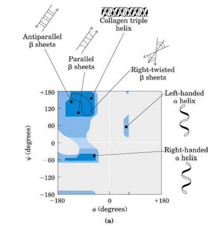

# Protein Secondary Structure 蛋白质二级结构

+   The term secondary structure (二级结构) refers to any chosen segment of a polypeptide chain and describes the local spatial arrangement of its main-chain atoms, without regard to the positioning of its side chains or its relationship to other segments.
    二级结构指的是多肽链任一所选区段中主链原子中的局部空间排列, 但不涉及它的侧链定位或与其他肽段的关系
+   二级结构包含
    +   $\alpha$ helix $\quad\alpha$ 螺旋
    +   $\beta$ conformation $\quad\beta$ 构象
    +   $\beta$ turns $\quad \beta$ 转角
    +   random coil 无规则卷曲

## $\alpha$ conformation

$\alpha$螺旋 $\alpha$ helix 常见的蛋白质二级结构

+   The $\alpha$ helices found in proteins are almost always right-handed
    蛋白质中的 $\alpha$ 螺旋几乎都是右手螺旋 
    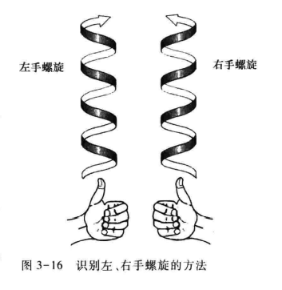
+   Residues per turn: $3.6$ 
    一个螺圈包含 $3.6$ 个氨基酸残基
+   Rise per residue: $1.5 \mathrm{\AA}$ 
    每个残基绕轴旋转 $100\degree$, 沿轴上升 $1.5$ 埃 ($0.15nm$)
+   Rise per turn (Pitch, 螺距) : $3.6\times 1.5\mathrm{\AA} = 5.4 \mathrm{\AA}$
    一个螺圈包含 $3.6$ 个氨基酸残基, 沿螺旋轴方向上升 $5.4$ 埃 ($0.54nm$)
+   Idealized $\Phi$ and $\Psi$ angles for $\alpha$ helix : $\Phi = -57\degree,\Psi=-48\degree$
    $\alpha$ 螺旋理想的 $\Phi$ 和 $\Psi$ 角为 $\Phi = -57\degree,\Psi=-48\degree$
    +   
+   Hydrogen bond between carbonyl $O_n$ and amid $H_{n+4}$
    +   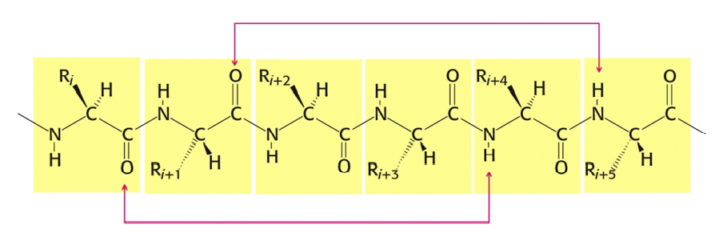
    +   Hydrogen-bonding scheme for an a helix. In the a helix, the $CO$ group of residue $n$ forms a hydrogen bond with the $NH$ group of residue $n+4$.
        在一个螺旋中, 第 $n$ 个 $-CO$ 基团与第 $n+1$ 个 $-NH$ 基团形成氢键
+   Side chains point outward
    侧链朝外

Four models of the $\alpha$ helix showing different aspects of its structure
四种展示 $\alpha$ 螺旋结构的模型 (不同角度)

+   Other forms of $\alpha$ Helix
    其他形式的 $\alpha$ 螺旋
    +   $2.2_{7}-helix$
    +   $3_{10}-helix$
    +   $4.3_{16}-helix$
    +   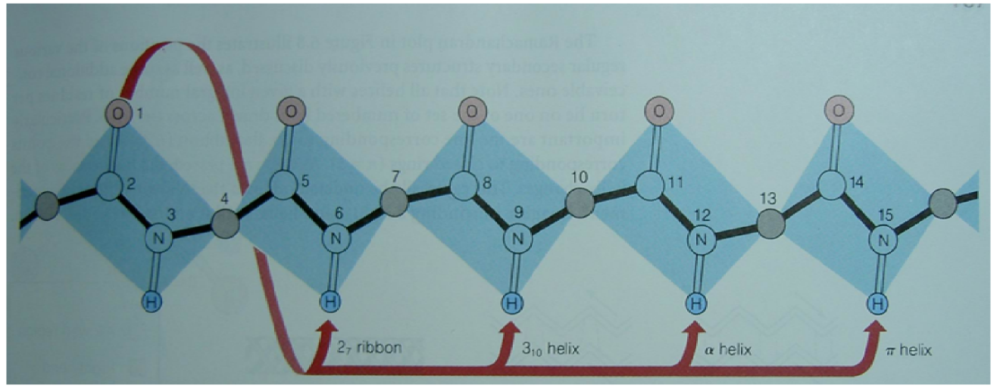

### 影响$\alpha$螺旋稳定性的五种因素

氨基酸序列影响 $\alpha$ 螺旋的稳定性 

+   一条肽链能否形成 $\alpha$ 螺旋, 以及形成的螺旋是否稳定, 与它的氨基酸组成和序列有极大的关系. 多肽中每个氨基酸残基都有形成 $\alpha$ 螺旋的固有倾向, 反映R基的性质(包括电荷性质和体积性质)以及它们如何影响邻接的主链原子采取特有的 $\Phi$ 角和 $\Psi$ 角的能力. 关于这方面的知识很大一部分来自对多聚氨基酸的研究. 发现R基小, 并且不带电荷的多聚丙氨酸 (多聚 $Ala$ ), 在pH7的水溶液中能自发地卷曲成 $\alpha$ 螺旋. 在大多数实验模型系统中丙氨酸显示出形成 $\alpha$ 螺旋的最大倾向性.
    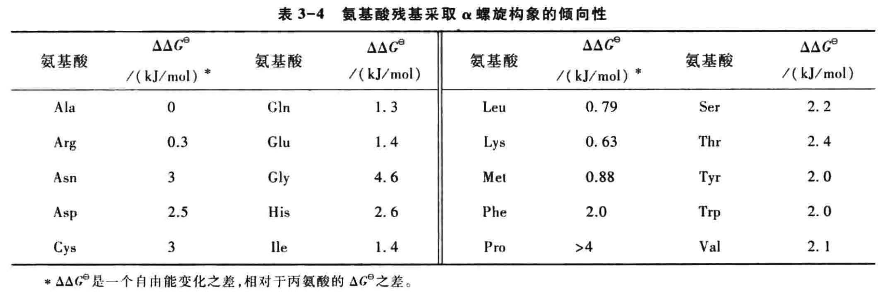

#### Electrostatic repulsion 静电排斥

+   
+   Glu 谷氨酸
+   Lys 赖氨酸
+   Arg 精氨酸

>   氨基酸残基形成 $\alpha$ 螺旋的固有倾向性

#### Bulkiness and shape of adjacent R groups 相邻 R 基的松散度和形状

以下几种氨基酸的体积和形状会使 $\alpha$ 螺旋不稳定
位阻

+   
+   Asn 天冬酰胺
+   Ser 丝氨酸
+   Thr 苏氨酸
+   Cys 半胱氨酸

#### Restricted rotation 旋转受限

+   脯氨酸( Pro )中的氮原子是刚性环的一部分, 不能绕 $N-C_\alpha$ 键旋转
+   

#### Flexible rotation 柔性(弹性)旋转

+   甘氨酸(Gly) 不经常出现在 $\alpha$ 螺旋中的原因是 Gly 比其他氨基酸残基以后更大的构象柔性, 多聚 Gly 倾向采取很不同于 $\alpha$ 螺旋的卷曲结构 (Coiled structure)

#### Interaction between amino acid residues at the ends of the helical segment and the electric dipole(偶极子)of a helix.

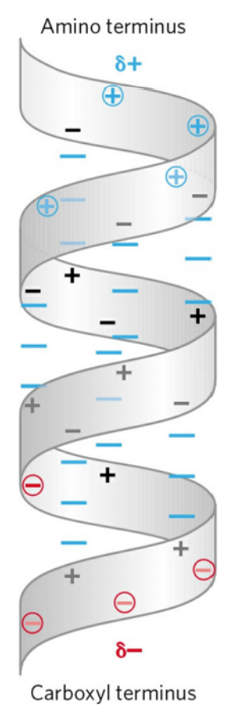

螺旋段末端的氨基酸残基和 $\alpha$ 螺旋所特有的电偶极之间的相互作用

+   (+) charged a.a. near C-terminus(have a stabilizing interaction with the negative charge of the helix dipole)
    螺旋偶极的部分正电荷留在氨基端附近的肽氨基上
+   (-) charged a.a. near N-terminus(have a stabilizing interaction with the positive charge of the helix dipole)
    螺旋偶极的部分负电荷留在羧基端附近的肽羰基上
+   因此 带负电荷的氨基酸经常存在于螺旋段的氨基酸, 在这里它们通过与螺旋偶极的正电荷相互作用稳定了 $\alpha$ 螺旋

>   a.a. means amino acid

+   Five types of constraints affect the stability of an a helix
    有 5 个方面的因素影响 $\alpha$ 螺旋的稳定性
    +   The intrinsic propensity of an amino acid residue to form an a helix
        氨基酸残基形成 $\alpha$ 螺旋的固有倾向
    +   The interactions between R groups, particularly those spaced three(or four) residues apart
        R 基之间, 特别是 3(或 4 ) 个残基的 R 基之间的相互作用
    +   The bulkiness of adjacent R groups
        相邻 R 基之间的庞大体积 (位阻)
    +   The occurrence of Pro and Gly residues
        Pro 和 Gly 残基的存在
    +   Interactions between amino acid residues at the ends of the helical segment and the electric dipole inherent to the a helix
        螺旋段末端的氨基酸残基和 $\alpha$ 螺旋所特有的电偶极之间的相互作用

### $\alpha$ 螺旋$(3.6_{13})$特征 :star:

+   螺旋的 $C_\alpha$ 具有相同的二面角, 右手螺旋
+   每圈 3.6 个氨基酸, 高度 $0.54 nm$
+   每个氨基酸绕轴旋转 $100\degree$, 沿轴上升 $0.15nm$
+   氨基酸侧链向外
+   相邻螺圈间形成氢键, 取向与中心轴平行
+   $C=O$ 氧与它后面的第 4 个残基的 $N-H$ 氢形成链内氢键

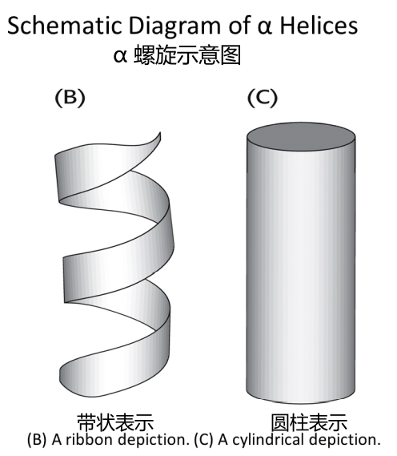

### $\alpha$ - Helical Coiled Coil

+   $\alpha$-helical coiled coil usually serves a mechanical role.
    卷曲型 $\alpha$ 螺旋通常起力学作用

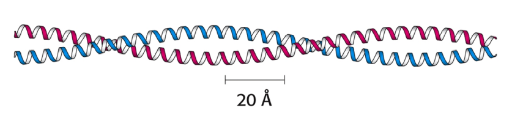

#### Protein Rich in $\alpha$ Helices 富含 $\alpha$ 螺旋的蛋白质

储存铁的蛋白质 Ferritin(铁蛋白) 由一束 $\alpha$ 螺旋组成

### Structure of TALE protein

TALE repeats have helix-loop-helix secondary structure

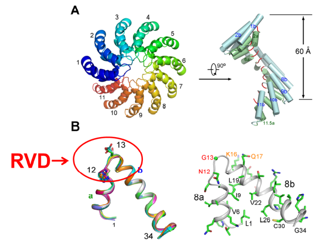

dHax3 TALE Repeats Bounds to the DNA-RNA Hybrid

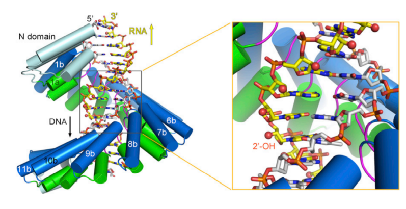

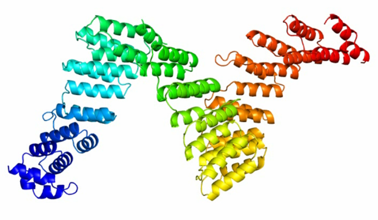

## $\beta$ conformation   $\beta$ 构象

+   A more extended conformation of polypeptide chains,and its structure is again defined by backbone atoms arranged according to a characteristic set of dihedral angles
    这是一种更为伸展的多肽链构象, 它的结构也受到一套特有的二面角排列的主链原子的限定

+   The backbone of the polypeptide chain is extended into a zigzag(锯齿) rather than helical structure
    在 $\beta$ 构象中, 多肽链骨架伸展成锯齿(zigzag) 结构, 而不是螺旋结构

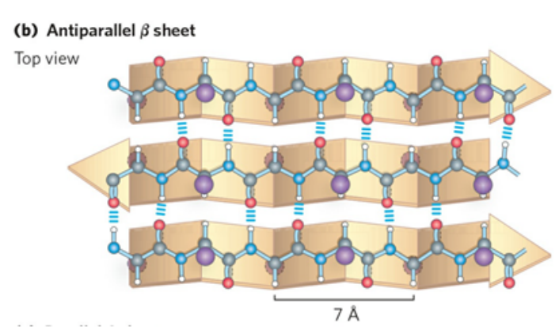

### $\beta$ Strand $\beta$ 股

+   Zigzag polypeptide backbone
    锯齿状多肽骨架

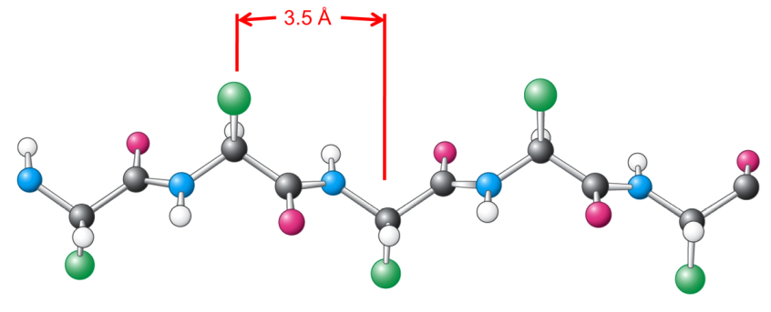

>   Structure of a $\beta$ strand. The side chains(green) are alternately above and below the plane of the strand
>   侧链交替地出现在多肽骨架的上下端

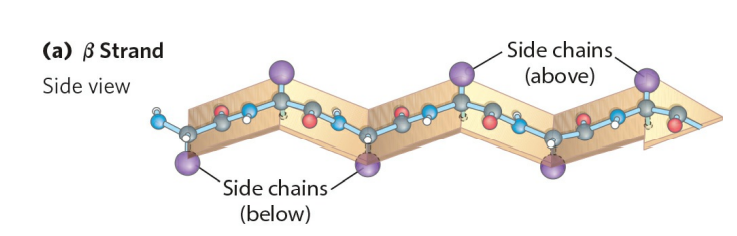

### $\beta$ 折叠片

The arrangement of several segments side by side,all of which are in the $\beta$ conformation, is called a $\beta$ sheet($\beta$折叠片)
处于 $\beta$ 构象的几段多肽链并排地排列, 称为 $\beta$ 折叠片

#### Antiparallel $\beta$ sheet 反平行折叠片

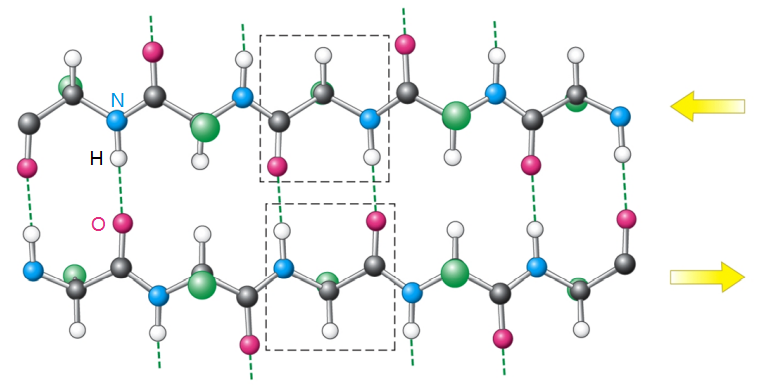

>   1个氨基酸只与1个氨基酸形成氢键 (共2个) 虚线框内示意

An antiparallel $β$ sheet. Adjacent $β$ strands run in opposite directions. Hydrogen bonds between $NH$ and $CO$ groups connect each amino acid to a single amino acid on an adjacent strand, stabilizing the structure.
在反平行 $\beta$ 折叠片中, 相邻肽链是反向的,  $NH$ 和  $CO$ 基团之间形成氢键, 将相邻的肽链连接起来, 形成稳定结构

#### Parallel $\beta$ sheet 平行折叠片

>   1个氨基酸与2个氨基酸形成氢键 (共2个) 虚线框内示意

A parallel $β$ sheet. Adjacent $β$ strands run in the same direction. Hydrogen bonds connect each amino acid residue on one strand with two different amino acid residues on the adjacent strand.
在平行 $\beta$ 折叠片中, 相邻肽链是同向的, 一个肽链上的一个氨基酸残基, 与相邻肽链上的两个氨基酸残基形成肽键

#### Mixed $\beta$ sheet 混合折叠片

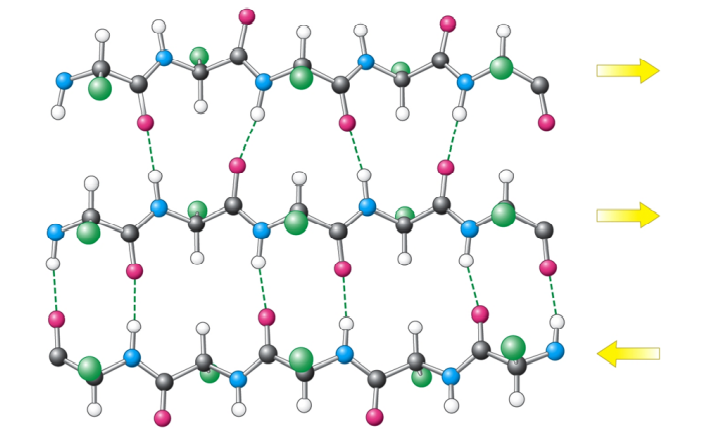

#### $\beta$ sheet 特点 :star:

+ 2-3个残基也可以形成，成对出现
+ 可以序列不连续，但空间靠近
+ 主链仍能以氢键形式参与其他相互作用
+ $\beta$ strand也可以是分子间的

### A twisted $\beta$ sheet 扭曲的 $\beta$ 折叠片

### Protein Rich in $\beta$ Sheets 富含 $\beta$ 折叠片结构的蛋白质

一种脂肪酸结合蛋白的结构 (图中蓝色箭头为 $\beta$ 折叠片)

## $\beta$ turns $\beta$ 转角

+   Connect the ends of two adjacent segments of an antiparallel $\beta$ sheet
    连接两段 相邻 反平行 $\beta$ 折叠片 的末端
+   $180°$ turns involving $4$ amino acids 
    4 个氨基酸残基 形成 $180\degree$ 的转角
+   Hydrogen bonding, the carbonyl oxygen of the first residue forming a hydrogen bond with the amino-group hydrogen of the fourth.
    第 1 个氨基酸残基与第 2 个氨基酸残基之间形成氢键

+   Gly 和 Pro 经常出现在 $\beta$ 转角中
    +   Gly 侧链小, 柔性大(容易调整临近残基的空间阻碍)
    +   Pro 脯氨酸肽键容易采取顺式构型 适合形成转角

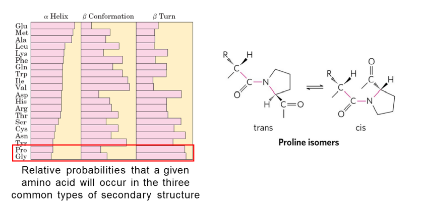

### $\beta$ turn的性质 :star:

+ 四个连续的氨基酸组成
+ 主链骨架 $180\degree$ 折叠
+ 第一个氨基酸的 $C=O$ 与第四个氨基酸的 $N-H$ 形成氢键
+ $C_1^{\alpha}$ 与 $C_4^{\alpha}$ 之间距离小于 $0.7nm$

## Random coil 无规则卷曲

+   Random coil generally refers to those undefined, irregular secondary structure in proteins. Nonrepetitive, having a loop or coil conformation.
    无规则卷曲一般指哪些蛋白质中没有被定义的, 不规则的二级结构 不重复, 有环状构象

### 特点:star:

+   $\alpha-Helix,\beta-sheet,\beta-turn$ 的连接单元
+   没有规律的多肽链主链骨架构象, 往往与生物活性有关
+   $\alpha$ 螺旋, $\beta$ 折叠在拉氏构象图上有固定的位置, 无规则卷曲的的 $\Phi,\Psi$ 二面角可存在于所有允许区域内

## Super secondary Structures 超二级结构

Supersecondary structures(超二级结构) or motifs(模体) are particular arrangements and combinations of two or three secondary structures.
超二级结构或者说模体, 是由两个或多个二级结构特定排列组合而成

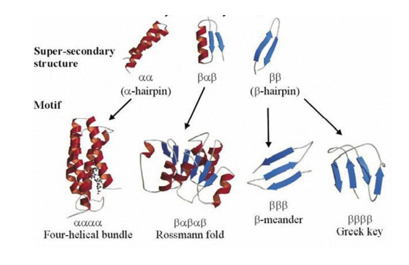

+   蛋白质由不同的超二级结构折叠到一起形成

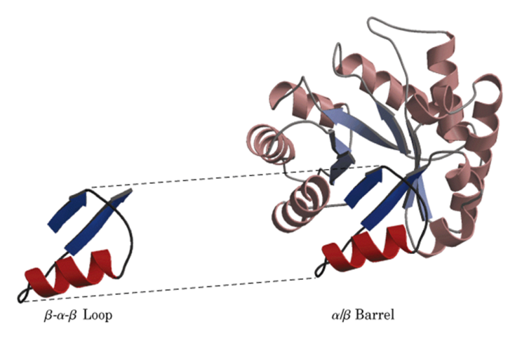

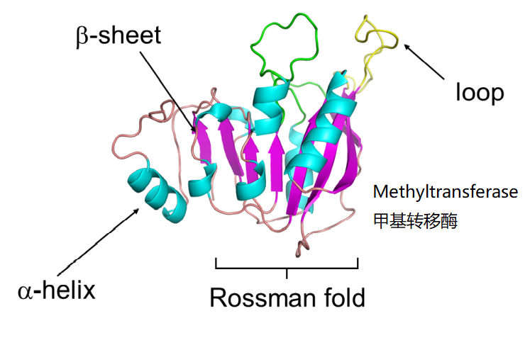

### $\beta$ 桶

A more elaborate motif, the $β$ barrel($\beta$桶).
更精细的模体 $\beta$ 桶

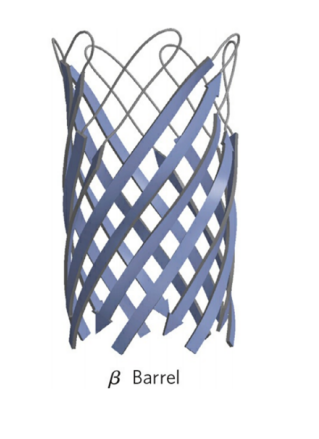

#### $β$ Barrel Integral Membrane Proteins $β$ 桶内在膜蛋白

Not all integral membrane proteins are composed of transmembrane $\alpha$ helices. Another structural motif common in bacterial membrane proteins is the $\beta$ barrel
不是所有的整合膜蛋白都是由跨膜 $\alpha$ 螺旋组成, 还有一种在细菌膜蛋白中常见的 结构模体是 $\beta$ 桶

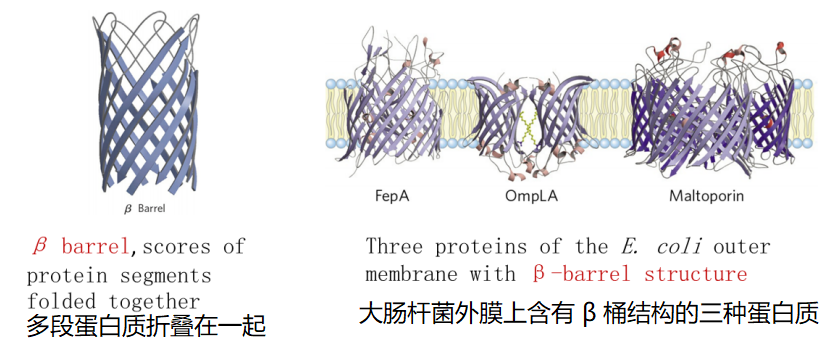

---

+   革兰氏阴性菌 OMPs 的晶体结构

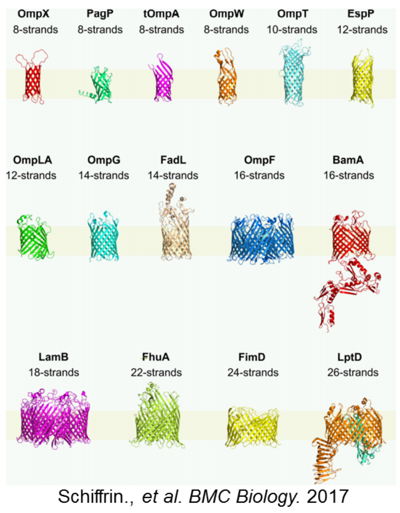

---

+   线粒体和叶绿体外膜上也含有大量的 $\beta$ 桶

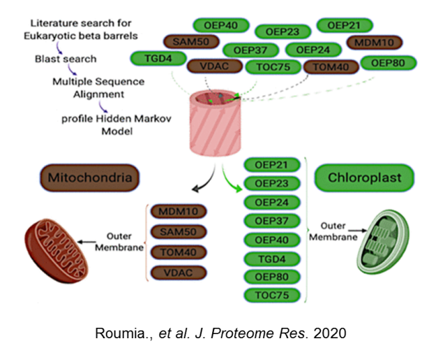

# 结构域

描述结构模式

+   Polypeptides with more than a few hundred amino acid residues often fold into two or more domains.
    多肽链在二级结构或超二级结构的基础上形成的三级结构的局部折叠区, 它是相对独立的紧密球状实体, 称为结构域. 最常见的结构域含序列上连续的 100-200 个氨基酸残基, 少至 40 个残基, 多至 400 个以上残基.
+   In a protein with multiple domains, each domain may appear as a distinct globular lobe.
    含有多个结构与的蛋白质中, 每个机构与可能以球状突起出现
+   Different domains often have distinct functions 
    不同的结构域通常具有不同的功能
+   Small proteins usually have only one domain(the domain is the protein).
    小蛋白通常只有一个结构域 (蛋白质本身作为结构域)

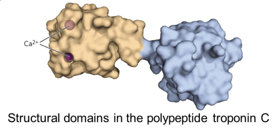

# 蛋白质的三级结构

## 三级结构

The overall three-dimensional arrangement of all atoms in a protein is referred to as the protein's tertiary structure(蛋白质的三级结构)
三级结构可定义为蛋白质分子肽链中所有肽键和氨基酸残基(包括侧链 R 基)的空间位置

### protein type

#### Fibrous Proteins 纤维状蛋白

Mainly structural proteins. A characteristic feature of the fibrous protein sequences is the presence of repetitive sequence motifs.
主要的结构蛋白, 纤维状蛋白序列的一个特征是重复序列模体的出现

+   Single type of secondary structure 
    只有一种二级结构
+   Provide support,shape,and external protection
    提供支撑, 形成形状, 和额外的保护
+   Strength and flexibility 
    坚韧
+   Water insoluble, high concentration of hydrophobic amino acids
    不溶于水, 高度疏水氨基酸

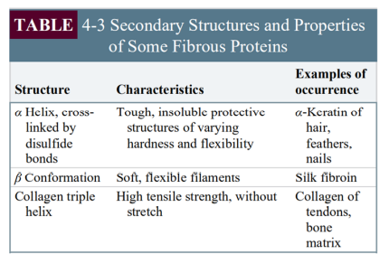

##### $\alpha$ keratin $\alpha$ 角蛋白

+   Structural protein for hair,wool,feathers,nails,hooves,horns 
    毛, 鳞, 羽, 甲等的结构蛋白
+   Providing strength
    提供强度
    +   Coiled coil (left handed twist)of $\alpha$ -helix with hydrophobic amino acids
        由疏水氨基酸组成的左手螺旋的 $\alpha$ 螺旋圈
    +   Forming fibers by hydrophobic interactions
        通过疏水相互作用形成纤维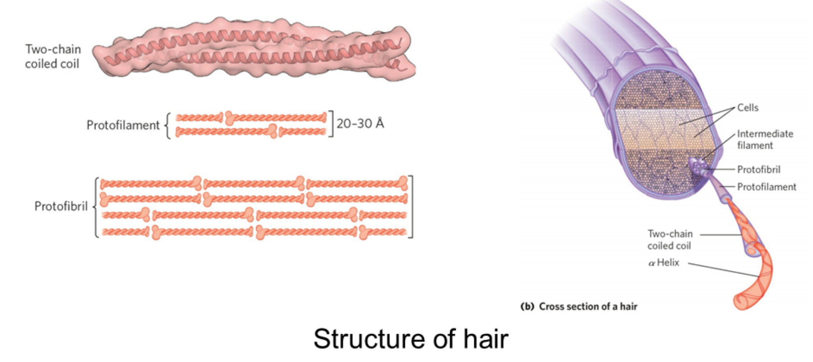
+   Disulfide bonds 二硫键
    +   The more $S-S$ bonds the harder the structure
        二硫键越多, 结构强度越高
    +   Permanent wave 永久烫发
        +   Reducing of disulfide bond 还原二硫键 $\to$ Generation of new disulfide bond 生成新的二硫键
        +   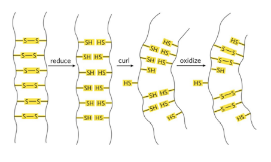

##### Silk Fibroin 丝心蛋白

+   Produced by insects and spiders
    由昆虫和蜘蛛产生
+   $β$ conformation ($β$ 构象)
+   Rich in Ala(丙氨酸) and Gly(甘氨酸) residues
+   Stabilization by hydrogen bonding(氢键) and van der Waals(范德华力) interactions
    通过氢键和范德华力 稳定

##### Collagen 胶原蛋白

+   Providing strength in connective tissue
    在结缔组织中提供韧性
    +   Tendon,cartilage,organic matrix of bone,cornea 
+   Collagen fibrils(胶原原纤维) 
    +   Crosslinking of collagen molecules by involving lysine, hydroxylysine, histidine
        由 Gly, Pro, Hyp 形成三股右手超螺旋缆

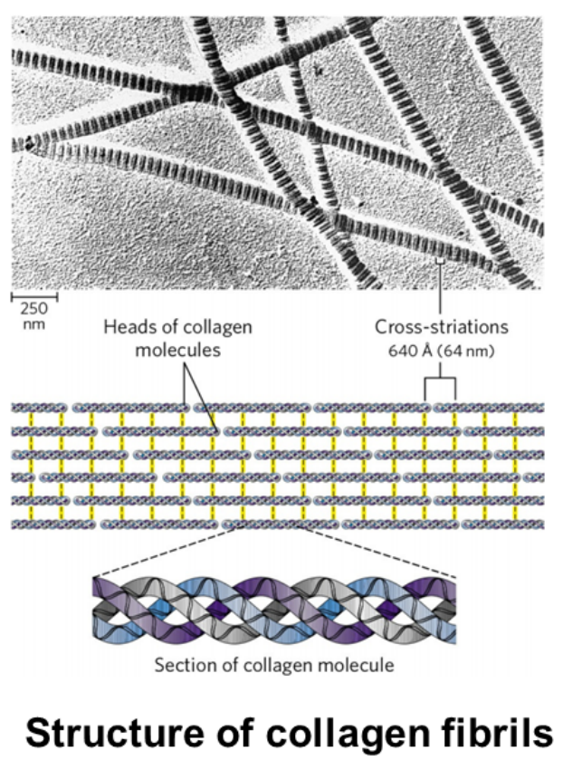

#### Globular Proteins 球状蛋白

Proteins that fold into compact units. Soluble in aqueous solutions
折叠成致密的单元的蛋白质, 可溶于水溶液

+   With polypeptide chains folded into a spherical or globular shape
    多肽链折叠成球状 
+   Hydrophobic side chains in the interior, and hydrophilic sided chains on the surface 
    疏水侧链在内, 亲水侧链在外
+   Several types of secondary structure 
    多种二级结构
+   Enzymes and regulatory proteins 
    酶和调节蛋白
+   Structural diversity reflects functional diversity in globular proteins
    球状蛋白质的结构多样性反应了功能的多样性

##### Myoglobin 肌红蛋白

+ The first globular protein structure to be determined,by x-ray diffraction methods
    第一种被解析的蛋白质结构(通过 X 射线衍射)

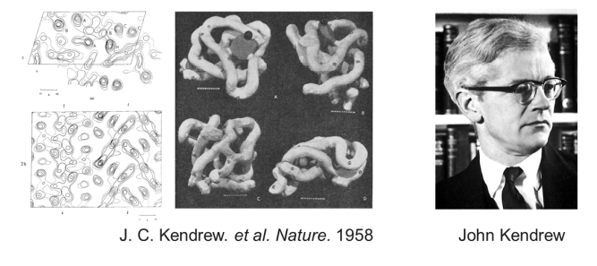

+ Oxygen carrier in muscle: containing heme group
    肌肉中运输氧气: 含有血红素基团

##### Classification of globular proteins

+   All $\alpha$ proteins 全 $\alpha$ 蛋白质
    +   Proteins containing predominantly $\alpha$-helices
        $\alpha$ 螺旋占优势的蛋白质
    +   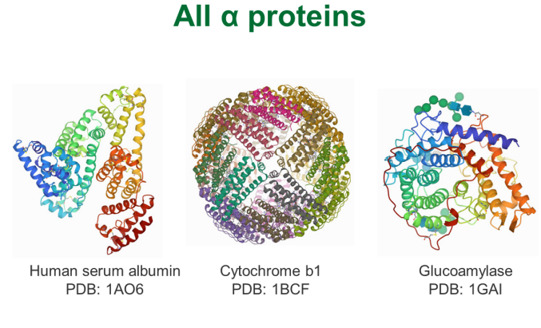
+   All $β$ proteins 全 $\beta$ 蛋白质
    +   Proteins containing predominantly $\beta$-strands
        $\beta$ 折叠股占优势的蛋白质
    +   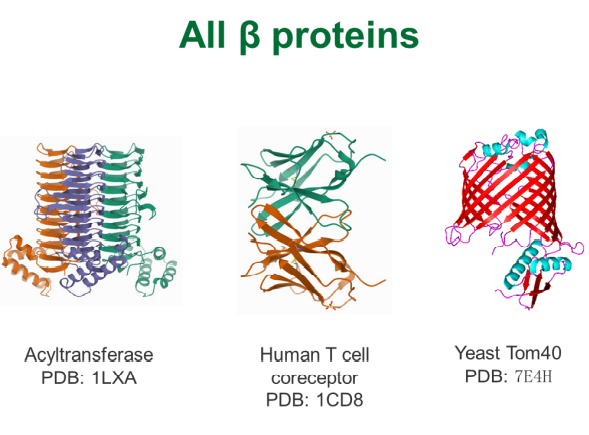
+   $\alpha/\beta$ proteins( $\alpha$ and $β$ segments are interspersed or alternate)
    +   Proteins with alternating $\alpha$-helices and $β$-strands
         $\alpha$ 螺旋和 $\beta$ 折叠股交替出现的蛋白质
    +   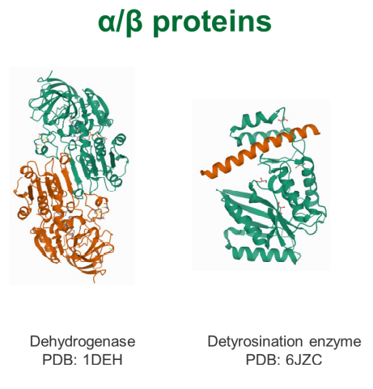
+   $\alpha+\beta$ proteins( $\alpha$ and $\beta$ regions are segregated)
    +   Proteins with segregated $\alpha$-helices and $β$-strands
        有成段的 $\alpha$ 螺旋和 $\beta$ 折叠股
    +   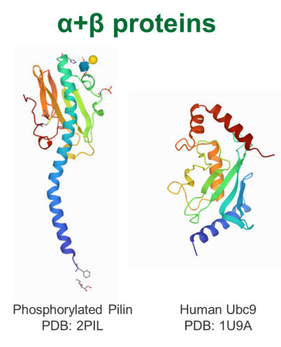
+   Small proteins
    +   Proteins with little or no secondary structures
        几乎没有 (with little or no) 二级结构的蛋白质

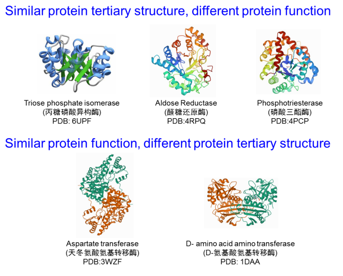

>   球状蛋白序列类似, 但是功能不类似, 因为结构不一样, 结构决定功能

#### Membrane Proteins 膜蛋白

Proteins associated with a membrane of a cell or organelle
与细胞膜或细胞器膜有关的蛋白质

+   Integral membrane proteins (内在膜蛋白)
+   Peripheral membrane proteins (外周膜蛋白)
+   Amphitropic proteins (兼在膜蛋白)

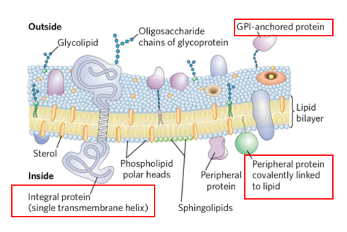

##### Structure of a photosynthetic center in bacteria 细菌中光合作用中心的结构

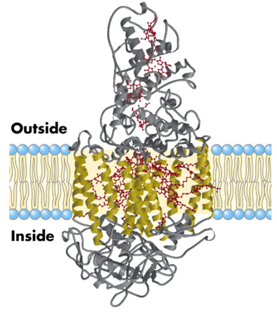

This photosynthetic center has four protein subunits, three of which contains $\alpha$-helical segments that span the membrane.
这个光合作用中心有四个蛋白质亚基, 期中三个含有 $\alpha$ 螺旋段锚定在膜上

These segments are rich in nonpolar amino acids, their hydrophobic side chains oriented towards the outside of the molecules.
这些片段富含非极性氨基酸, 他们的疏水侧链朝向蛋白质分子外

##### Summary of Transport Types

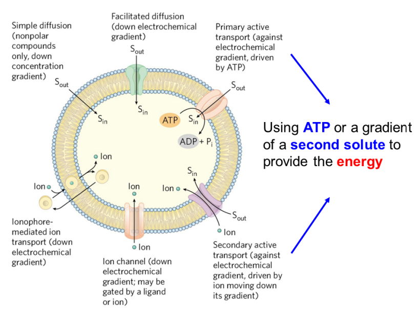

##### Transport May Be Passive or Active

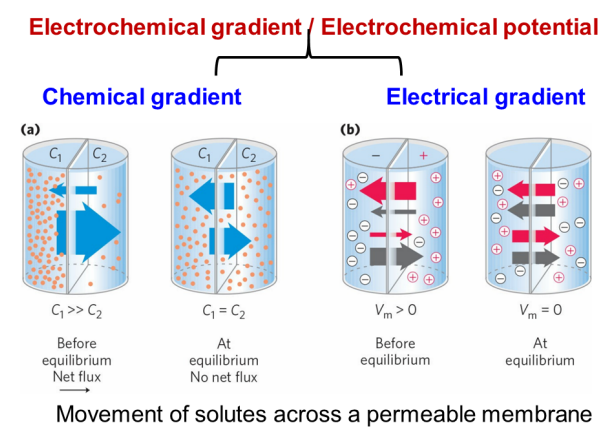

>   左: 化学梯度(浓度梯度)
>   右: 电荷梯度(达到电中性)

Membrane proteins that act by increasing the rate of solute movement across membranes are called transporters or carriers
通过增加溶质通过膜的速率的膜蛋白称为转运蛋白或载体蛋白

##### Transport Types

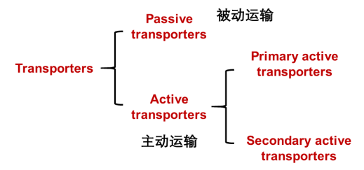

Passive transporters simply facilitate movement down a concentration gradient, increasing the transport rate
被动运输蛋白顺浓度梯度协助运输, 增加转运速率

Active transporters(sometimes called pumps) can move substrates across a membrane against a concentration gradient or an electrical potential
主动运输蛋白能够 逆 浓度梯度 或 电势差 跨膜运输底物

+   Primary active transporters use energy provided directly by a chemical reaction
    Primary active transporters (初级主动运输蛋白) 能够直接利用化学反应的能量
    
+   Secondary active transporters couple uphill transport of one substrate with downhill transport of another.

    +   >   **transport of molecules across the cell membrane utilizing energy in other forms than ATP**

##### A transporter protein reduces the $\Delta G^{\stackrel{+}{+}}$ for transmembrane diffusion of the solute

转运蛋白能够降低溶质跨膜扩散的自由能

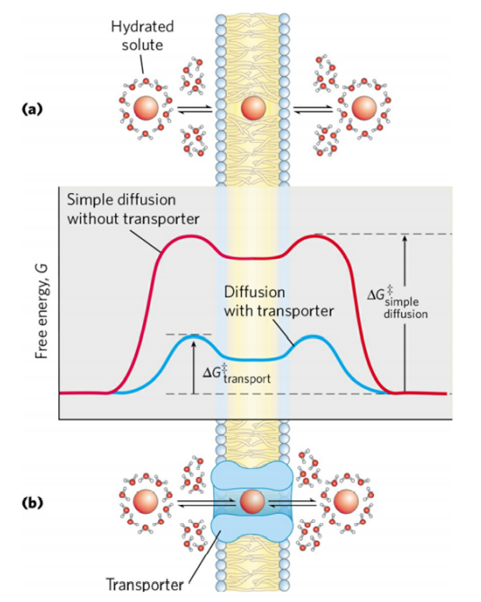

Energy changes accompanying passage of a hydrophilic solute through the lipid bilayer of a biological membrane.
亲水溶质通过生物膜的脂双层时, 能量会发生变化

##### lon Channel 离子通道

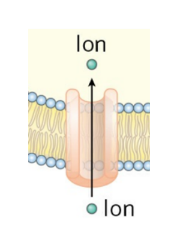

+   lon channel(离子通道) speed the passage of inorganic ions across membranes by a mechanism different from that of transporters(膜转运蛋白)
    离子通道通过一种与膜转运蛋白不同的方式 加快无机离子通过膜的速度
+   They provide an aqueous path across the membrane through which inorganic ions can diffuse at very high rates
    离子通道提供了能够使无机离子快速扩散通过膜的水通路

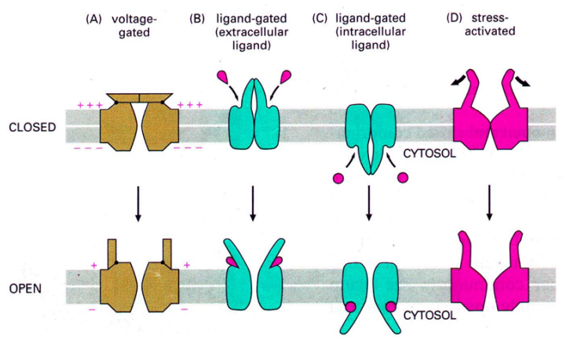

##### Differences between channels(离子通道) and transporters(膜转运蛋白)

离子通道与膜转运蛋白的差异

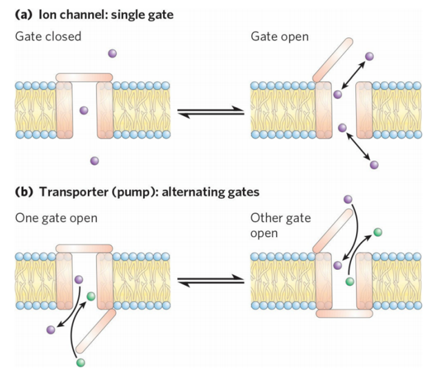

##### Some well-studied representatives of the main transporter and channel families

一些研究得比较彻底得代表性主要转运蛋白和通道蛋白

###### Glucose Transporter(葡萄糖转运蛋白)

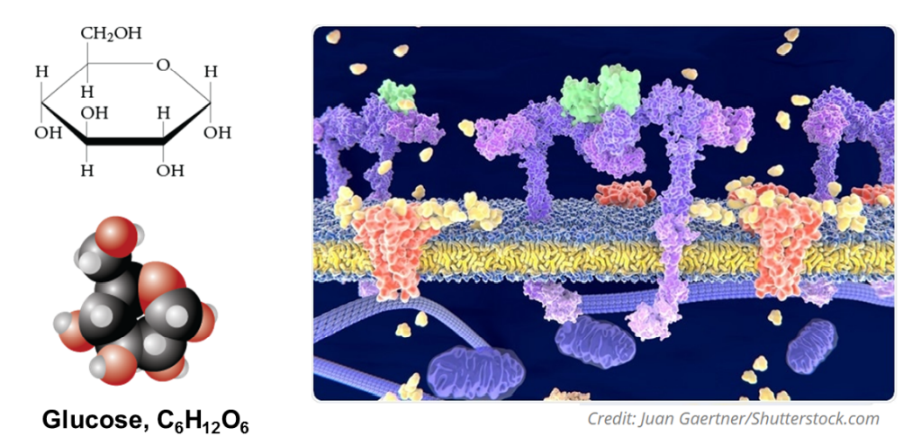

+   Naturally occurring form of glucose is D-glucose 
    天然葡萄糖是 D 型的
+   The most abundant monosaccharide 
    最丰富的单糖
+   Make cellulose in cell walls, the most abundant carbohydrate in the world 
    组成细胞壁中的纤维素(世界上最丰富的多糖)
+   The most important source of energy in all organisms
     在所有的机体中, 葡萄糖是最重要的能量来源
+   Blood sugar as it circulates in the blood at a concentration of 65-110 mg/100 ml of blood.
    血糖浓度 为 65-110 mg / 100 mL

---

+   Glucose transporters in *Homo sapiens*
    人类的葡萄糖转运蛋白

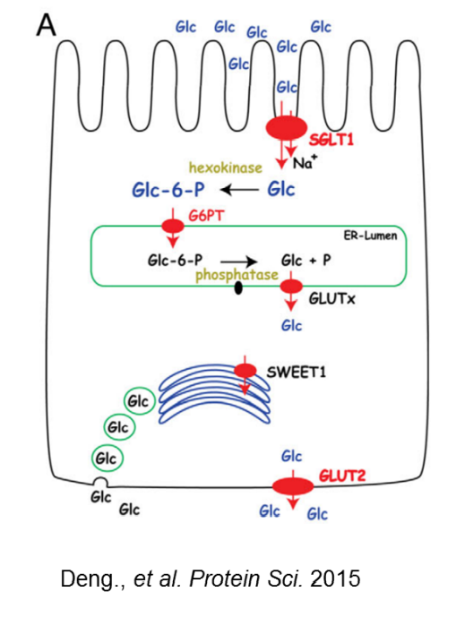

+   Three classes of eukaryotic sugar transporters have been characterized:
    以下是三类真核细胞中的葡萄糖转运蛋白
    +   GLUTs, glucose transporters 
        GLUTs 葡萄糖转运蛋白
    +   SGLTs, sodium-glucose symporters
        SGLTs Na - 葡萄糖 协同转运蛋白 
    +   SWEETs, sugars will eventually be exported transporters

---

+   The structural folds and overall structures of glucose transporters
    葡萄糖转运蛋白的折叠结构和总体结构

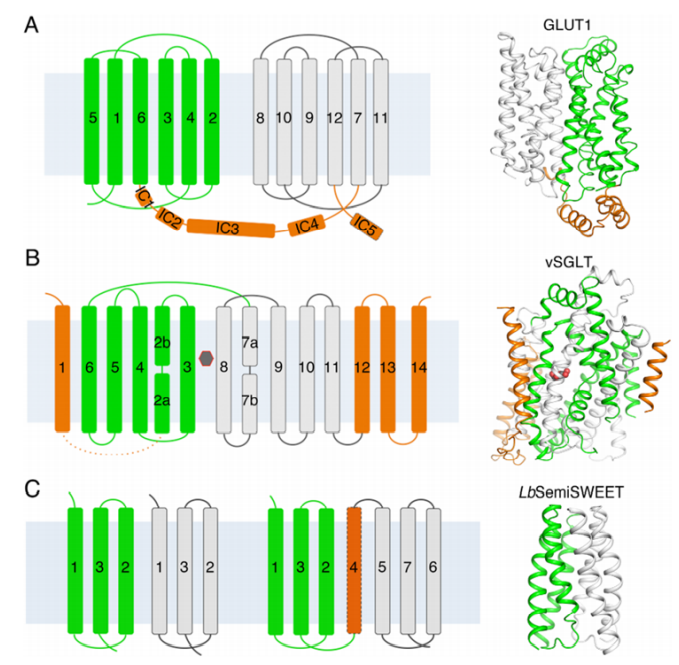

---

+   Membrane topology of the glucose transporter GLUT1
    GLUT1 葡萄糖转运蛋白的 膜拓扑学

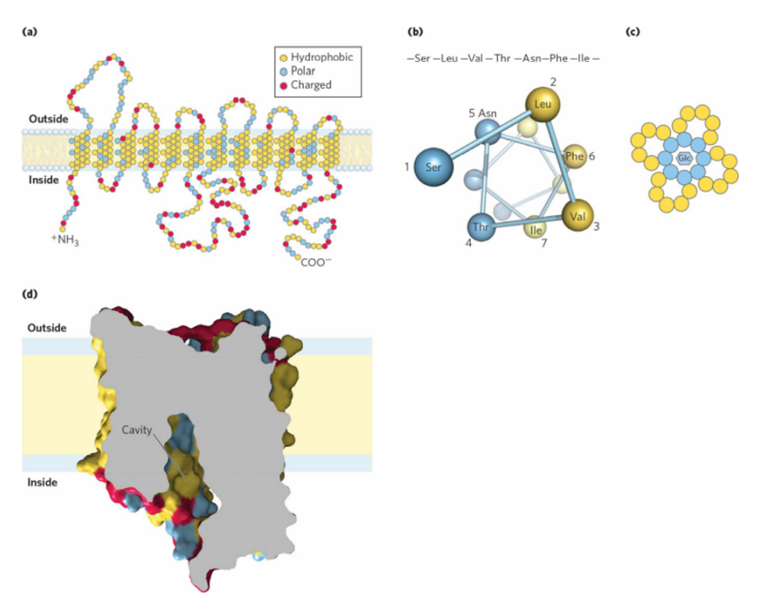

+   Model of glucose transport into erythrocytes(红细胞) by GLUT1
    葡萄糖通过 GLUT1 进入红细胞的模型
    +   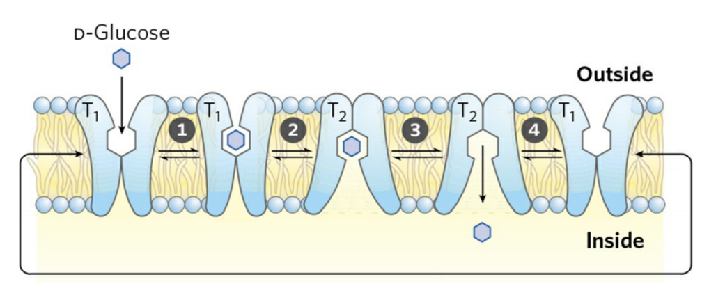

###### The Chloride-Bicarbonate(氯-碳酸氢盐) Exchanger

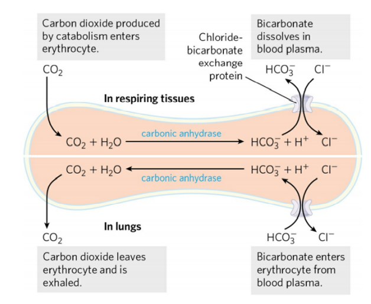

>   Chloride-bicarbonate exchanger of the erythrocyte(红细胞)membrane.

+   This cotransport system allows the entry and exit of without changing the membrane potential.
    协同转运系统能够在不改变膜势能的情况下实现转运
+   Its role is to increase the $CO_2$-carrying capacity of the blood.
    作用是增加血液运输 $CO_2$ 的容量

---

+   Phylogenetic dendrogram of human CI-/HCO3 exchanger genes

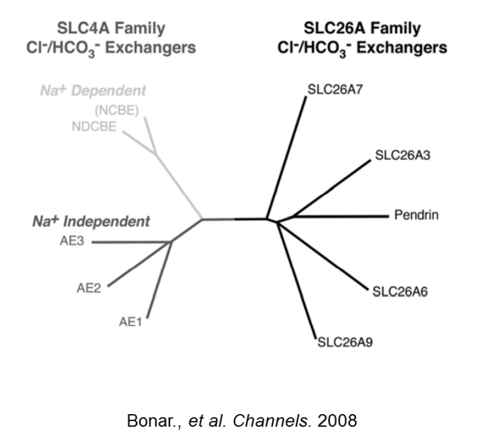

---

+   Structural framework of $AE1_{CTD}$

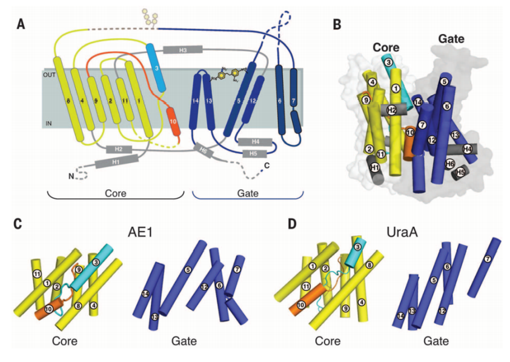

---

+   Propose a possible transport mechanism

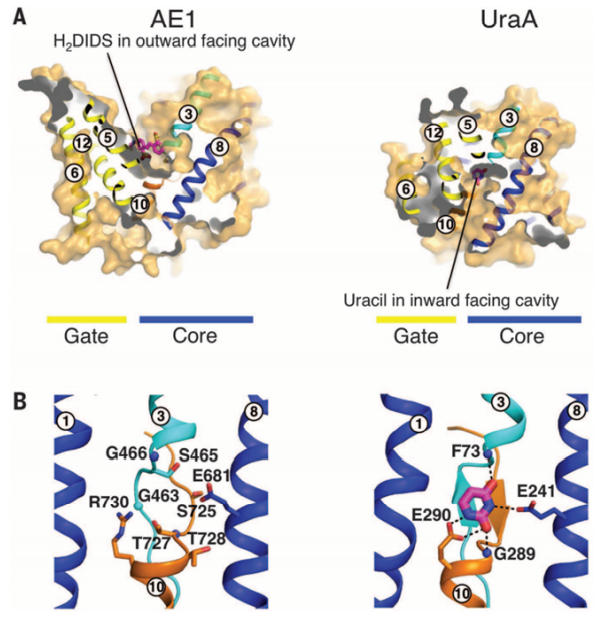

###### Transport ATPases

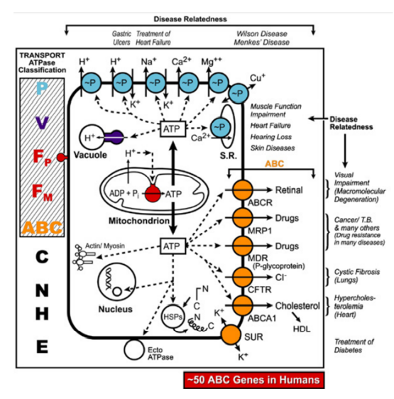

---

+   P-type ATPases

P-type ATPase is a ATP-driven cation transporter that is reversibly phosphorylated by ATP as part of the transport cycle.
P型 ATP 酶是一种 ATP 驱动的正离子转运蛋白 可以被 ATP 可逆性地磷酸化 作为转运循环中的一部分

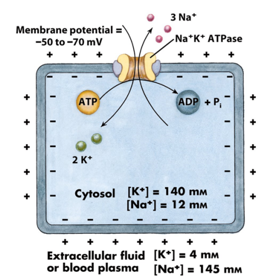

$Na^+\quad K^+$ ATPase is a P-type ATPase with two subunits.
钠钾泵是一种 P 型 ATP 酶, 有两个亚基

---

+   The general structure of the P-type ATPases
    P 型 ATP 酶的总体结构

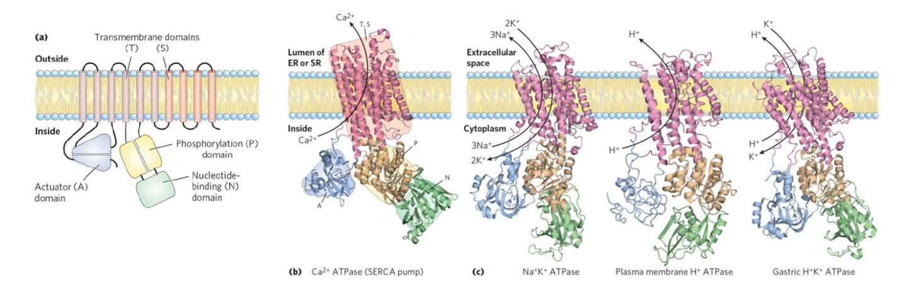

All P-type pumps have similar structures
所有的 P 型泵( ATPase ) 有相似的结构

---

+   Postulated mechanism of the $Ca^{2+}$-ATPase
    钙离子泵的机制猜想

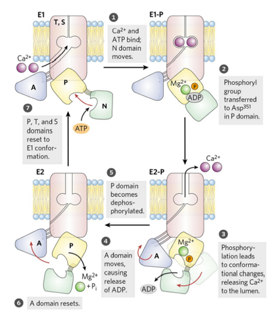

---

+   Role of the $Na^+K^+$ ATPase in animal cells
    动物细胞中钠钾离子泵的作用

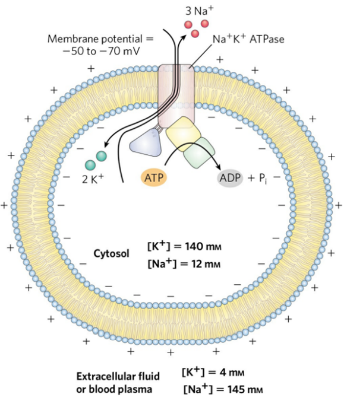

+   The electrical potential across the plasma membrane is central to electrical signaling in neurons 
    膜两边电势对神经细胞电信号的传递十分重要
+   The gradient of $Na^+$ is used to drive the uphill cotransport of solutes in many cell types
    一些细胞中 钠离子浓度势能用于溶质的协同转运

---

+   V-Type and F-Type ATPases

The V-type ATPases, a class of proton-transporting ATPases, are responsible for acidifying intracellular compartments in many organisms 
V 型 ATP 酶是一类质子转运 ATP 酶  在一些生物中负责酸化细胞内隔间

The F-type ATPases transporters catalyze the uphill transmembrane passage of protons, driven by ATP hydrolysis
F 型 ATP 酶转运蛋白 催化质子的逆浓度跨膜运输 由 ATP 水解驱动

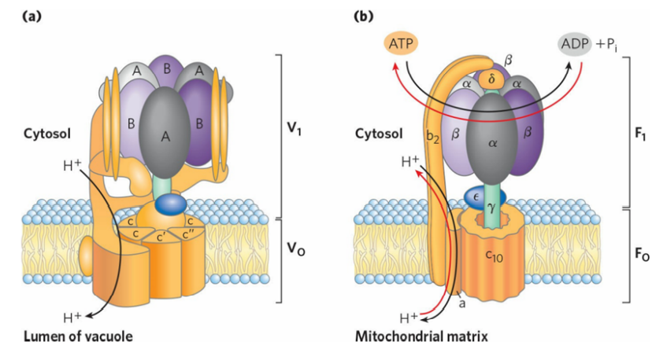

V-Type and F-Type ATPases Are ATP-Driven Proton Pumps
V 型和 F 型 ATP 酶都是 ATP 驱动的质子泵

---

+   Reversibility of F-type ATPases
    F 型  ATP 酶的可逆性

A F-type ATPase can also catalyze ATP synthesis as proton flow down their electrochemical gradient. In this case, it is called ATP synthase.
F 型 ATP 酶在质子顺浓度梯度通过它时, 能够催化 ATP 合成, 这种情况下 称作 ATP 合成酶

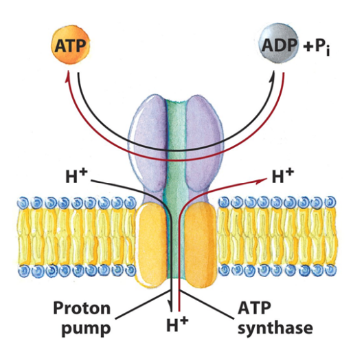

---

+   ABC transporters

ABC(ATP-binding cassette) transporters constitute a large family of ATP-dependent transporters that pumps amino acids, peptides, metal ions, lipids, drugs, etc. , out of cells against a concentration gradient. All ABC transporters have two nucleotide-binding domains and two transmembrane domains. 
ATP结合盒超家族转运蛋白 是一种依赖 ATP, 将 氨基酸, 肽, 金属离子, 药物等胞外物质逆浓度运输到包内的转运蛋白
所有的 ABC 转运蛋白都有两个核苷酸结合位点, 和两个跨膜区

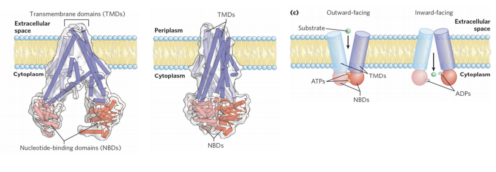

###### Water channels Aquaporins(AQPs) 水通道

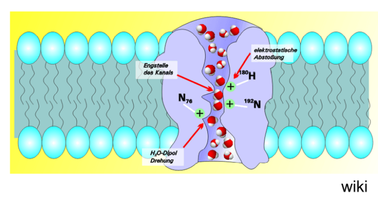

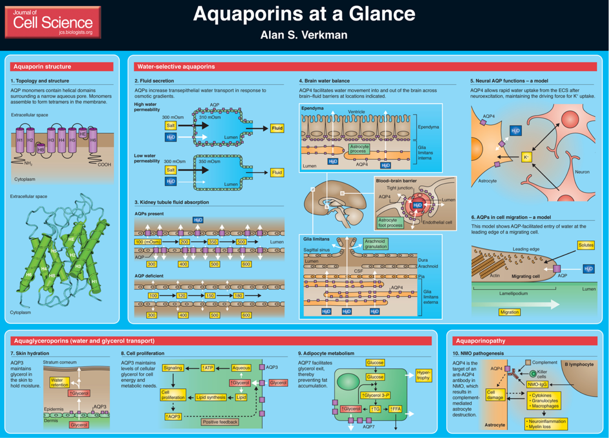

---

+   Structural basis of water-specific transport through the AQP1 water channel
    AQP1 水通道 水特异性运输的结构基础 

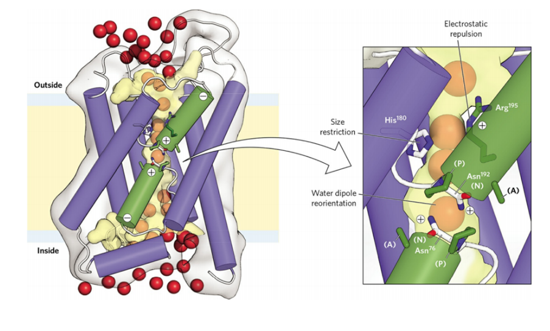

###### lon channels 离子通道

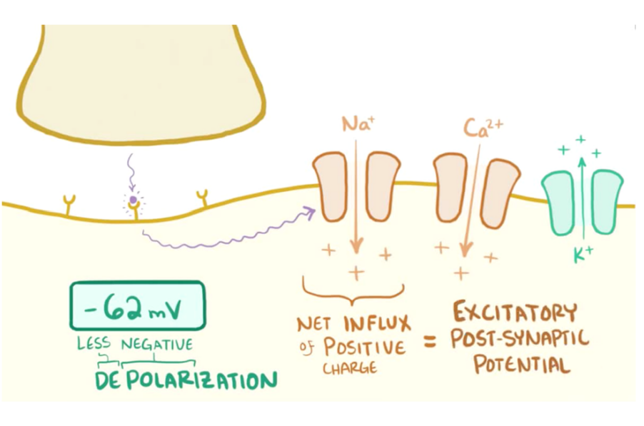

---

+   The $K^+$ channel of Streptomyces Iividans 链霉菌的 $K^+$ 通道

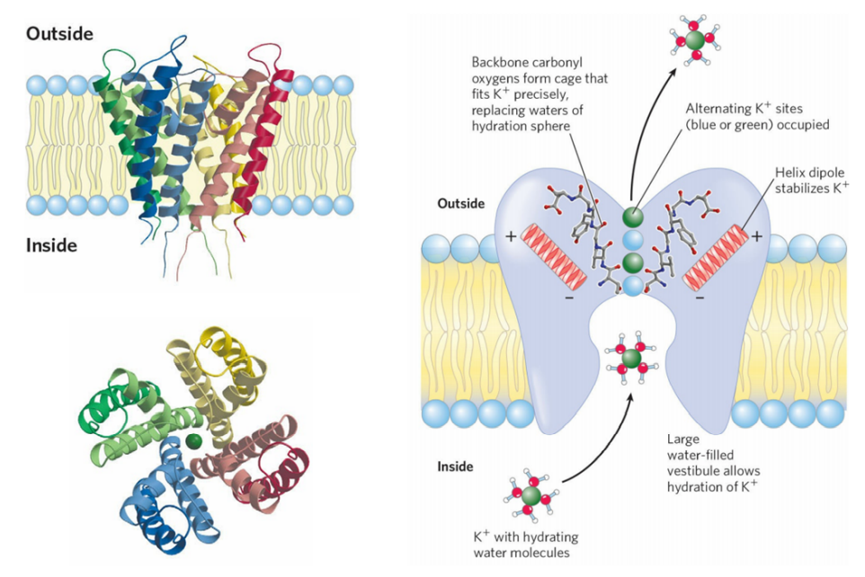

---

+   Structural basis for voltage gating in a $K^+$ channel of the Shaker family
    $K^+$ 通道 voltage gating 的结构基础

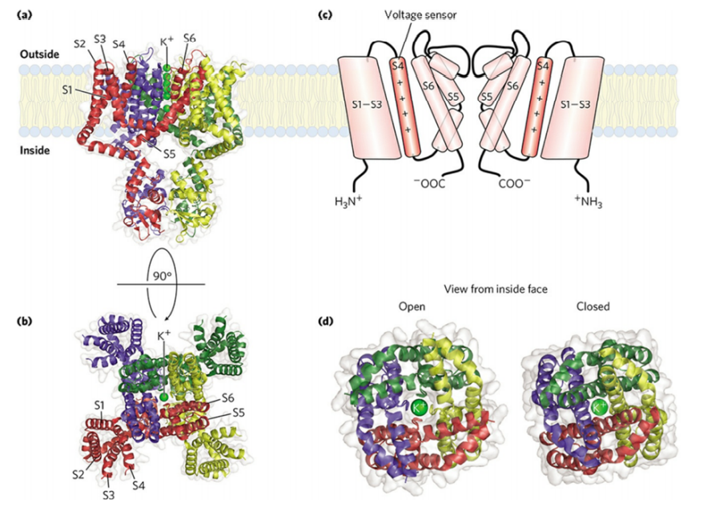

---

+   Voltage-Gated Sodium Channels
    钠离子通道

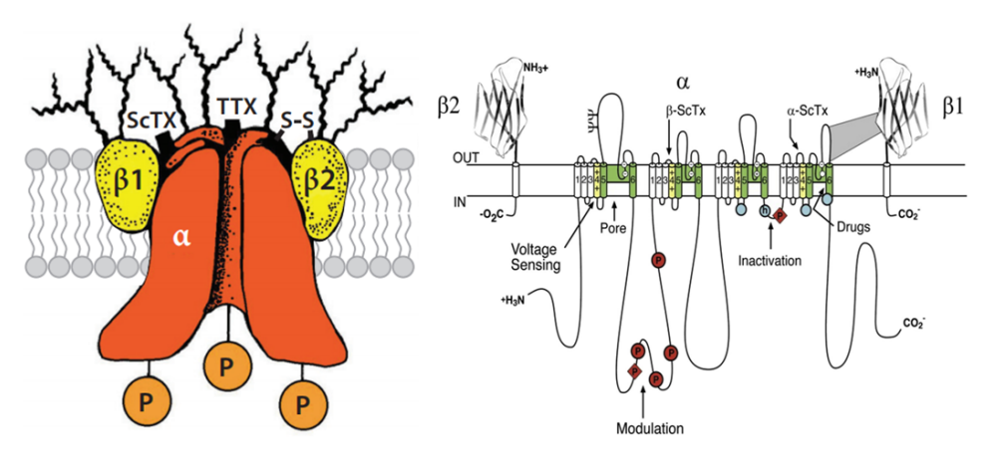

---

+   Structure of sodium channel
    钠离子通道的结构

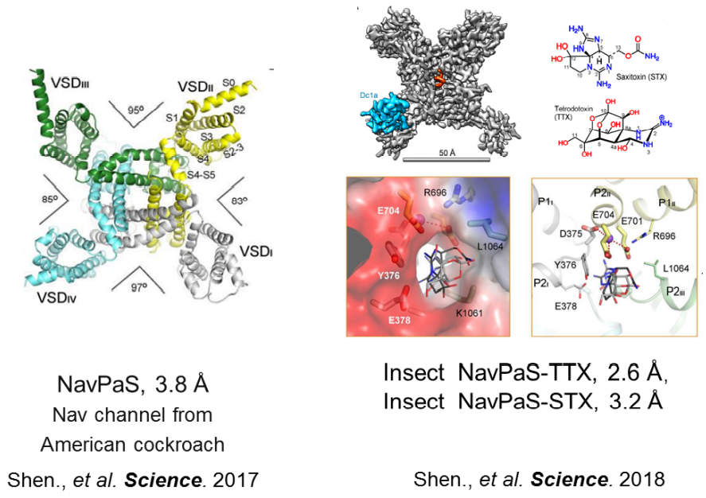

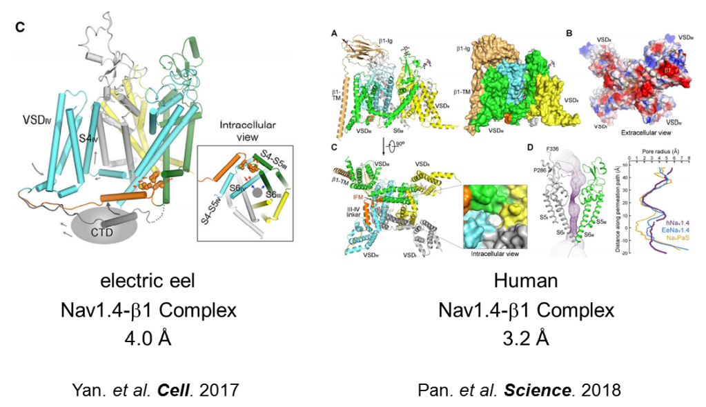

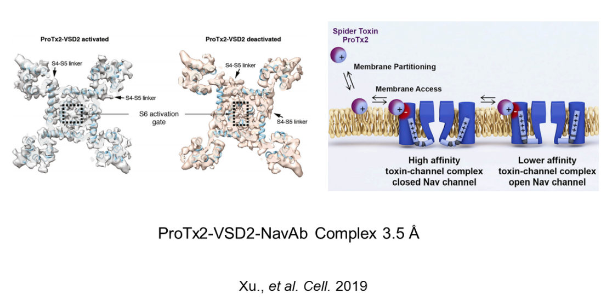

---

+   Sperm-specific ion channel, CatSper
    精子特异性离子通道

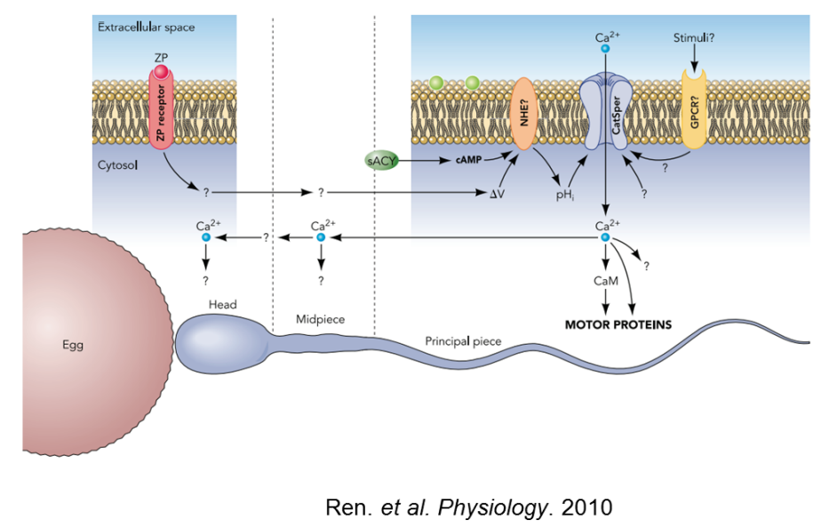

---

+   Cryo-EM reconstruction of the mouse CatSpermasome(2.9$\AA$)

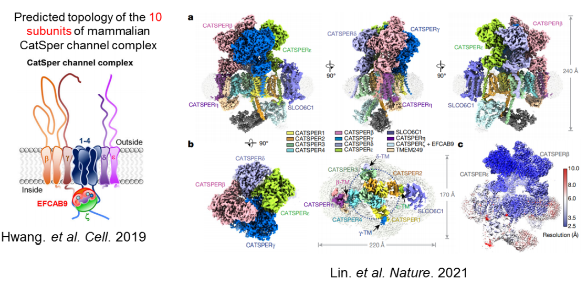

#### Non-globular/Intrinsically unstructured proteins 非球状/固有非结构化蛋白质

Regions of proteins or entire proteins that at native conditions may lack ordered structure but in their functional state can undergo disorder-to-order transition.
蛋白质的区段或整个蛋白质 在自然(原生)条件(native condition)下 可能缺乏有序结构 但是在他们的功能态能够经历从无须到有序的转变

# Protein Quaternary Structure 四级结构

+   Protein quaternary structure(蛋白质的四级结构)
    +   The quaternary structure of a protein is the association of several protein chains or subunits(亚基)into a closely packed arrangement. Each of the subunits has its own primary,secondary,and tertiary structure.
        蛋白质的四级结构是指 多个蛋白质链或者亚基之间紧密结合, 每个亚基有它自己的一级, 二级, 三级结构.
    +   自然界中很多蛋白质是以独立折叠的球状多肽链的聚集体形式存在的. 这些具有三级结构的多肽链称为亚基, 它们通过非共价相互作用彼此缔合在一起. 亚基的缔合方式或组织方式称为蛋白质四级结构(Quaternary Structure)
    +   Subunits usually associate noncovalently 亚基之间通常以非共价相互作用结合
        +   hydrogen bonds 氢键
        +   van der Waals forces 范德华力
        +   Interchain disulfide bridges 链内二硫桥

## 血红蛋白

+ Tetramer: two identical a chains and two identical β chains
    两个相同的 $\alpha$ 链和两个相同的 $\beta$ 链
+ Dimer of ap protomer
    四聚体

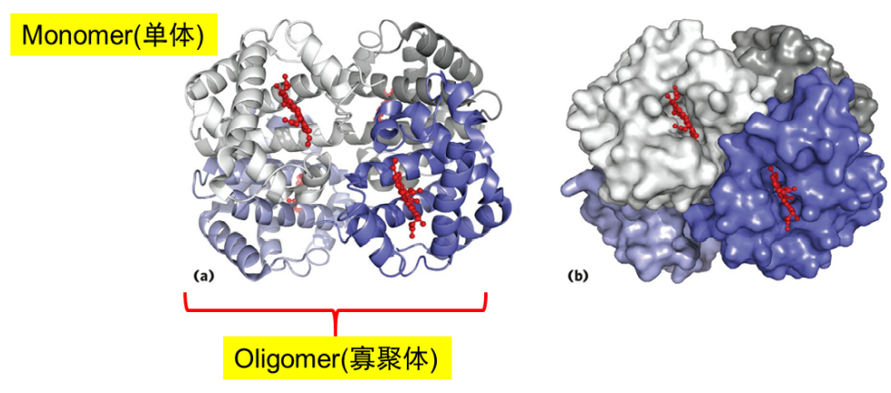

+   Protein quaternary structures range from simple dimers to large complexes
    从简单二聚体道大型复合物的蛋白质四级结构
    +   Multimer(多聚蛋白质), a multisubunit protein 一种多亚基蛋白质 
    +   Oligomer(寡聚蛋白质), a multisubunit protein having two or more polypeptide chains. 
        有两个或多个多肽链的多亚基蛋白质
    +   Protomer(原聚体/原体), a general term describing any repeated unit of one or more stably associated protein subunits in a larger protein structure. In a protomer with multiple subunits,the subunits may be identical or different.
        对称的寡聚蛋白质分子可视为是由两个或多个自身不对称的同一结构成分组成, 这种结构成分被称为原聚体(原体)
+   Symmetries(对称性) of protein quaternary structure(蛋白质的四级结构)
    蛋白质四级结构的对称性
    +   In the majority of oligomeric proteins, the subunits are symmetrically arranged(对称排列)
        大多数寡聚蛋白质的亚基对称排列
    +   That is: protomers occupy geometrically equivalent positions 
        原因是原聚体占有几何上相同的位置
    +   Thus proteins can have only rotational symmetry
        因此蛋白质只能旋转对称性

>   形成对称型的原因
>   增加稳定性

## Symmetries(对称性)of protein quaternary structure(蛋白质的四级结构)

Simples case, cyclic symmetry, single axis of rotation (2-,3-,4-,n-fold). $C_2$ is most common $C_2$ 最常见
在多亚基蛋白质中一个对常见的点群对称是环状对称
环状点群对称用 $C_n$ 表示, $n$ 是轴次(重), 例如肝乙醇脱氢酶(含 2 个原聚体) 和血红蛋白(含 2 个原聚体) 都具有 2- 重环状对称( $C_n$ ). 

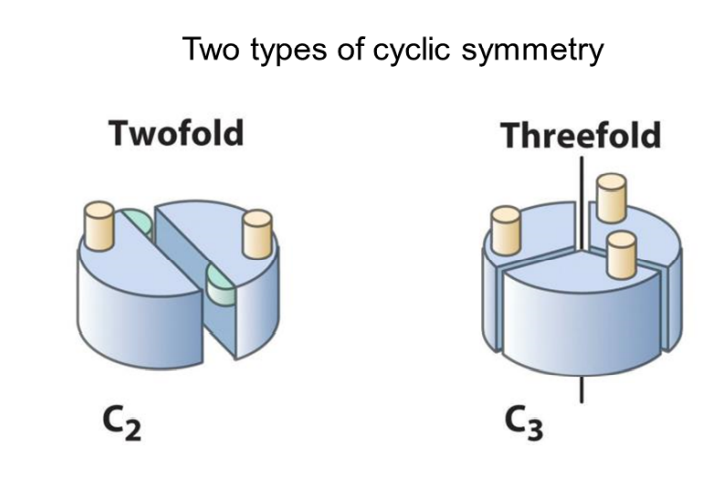

---

Dihedral symmetry(Da): n-fold rotational axis intersects with a twofold rotational axis. 
$D_2$ most common $D_2$最常见
具有两个或多个对称轴的聚集体属于高级点群对称, 包括二面体(dihedral) 和立方体 (cubic) 点群对称. 二面体点群对称式寡聚蛋白中另一个最常见的对称形式. 

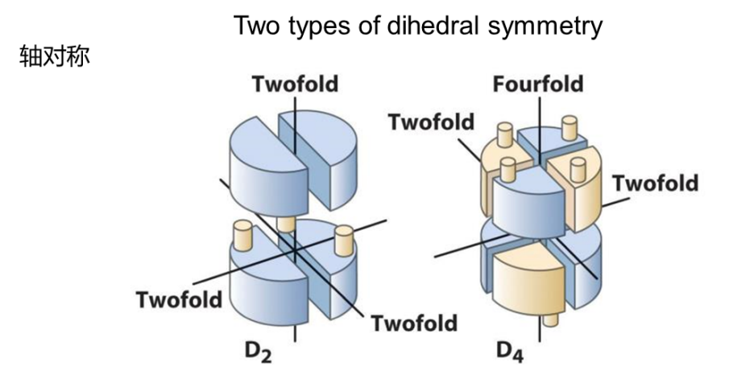

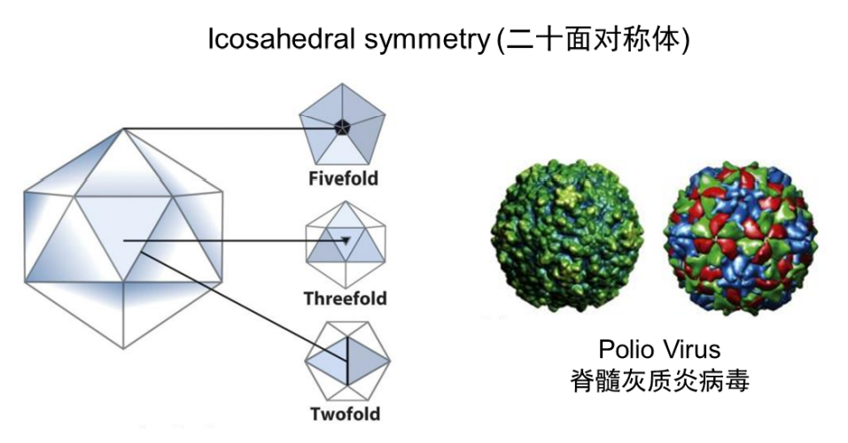

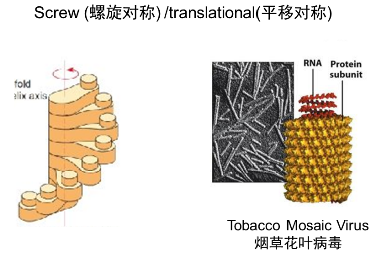

---

+   Advantages of multiple subunits clustered into a quaternary structure
    多亚基聚集成四级结构的优势
    +   Enhance stability( surface-area-to- volume ratio(表面积和体积比)decreases )
        增强稳定性 (减小表面积和体积比)
        +   亚基缔合的第一个优点是蛋白质的表面积于体积之比降低, 一个颗粒或球体的半径增大, 表面积与体积之比则缩小(因为表面积是半径平方的函数, 体积是半径立方的函数), 因为蛋白质内部的相互作用在能量上一般有利蛋白质的稳定, 又因蛋白质表面与溶剂水的相互作用常不利于稳定, 所以降低表面积与体积的比值总的结果是增强蛋白质结构的稳定性. 亚基缔合还可以屏蔽亚基表面上的疏水残基以避开溶剂水, 亚基能识别自身或其他亚基, 由于结合亚基突变体的能力较弱, 因而可以排除在遗传翻译中产生的任何错误.
    +   Improve genetic economy and efficiency
        增强遗传经济型和效率
        +   蛋白质单体缔合成寡聚体对一个生物体在遗传上是经济的. 编码一个将装配常同多聚蛋白质的单体所需的 DNA 比编码一条相对分子质量相同的大多肽链要少. 决定该具体装配和亚基 - 亚基相互作用的所有信息都包含在编码该代替所需的遗传物质中. 例如, HIV 蛋白酶是一个相同亚基的二聚体, 它的催化功能与相对分子质量大一倍的单体同源细胞酶是相似的. 
    +   Improve catalytic efficiency(Bring the catalytic groups together)|
        使催化基团汇集在一起
        +   许多酶至少他们的某些催化能力是来自单体亚基的寡聚缔合,  因为寡聚体的形成可使来自不同单体亚基的催化基团汇集在一起以形成完整的催化部位. 例如细菌谷氨酰胺合成酶的活性部位是由相邻的亚基对形成的, 解离的单体则无活性. 
    +   Adjustable activity( allosteric effect(别构效应))
        具有协同性和别构效应
        +   亚基之所以缔合成寡聚蛋白质还有一个重要原因. 大多数寡聚蛋白质调节他们的生物活性,(如酶的催化活性) 都是借助于亚基相互作用. 多哎呀及蛋白质一般具有多个结合部位, 结合在蛋白质分子的特定部位上的配体对该分子的其他部位所产生的影响(如改变亲和力或/和催化能力)称为别构效应(allosteric effect). 具有别构效应的蛋白质称为别构蛋白质或变构蛋白质, 如别构酶. 「别构」一词来自希腊文 allo(「别的」) 和 stereos(「实体」;「形状」). 其原义是指蛋白质分子含有不止一个配体结合部位, 出活性部位外还有别的配体(如效应物调节物)的结合部位, 称为别构部位或调节部位. 别构蛋白质分子至少含有两个活性部位, 或者还有别构部位. 这两种部位可以在同一个亚基上, 也可以在不同的亚基上, 他们的数目可以相同也可以不同. 别构效应种亚基之间的信息传递使通过蛋白质构象的变化实现的, 亚基之间的接触点提供了亚基之间的通讯机制. 别构效应具有协同性(cooperativity). 别构效应可分为同促效应和异促效应. 同异效应(homotropic effect)发生作用的部位是相同的(例如都是催化部位), 也即一种配体(如底物)的结合对在其他部位的同种配体的亲和力的影响, 这种影响一般是使亲和力加强, 也即第一个配体的结合引起第二个, 第三个 $\cdots$ 配体更容易结合. 这样的同促效应被称为具有正协同性. 正协同效应表现为 S 形配体结合曲线. 如果第一个配体的结合导致第二个, 第三个 $\cdots$ 更难结合, 这样的同促效应则称为具有负协同性, 它不呈现 S 形曲线. 异促效应(Heterotropic Effect) 发生作用的部位是不同的, 也即活性部位的结合行为将受到别构部位与效 应物结合的影响. 有人只认为异促效应是「别构效应」, 因为它才符合「别构」的原义 (effector) 是降低为使活性部位达到饱和所需的配体浓度(如底物浓度)的, 则称它为正效应物或激活剂 (activator) ; 如果是升高为使活性部位达到饱和所需的配体浓度的, 则称它为负效应物或抑制剂 (inhibitor) 别构效应物是细胞代谢库的成分. 其浓度的细微变化可以立即调节代谢的需求
            应该强调指出, 别构蛋白质不管否存在别构部位(有些别构酶不存在别构部位, 只有同促效应), 但是活性部位之间的同促效应总是有的. 同促效应是别构效应的基本, 异促效应可看成是对同促效应的进一步调节.

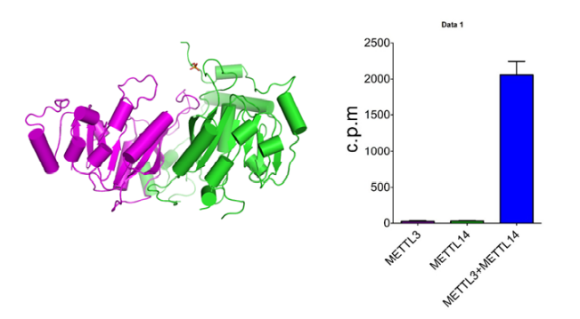

# Protein denaturation, folding and structure prediction 蛋白质的变性, 折叠和结构预测

+   Pathways that contribute to proteostasis蛋白质稳态
    +   Protein folding(蛋白质的折叠)
    +   Thermodynamics(热力学)
    +   Dynamics(动力学)
    +   Structure prediction(结构预测)

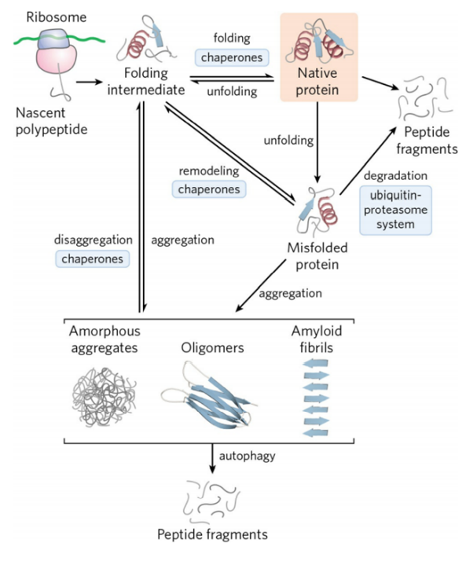

## Protein denaturation 蛋白质的变性

+   Protein denaturation(蛋白质的变性)
    +   A loss of three-dimensional structure(三维结构)sufficient to cause loss of function
        足以造成功能缺失的三维结构破坏
    +   The denatured state does not necessarily equate with complete unfolding of the protein and randomization of conformation
    +   Under most conditions denatured proteins exist in a set of partially folded states
+   Denaturation by
    +   Heat,cooperative melting of the structure 
    +   pH variation,alters ionization state of side chains 
    +   Detergents,break hydrophobic interactions 
    +   Denaturing agents,guanidine HCl(酸胍,urea(尿素)5-10M).Disruption of hydrophobic interactions

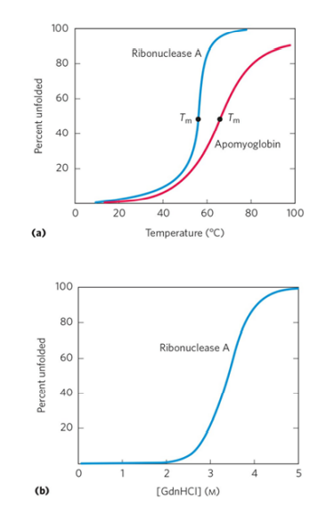

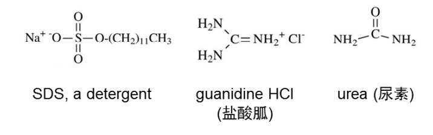

## Protein Renaturation 蛋白质的复性

Certain globular proteins denatured by heat, extremes of pH, or denaturing reagents will regain their native structure and their biological activity if returned to conditions in which the native conformation is stable. This process is called renaturation(复性)

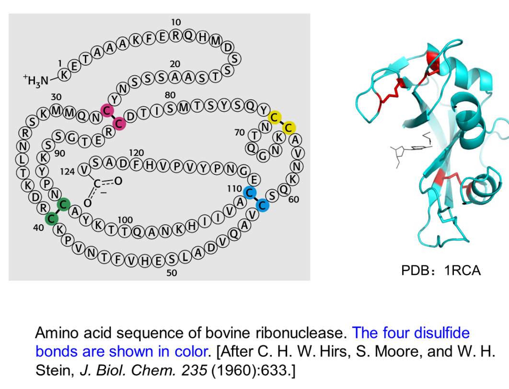

### The denaturation and renaturation of ribonuclease a(核糖核酸酶)

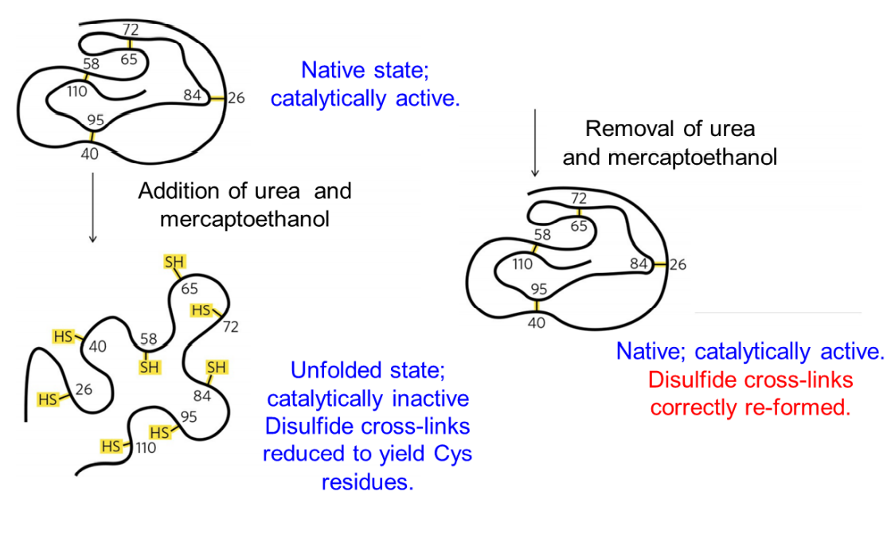

The amino acid sequence(氨基酸序列) of a polypeptide chain contains all the information required to fold the chain into its native,three-dimensional structure(三维结构)

## Protein folding 蛋白质折叠

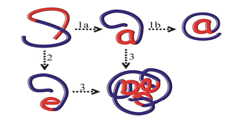

As proteins are synthesized from individual amino acids on ribosomes, they must fold into their native conformations

### 蛋白质折叠基础-amino acid sequence

The three-dimensional structure of a protein is dictated by its amino acid sequence

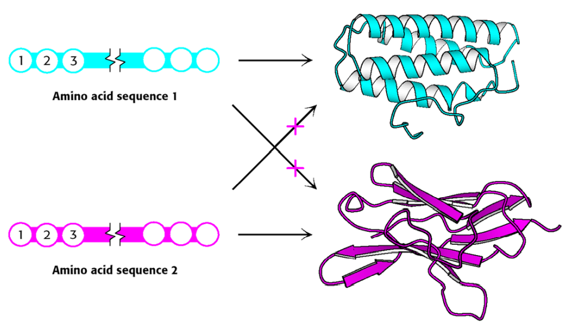

### How does a protein fold

+   Assume a chain of 100 amino acids
+   Allow only 10 conformations
    Possible conformations =$10^{100}$
+   Assume bond rotation rate $10^{-13}$ sec
    Reaching the native state would take: 10 years

E coli: make 100 a.a. protein in 5 sec

>   Conclusion: Protein folding cannot be random-walk

### Polypeptides fold rapidly by a stepwise process

Molten globule state model(熔球模型)(hydrophobiccollapse) initiation of folding by spontaneous collapse by hydrophobic interactions

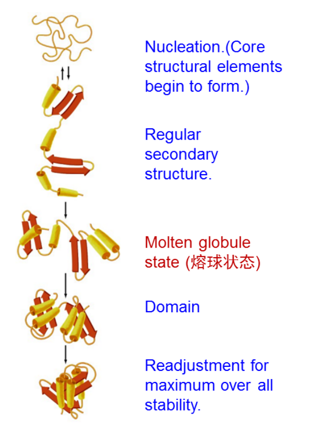

#### Hydrophobic effect(疏水作用)

The hydrophobic groups exposed to the solvent are as few as possible,and the hydrogen bonds formed by the polypeptide chain and the surrounding water molecules are in the most favorable energy state 

The aggregation of nonpolar groups in water leads to an increase in entropy owing to the release of water molecules into bulk water

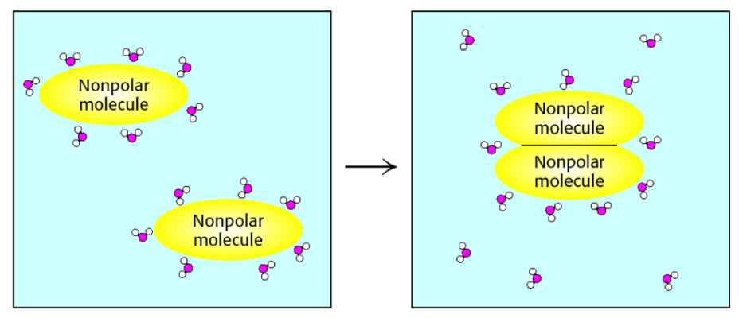

#### Gibbs Free-Energy Change ($\Delta G$)

$$
\Delta G=\Delta H_{\text {system }}-T \Delta S_{\text {system }}<0
$$

The free-energy change must be negative for a reaction to be spontaneous. a negative free-energy change occurs with an increase in the overall entropy of the universe

---

Now we will apply the thermodynamic concepts to a biological process: Protein Folding

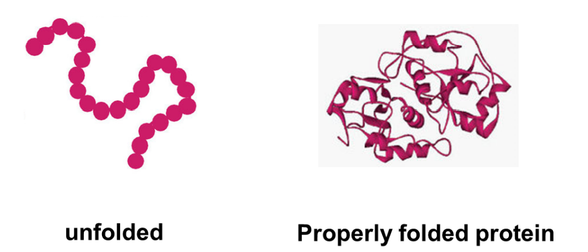

#### Entropy effect(熵效应)

+   Thermodynamic forces that stabilize the folded state The formation of hydrogen bonds,ionic bonds,and disulfide bonds is also driven by the entropy effect

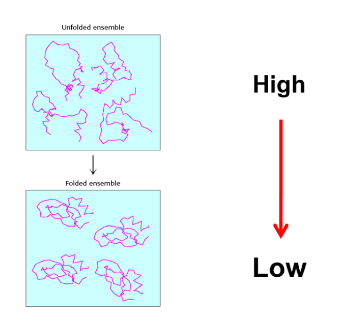

#### Thermodynamics(热力学) of Protein Folding

+   Free-energy funnel 
    +   Unfolded states 
        +   High entropy and high free energy 
    +   Folding process 
        +   Decrease in the number of conformational species(entropy) and free energy 
        +   Semistable folding intermediates

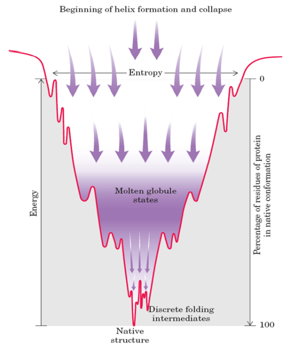

The Essence of Protein Folding Is the Retention 1of Partly Correct Intermediates

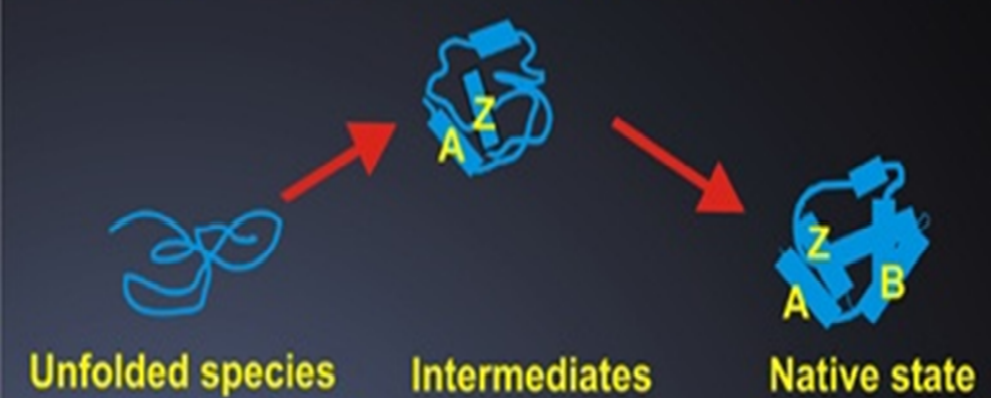

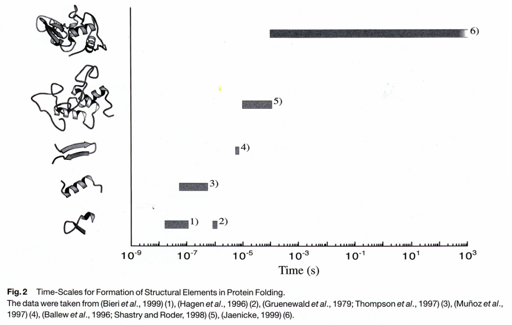

#### Molten globule state model(熔球模型)

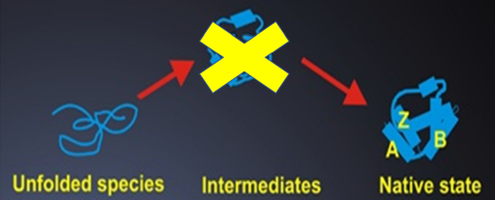

**In living cells,some proteins require folding assistance from molecular chaperones**

+   Molecular chaperones(分子伴侣)
    +   Hsp(heat shock protein,热激蛋白)
    +   Chaperonin(伴侣蛋白)
+   Isomerases(异构酶)in protein folding 
    +   Protein disulfide isomerase(PD)(蛋白质二硫键异构酶)
    +   Peptide prolyl isomerase(PP)(肽基脯氨酸异构酶)

##### Hsp(热激蛋白) in protein folding

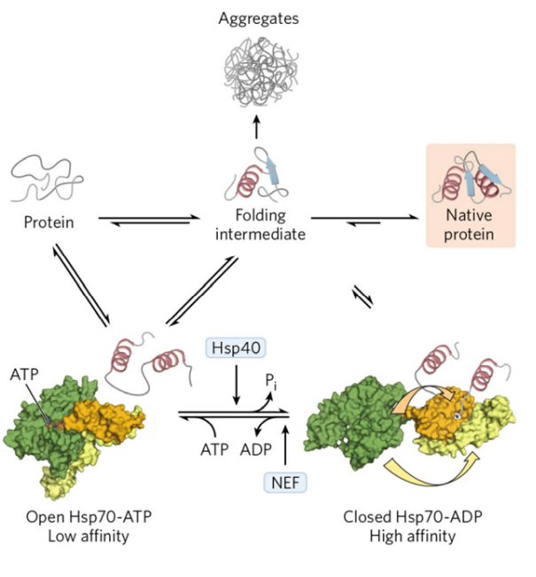

+   Hsp70 proteins bind to regions of unfolded polypeptides that are rich in hydrophobic residues 
+   These chaperones thus protect"both proteins subject to denaturation by heat and new peptide molecules being synthesized (and not yet folded) 
+   Hsp70 proteins also block the folding of certain proteins that must remain unfolded until they have been translocated across a membrane

##### Chaperonin(伴侣蛋白) in protein folding

Chaperonins(伴侣蛋白) are elaborate protein complexes required for the folding of some cellular proteins that do not fold spontaneously

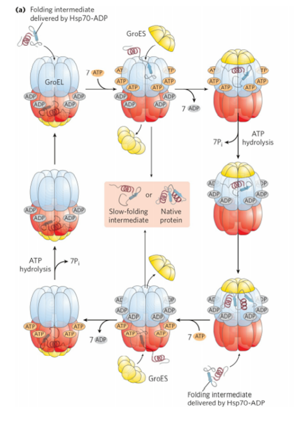

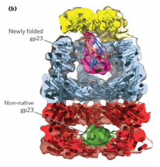

##### Isomerases(异构酶) in protein folding

+   Protein disulfide isomerase(PD(蛋白质二硫键异构酶)
    Shuffling disulfide bonds
+   Peptide prolyl isomerase(P)(肽基脯氨酸异构酶)
    Interconversion of the cis and trans isomers of pro(脯氨酸) peptide bonds
    使脯氨酸酶肽键产生顺反异构

---

**Appropriate protein folding is critical for function and health**

Protein misfoldings are responsible for over 20 diseases
蛋白质错误折叠导致至少 20 种疾病

+ Mad Cow Disease
    + Mad Cow disease caused by an"evil protein" - The "evil" protein and normal protein have identical primary structures, but their tertiary structures are different
        疯牛病由“evil protein”造成, 该蛋白质与正常蛋白质由相同的一级结构, 但是他们的三级结构不同
    + 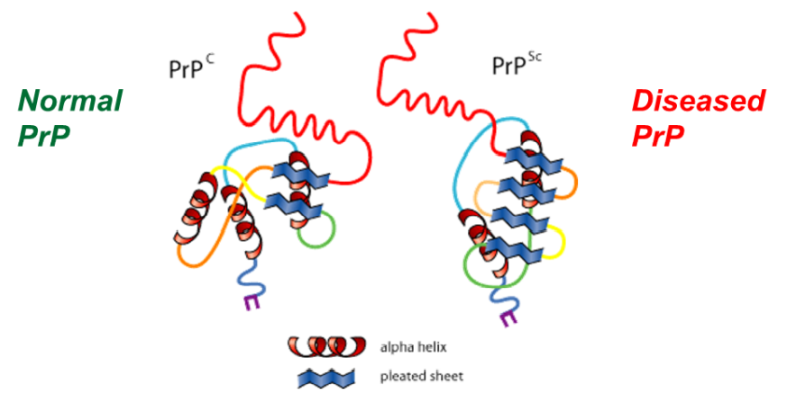
+ Alzheimer Disease
	+ 神经退行性疾病
	+ Enzymes act on the APP(amyloid precursor protein) and cut it into fragments. The beta-amyloid fragment is crucial in the formation of senile plaques in AD
	    酶作用于淀粉样前体蛋白, 并将其截割成小片段, $\beta$-淀粉样蛋白在阿兹海默症的 $\beta$-淀粉样斑块的形成中十分重要
	+ 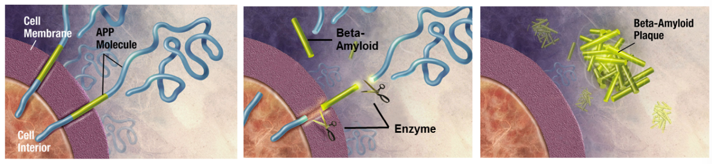
+ $\tau$ 蛋白 $\Longleftrightarrow$ 帕金森

# 蛋白质的结构解析 Protein structure prediction

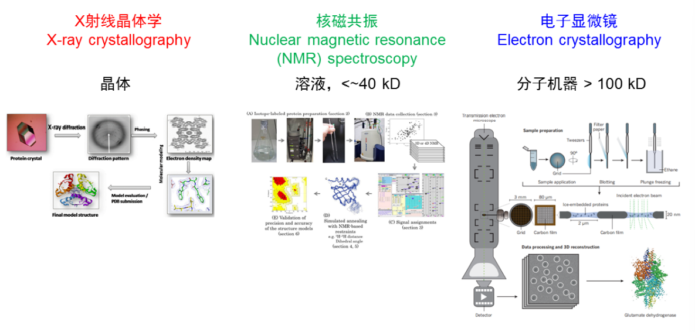

## X射线晶体衍射

X-ray crystallography(X射线晶体学) is a tool used for determining the atomic and molecular structure of a crystal The underlying principle is that the crystalline atoms cause a beam of X-rays to diffract into many specific directions. By measuring the angles and intensities of these diffracted beams,a crystallographer can produce a 3D picture of the density of electrons within the crystal. From this electron density(电子密度)image,the mean positions of the atoms in the crystal can be determined as well as their chemical bonds their disorder and various other information

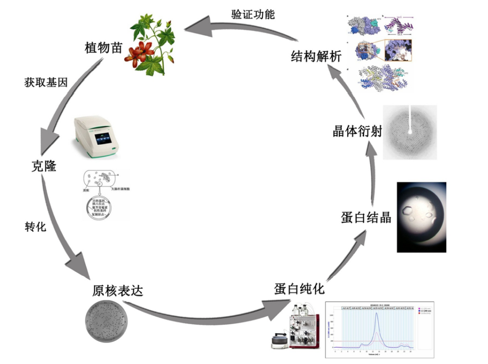

### Process of crystallography technology

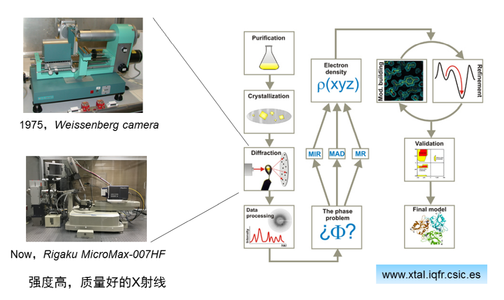

---

+   **The emergence of synchrotron radiation sources has greatly accelerated the development of structural biology**

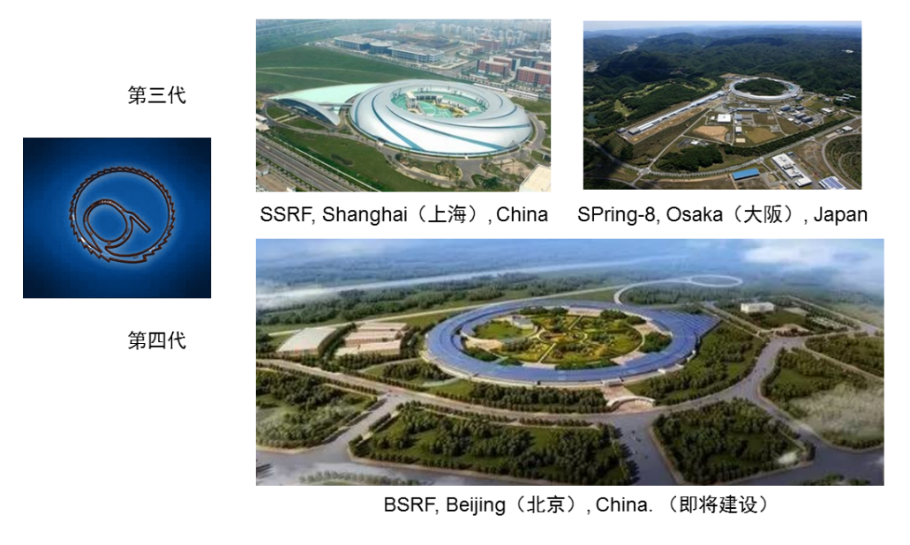

## 冷冻电镜
Single Particle cryo-EM

**Electron Microscope Technology(电子显微镜技术)**

The Electron Microscope(EM)is an impressively powerful microscope that exists today allowing researchers to view a specimen at nanometer size

>   纳米级别

### General structure of electron microscope

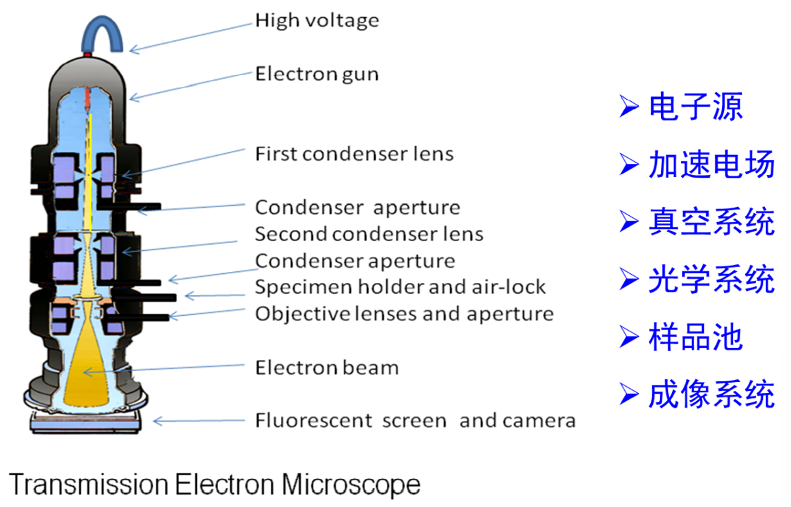

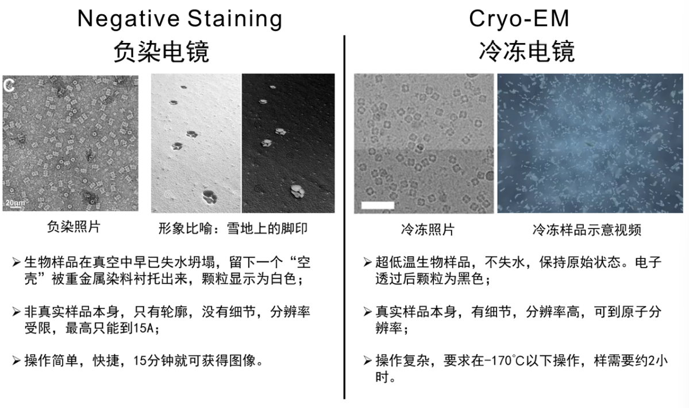

## General Negative Staining(负染) Methods

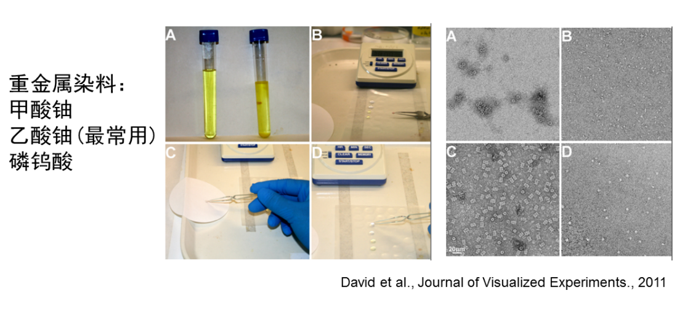

## Basic principles of 3D reconstruction

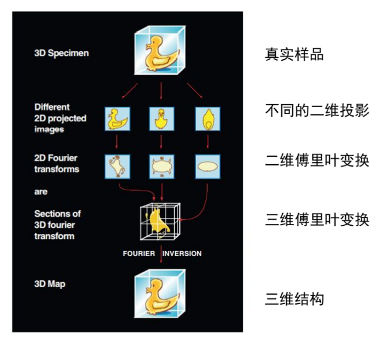

### Atomic Electron Tomography

## NMR 核磁共振

NMR spectroscopy(核磁共振) is the study of molecules by recording the interaction of radiofrequency(Rf) electromagnetic radiations with the nuclei of molecules placed in a strong magnetic field
核磁共振通过记录强磁场下电磁辐射频率与分子核之间的反应进行研究

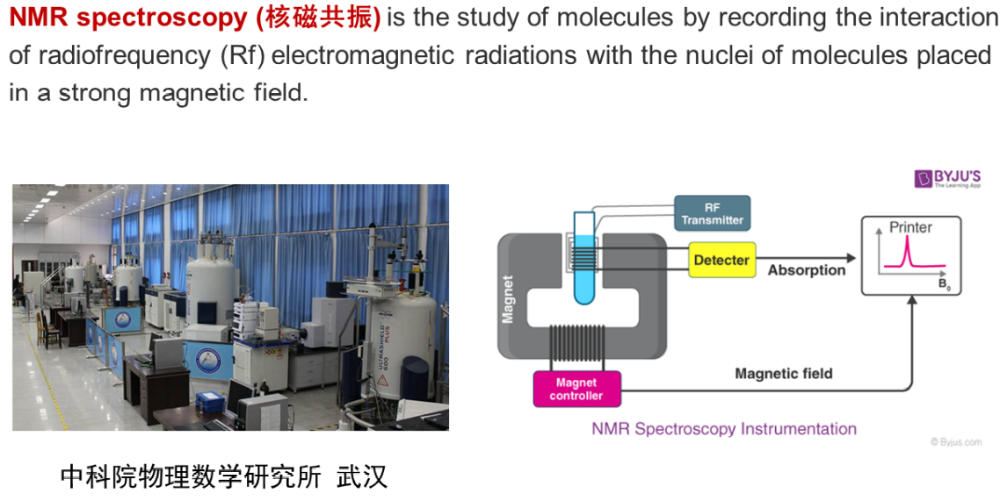

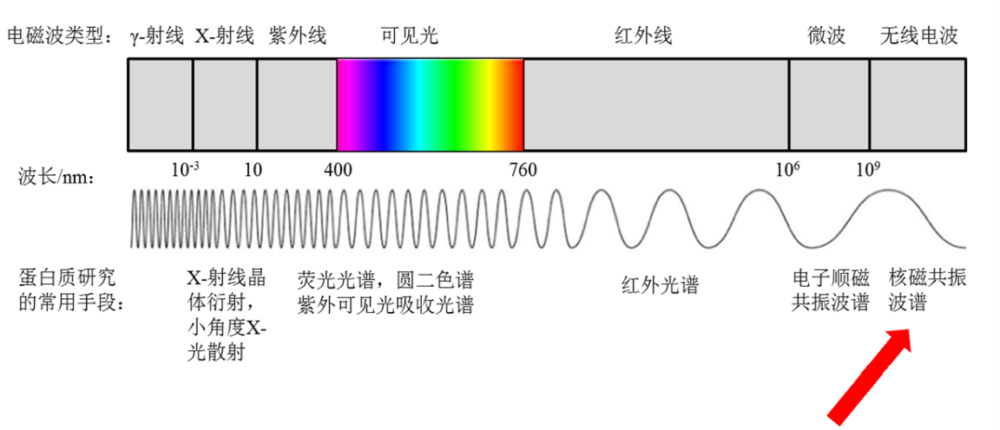

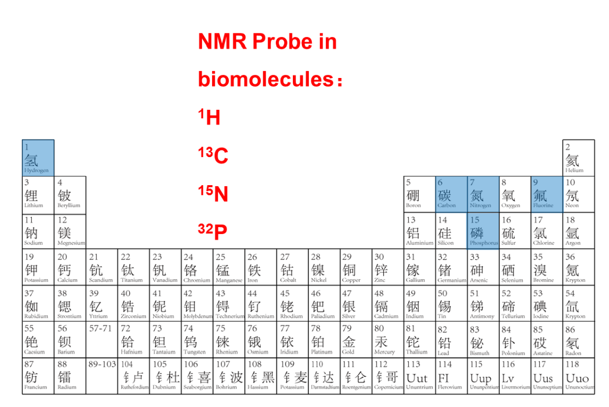

---

Chemical shift(化学位移):It depends on the chemical environment of the atom,that is,the spatial structure of the atom

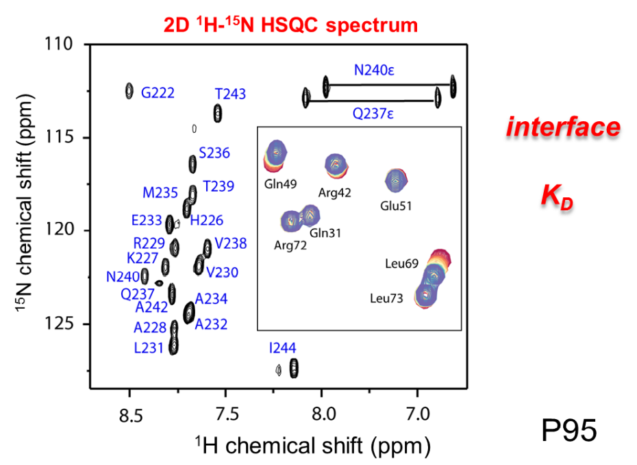

---

Nuclear overhauser effect(NOE)(核奥弗豪泽效应)
Spatial Dipole-Dipole Interaction between atoms within 6 $\AA$

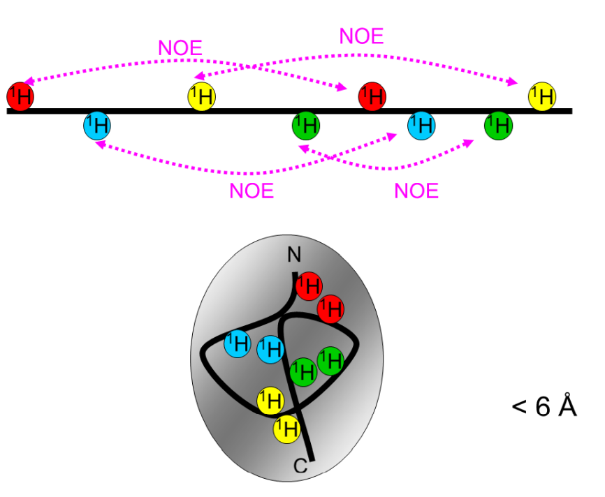

1.Single particle cryo-EM
单颗粒冷冻电镜技术

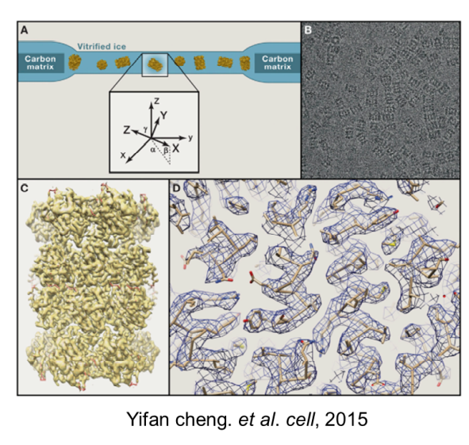

2.Atomic electron tomography
电子断层成像技术

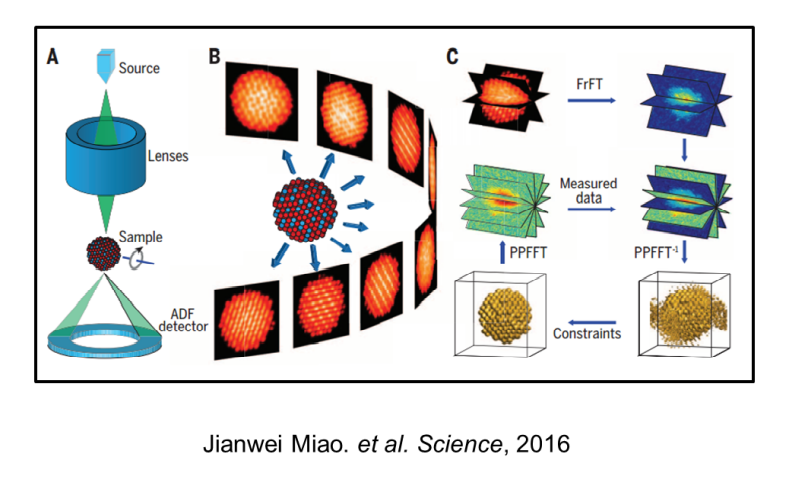

3.Micro electron diffraction
电子晶体学技术

|解析技术|优点|缺点|
|:---:|:---:|:---:|
|X射线晶体衍射|||
|冷冻电镜|||
|核磁共振|||

