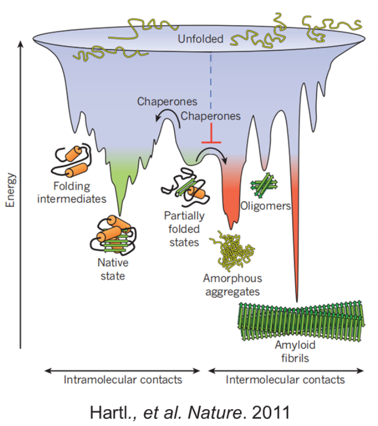
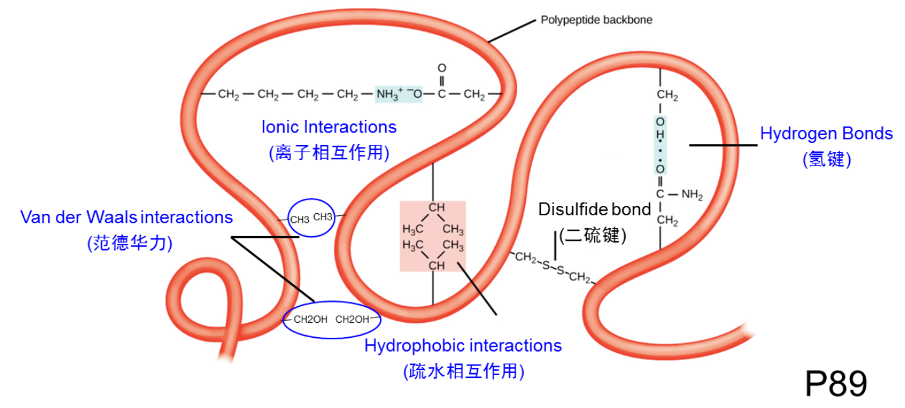
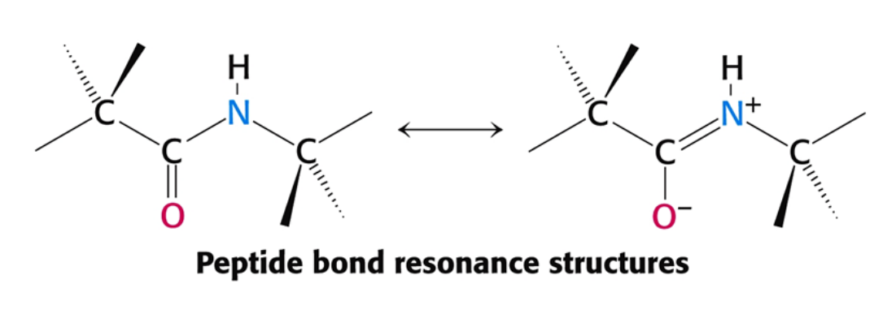
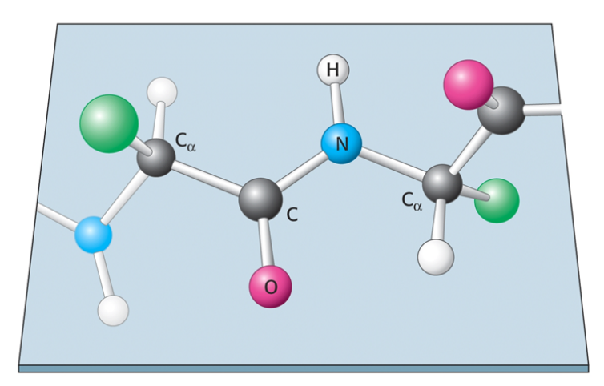
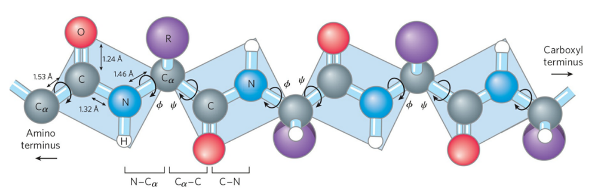
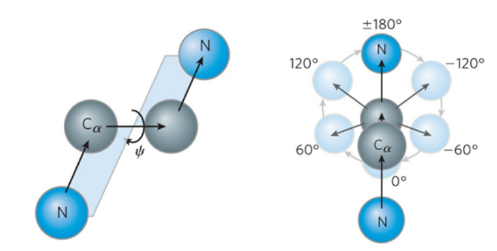

#  Proteins Conformation Three-Dimensional Structure 蛋白质的构象/三维结构

## 结构层次

+ 一级结构 Primary Structure
    + 氨基酸顺序
+ 二级结构 Secondary Structure
    + 
+ 三级结构 Tertiary Structure
    + 球状结构
+ 四级结构 Quaternary Structure
     + 多亚基聚集

## The most stable conformations of a typical proteins 典型蛋白质的稳定构象

+   The conformations existing under a given set of conditions are usually the ones that are thermodynamically the most stable-that is, having the lowest Gibbs free energy ($G$).
    在给定的一套条件下存在的构象一般是热力学上最稳定的构象, 也即吉布斯自由能 $(G)$ 最低的构象
+   Proteins in any of their functional, folded conformations are called native proteins(天然蛋白质).
    任何这一种处于有功能的折叠构象的蛋白质称为**天然蛋白质 (Native Proteins)**

# Overview of Protein Structure 蛋白质结构概述

## A protein's conformation is stabilized largely by weak interactions 蛋白质构象主要由弱相互作用稳定

+   Stability (稳定性)
    +   The tendency to maintain a native conformation
        维持一个天然构象的趋势或倾向
+   The protein conformation with the lowest energy(i.e., the most stable conformation) is the one with the maximum number of weak interaction.
    具有最低自由能的蛋白质构象(即最稳定的构象)是弱相互作用数目达到最大的构象

+   For all proteins of all organisms, weak interactions are especially important in the folding of polypeptide chains into their secondary and tertiary structures. The association of multiple polypeptides to form quaternary structures also relies on these weak interactions.
    对所有生物的所有蛋白质来说, 弱相互作用在多肤链折叠成二, 三级结构方面显得特别重要, 多个多多肽链缔合成四级结构也是依靠这些相互作用

## The peptide bond is rigid and planar 肽键具有刚性和平面的性质

+   Peptide bonds have considerable double-bond character - resonance hybrid(共振杂化体)
    肽键具有重要的双键性质: 共振杂化体

+   Peptide plane (肽平面), 6 atoms($C_\alpha,C,O,N,H\ and\ C_\alpha$) of the peptide group(肽基) lie in a single plane
    肽基的六个原子在同一个平面内
+   No free rotation of peptide C-N bond
    肽的 $C-N$ 键不能自由旋转

### Rotation of peptide chain 肽链的旋转

+   The $N-C_\alpha$ and $C_\alpha-C$ bonds can rotate, described bu dihedral angles designated $\Phi $ and $\Psi$, respetively.
    多肤链主链的构象是由 个二面角 (dihedral angle) , 也称扭角 (torsion angle) : $\Phi$ 角, $\Psi$ 角和 $\omega$ 角规定的. 它们各自反映了绕主链上 3 个重复键中的一个键的旋转状况. 二面角定义为两个平面相交的角 在肤的场合．这 些平面由多肤主链中的键矢量来确定 
+   $\Phi$ (phi): Rotation angle of $N-C_\alpha$
    $\Phi$ 角涉及 $C-N-C_\alpha-C$ 键, 绕中央 $N-C_\alpha$ 键发生旋转
+   $\Psi$(psi): Rotation angle of $C_\alpha-C$
    $\Psi$ 角涉及 $N-C_\alpha-C-N$ 键, 绕中央 $C_\alpha-C$ 键旋转

+   Both $\Phi$ and $\Psi$ are defined as $\pm 180\degree$ when the polypeptide is fully extended and all peptide groups are in the same plane.
    按照习惯, 当主链完全伸展且所有肽基处于同一平面时 $\Phi$ 角和 $\Psi$ 角两者被定义为 $\pm 180°$

## The folding of the polypeptide backbone is restricted by steric constraints 多肽主链的折叠受到空间位阻的限制

# 蛋白质二级结构

## $\alpha$ conformation
$\alpha$螺旋 $\alpha$ helix

氨基酸序列影响$\alpha$螺旋的稳定性

## 影响$\alpha$螺旋稳定性的五种因素

### $\alpha$ 螺旋$(3.6_{13})$特征

### $\alpha$ - Helical Coiled Coil

## $\beta$ conformation

### 平行折叠片

### 反平行折叠片

### 混合折叠片

### $\beta$ sheet 特点

+ 2-3个残基也可以形成，成对出现
+ 可以序列不连续，但空间靠近
+ 主链仍能以氢键形式参与其他相互作用
+ $\beta$ strand也可以是分子间的

### a twisted $\beta$ sheet 
## $\beta$ turns $\beta$ 转角

### $\beta$ turn的性质
+ 四个连续的氨基酸组成
+ 主链骨架180

## Random coil 无规则卷曲

## Super secondary Structures 超二级结构

# 结构域

# 蛋白质的三级结构
## 三级结构
protein type
+ Fibrous Proteins
+ Globular Proteins
+ Membrane Proteins
+ Non-globular/Intrinsically unstructured proteins

### Fibrous Proteins
+ Strength and Flexibility
+ Water

#### $\alpha$ 角蛋白
#### 丝心蛋白

#### 胶原蛋白

### Globular Proteins 球状蛋白
#### Myoglobin 肌红蛋白
+ 第一种被解析的蛋白质结构

> 球状蛋白序列类似，但是功能不类似，因为结构不一样，结构决定功能

# Protien Quaternary Structure 四级结构
蛋白质的四级结构
蛋白质的四级结构是由多个蛋白质链或者亚基组装而成
亚基通常
+ xxx

## 血红蛋白
+ 两个相同的 $\alpha$ 链和两个相同的 $\beta$ 链
+ 四聚体

## From simple dimer to large complexes

形成对称型的原因
增加稳定性

# Protein denaturation, folding and strucure prediction蛋白质的变量折叠和结构预测

## 蛋白质稳态

#### 蛋白质的折叠

#### 热力学

#### 动力学

#### 结构预测

#### 蛋白质的变性
足以造成功能缺失的三维结构破坏

Denaturation by
+ 高温
+ pH变化
	+ 改变侧链的离子化状态
+ 去污剂
	+ 打断氢键作用
+ 变性介质 Denaturing Agent

#### 蛋白质的复性

> 蛋白质的折叠不是独立进行的
> + 分子伴侣
> 	+ Hsp 热激蛋白
> + 异构酶

Chaperonin
腔体

Isomerases 异构酶
+ 蛋白质二硫键异构酶 PDI
+ 肽基

Protein misfoldings are responsible for over 20 diseases

+ Mad Cow Disease
+ Alzheimer Disease
	+ 神经退行性疾病
+ $\tau$ 蛋白 $\Longleftrightarrow$ 帕金森

# 蛋白质的结构解析 Protein structure prediction

## X射线晶体衍射

## 冷冻电镜
Single Particle cryo-EM

### Atomic Electron Tomography

## NMR 核磁共振

|解析技术|优点|缺点|
|:---:|:---:|:---:|
|X射线晶体衍射|||
|冷冻电镜|||
|核磁共振|||

# 蛋白质动态学解析

## 化学交联质谱分析

