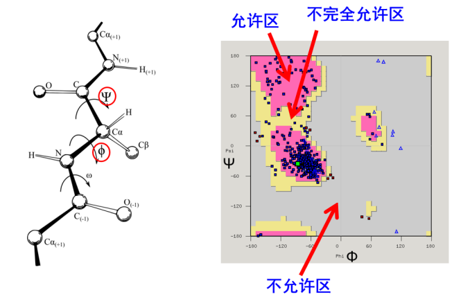

Proteins Conformation Three-Dimensional Structure 蛋白质的构象/三维结构

## 结构层次

+ 一级结构 Primary Structure
    + 氨基酸顺序
+ 二级结构 Secondary Structure
    + 
+ 三级结构 Tertiary Structure
    + 球状结构
+ 四级结构 Quaternary Structure
     + 多亚基聚集

## The most stable conformations of a typical proteins 典型蛋白质的稳定构象

+   The conformations existing under a given set of conditions are usually the ones that are thermodynamically the most stable-that is, having the lowest Gibbs free energy ($G$).
    在给定的一套条件下存在的构象一般是热力学上最稳定的构象, 也即吉布斯自由能 $(G)$ 最低的构象
+   Proteins in any of their functional, folded conformations are called native proteins(天然蛋白质).
    任何这一种处于有功能的折叠构象的蛋白质称为**天然蛋白质 (Native Proteins)**

# Overview of Protein Structure 蛋白质结构概述

## A protein's conformation is stabilized largely by weak interactions 蛋白质构象主要由弱相互作用稳定

+   Stability (稳定性)
    +   The tendency to maintain a native conformation
        维持一个天然构象的趋势或倾向
+   The protein conformation with the lowest energy(i.e., the most stable conformation) is the one with the maximum number of weak interaction.
    具有最低自由能的蛋白质构象(即最稳定的构象)是弱相互作用数目达到最大的构象

+   For all proteins of all organisms, weak interactions are especially important in the folding of polypeptide chains into their secondary and tertiary structures. The association of multiple polypeptides to form quaternary structures also relies on these weak interactions.
    对所有生物的所有蛋白质来说, 弱相互作用在多肤链折叠成二, 三级结构方面显得特别重要, 多个多多肽链缔合成四级结构也是依靠这些相互作用

## The peptide bond is rigid and planar 肽键具有刚性和平面的性质

+   Peptide bonds have considerable double-bond character - resonance hybrid(共振杂化体)
    肽键具有重要的双键性质: 共振杂化体

+   Peptide plane (肽平面), 6 atoms($C_\alpha,C,O,N,H\ and\ C_\alpha$) of the peptide group(肽基) lie in a single plane
    肽基的六个原子在同一个平面内
+   No free rotation of peptide C-N bond
    肽的 $C-N$ 键不能自由旋转

### Rotation of peptide chain 肽链的旋转

+   The $N-C_\alpha$ and $C_\alpha-C$ bonds can rotate, described bu dihedral angles designated $\Phi $ and $\Psi$, respetively.
    多肤链主链的构象是由 个二面角 (dihedral angle) , 也称扭角 (torsion angle) : $\Phi$ 角, $\Psi$ 角和 $\omega$ 角规定的. 它们各自反映了绕主链上 3 个重复键中的一个键的旋转状况. 二面角定义为两个平面相交的角 在肤的场合．这 些平面由多肤主链中的键矢量来确定 
+   $\Phi$ (phi): Rotation angle of $N-C_\alpha$
    $\Phi$ 角涉及 $C-N-C_\alpha-C$ 键, 绕中央 $N-C_\alpha$ 键发生旋转
+   $\Psi$(psi): Rotation angle of $C_\alpha-C$
    $\Psi$ 角涉及 $N-C_\alpha-C-N$ 键, 绕中央 $C_\alpha-C$ 键旋转

+   Both $\Phi$ and $\Psi$ are defined as $\pm 180\degree$ when the polypeptide is fully extended and all peptide groups are in the same plane.
    按照习惯, 当主链完全伸展且所有肽基处于同一平面时 $\Phi$ 角和 $\Psi$ 角两者被定义为 $\pm 180°$

## The folding of the polypeptide backbone is restricted by steric constraints 多肽主链的折叠受到空间位阻的限制

+   In principle, $\Phi$ and $\Psi$ can have any value between $-180\degree$ and $+180\degree$, but many values are prohibited by steric interference between atoms in the polypeptide backbone and amino acid side chains.
    理论上 $\Phi$ 和 $\Psi$ 可以为 $-180\degree$ 到 $+180\degree$ 之间的任何值, 但是因为多肽骨架和氨基酸侧链位阻的存在, 实际上不是任意的  $\Phi$ 和 $\Psi$ 值所决定的肽链构象都是立体化学所允许的.
+   In a protein, some of the conformations shown here (e.g. , $0\degree$) are prohibited by steric overlap of atoms.
    蛋白质中,  $\Phi$ 和 $\Psi$ 同时为 $0\degree$ 的那种构象就不能存在

### Ramachandran Plot 拉氏构象图

+   根据非共价键合原子之间的最小接触距离, 确定哪些 $C_\alpha$ 的成对二面角 ($\Phi, \Psi$) 所规定的两个相邻肽基的构象是被允许的, 哪些是不允许的, 并在 $\Phi$ (横坐标) 对 $\Psi$ (纵坐标) 所作的 $\Phi-\Psi$ 图上标出

+   拉氏构象图展示了 蛋白质能稳定存在的二级结构

# Protein Secondary Structure 蛋白质二级结构

+   The term secondary structure (二级结构) refers to any chosen segment of a polypeptide chain and describes the local spatial arrangement of its main-chain atoms, without regard to the positioning of its side chains or its relationship to other segments.
    二级结构指的是多肽链任一所选区段中主链原子中的局部空间排列, 但不涉及它的侧链定位或与其他肽段的关系
+   二级结构包含
    +   $\alpha$ helix $\quad\alpha$ 螺旋
    +   $\beta$ conformation $\quad\beta$ 构象
    +   $\beta$ turns $\quad \beta$ 转角
    +   random coil 无规则卷曲

## $\alpha$ conformation

$\alpha$螺旋 $\alpha$ helix 常见的蛋白质二级结构

+   The $\alpha$ helices found in proteins are almost always right-handed
    蛋白质中的 $\alpha$ 螺旋几乎都是右手螺旋 
    
+   Residues per turn: $3.6$ 
    一个螺圈包含 $3.6$ 个氨基酸残基
+   Rise per residue: $1.5 \mathrm{\AA}$ 
    每个残基绕轴旋转 $100\degree$, 沿轴上升 $1.5$ 埃 ($0.15nm$)
+   Rise per turn (Pitch, 螺距) : $3.6\times 1.5\mathrm{\AA} = 5.4 \mathrm{\AA}$
    一个螺圈包含 $3.6$ 个氨基酸残基, 沿螺旋轴方向上升 $5.4$ 埃 ($0.54nm$)
+   Idealized $\Phi$ and $\Psi$ angles for $\alpha$ helix : $\Phi = -57\degree,\Psi=-48\degree$
    $\alpha$ 螺旋理想的 $\Phi$ 和 $\Psi$ 角为 $\Phi = -57\degree,\Psi=-48\degree$
    +   
+   Hydrogen bond between carbonyl $O_n$ and amid $H_{n+4}$
    +   
    +   Hydrogen-bonding scheme for an a helix. In the a helix, the $CO$ group of residue $n$ forms a hydrogen bond with the $NH$ group of residue $n+4$.
        在一个螺旋中, 第 $n$ 个 $-CO$ 基团与第 $n+1$ 个 $-NH$ 基团形成氢键
+   Side chains point outward
    侧链朝外

Four models of the a helix showing different aspects of its structure

+   Other forms of $\alpha$ Helix
    其他形式的 $\alpha$ 螺旋
    +   $2.2_{7}-helix$
    +   $3_{10}-helix$
    +   $4.3_{16}-helix$
    +   

### 影响$\alpha$螺旋稳定性的五种因素

氨基酸序列影响 $\alpha$ 螺旋的稳定性 

+   一条肽链能否形成 $\alpha$ 螺旋, 以及形成的螺旋是否稳定, 与它的氨基酸组成和序列有极大的关系. 多肽中每个氨基酸残基都有形成 $\alpha$ 螺旋的固有倾向, 反映R基的性质(包括电荷性质和体积性质)以及它们如何影响邻接的主链原子采取特有的 $\Phi$ 角和 $\Psi$ 角的能力. 关于这方面的知识很大一部分来自对多聚氨基酸的研究. 发现R基小, 并且不带电荷的多聚丙氨酸 (多聚 $Ala$ ), 在pH7的水溶液中能自发地卷曲成 $\alpha$ 螺旋. 在大多数实验模型系统中丙氨酸显示出形成 $\alpha$ 螺旋的最大倾向性.
    

#### Electrostatic repulsion 静电排斥

+   
+   Glu 谷氨酸
+   Lys 赖氨酸
+   Arg 精氨酸

>   氨基酸残基形成 $\alpha$ 螺旋的固有倾向性

#### Bulkiness and shape of adjacent R groups 相邻 R 基的松散度和形状

以下几种氨基酸的体积和形状会使 $\alpha$ 螺旋不稳定
位阻

+   
+   Asn 天冬酰胺
+   Ser 丝氨酸
+   Thr 苏氨酸
+   Cys 半胱氨酸

#### Restricted rotation 旋转受限

+   脯氨酸( Pro )中的氮原子是刚性环的一部分, 不能绕 $N-C_\alpha$ 键旋转
+   

#### Flexible rotation 柔性(弹性)旋转

+   甘氨酸(Gly) 不经常出现在 $\alpha$ 螺旋中的原因是 Gly 比其他氨基酸残基以后更大的构象柔性, 多聚 Gly 倾向采取很不同于 $\alpha$ 螺旋的卷曲结构 (Coiled structure)

#### Interaction between amino acid residues at the ends of the helical segment and the electric dipole(偶极子)of a helix.

螺旋段末端的氨基酸残基和 $\alpha$ 螺旋所特有的电偶极之间的相互作用

+   (+) charged a.a. near C-terminus(have a stabilizing interaction with the negative charge of the helix dipole)
    螺旋偶极的部分正电荷留在氨基端附近的肽氨基上
+   (-) charged a.a. near N-terminus(have a stabilizing interaction with the positive charge of the helix dipole)
    螺旋偶极的部分负电荷留在羧基端附近的肽羰基上
+   因此 带负电荷的氨基酸经常存在于螺旋段的氨基酸, 在这里它们通过与螺旋偶极的正电荷相互作用稳定了 $\alpha$ 螺旋

>   a.a. means amino acid

+   Five types of constraints affect the stability of an a helix
    有 5 个方面的因素影响 $\alpha$ 螺旋的稳定性
    +   The intrinsic propensity of an amino acid residue to form an a helix
        氨基酸残基形成 $\alpha$ 螺旋的固有倾向
    +   The interactions between R groups, particularly those spaced three(or four) residues apart
        R 基之间, 特别是 3(或 4 ) 个残基的 R 基之间的相互作用
    +   The bulkiness of adjacent R groups
        相邻 R 基之间的庞大体积 (位阻)
    +   The occurrence of Pro and Gly residues
        Pro 和 Gly 残基的存在
    +   Interactions between amino acid residues at the ends of the helical segment and the electric dipole inherent to the a helix
        螺旋段末端的氨基酸残基和 $\alpha$ 螺旋所特有的电偶极之间的相互作用

### $\alpha$ 螺旋$(3.6_{13})$特征 :star:

+   螺旋的 $C_\alpha$ 具有相同的二面角, 右手螺旋
+   每圈 3.6 个氨基酸, 高度 $0.54 nm$
+   每个氨基酸绕轴旋转 $100\degree$, 沿轴上升 $0.15nm$
+   氨基酸侧链向外
+   相邻螺圈间形成氢键, 取向与中心轴平行
+   $C=O$ 氧与它后面的第 4 个残基的 $N-H$ 氢形成链内氢键

### $\alpha$ - Helical Coiled Coil

+   $\alpha$-helical coiled coil usually serves a mechanical role.
    卷曲型 $\alpha$ 螺旋通常起力学作用

#### Protein Rich in $\alpha$ Helices 富含 $\alpha$ 螺旋的蛋白质

储存铁的蛋白质 Ferritin(铁蛋白) 由一束 $\alpha$ 螺旋组成

### Structure of TALE protein

TALE repeats have helix-loop-helix secondary structure

dHax3 TALE Repeats Bounds to the DNA-RNA Hybrid

## $\beta$ conformation   $\beta$ 构象

+   A more extended conformation of polypeptide chains,and its structure is again defined by backbone atoms arranged according to a characteristic set of dihedral angles
    这是一种更为伸展的多肽链构象, 它的结构也受到一套特有的二面角排列的主链原子的限定

+   The backbone of the polypeptide chain is extended into a zigzag(锯齿) rather than helical structure
    在 $\beta$ 构象中, 多肽链骨架伸展成锯齿(zigzag) 结构, 而不是螺旋结构

### $\beta$ Strand $\beta$ 股

+   Zigzag polypeptide backbone
    锯齿状多肽骨架

>   Structure of a $\beta$ strand. The side chains(green) are alternately above and below the plane of the strand
>   侧链交替地出现在多肽骨架的上下端

### $\beta$ 折叠片

The arrangement of several segments side by side,all of which are in the $\beta$ conformation, is called a $\beta$ sheet($\beta$折叠片)
处于 $\beta$ 构象的几段多肽链并排地排列, 称为 $\beta$ 折叠片

#### Antiparallel $\beta$ sheet 反平行折叠片

>   1个氨基酸只与1个氨基酸形成氢键 (共2个) 虚线框内示意

An antiparallel $β$ sheet. Adjacent $β$ strands run in opposite directions. Hydrogen bonds between $NH$ and $CO$ groups connect each amino acid to a single amino acid on an adjacent strand, stabilizing the structure.
在反平行 $\beta$ 折叠片中, 相邻肽链是反向的,  $NH$ 和  $CO$ 基团之间形成氢键, 将相邻的肽链连接起来, 形成稳定结构

#### Parallel $\beta$ sheet 平行折叠片

>   1个氨基酸与2个氨基酸形成氢键 (共2个) 虚线框内示意

A parallel $β$ sheet. Adjacent $β$ strands run in the same direction. Hydrogen bonds connect each amino acid residue on one strand with two different amino acid residues on the adjacent strand.
在平行 $\beta$ 折叠片中, 相邻肽链是同向的, 一个肽链上的一个氨基酸残基, 与相邻肽链上的两个氨基酸残基形成肽键

#### Mixed $\beta$ sheet 混合折叠片

#### $\beta$ sheet 特点 :star:

+ 2-3个残基也可以形成，成对出现
+ 可以序列不连续，但空间靠近
+ 主链仍能以氢键形式参与其他相互作用
+ $\beta$ strand也可以是分子间的

### A twisted $\beta$ sheet 扭曲的 $\beta$ 折叠片

### Protein Rich in $\beta$ Sheets 富含 $\beta$ 折叠片结构的蛋白质

一种脂肪酸结合蛋白的结构 (图中蓝色箭头为 $\beta$ 折叠片)

## $\beta$ turns $\beta$ 转角

+   Connect the ends of two adjacent segments of an antiparallel $\beta$ sheet
    连接两段 相邻 反平行 $\beta$ 折叠片 的末端
+   $180°$ turns involving $4$ amino acids 
    4 个氨基酸残基 形成 $180\degree$ 的转角
+   Hydrogen bonding, the carbonyl oxygen of the first residue forming a hydrogen bond with the amino-group hydrogen of the fourth.
    第 1 个氨基酸残基与第 2 个氨基酸残基之间形成氢键

+   Gly 和 Pro 经常出现在 $\beta$ 转角中

### $\beta$ turn的性质 :star:

+ 四个连续的氨基酸组成
+ 主链骨架 180

## Random coil 无规则卷曲

## Super secondary Structures 超二级结构

# 结构域

# 蛋白质的三级结构
## 三级结构
protein type
+ Fibrous Proteins
+ Globular Proteins
+ Membrane Proteins
+ Non-globular/Intrinsically unstructured proteins

### Fibrous Proteins
+ Strength and Flexibility
+ Water

#### $\alpha$ 角蛋白
#### 丝心蛋白

#### 胶原蛋白

### Globular Proteins 球状蛋白
#### Myoglobin 肌红蛋白
+ 第一种被解析的蛋白质结构

> 球状蛋白序列类似，但是功能不类似，因为结构不一样，结构决定功能

# Protein Quaternary Structure 四级结构

蛋白质的四级结构
蛋白质的四级结构是由多个蛋白质链或者亚基组装而成
亚基通常
+ xxx

## 血红蛋白
+ 两个相同的 $\alpha$ 链和两个相同的 $\beta$ 链
+ 四聚体

## From simple dimer to large complexes

形成对称型的原因
增加稳定性

# Protein denaturation, folding and strucure prediction蛋白质的变量折叠和结构预测

## 蛋白质稳态

#### 蛋白质的折叠

#### 热力学

#### 动力学

#### 结构预测

#### 蛋白质的变性
足以造成功能缺失的三维结构破坏

Denaturation by
+ 高温
+ pH变化
	+ 改变侧链的离子化状态
+ 去污剂
	+ 打断氢键作用
+ 变性介质 Denaturing Agent

#### 蛋白质的复性

> 蛋白质的折叠不是独立进行的
> + 分子伴侣
> 	+ Hsp 热激蛋白
> + 异构酶

Chaperonin
腔体

Isomerases 异构酶
+ 蛋白质二硫键异构酶 PDI
+ 肽基

Protein misfoldings are responsible for over 20 diseases

+ Mad Cow Disease
+ Alzheimer Disease
	+ 神经退行性疾病
+ $\tau$ 蛋白 $\Longleftrightarrow$ 帕金森

# 蛋白质的结构解析 Protein structure prediction

## X射线晶体衍射

## 冷冻电镜
Single Particle cryo-EM

### Atomic Electron Tomography

## NMR 核磁共振

|解析技术|优点|缺点|
|:---:|:---:|:---:|
|X射线晶体衍射|||
|冷冻电镜|||
|核磁共振|||

# 蛋白质动态学解析

## 化学交联质谱分析

