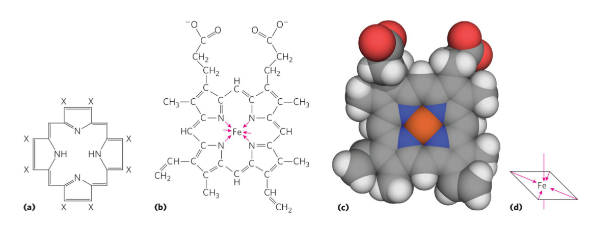
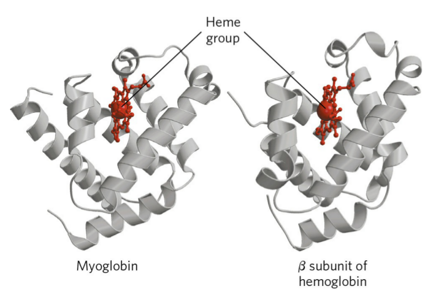
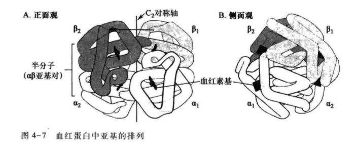
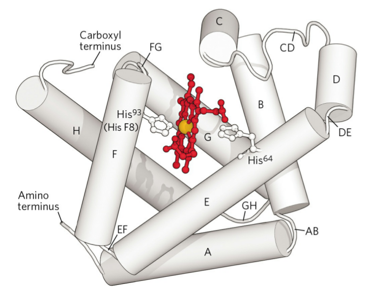

# Protein Functional diversity 蛋白质功能多样性

Enormous functional diversity
+ Catalysis 行使催化和转化功能
+ Messenger 作为信号分子和信号转导器
+ Transport 
+ Structural component
+ Motion
+ Defense and Protect
+ Storage
+ Support and Connection

> Most protein don't work alone.

## Reversible binding of other molecules 与其他分子的可逆性结合

Reversible

很多蛋白质的功能涉及跟其他分子的可逆结合

+ Ligand 配体
    + 被一个蛋白质可逆结合的分子称为配体
    + 一个配体可以是任一种分子, 包括另一种蛋白质
+ Binding site
	+ 局部结构位点  “match”
	+ 生物大分子非共价相互作用力
	+ 它们在大小, 形状, 电荷以及疏水或亲水性上都跟配体是互补的, 因此蛋白质 - 配体相互作用是特意或专一的

## 蛋白质分子具有柔性

构象变化可以很细微, 反映着整个蛋白质的分子振动和氨基酸残基的细小运动. 这种方式的蛋白质柔动有时称为「呼吸」. 构象变化也可能很剧烈, 蛋白质结构大片段发生移动多至几个纳米. 特异的构象变化对蛋白质的功能经常是必需的.

## Conformational change of proteins 蛋白质的构象变化

+   构象变化使结合部位与配体更加互补, 结合得更加紧密
+   在蛋白质与配体之间发生的结构适应称为诱导契合

> Induced fit 诱导契合
> Structural adaptation permitting tighter binding
## Interactions between ligands and proteins may be regulated 配体与蛋白质之间的相互作用可被调节

配体和蛋白质之间的相互作用一般可以通过跟一个或多个另外的配体专一相互作用来调节, 这些别的配体可以引起蛋白质的构象变化而影响第一个配体的结合, 发生别构效应

> Allosteric effect 别构效应
> ligand 1 与蛋白质结合后 可以调控 ligand 2 的结合位点

## The enzymes represent a special case of protein function 酶代表蛋白质功能的特殊情况

酶与其他分子结合并使之发生化学转化: 催化作用

+ 配体称为底物
+ 结合部位称为催化部位或者活性部位

# 氧结合蛋白 Oxygen-binding proteins

### Heme prosthetic group 血红素辅基

>   图为血红素

$O_2$ 难溶于水溶液 ($0.035 g/L @ 50℃$) 如果只是简单的溶于血清, 则不能有足够量的 $O_2$ 被运载到组织. $O_2$ 通过组织的扩散也不可能超过几个毫米的距离. 较大的过细胞动物的进化有赖于能够转运和贮存氧的蛋白质进化. 然而蛋白质中没有适合 $O_2$ 分子可逆结合的氨基酸侧链, 只有某些过渡金属如其中的低氧态 $Fe^{2+}$ 和 $Cu^+$ 具有强的结合氧倾向. 

进化过程中肌红蛋白 - 血红蛋白家族选中了二价铁 Fe(II) 作为氧结合部位. 某些节肢动物的血蓝蛋白 (hemocyanin) 中结合氧的是一价铜 ($Cu^+$) 多细胞生物正是利用金属(最常见的是铁)的这一性质来转运氧的. 但是游离的铁会促进高反应性的氧分子形式, 如羟自由基的形成, 这些自由基能损坏 DNA 和其他大分子. 因此细胞所利用的铁是以 鳌合 和/或 使之反应性降低的形式 被结合的. 

在多细胞生物中,特别是在那些载氧的铁需要远距离被转运的生物中, 铁经常要掺人被蛋白质结合的辅基一血红素 (heme $or$ haem) 

血红素基存在于肌红蛋白, 血红蛋白和许多称为血红素蛋白质的其他蛋白质中, 由一个复杂的有机环结构 - 原卟啉 $\mathrm{IX}$ ($protoporphyrin ~\mathrm{IX}$) 组成,一个 Fe($\mathrm{II}$) 的铁原子与之结合 原卟啉 $\mathrm{IX}$ 由 4 个碧吡咯环组成, 4个吡咯环通过甲叉桥 (metheme bridge) 连接成四吡咯环系统, 称为卟吩 (porphin) , 与之相连的有四个甲基, 两个乙烯基和两个丙酸基. 卟吩是卟啉 (porphyrin) 的母体或卟啉核. 它标有 X 位置的氢一个或多个被其他基团取代, 即为卟啉; 原卟啉 IX 只是卟啉类中的一个. 卟啉化合物在叶绿素、细胞色素以及其他一些天然色素中还将遇到. 这类化合物有很强的着色力, 血红蛋白中的铁卟啉(血红素)使血液呈红色, 叶绿蛋白中的镁卟啉(叶绿素)是植物呈绿色的原因. 

heme iron结合$O_2$ 
咪唑与 $Fe^{2+}$ 通过配位键结合
$O_2$ 与 $Fe^{2+}$ 通过配位键结合

## Hemoglobin 血红蛋白

红细胞中的蛋白质

### Hemoglobin is good for $O_2$ transport

+   在从肺部经心脏到达外周组织的动脉血中, 血红蛋白约 $96\%$ 为氧所饱和. 在回到心脏的静脉血中血红蛋白仅 $64\%$ 被氧饱和, 因此每 $100mL$ 血液通过组织释放出其所携带氧的 $\frac{1}{3}$ , 或相当于在大气压和室温下 $6.5mL$ 氧气.

### The Structure of Hemoglobin 血红蛋白的结构

+ $M_r$ 64500; Hb 分子近似球形, 直径约为 $5.5~nm$ Hb 是一个四聚体蛋白质, 由 $4$ 个多肽亚基组成, 每一个亚基缔合有一个血红素辅基.

#### 血红蛋白亚基的种类和组成方式

人体在不同的发育阶段血红蛋白亚基的种类(为它们编码的基因至少有7种:$\alpha, \beta, ^A\gamma,^C\gamma,\delta,\varepsilon,\xi$)是不同的. 成人血红蛋白主要是$Hb~A$(或 $Hb~A_1$), 其亚基组成为 $\alpha_2\beta_2$ . 在红细胞生活周期中, 由于和葡萄糖或其他化合物发生化学反应, 也会产生 $Hb~A$ 的变异形式,例如 $Hb~A_{1a},Hb~A_{1b}$ 和 $Hb~A_{1c}$

$Hb~A_{1c}$ 是 $Hb~A$ 的葡糖基化形式, 它的形成与血中葡萄糖浓度有关. $Hb~A_{1c}$ 在总 $Hb$ 中的比例是红细胞生活周期(约120d)中平均葡萄糖浓度的量度, 因此临床上被用作糖尿病人在两次就诊之间血糖控制的指标. 成人血红蛋白中的次要组分是 $Hb A_2$(约占总 $Hb$ 的 $2\%$).其亚基组成为 $\alpha_2\delta_2$ 
$Hb~A_2$ 和 $Hb~A$ 的 $\alpha$ 链是完全相同的, 只是在 $Hb~A_2$ 中 $\delta$ 链代替了 $\beta$ 链.

#### 血红蛋白亚基在结构上与肌红蛋白相似

成熟血红蛋白 $Hb~A_1$ 含有两种类型的珠蛋白, $2$ 条 $\alpha$ 链( $141$ 个残基/条)和 $2$ 条 $\beta$ 链( $146$ 个残基/条). 虽然在 $\alpha$ 和 $\beta$ 亚基的多肽序列中不到一半的氨基酸残基相同, 但两种类型亚基的三维结构是很相似的. 而且它们的结构又与肌红蛋白的很相似, 虽则这 $3$ 个多肽的氨基酸序列只有 $27$ 个位置是相同的. 所有这 $3$ 个多肽都是珠蛋白家族的成员. 描述肌红蛋白的螺旋命名惯例也适用于血红蛋白多肽, 除了 $\alpha$ 亚基缺失一段短的 $D$ 螺旋之外.

#### 血红蛋白的四级结构

血红蛋白四级结构的特点是不相同的亚基之间相互作用强, $\alpha_1\beta_1$ (和 $\alpha_2\beta_2$)的界面(接触面)涉及 30 个以上的残基, 其相互作用是相当强的, 虽然血红蛋白用尿素处理导致四聚体解离成 $\alpha\beta$ 二聚体, 但这些二聚体是保持完整的. $\alpha_1\beta_2$ (和 $\alpha_2\beta_1$) 的界面涉及 19 个残基. 所有的这些接触面都是由疏水相互作用主要的, 但也有许多氢键和少数盐桥(离子对).

### 结合氧时血红蛋白发生构象变化

## Myoglobin 肌红蛋白

### Globin family

### The Structure of Myoglobin
+ 一个氧气储存蛋白 

### Myoglobin $O_2$ binging properties

## Mathematical description of protein-ligand binding

+ Equilibrium expression

$$
K_a=\frac{[\mathrm{PL}]}{[\mathrm{P}][\mathrm{L}]}=\frac{k_a}{k_d}\longrightarrow $$

## Hemoglobin vs Mylglobin
> 初级结构 只有~18%

+ Hemoglobin has quaternary structure but Myoglobin dose not

### Structural change og hemoglobin upon Oxygen binding 

### Hemoglobin binds oxygen cooperatively
+ Roles of hemoglobin
+ Cooperative binding of O_2 to hemoglobin

# Allosteric protein 别构蛋白
## Hill Equation
Hill plot
$\log{\frac{Y}{1-Y}}$

## Two models suggest mechanisms for cooperative binding to ligand
### MWC model

### K

Hemoglobin also transports H^+ and CO_2

Oxygen binding to hemoglobin is regulated by 2,3-bisphoshphoglycerate (BPG)(二磷酸甘油酸)
# Sickle Cell Anemia 镰状细胞性贫血
Inher
Single amino acid change 
Glu6\to Val

