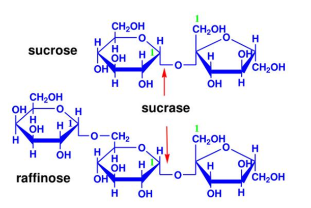
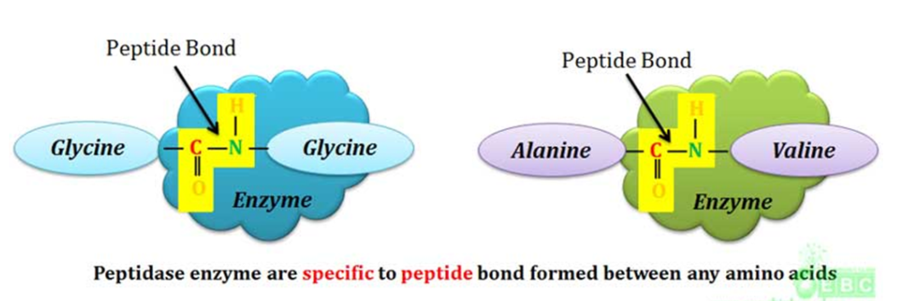
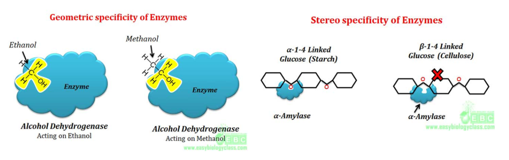
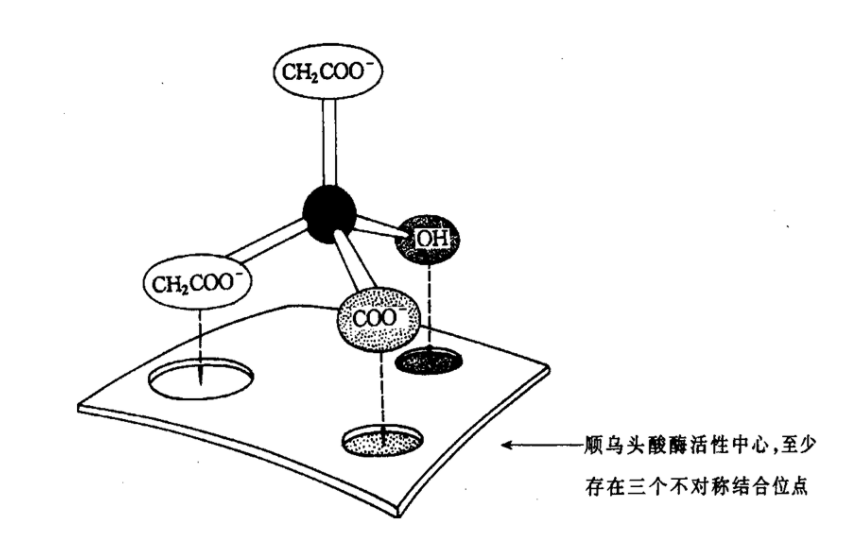
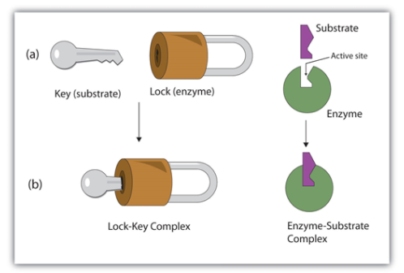
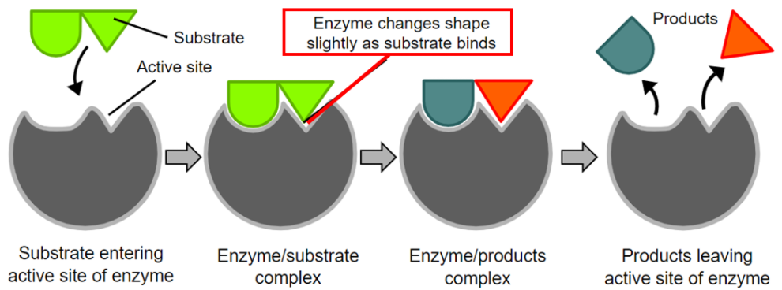
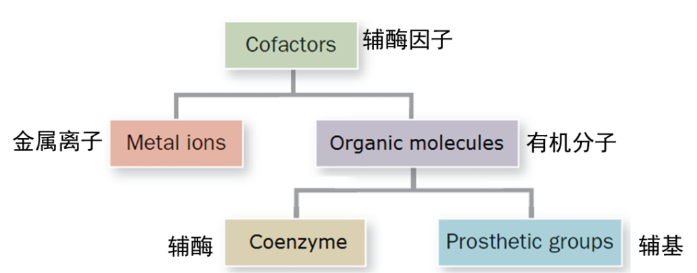
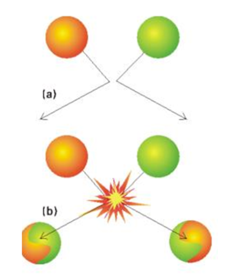
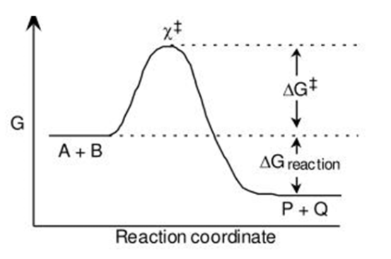

[TOC]

# Intro

>   Enzymes have played an important role in many aspects of life since the dawn of time.
>   Civilizations have used enzymes for thousands of years without understanding what they were or how they work.

# Enzyme Catalysis 酶催化

## Enzyme are biological catalysis 酶是生物催化剂

酶与催化剂的相似点

+   通过降低活化能增加化学反应的速率
+   正反应和逆反应的速率都会增加
+   对反应的平衡常数($equilibrium\ constant$)没有影响
+   经过反应不发生改变
+   短暂地与底物($substrates$)结合

## General properties of enzymes

+   High efficiency (高效性)
+   Specificity (专一性)
+   Mild reaction conditions (反应条件温和)
+   Easily inactivated (易失活)
+   Highly regulated (受到调控)
+   Many enzymes require cofactors (需要辅因子)

### High efficiency 高效性

### Specificity 专一性

#### Different types of enzyme specificity

+   Structure specificity (结构专一性)
+   Absolute specificity (绝对专一性)
+   Relative specificity (相对专一性)
+   Bond specificity (键专一性)
+   Stereospecificity (立体异构专一性)
+   Optical isomerism specificity (旋光异构专一性)
+   Geometrical specificity (几何异构专一性)

#### Relative specificity 相对专一性

+   Enzymes catalyze one **class of substrates** (**一类底物**) or one kind of chemical bond in the same type.

#### Bond specificity 键专一性

+   Specific to substrates having similar bonds and similar structures 

>   特异催化具有相似的键或结构的底物

#### Relative specificity 相对专一性

+   Enzymes catalyze one class of substrates or one kind of chemical bond in the same type.

>   

#### Stereospecificity 立体异构专一性

+   The enzyme can act on only one form of isomers of the substrates.

>   酶只能作用与底物的一种异构体

#### Enzymes specificity hypothesis 酶特异性假说

+   Lock and key theory (锁钥学说)
+   Induced fit hypothesis (诱导契合假说)

##### Lock and key theory 锁钥学说

+   The shape of the substrate(key)(底物(钥匙))perfectly matches the
    shape of the active site(lock)(活性位点(锁)).
+   The catalysis of reactions only occurs if the substrate fits precisely
    into the active site.
+   Explains substrate specificity.
+   Says nothing about how catalysis occurs
    +   
+   Cannot explain why enzymes also catalyze the reverse reaction
    +   

##### Induced fit hypothesis (诱导契合假说)

+   Only the proper substrate is capable of inducing the proper alignment of the active site that will enable the enzyme to perform its catalytic function.
+   Induced first, fit second.
+   The Induction is mutual so both enzyme and substrate must adjust to one another

### Mild reaction conditions 反应条件温和

Function in aqueous solutions under very mild conditions of temperature and pH

### Highly regulated 受到调控

+   The action of enzyme catalytic reactions are controlled by various mechanisms and are inhibited by various organic and inorganic molecules.
+   Regulations can be accomplished through varying the enzyme quantity, adjusting the enzymatic activity, or changing the substrate concentration.

### Many enzymes require cofactors 需要辅因子

+   Either metal ions or organic molecules 

+   They are either directly involved in catalysis or assist incatalysis, or serve as secondary substrates in the reaction

## Theories of reaction rates and activation energy

Collision theory（碰撞理论）and transition state
theory（过渡态理论）are two theories that are used to
explain the reaction rates of different chemical reactions
at the molecular level.

### Collision Theory 碰撞理论

+   In order for a reaction to occur, the particles of the reactant must have enough energy, and must collide at the correct angles (proper orientation).
+   The collision theory explains the factors that affect the rate of a reaction.
+   The greater the rate of effective collisions, the greater the reaction rate is.
+   Chemical reactions
    +   bonds break
    +   new bonds form

### Activation Energy 活化能

Sufficient Energy to break the chemical bonds
Activation energy (活化能) is the minimum amount of energy required for a successful collision.

### Transition state theory 过渡态理论

$$
\mathrm{A}+\mathrm{B} \stackrel{\mathrm{K}^{\neq}}{\longleftrightarrow} \mathrm{X}^{\stackrel{+}{+}} \stackrel{\mathrm{k}}{\longrightarrow} \mathrm{P}+\mathrm{Q}
$$

>   $\mathrm{K^{\neq}}$ is the equilibrium constant
>   $k$ is the rate constant

The transition state theory can be used to understand the mechanism of an elementary chemical reaction

From transition-state theory we can derive an expression that relates the magnitude of a rate constant $\mathrm{k}$ to the activation energy $\Delta G^{\stackrel {+}{+}}$ (活化自由能)
$$
\large k=\frac{\mathrm{k} T}{h} e^{-\Delta G^{\stackrel++} / R T}
$$

>   $k$ is the Boltzmann constant 玻尔兹曼常数
>   $h$ is Planck's constant 普朗克常数

ES,EP相对稳定

## Emzyme components, nomenclature and classification

### Components of Emzyme

