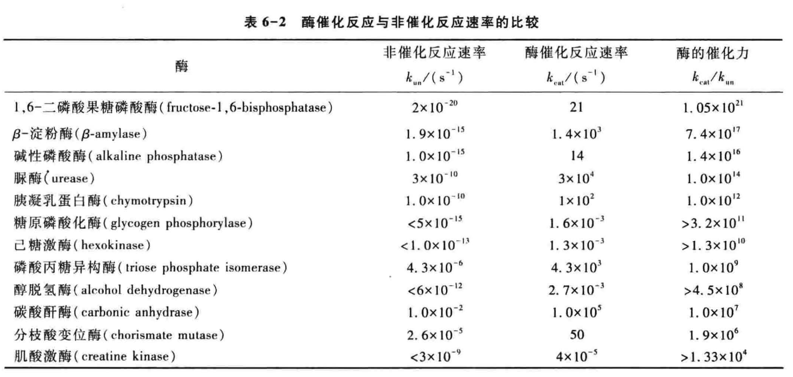
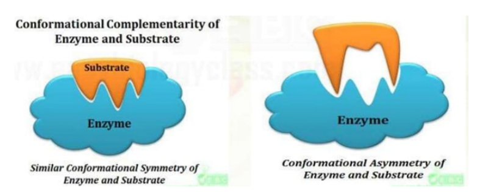
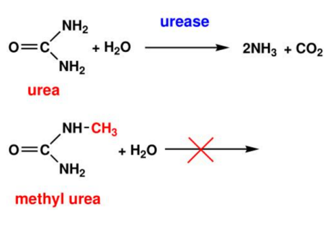

[TOC]

# Intro

>   Enzymes have played an important role in many aspects of life since the dawn of time.
>   Civilizations have used enzymes for thousands of years without understanding what they were or how they work.

# Enzyme Catalysis 酶催化

## Enzyme are biological catalysis 酶是生物催化剂

酶与催化剂的相似点

+   通过降低活化能增加化学反应的速率
+   正反应和逆反应的速率都会增加
+   对反应的平衡常数($equilibrium\ constant$)没有影响
+   经过反应不发生改变
+   短暂地与底物($substrates$)结合

## General properties of enzymes

+   High efficiency (高效性)
+   Specificity (专一性)
+   Mild reaction conditions (反应条件温和)
+   Easily inactivated (易失活)
+   Highly regulated (受到调控)
+   Many enzymes require cofactors (需要辅因子)

>   高效性和专一性是酶最突出的两个性质

### High efficiency 高效性

酶能够将反应速率提高一百万倍以上
没有酶的催化 大多数生化反应的速率无法感知 Most reactions in biological systems do not take place at perceptible rates in the absence of enzymes.

### Specificity 专一性

所谓高度专一性 (specificity) 是指酶对作用的反应物和催化的反应有严格的选择性 这种选择性是 通过酶与反应物之间相互作用或是通过基于结构互补的分子识别实现的 酶往往只能催化一种或一类反应(a single chemical reaction or **a set of closely related reactions**)，作用于一种或一类物质. 而一般催化剂没有这样严格的选择性 氢离子可以催化淀粉、脂肪和蛋白质 的水解，而淀粉酶只能催化淀粉糖苷键的水解，蛋白酶只能催化蛋白质肽键的水解，脂肪酶只能催化脂肪酯键的水解，而对其他类物质则没有催化作用. 酶作用的专一性，是酶最重要的特点之一, 也是和一般催化剂最主要的区别

#### Different types of enzyme specificity

+   Structure specificity (结构专一性)
    +   Absolute specificity (绝对专一性)
    +   Relative specificity (相对专一性)
    +   Bond specificity (键专一性)
+   Stereospecificity (立体异构专一性)
    +   Optical isomerism specificity (旋光异构专一性)
    +   Geometrical specificity (几何异构专一性)

#### Absolute specificity 绝对专一性

有些酶对底物的要求非常严格，只作用于一种底物，而不作用千任何其他物质
Absolute specificity can be thought of as being exclusive, in which an enzyme acts upon one specific substrate

**Absolute specific enzymes** will **only catalyze one reaction** with its specific substrate.

#### Relative specificity 相对专一性

有些酶对底物的要求比上述绝对专一性要低一些，可作用一类结构相近的底物

+   Enzymes catalyze one **class of substrates** (**一类底物**) or one kind of chemical bond in the same type.

#### Bond specificity 键专一性

有些酶只要求作用于底物一定的键, 而对键两端的基团并无严格要求

+   Specific to substrates having similar bonds and similar structures 

>   特异催化具有相似的键或结构的底物

#### Stereo specificity 立体异构专一性

当底物具有立体异构体时，酶只能作用其中的一种

+   The enzyme can act on only **one form of isomers** of the substrates.

>   酶只能作用与底物的一种异构体
>   下图右

#### Enzymes specificity hypothesis 酶特异性假说

+   Lock and key theory (锁钥学说)
+   Induced fit hypothesis (诱导契合假说)

##### Lock and key theory 锁钥学说

+   The shape of the substrate(key)(底物(钥匙))perfectly matches the
    shape of the active site(lock)(活性位点(锁)).
+   The catalysis of reactions only occurs if the substrate fits precisely
    into the active site.
+   Explains substrate specificity.
    解释了底物专一性
+   Says nothing about how catalysis occurs
    没有解释催化是如何发生的
+   Cannot explain why enzymes also catalyze the reverse reaction
    无法解释酶可以催化可逆反应
    +   

##### Induced fit hypothesis (诱导契合假说)

+   Only the proper substrate is capable of inducing the proper alignment of the active site that will enable the enzyme to perform its catalytic function.
+   Induced first, fit second. 先诱导, 再契合
+   The Induction is mutual so both enzyme and substrate must adjust to one another
    诱导是相互的, 所有酶和底物要相互调节

>   酶分子是高柔性的动态构象分子, 当酶分子与底物分子接近时, 酶蛋白收底物分子诱导, 其构象发生有利于底物结合的变化, 酶与底物在此基础上互补契合进行反应.

### Mild reaction conditions 反应条件温和

Function in aqueous solutions under very mild conditions of temperature and pH

### Highly regulated 受到调控

+   The action of enzyme catalytic reactions are controlled by various mechanisms and are inhibited by various organic and inorganic molecules.
    酶催化反应被许多机制控制, 也收到许多有机, 无极分子的抑制
+   Regulations can be accomplished through varying the enzyme quantity, adjusting the enzymatic activity, or changing the substrate concentration.
    可以通过改变酶量, 调节酶活性, 改变底物浓度进行调控, 

### Many enzymes require cofactors 需要辅因子

+   Either metal ions or organic molecules 
    辅因子是金属离子或有机分子

+   They are either directly involved in catalysis or assist in catalysis, or serve as secondary substrates in the reaction
    他们直接参与催化或者辅助催化, 或者作为反应的第二底物

## Theories of reaction rates and activation energy

Collision theory（碰撞理论）and transition state theory（过渡态理论）are two theories that are used to explain the reaction rates of different chemical reactions at the molecular level.

碰撞理论和过渡态理论在分子层面解释不同化学反应的速率

### Collision Theory 碰撞理论

+   In order for a reaction to occur, the particles of the reactant must have enough energy, and must collide at the correct angles (proper orientation).
    反应要发生, 反应物粒子必须要有足够的能量, 而且要以正确的角度发生碰撞. (正确的取向)
+   The collision theory explains the factors that affect the rate of a reaction.
    碰撞理论解释了影响反应速率的因素
+   The greater the rate of effective collisions, the greater the reaction rate is.
    有效碰撞的速率越大, 反应速率越大.
+   Chemical reactions 化学反应
    +   bonds break 旧键断裂
    +   new bonds form 新键形成

### Activation Energy 活化能

Sufficient Energy to break the chemical bonds 足够的能量, 打破化学键
Activation energy (活化能) is the minimum amount of energy required for a successful collision.
活化能是发生有效碰撞所需的最低能量

### Transition state theory 过渡态理论

$$
\mathrm{A}+\mathrm{B} \stackrel{\mathrm{K}^{\neq}}{\longleftrightarrow} \mathrm{X}^{\stackrel{+}{+}} \stackrel{\mathrm{k}}{\longrightarrow} \mathrm{P}+\mathrm{Q}
$$

>   $\mathrm{K^{\neq}}$ is the equilibrium constant
>   $k$ is the rate constant

The transition state theory can be used to understand the mechanism of an elementary chemical reaction

From transition-state theory we can derive an expression that relates the magnitude of a rate constant $\mathrm{k}$ to the activation energy $\Delta G^{\stackrel {+}{+}}$ (活化自由能)
$$
\large k=\frac{\mathrm{k} T}{h} e^{-\Delta G^{\stackrel++} / R T}
$$

>   $k$ is the Boltzmann constant 玻尔兹曼常数
>   $h$ is Planck's constant 普朗克常数

ES,EP相对稳定

## Emzyme components, nomenclature and classification

### Components of Emzyme

