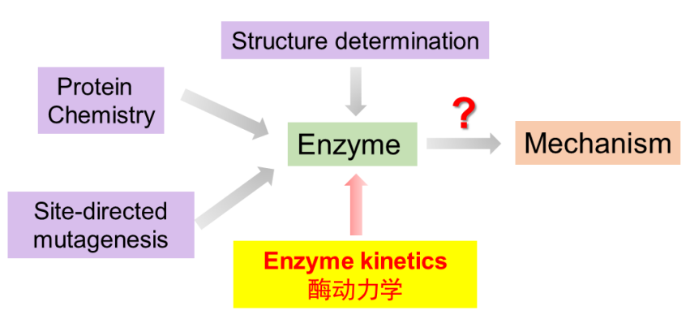
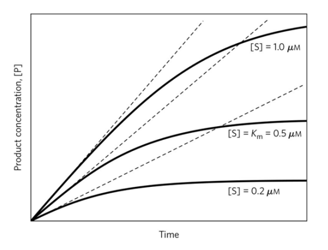
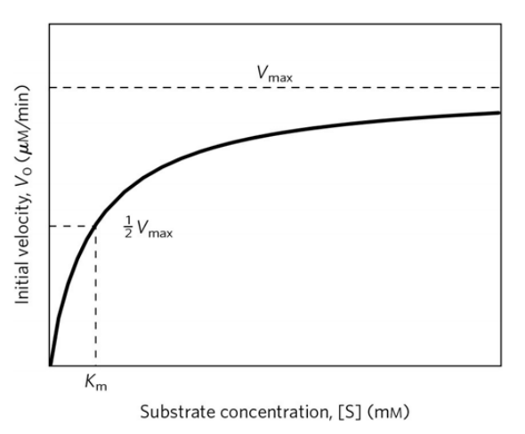

# Factors affecting enzyme-catalyzed reaction rates

+   Substrate concentration 底物浓度
+   Enzyme concentration 酶浓度
+   Temperature 温度
+   рH
+   Inhibitor or Activator 抑制剂或激活剂

## 底物浓度对酶催化反应速率的影响

## 底物浓度对酶催化反应$V_0$的影响

+   相对低浓度的底物, $V_0$ 几乎随底物浓度线性增加

+   

## ES复合物是理解动力学行为的关键

$$
\large \mathbf{E}+\mathbf{S} \underset{k_{-1}}{\stackrel{k_{1}}{\rightleftharpoons}} \mathbf{ES} \stackrel{k_{2}}{\rightarrow} \mathbf{E}+\mathbf{P}
$$

>   +   $V_0$ 测试反应的初始速率
>   +   $[S]\gg[E]$ 
>   +   $k^2\ll[]$ 

