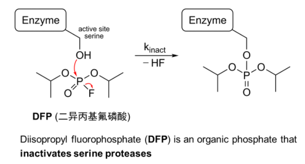
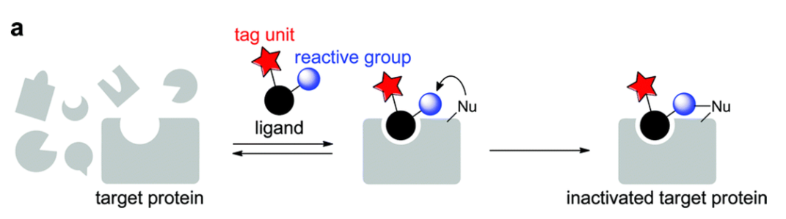
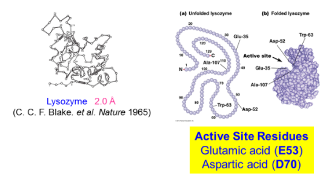
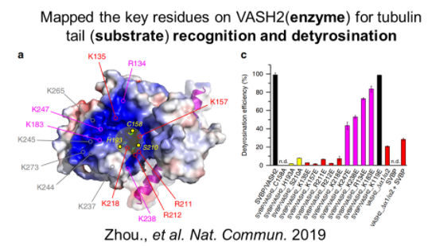
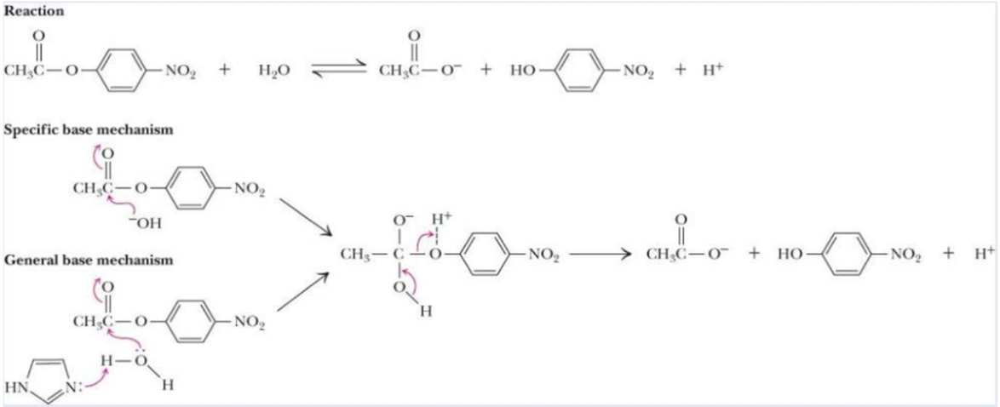
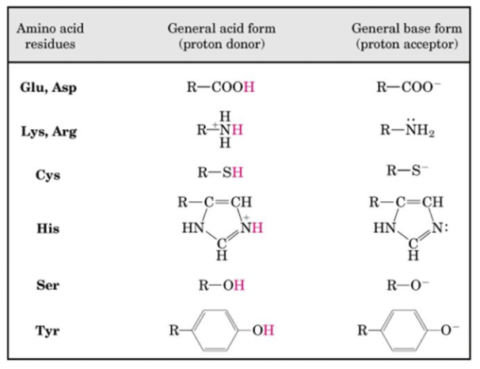
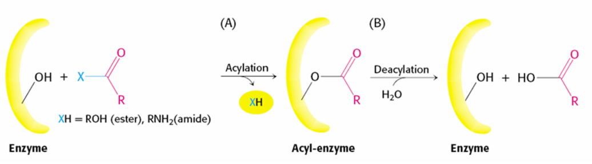

# 酶的活性位点

+   The active site(活性部位)of the enzyme is the place where the substrate binds and at which catalysis occurs 
+   The active site binds the substrate(底物),forming an enzyme-substrate(ES)complex.

## Characteristics of enzyme active site

+   The active site takes up a small part (1-2%) of the total volume of the enzyme.
+   It is the most important part as it directly catalyzes the chemical reaction.
+   It usually consists of three to four amino acids, while other amino acids within the protein are required to maintain the tertiary structure of the enzymes.

### Amino acid residues in the enzyme active site

+   The active site is 3-dimensional and is generally found in a pocket, crevice or cleft in the enzyme tertiary structure, requiring that the substrates diffuse in and the products diffuse out.
+   The amino acid residues of the active site may be far apart in the orimary structure owing to the folding required for tertiary structure.

+   The specificity of binding depends on the precisely defined arrangement of atoms in an active site.
+   Models for active site of enzyme:

+   Active site contains functional groups(-OH,NH2,-cOOH,etc.)
+   Substrates are bound in the active site cleft by noncovalent interactions
    +   onic Interactions 离子相互作用
        +   带电荷的氨基酸
        +   金属离子
    +   Hydrogen bond 氢键
    +   Van Der Waals forces 范德华力
    +   Hydrophobic interaction 疏水作用力

## Methods used to study enzyme active site

+   Chemical modification of enzymes (化学修饰法)
+   X-ray diffraction analysis (X射线衍射分析法)
+   Site-directed mutagenesis (定点诱变法)
+   Determination of kinetic parameters (动力学参数测定法)

### Chemical modification of enzymes (化学修饰法)

Active site determination 

If the chemical modification of a particular amino acid side chain results in enzyme deactivation, then the residue in question is located at the active site, provided that the modification can be prevented by the presence of excess substrate or inhibitor.

+   Non-specific covalent modification(非特异性共价修饰)
+   Specific covalent modification(特异性共价修饰)
+   Affinity labels(亲和标记法)

#### Specific covalent modification(特异性共价修饰)

Specific modification of an amino acid residue in the active site of the enzyme results in enzyme deactivation:

#### Affinity labels（亲和标记法）

+   Affinity labels are active-site directed reagents
+   They are irreversible inhibitors
+   Affinity labels resemble substrates, but contain reactive groups to interact covalently with the enzyme.

### X-ray diffraction analysis (X射线衍射分析法)

+   Determination of structure (specially active site's) and type of amino acids present in active sites determines catalytic activities, interaction level of enzymes.
+   X ray crystallography helps us to determine and predict the catalytic efficiency of enzymes.

+   Lysozyme (溶菌酶) was the first enzyme whose structure was determined crystallographically, this feat having been accomplished in the laboratory of D.C.Phillips by 1965.

### Site-directed mutagenesis（定点诱变法）

Creates mutant enzymes with amino acid substitutions at active sites；substitutions that alter normal activity help identify amino acids crucial to the active site.

### Determination of kinetic parameters (动力学参数测定法)

Measure the kinetic parameters at different pH to determine the dissociation state of the side chain groups of the enzyme moleculewhen participating in the reaction, so as to judge the dissociated amino acid residues Using this method, the amino acids involved in the catalytic reaction in RNase were determined.($His_{12}, His_{119}$)

# Enzyme catalytic mechanisms 酶的催化机制

## Specific catalytic groups contribute to catalysis

+   Once a substrate is bound to an enzyme,properly positioned catalytic functional groups aid in the cleavage and formation of bonds by a variety of mechanisms 
    +   Acid-base catalysis(酸碱催化)
    +   Covalent catalysis(共价催化)
    +   Metal ion catalysis(金属离子催化)
+   These are distinct from mechanisms based on binding energy because they generally involve transient covalent interaction with a substrate or group transfer to or from a substrate.

### Acid-base catalysis(酸碱催化)

+   Acid-Base catalysis(酸碱催化)is involved in any reaction mechanism that requires the transfer of a proton from one molecule to another.
+   Many nucleophiles(亲核试剂)are activated by the removal of a proton,including alcohol,thiol,and amine functional groups.
+   Enzymes that utilize Acid-Base catalysis can be subgrouped further into 
    +   Specific acid-base catalysis (专一酸碱催化)
        +   Occur if a hydronium ion ($H_3O^+$) or a hydroxide ion ($OH^-$), respectively, are utilized directly in the reaction mechanism, and **the pH of the solution affects the rate of catalysis**.
    +   General acid-base catalysis (总/广义酸碱催化)
        +   Occur when molecules other than hydronium ion ($H_3O^+$) or a hydroxide ion ($OH^-$) are the source of proton donation or acceptance.
            Most commonly, **an active site amino acid residue is used toaccept or donate a proton** within the reaction mechanism. In general acid-base reactions the **pH is usually held constant within a buffered system**.
+   Catalysis of p-nitrophenyl acetate hydrolysis can occur either by specific acid hydrolysis or by general base catalysis.

+   Amino acids in general acid-base catalysis

>   Many organic reactions that are used to model biochemical processes are promoted by **proton donors (general acids)** or **proton acceptors (general bases)**. The active sites of some enzymes contain amino acid functional groups, such as those shown here, that can participate in the catalytic process as proton donors or proton acceptors.

### Covalent catalysis(共价催化)

### Metal ion catalysis(金属离子催化)

## The reason for the great efficiency of enzymes

### Proximity and orientation effects(邻近和定向效应)

### Substrate distortion and induced fit(底物形变和诱导契合)

### Synergistic effects(协同效应)

### Active site microenvironment(活性部位的微环境)

## Examples of enzymatic reactions (酶催化反应机制实例)

### Chymotrypsin(胰凝乳蛋白酶)action proceeds in Two Steps linked by a covalently bound intermediate

>   羟基攻击  酶酰化

q
