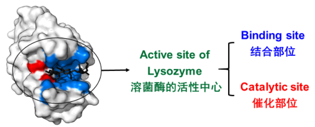
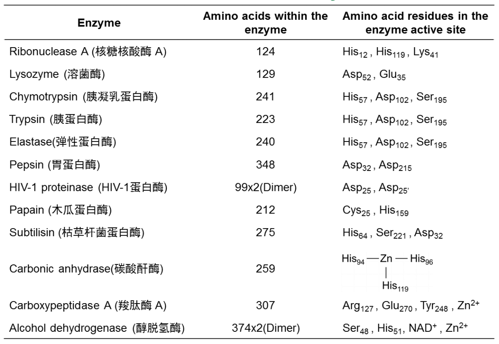
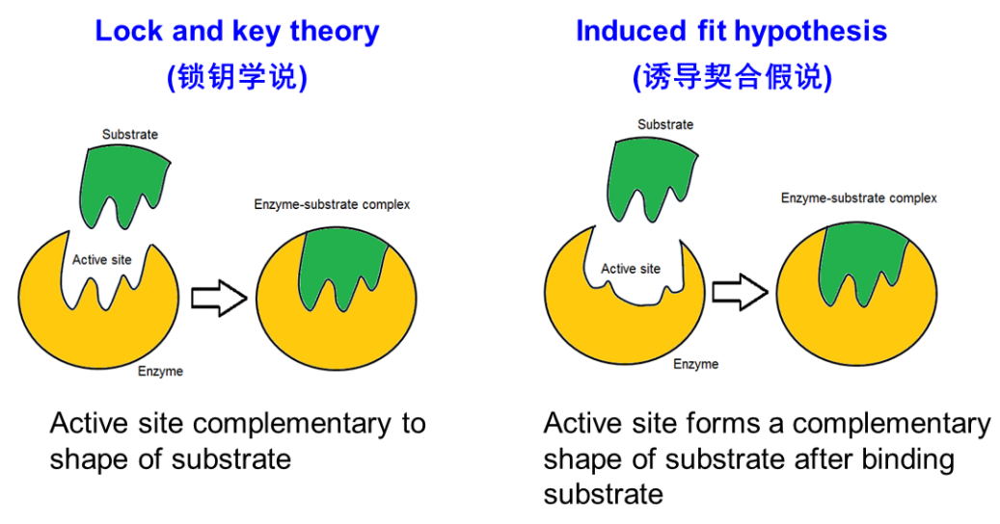
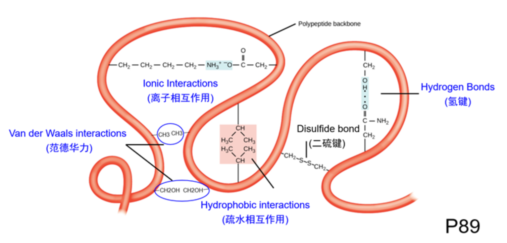

# 酶的活性位点

+   The active site(活性部位)of the enzyme is the place where the substrate binds and at which catalysis occurs 
+   The active site binds the substrate(底物),forming an enzyme-substrate(ES)complex.

## Characteristics of enzyme active site

+   The active site takes up a small part (1-2%) of the total volume of the enzyme.
+   It is the most important part as it directly catalyzes the chemical reaction.
+   It usually consists of three to four amino acids, while other amino acids within the protein are required to maintain the tertiary structure of the enzymes.

### Amino acid residues in the enzyme active site

+   The active site is 3-dimensional and is generally found in a pocket, crevice or cleft in the enzyme tertiary structure, requiring that the substrates diffuse in and the products diffuse out.
+   The amino acid residues of the active site may be far apart in the orimary structure owing to the folding required for tertiary structure.

+   The specificity of binding depends on the precisely defined arrangement of atoms in an active site.
+   Models for active site of enzyme:

+   Active site contains functional groups(-OH,NH2,-cOOH,etc.)
+   Substrates are bound in the active site cleft by noncovalent interactions
    +   onic Interactions 离子相互作用
        +   带电荷的氨基酸
        +   金属离子
    +   Hydrogen bond 氢键
    +   Van Der Waals forces 范德华力
    +   Hydrophobic interaction 疏水作用力

## Methods used to study enzyme active site

+   Chemical modification of enzymes (化学修饰法)
+   X-ray diffraction analysis (X射线衍射分析法)
+   Site-directed mutagenesis (定点诱变法)
+   Determination of kinetic parameters (动力学参数测定法)

