[TOC]

# Structure and Function of Nucleic Acid 核酸的结构和功能

Nucleic acids are one of the four major types of macromolecules that are essential for all known forms of life

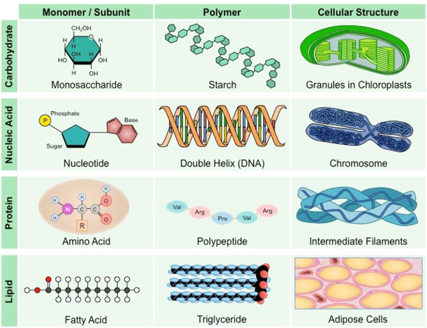

## The genetic central dogma 中心法则

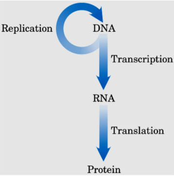

## Brief history of nucleic acid discovery and research

+   1869
    +   瑞典青年科学家 Mieseher 成功分离核素 (nuelein)
+   1925-1930
    +   Levene 证明了核酸的基本结构单位是核苷酸
+   1928
    +   Griffith 进行了肺炎双球菌转化实验, 提出了"什么物质使肺炎双球菌引起转化?"的问题.
+   1944
    +   Avery 发现肺炎双球菌的转化物质是DNA
+   1952
    +   Hershey 和 Chase 通过 T2 噬菌体实验证实了遗传物质是 DNA
+   1953
    +   Watson 和 Crick 提出DNA双螺旋结构学说, 并获得 1962 年诺贝尔奖
+   1958
    +   Crick 提出的中心法则; 同年 Meselson 和 Stahl 证明 DNA 的半保留复制
+   1961
    +   Jacob及Monod提出了操纵子学说,并假设mRNA的功能
+   1965
    +   1961年Crick提出了密码三联体说;
        1965年全部完成了64种密码的研究工作
+   1970
    +   Temin及Baltimore发现逆转录酶;Smith等人发现了限制性内切酶
+   1973
    +   1973年Cohen及Chang成功建立克隆技术
+   1980
    +   Sanger与Gilbert建立了快速测定DNA序列的新方法获诺贝尔奖
+   1981
    +   酵母丙氨酸tRNA人工合成成功
+   1982
    +   A.Aaron Klug阐明病毒及核小体等核酸蛋白质复合物的结构而获得1982年的诺贝尔奖
+   1985
    +   Mullis发明PCR术,10年后获得诺贝尔化学奖
+   1990
    +   美国启动人类基因组计划(HGP)

### Classification of nucleic acid

A nucleic acid(核酸)is a polymer in which the monomer units are nucleotides(核苷酸).There are two types of nucleic acids:

1.   **D**eoxyribo**n**ucleic **a**cid (DNA) (脱氧核糖核酸)
2.   **R**ibo**n**ucleic **a**cid (RNA) (核糖核酸)

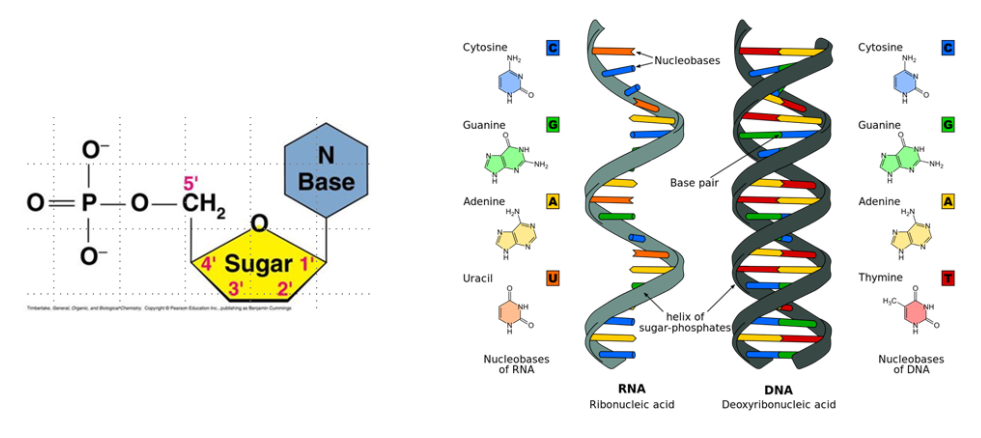

#### Deoxyribonucleic acid (DNA) (脱氧核糖核酸)

+   A helical double-stranded nucleic acid that is crucial for containing the genetic information for cell growth, division, and function.
+   The amino acid sequence of every protein in a cell, and the nucleotide sequence of every RNA, is specified by a nucleotide sequence in the cells DNA.
+   A segment of a DNA molecule that contains the information required for the synthesis of a functional biological product, whether protein or RNA, is referred to as a gene.
+   The storage and transmission of biological information are the only known functions of DNA.

#### Ribonucleic acid (RNA) (核糖核酸)

A polymeric molecule essential in various biological roles in coding, decoding, regulation and expression of genes.

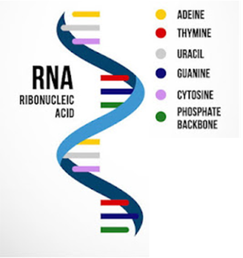

##### Three main types of RNA are involved in protein synthesis 

+   Messenger RNAs (mRNAs) (信使RNA) are intermediaries,carrying information for the synthesis of a protein from one or a few genes to a ribosome.
+   Transfer RNAS (tRNAs) (转移RNA) are adapter molecules that faithfully translate the information in mRNA into a specific sequence of amino acids.
+   Ribosomal RNAs (rRNAs) (核糖体RNA) are components of ribosomes,the complexes that carry out the synthesis of proteins.

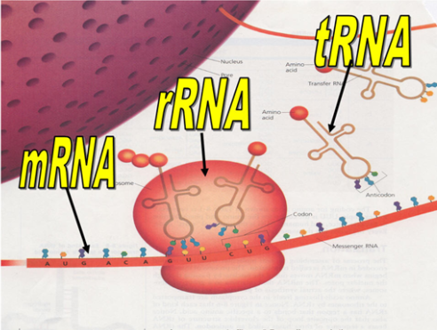

>   具有催化功能的RNA

##### Many other small RNA molecules with specialized functions are present in cells.

+   Small nuclear RNA(snRNA)
+   Small nucleolar RNA(snoRNA)
+   Small cytoplasmic(scRNA)
+   Antisense RNA Small interfering(siRNA)
+   Small temporal RNA(stRNA)
+   Guide RNA(gRNA)
+   Ribozyme

### Distribution of nucleic acid

+   DNA
    +   In eukaryotes 
        +   Most DNAs are located in the nucleoli and chromosomes in the nucleus 
        +   A small fraction of the total DNA is present in mitochondria, chloroplasts, and cytoplasm.
    +   In prokaryotes and viruses 
        +   DNA is found in the cytoplasm.
+   RNA
    +   In eukaryotes 
        +   RNA is found in the nucleus and in the cytoplasm.
    +   In prokaryotes and viruses 
        +   it is found in the cytoplasm.

## Chemical components of nucleic acid

Nucleic acid (核酸) can be hydrolyzed into nucleotides (核苷酸) by nucleases. The hydrolyzed nucleic acid has equal quantity of base (碱基), pentose (戊糖) and phosphate (磷酸).

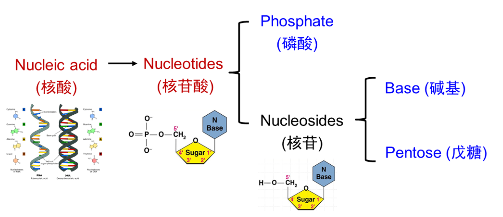

### The basic structure of a nucleotide

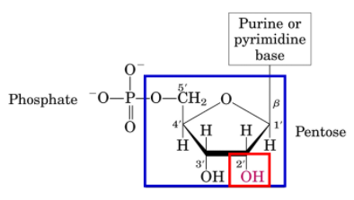

+   三体

    +   Ribose(核糖)-pentose RNA

    +   Deoxy-ribose(脱氧核糖)DNA

    +   ---

    +   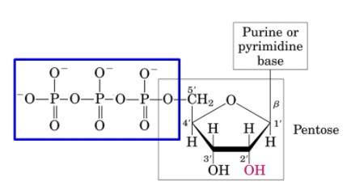

    +   Phosphate(磷酸基团)
        NMP NDP NTP

$\gamma \quad \beta \quad \alpha$

+   Base (碱基)

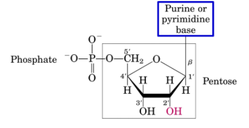

#### The structures of the five major bases

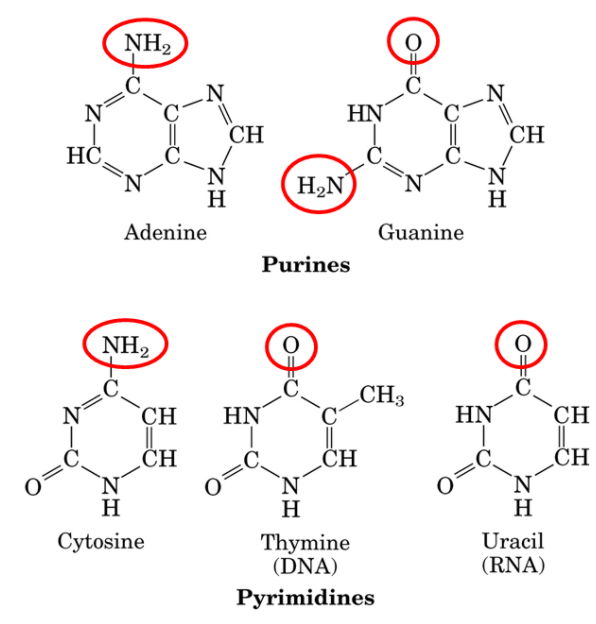

#### Nucleotide and nucleic acid nomenclature

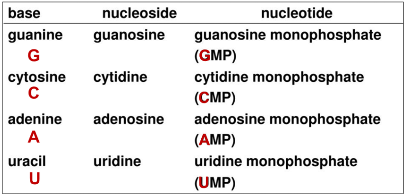

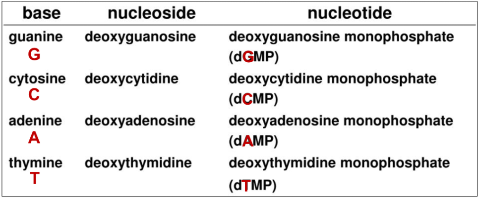

#### Composition of DNA and RNA

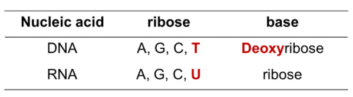

#### Nucleic acid derivatives

+   Multiple phosphate nucleotides
    +   adenosine monophosphate(AMP)
    +   adenosine diphosphate(ADP)
    +   adenosine triphosphate(ATP)

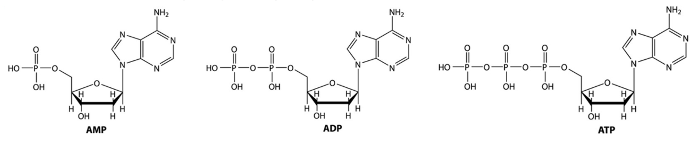

Nucleotides also play a central role in metabolism at a fundamental, cellular level.
They provide chemical energy-in the form of the nucleoside triphosphates, adenosine triphosphate(ATP), guanosine triphosphate(GTP), cytidine triphosphate(CTP) and uridine triphosphate (UTP)-throughout the cell for the many cellular functions that demand energy.P426-427

#### Nucleic acid derivatives 

+   Adenosine 3',5'cyclic monophosphate(CAMP)(腺苷-3',5'-环磷酸)
+   Guanosine 3',5'cyclic monophosphate(cGMP)(鸟苷-3',5'-环磷酸)

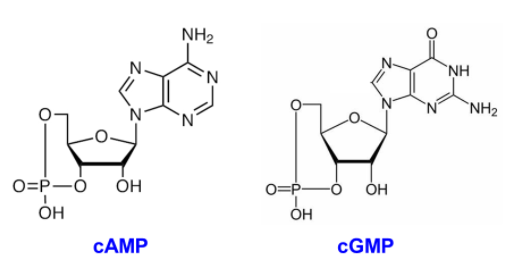

Second messenger(第二信使), used in signal transduction.
Important in many biological processes.

#### G protein-coupled signaling pathway (P540)

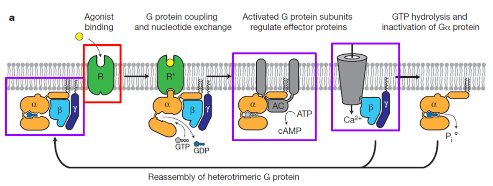

+   Membrane receptor(GPCR)
+   Heterotrimeric G proteins($G_\alpha,G_\beta,G_\gamma$)
+   Activated membrane proteins(Eg: adenylate cyclase(腺苷酸环化酶), calcium channel)produce the second messengers(第二信使)

#### Newly discovered cellular natural immune signaling molecules

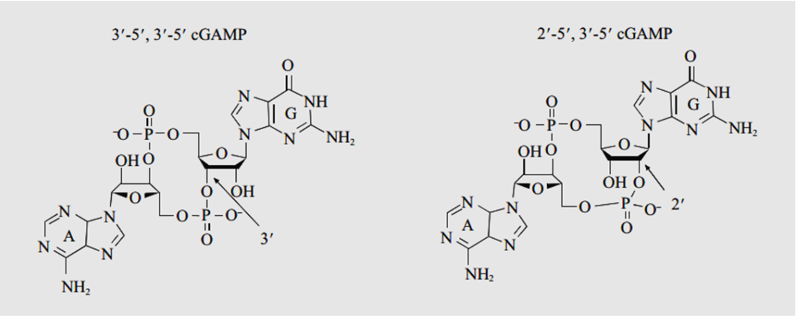

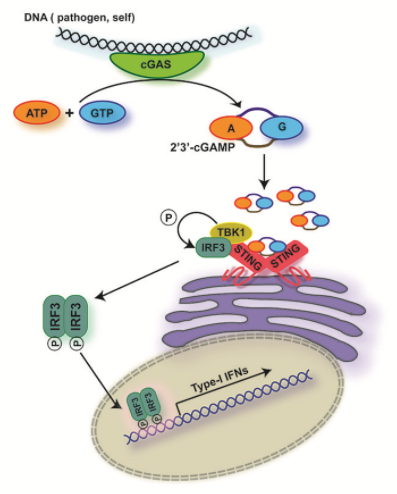

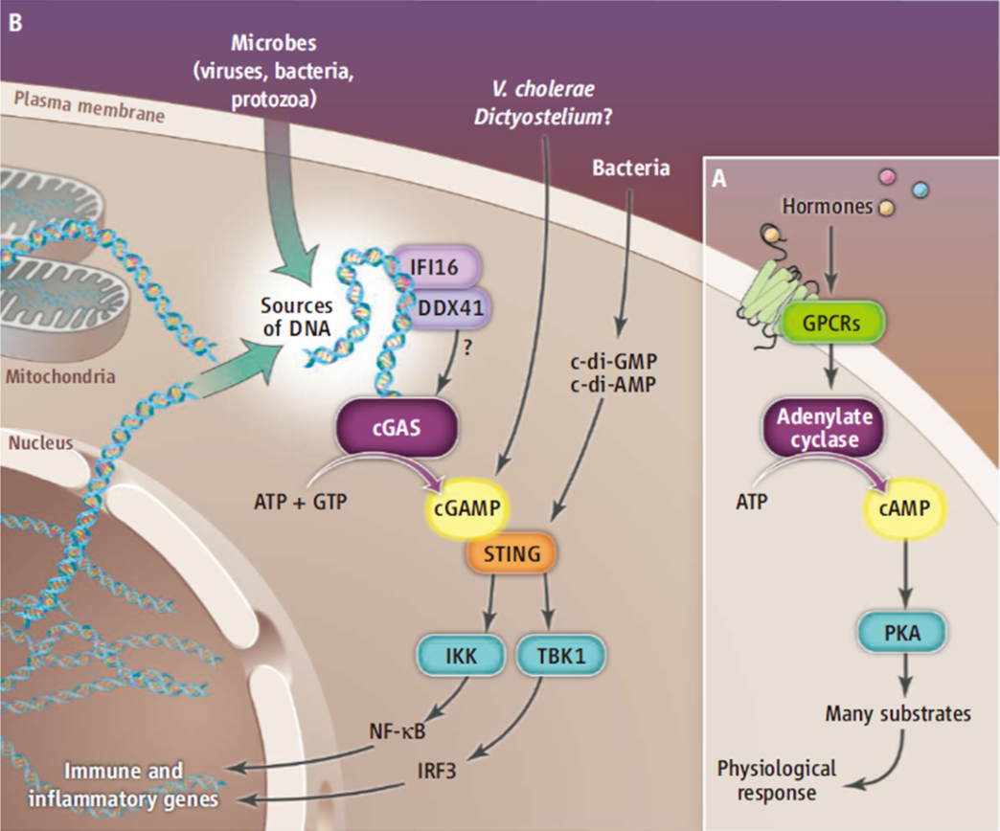

#### Phosphodiester bonds formation(磷酸二酯键形成)

+   Phosphodiester linkages in the covalent backbone of DNA and RNA.
+   All the phosphodiester linkages in DNA and RNA have the same orientation along the chain, giving each linear nucleic acid strand a specific polarity and distinct
    5' and 3' ends.

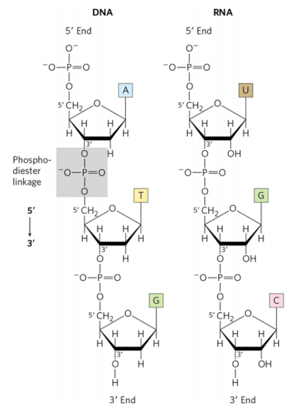

#### Nucleic acid chain extension

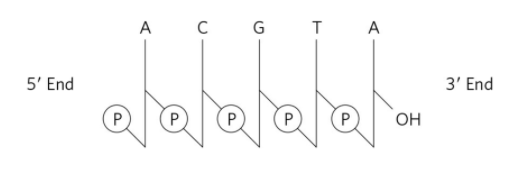

+   A nucleic acid chain,having a phosphate group at 5'end and a-OH group at 3'end,can only be extended from the 3'end.
+   A short($≤50$)nucleic acid is referred to as an oligonucleotide (寡核苷酸)
+   A longer($>50$)nucleic acid is called a polynucleotide (多聚核苷酸)

### Minor Bases

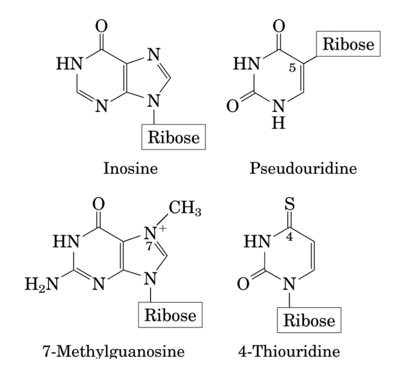

#### Methylcytidine oxidation

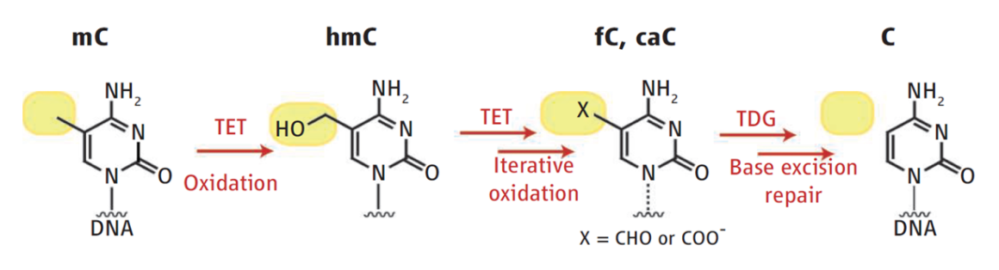

>   甲基化胞嘧啶(m5C)去甲基化反应

#### RNA base modifications ($m^6A$)

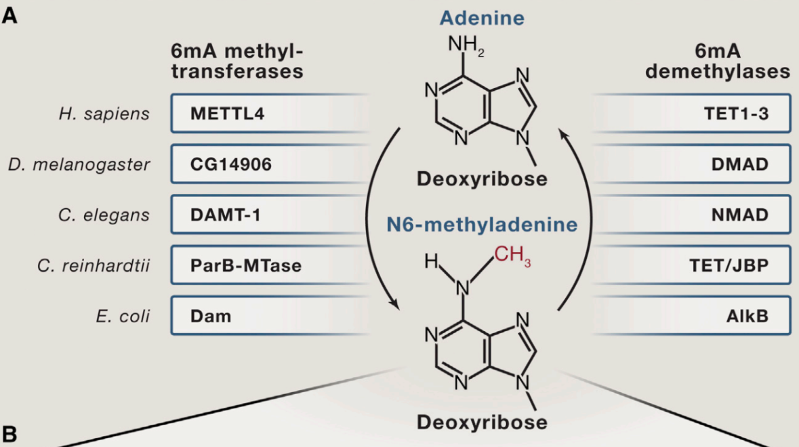

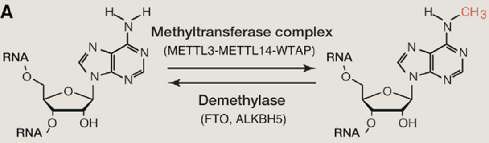

## Structures and Function of DNA

### Primary Structure-Sequence

+   Primary structure of DNA is formed by the covalent backbone consisting of deoxyribonucleotides linked to each other by phosphodiester bonds, is simply the sequence of nucleotides in the 5'-3' direction.

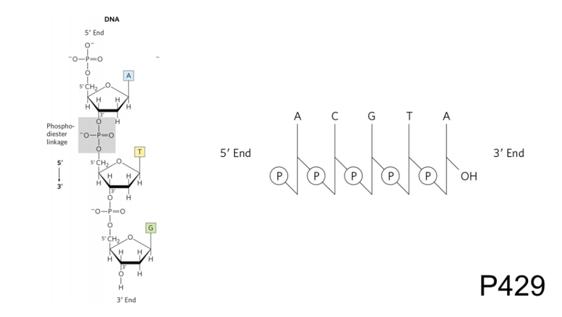

#### DNA Sequence and its implications

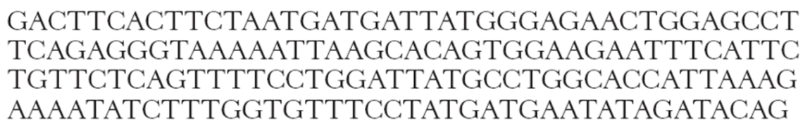

#### An Example: Human Genome

Complete sequence of the entire human genome has been determined, which is more than 3 billion letters long.

##### Implications of Human Genome

+   Identification and characterization of sequences that foretell the appearance of specific diseases
+   Development of better means of diagnosing and treating diseases;
+   Development of plans for preventing or managing diseases that take account of individual variations
    (personalized treatment)

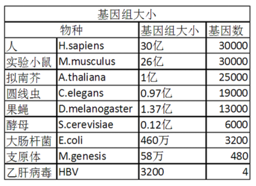

### Secondary Structure-Double Helix

James Watson and Francis Crick postulated the secondary structure of DNA in 1953 in their double helical model.

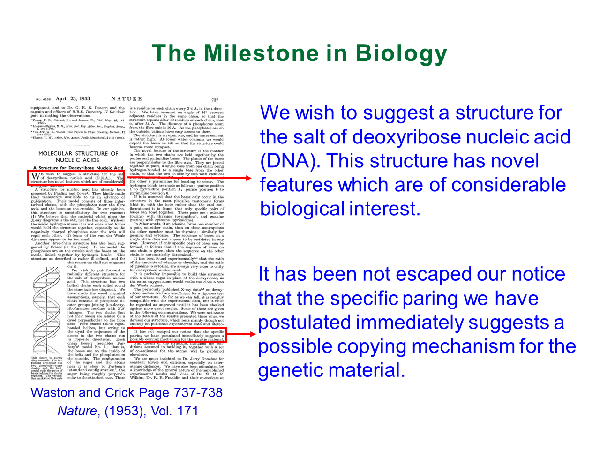

#### Watson-Crick model for the structure of DNA

##### Physical Properties of DNA

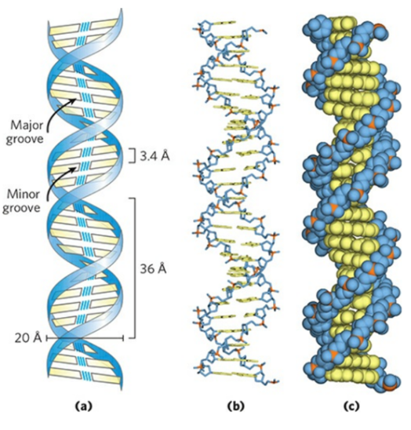

+   The two polynucleotide chain are spirally or helically twisted, whichgives it a twisted ladder-like look.
+   Antiparallel direction, i.e. one in5'-3' and other in 3'-5' direction.
+   The diameter of ds-stranded DNA helix is 20 A.
+   The distance between the two nucleotides or internuclear distance is 3.4 A. The length of DNA helix is 34 À after a full turn and it possesses 10 base pairs per turn.

##### Chemical Properties of DNA

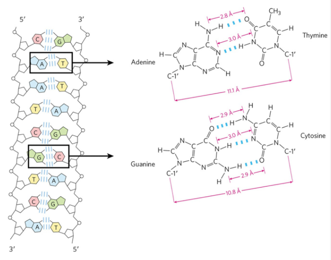

+   Base pairing（碱基配对）is complementary.
+   A major factor stabilizing the double helix is base pairing by hydrogen bonding between T-A and between C-G.
    +   T-A base pair comprised of 2 hydrogen bonds
    +   G-C base pair comprised of 3 hydrogen bonds
+   Base Paring
    +   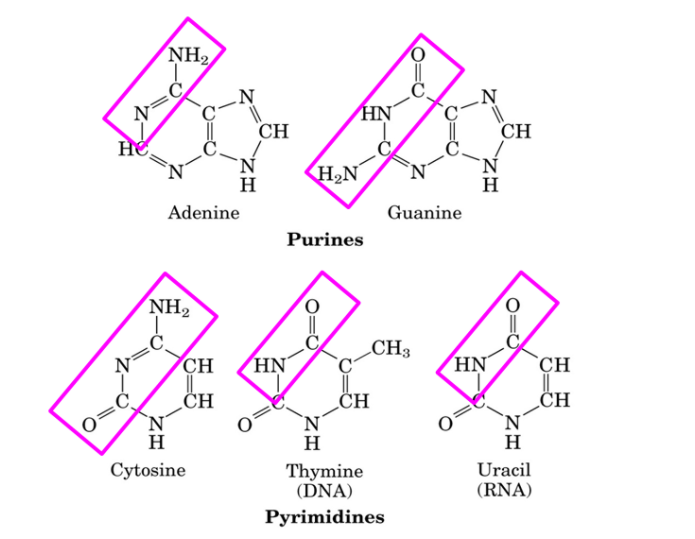

##### Complementarity of strands in the DNA double helix

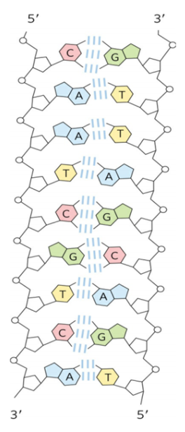

##### Replication of DNA as suggested by Watson and Crick

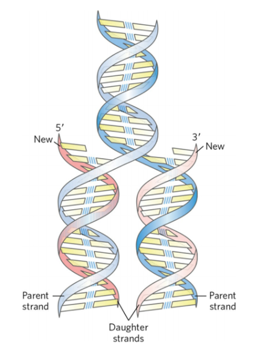

The preexisting or "parent" strands become separated, and each is the template for biosynthesis of a complementary "daughter" strand (in pink)

##### Three possible models for DNA Replication	

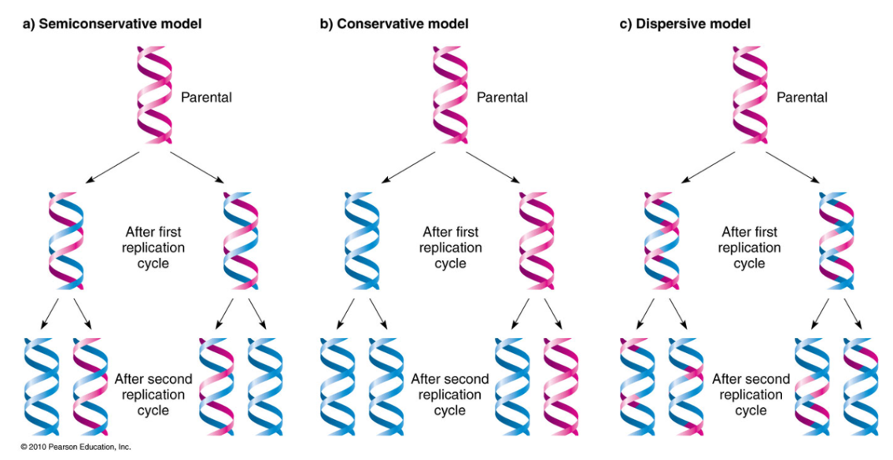

#### DNA can occur in different three-dimensional forms

##### Structural variation in DNA

+   The conformation of a nucleotide in DNA is affected by rotation about seven different bonds. Six of the bonds rotate freely. The limited rotation about bond 4 gives rise to ring pucker.
+   For purine bases in nucleotides, only two conformations with respect to the attached ribose units are sterically permitted, anti or syn.
    Pyrimidines occur in the anti conformation.

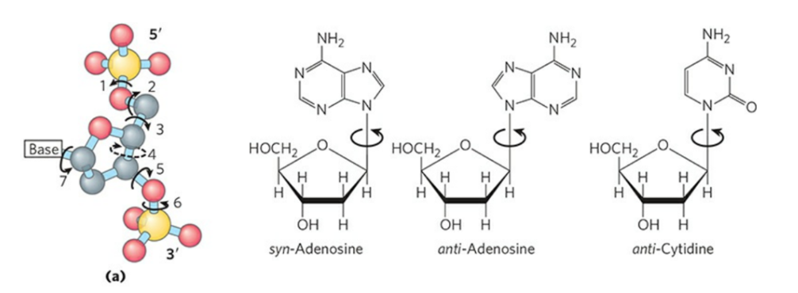

##### Forms of DNA

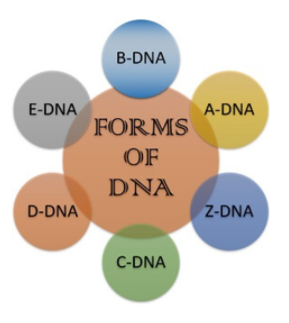

Among six different forms of DNA, B, A and Z forms are the most common P431

##### The three major types of DNA helix

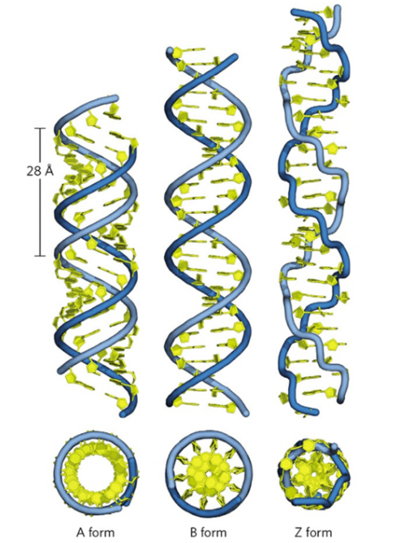

---

+   DNA can resume different forms depending upon their chemical microenvironment, such as ionic strength and relative humidity.
+   B-form DNA (Watson-Crick structure) is the predominant structure in the aqueous environment of the cells.
+   A-form and Z-form are also native structures found in biological systems.

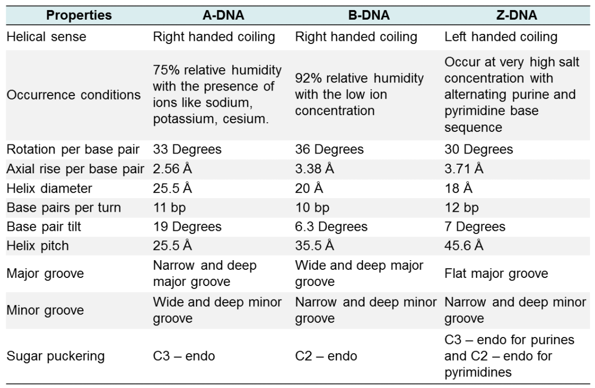

#### Certain DNA sequences adopt unusual structures

+   Palindromes (回文):star: are sequences of double-stranded nucleic acids with twofold symmetry.
+   A mirror repeat (镜像重复), on the other hand，has a symmetric sequence within each strand.

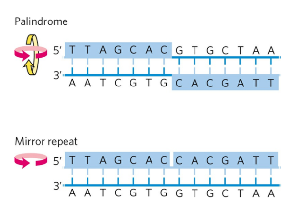

---

+   The self-complementarity within each strand confers the potential to form hairpin(发卡) or cruciform(十字) (cross-shaped) structures

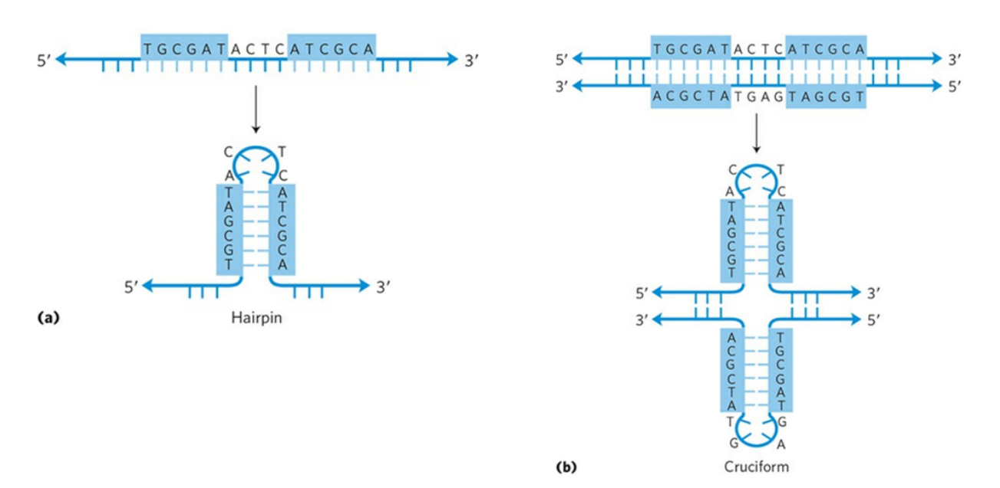

---

+   These sequences play important biological roles 
    +   Slowing or blocking protein synthesis by the ribosome a process called translation attenuation
    +   Forming recognition sites for restriction enzymes, which catalyze double stranded DNA cleavage

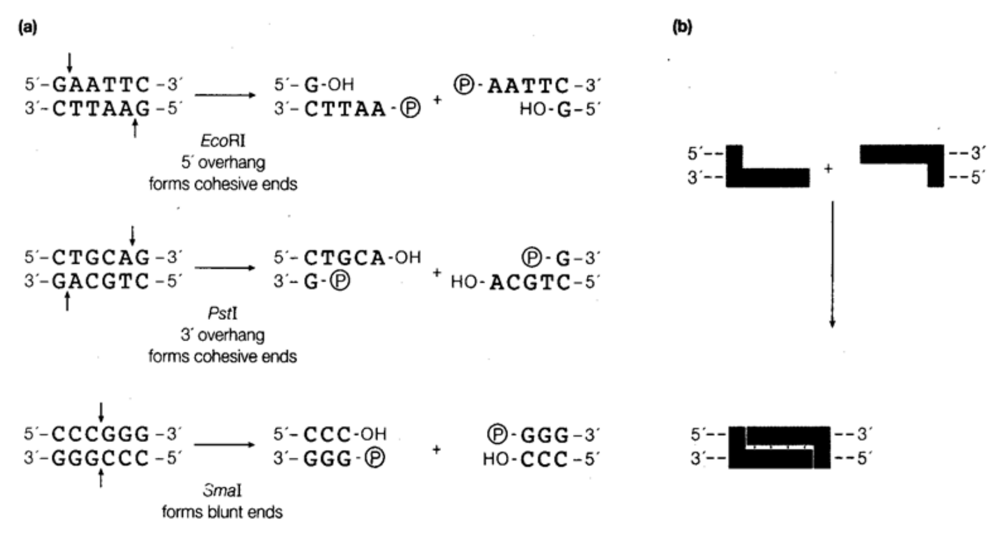

---

+   The AT-rich DNA

    +   The AT-rich region is exactly the site where a replication complex is formed and where the **DNA** synthesis is initiated:exclamation:

    +   >   双链容易打开

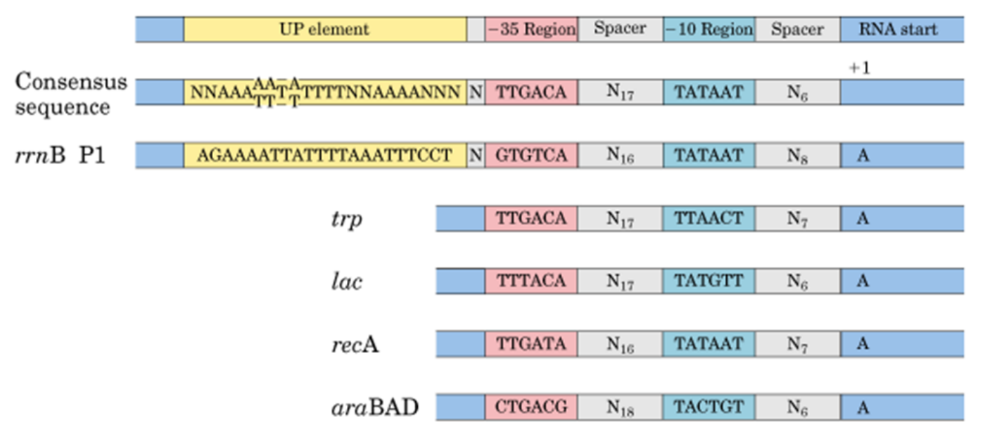

#### Base pairing 碱基配对

+   Watson-Crick pair

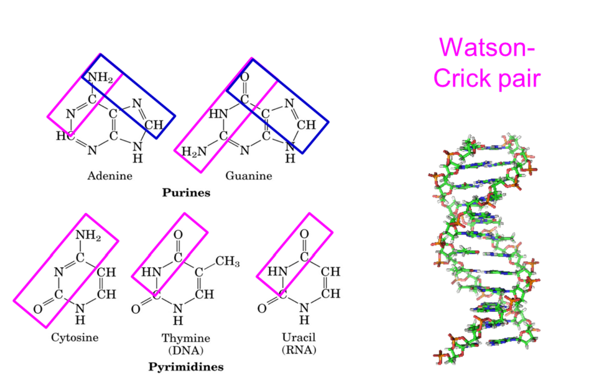

---

+   Hoogsteen pair

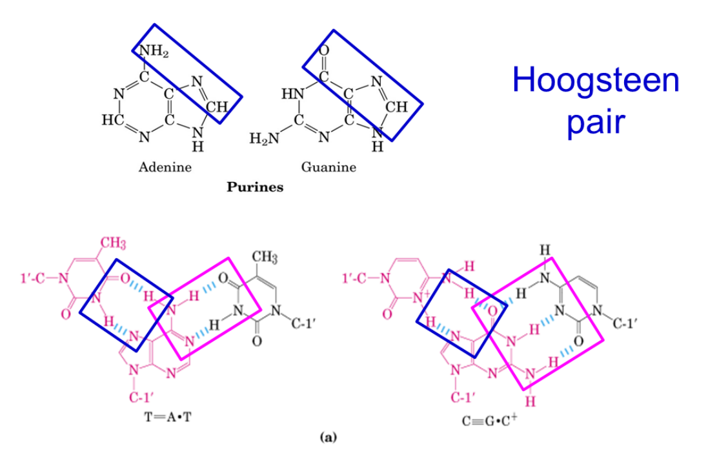

### Triple helical DNA and Quadruple helix DNA

#### Triple-stranded DNA (DNA三股螺旋)

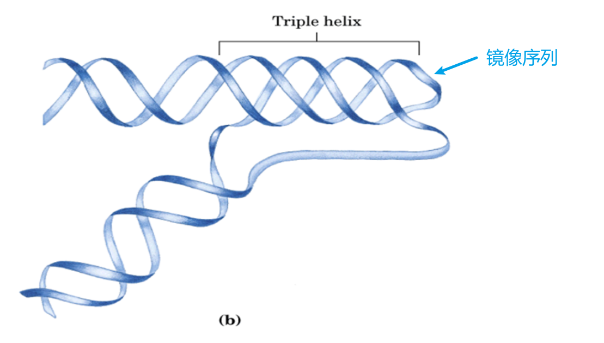

DNA triple-stranded structure often occurs at the start site or regulatory site of DNA replication, recombination, and transcription

#### Some unusual base-pairing patterns found in tRNA

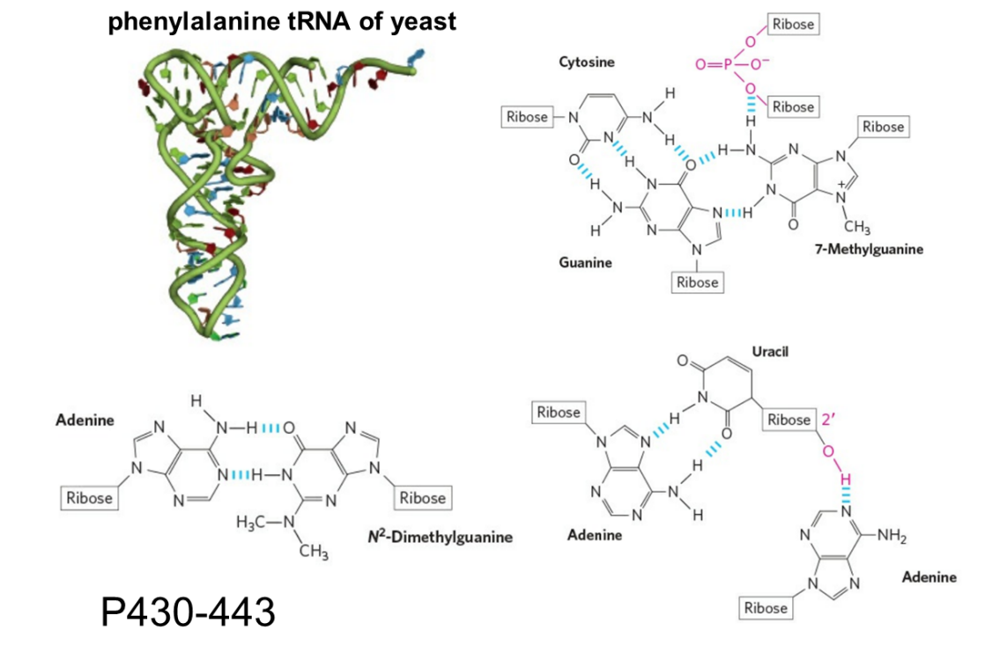

#### DNA structures containing four DNA strands (DNA四股螺旋)

​	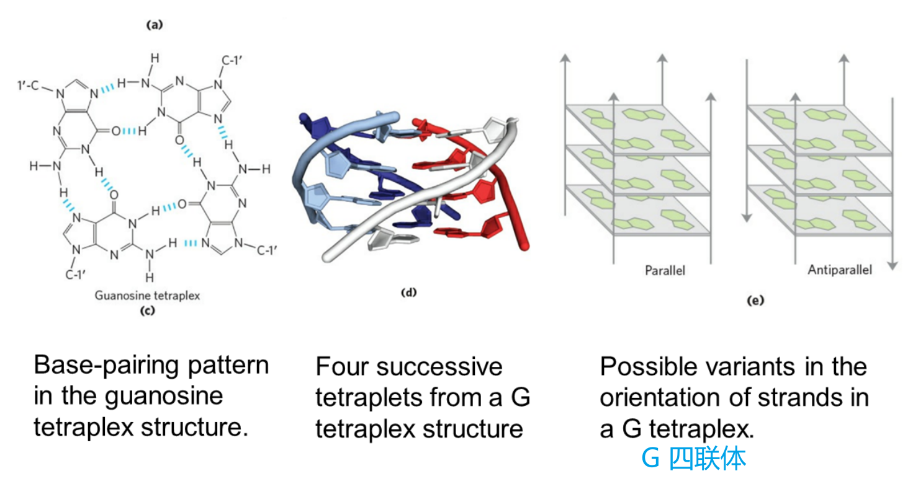

### Circular and superhelical DNA

+   Circular DNA is DNA that forms a closed loop and has no ends. Examples include
+   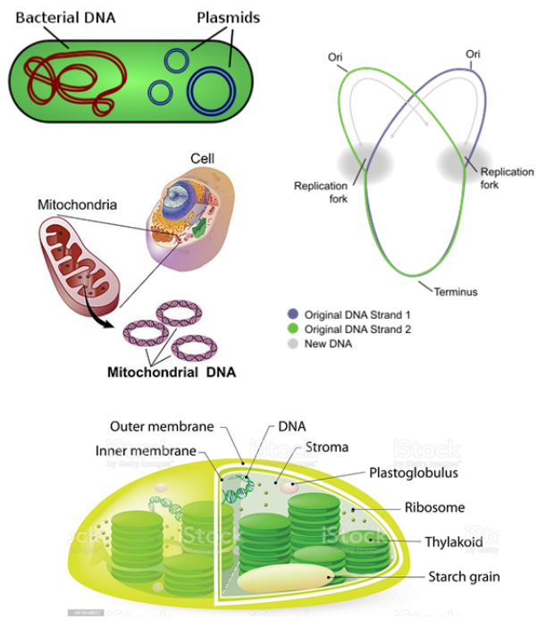
    +   Plasmids, mobile genetic elements 
    +   cccDNA, formed by some viruses inside cell nuclei 
        virus
    +   Circular bacterial chromosomes 
    +   Mitochondrial DNA (mtDNA)
    +   Chloroplast(叶绿体) DNA(cpDNA), and that of other plastids 
    +   Extrachromosomal circular DNA(eccDNA)

---

+   The circular DNA is supercoiled 

+   The supercoiled DNA may be of two types 

    +   Positive, when helix is in right handed coil 

    +   Negative when the double helix is in left handed coil

    +   >   拓扑异构

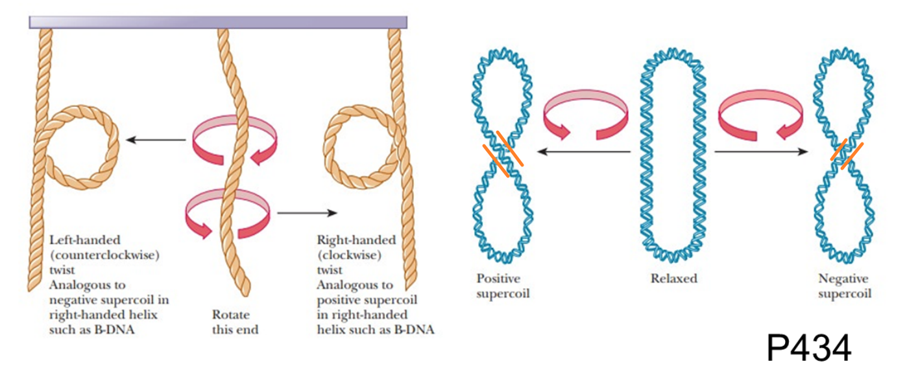

+   All organisms store their DNA as negatively supercoiled because it 

    +   Decreases storage space 

    +   Allows for opening of the helix for replication transcription, etc.

    +   >   形成超螺旋以减轻受到的应力

---

+   Linking number ($L_k$)(连环数) : A topological feature of DNA
    $$
    \large L_k=T_w+W_r
    $$

    +   $T_w$ (扭转数) = “the number of times Watson strand crosses Crick” 
    +   $W_r$ (缠绕数) = “the number of times WC duplex crosses WC duplex”
    +   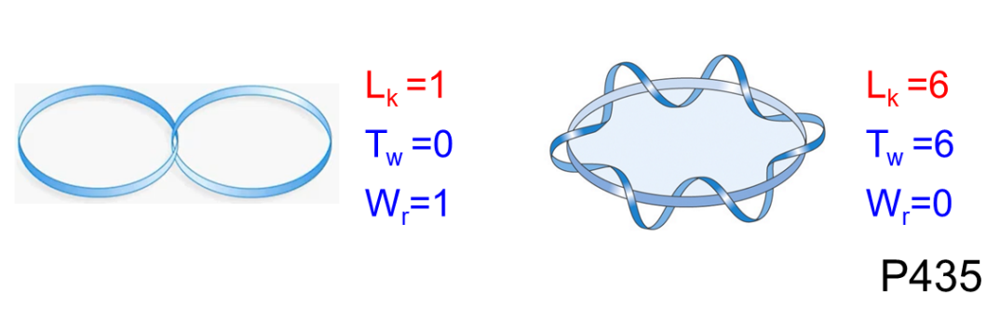

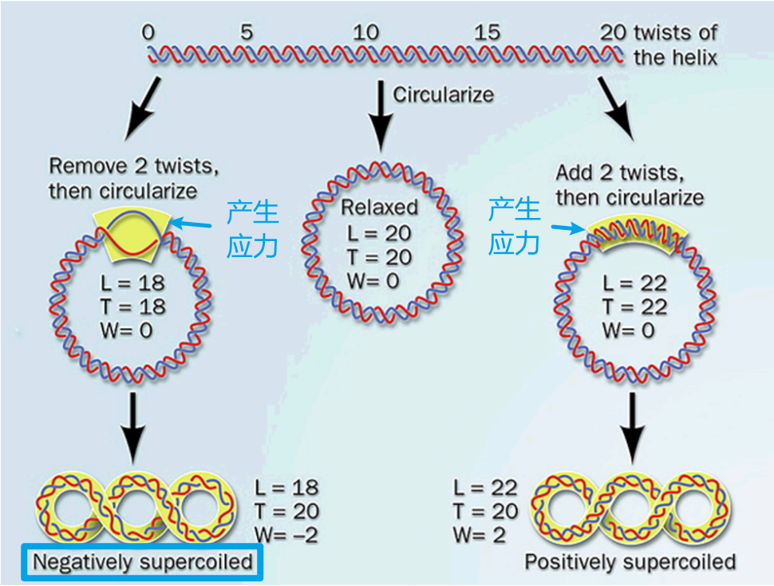

+   DNA supercoiling(DNA超螺旋) is important for DNA packaging within all cells. Because the length of DNA can be of thousands of times that of a cells, packaging this material into the cell or nucleus(in Eukaryotes) is a difficult feat 
+   Supercoiling of DNA reduces the space and allows for much more DNA to be packaged

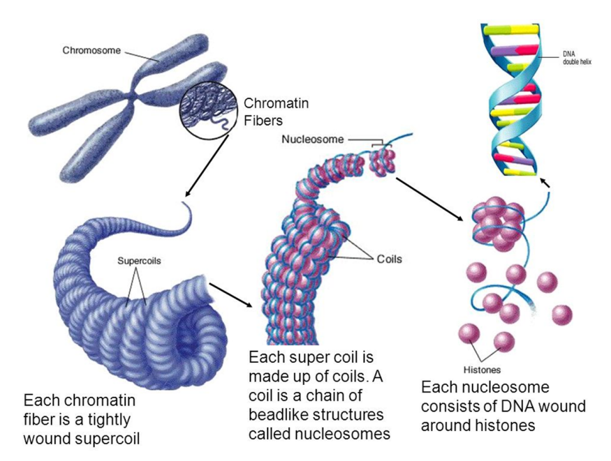

#### Nucleosome(核小体) Structure

+   Nucleosome are the basic unit of the chromatin organization. In Eukaryotes DNA associated with Proteins. (In prokaryotes DNA is naked)
    +   DNA: $\sim$200 bps
    +   Histone: basic proteins with many Lys and Arg residues
        +   H2A ($\times 2$)
        +   H2B ($\times 2$)
        +   H3($\times 2$)
        +   H4($\times 2$)

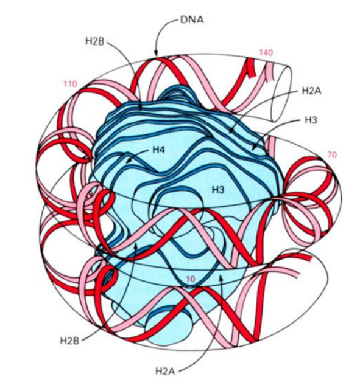

+   Cryo-EM reconstruction of 30-nm Chromatin(染色质) fibers
    +   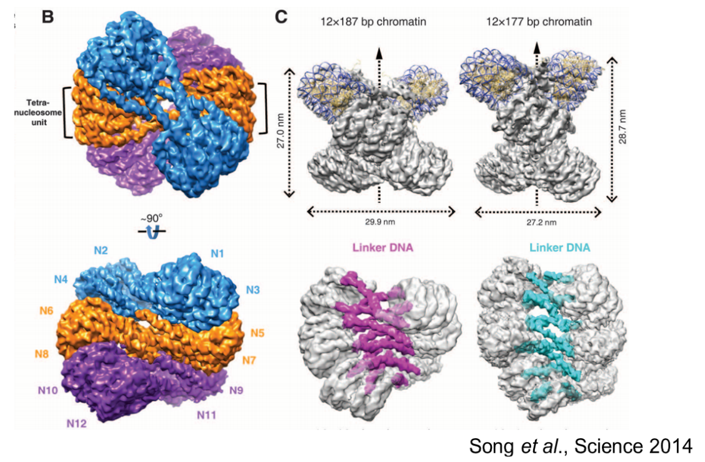

:exclamation: Possible modes of how a chromatin fifiber folds into helical or columnar forms

---

#### DNA packaging introduces a topological problem

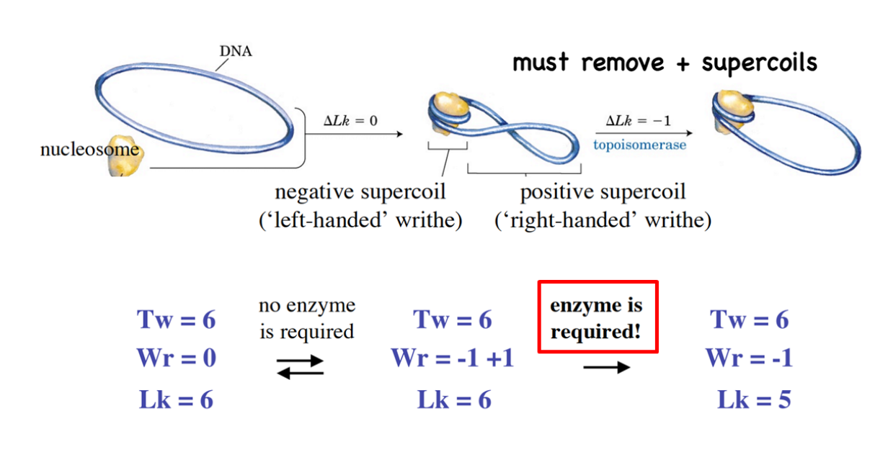

#### Type I and ll Topoisomerases(拓扑异构酶) usually relax supercoiled DNA)

+   They change the linking number by changing the number of writhes 
+   The change the linking number by breaking one or both strands of the dna molecule, winding them tighter or looser, then rejoining the ends 
+   They work only on topologically constrained DNA molecules because only topologically constrained DNA molecules can have writhe

---

+   Type I topoisomerase(拓扑异构酶l)

    +   Breaks only one strand of the dNA

    +   No ATP is required for its function

        +   >   需要能量, 不需要ATP

    +   Responsible for relaxing the stress of the DNA double helix generated due to either over winding or under winding

+   Type ll topoisomerase(拓扑异构酶l)

    +   Breaks both strands of the DNA
    +   Needs ATP for its activity
    +   Change the linking number of circular DNA by $\pm2$

##### Bacterial topoisomerase I(拓扑异构酶l) reaction cycle

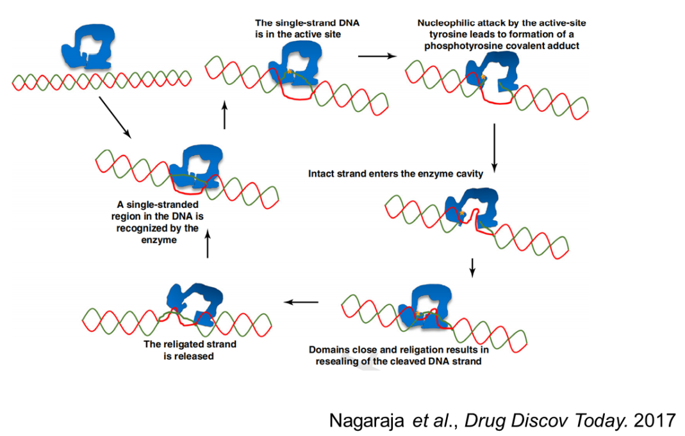

##### Topoisomerase(拓扑异构酶I)

Structure of the $\mathrm{hToP2}\beta^{core}$-DNA cleavage complex stabilized by the anticancer drug etoposide

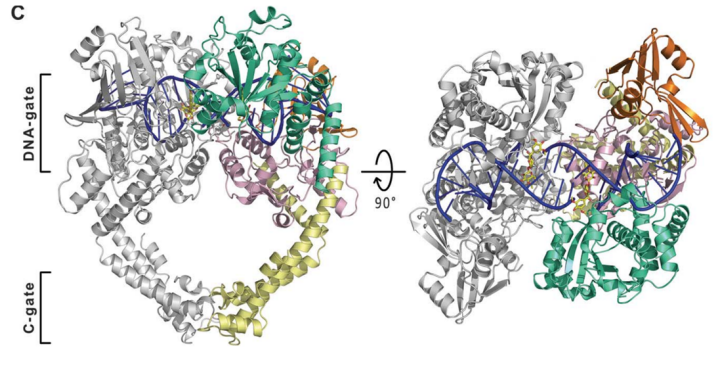

#### Mechanism of strand passage by type I topoisomerases

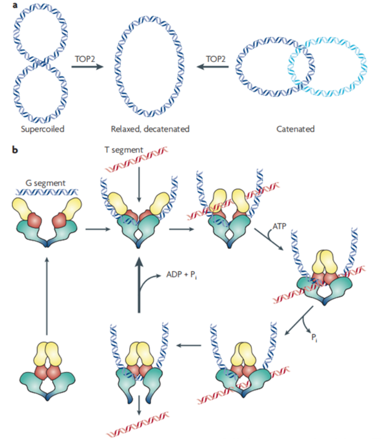

### Functions of DNA

+   Storage of genetic information 
+   Self-duplication & inheritance 
    +   DNA is able to replicate itself in a high fidelity to ensure the genetic information transfer from one generation to the next 
+   Expression of the genetic message 
    +   DNA can be used as a template to synthesize RNA (transcription), and RNA is further used as the template to synthesize proteins(translation)

**DNA's major function is to code for proteins.**

#### Griffith's experiment with Pneumonia and the accidental discovery of Transformation

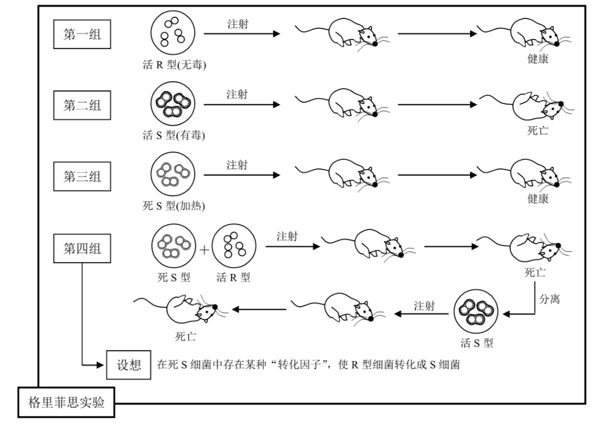

##### Bacteriophage

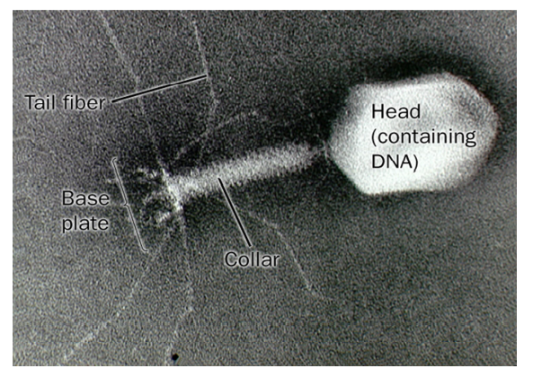

#### The Hershey-Chase Experiments(1952) by Alfred Hershey and Martha Chase

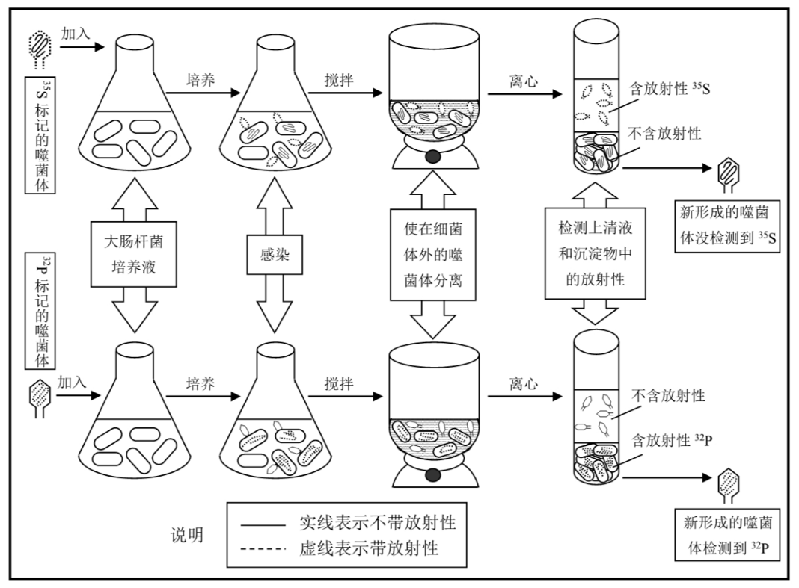

## Structures and functions of RNA (RNA的结构与功能)

### RNA Structure

#### Primary structure

Nucleotide sequence

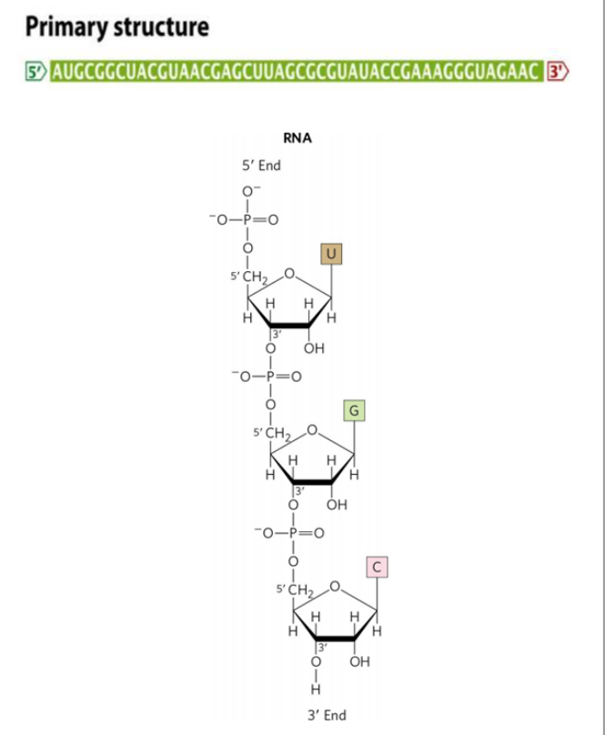

#### Secondary structure
+   Formed by complementary regions
+   Has greater variety than helix of DNA
+   Various shapes have different functions

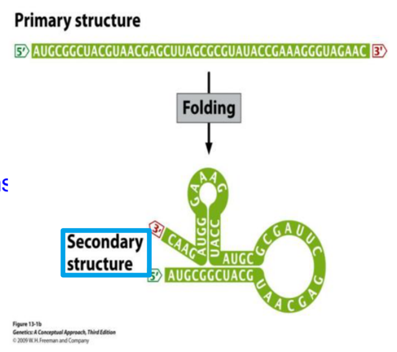

:exclamation: 69

### Messenger RNAs (mRNAs) (信使RNA)

+   mRNA is the template for protein synthesis, that is, to translate each genetic codon on mRNA into each Aa in proteins. Each genetic codon is a set of three continuous nucleotides on mRNA 
+   mRNA structure

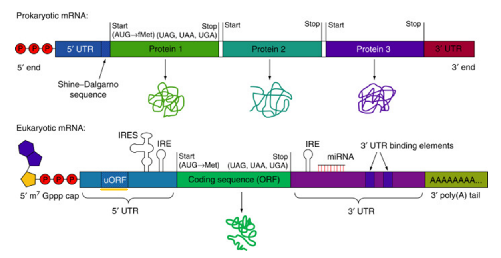

---

+   In bacteria,mRNAs can contain the protein coding sequences(red)for one gene(monocistronic)(单顺反子)or multiple genes(polycistronic)(多顺反子)
+   mRNAs also contain noncoding regions(gray)at their ends and between protein coding sequences that may be involved in regulation of protein synthesis

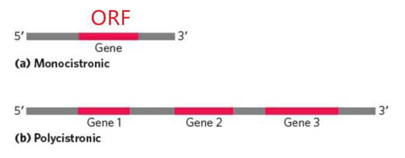

---

+   Most eukaryotic mRNAs are monocistronic(单顺反子)
+   The matured eukaryotic mRNA has special structure features including 5-cap and 3-poly A tail

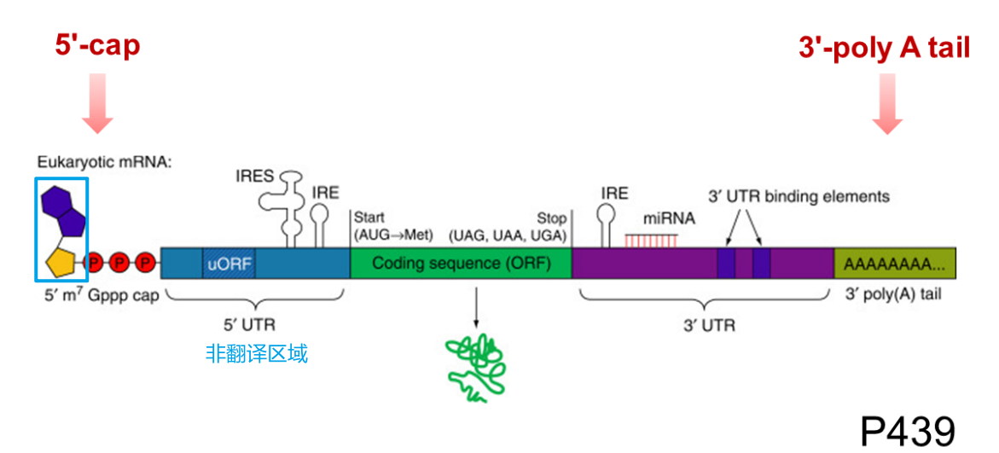

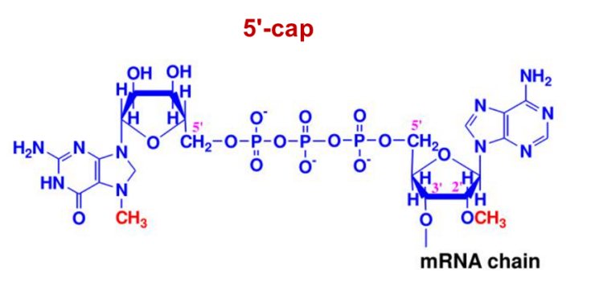

#### 5’-cap addition

+   Methylation can occur at different sites on G or A
+   5’-cap can be bound with CBP, benefiting transporting from nucleus to cytoplasm.
+   5’-cap can be recognized b translation initiation factor 
+   It protects the 5’-end from exonucleases

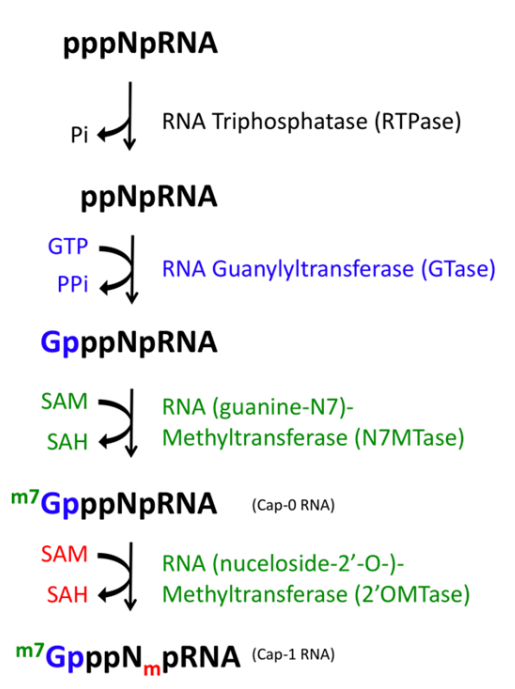

>   帮助翻译 招募

#### Poly A Tail

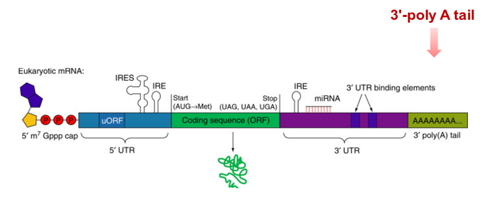

+   20-200 adenine nucleotides at 3 end
+   A un-translated sequence
+   Related with mRNa degradation that begins with poly a tail shortening
+   Associate with poly a tail binding proteins for protection

### Transfer RNAs (tRNAs) (转移RNA)

tRNA serves as an amino acid carrier to transport AA for protein synthesis

#### tRNA structure 

+   The overall structure is a cloveleaf, reversed L-shape structure 
+   There are three loops and four stems 
+   The 3-D structure is stabilized by hydrogen bonds of local intrachain base pairs on these stems

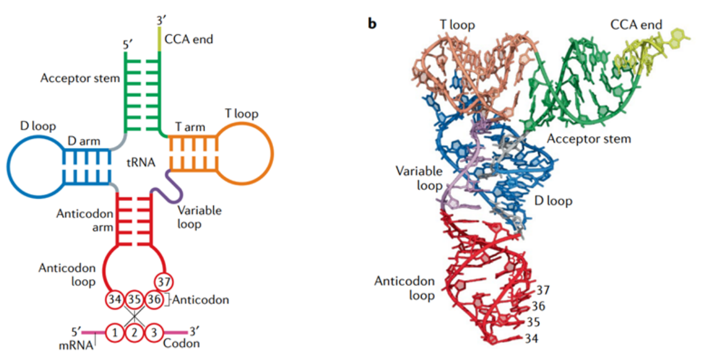

#### Two key sites of tRNA

+   A tRNA molecule has an amino acid attachment site and a template-recognition site, bridging DNA and protein
+   The template-recognition site is a sequence of three bases called the anticodon complementary to the mRNA codon

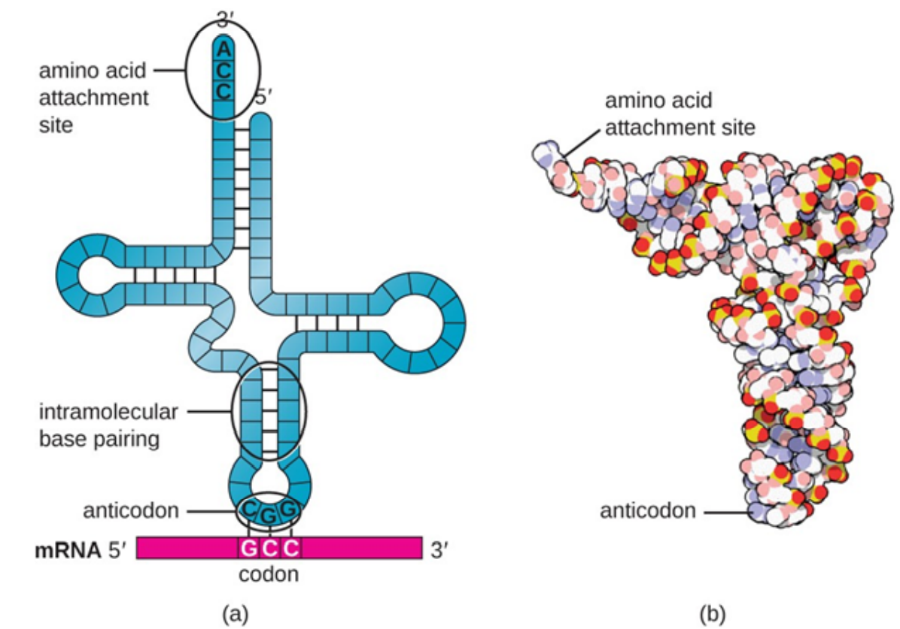

#### Functional role of tRNA in protein synthesis

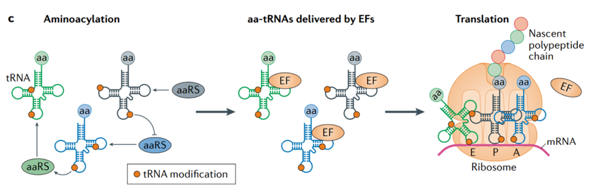

+   tRNA modifications both promote and inhibit aminoacyl-tRNA synthetase (aaRS)-mediated aminoacylation.
+   Elongation factor(EF) recognizes and delivers aminoacylated tRNA
    (aa-tRNA) to the A site (A) of the ribosome.
+   The codon-anticodon interaction at the A site is facilitated by tRNA modifications.

#### tRNA contains a high portion of unusual bases tRNA Modifications

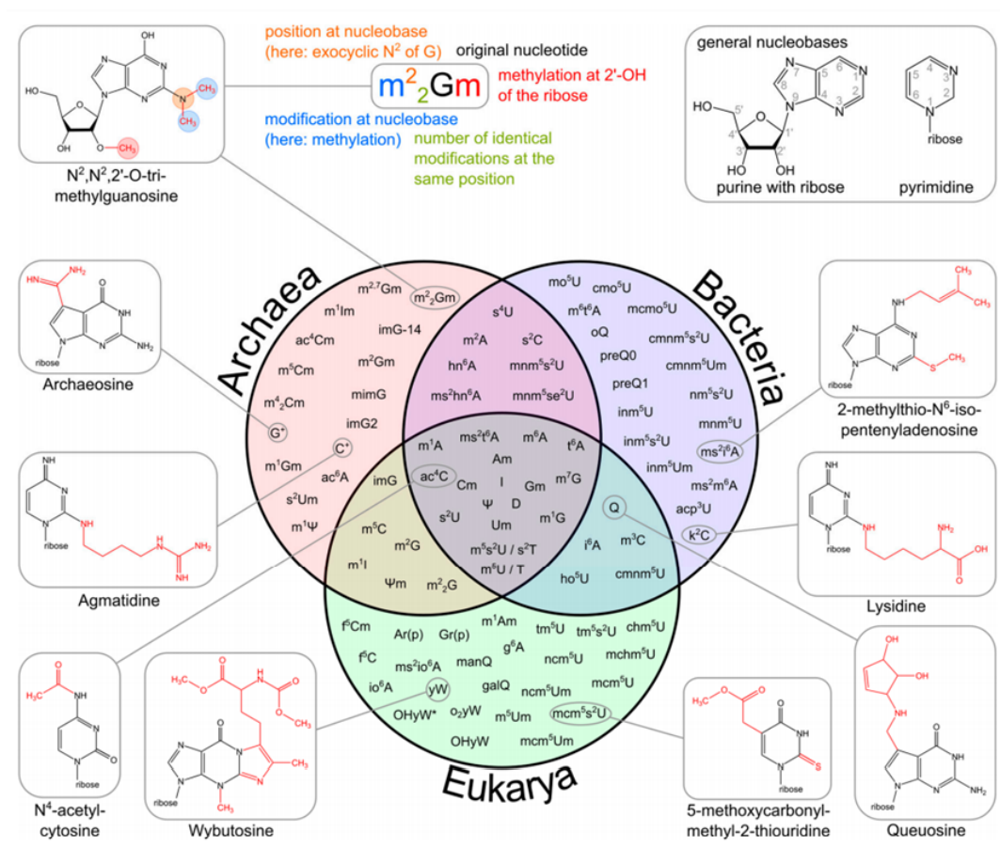

#### Functions of tRNA modifications

+   These modifications can cause large rearrangements as well as local fine-tuning in the 3D structure of a tRNA.
+   Modifications ensure correct folding, efficient translation, and can serve as identity elements for recognition by aminoacyl-tRNA synthetases. 
+   Modifications can adapt tRNAs to different environmental conditions such as temperature.
+   Modified bases can also be of great importance for applications in synthetic biology to fine-tune the structure of aptamers and riboswitches or for the improvement of orthogonal suppressor tRNA systems in the introduction of non-natural amino acids into proteins.

### Ribosomal RNAs (rRNAs) (核糖体RNA)

+   rRNA ensures the proper alignment of the mRNA and the ribosomes during protein synthesis and catalyzes the formation of the peptide bonds between two aligned amino acids during protein synthesis.
+   rRNA assembles with numerous ribosomal proteins to form ribosomes.
+   Ribosomes associate with mRNA to form a place for protein synthesis.

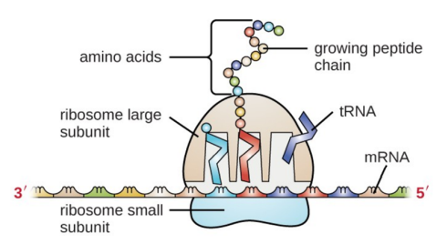

+   Classification and composition of ribosomes

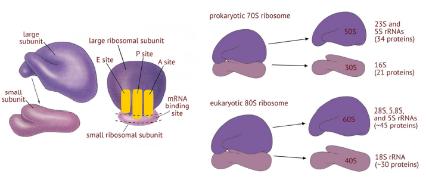

#### The first ribosome structure

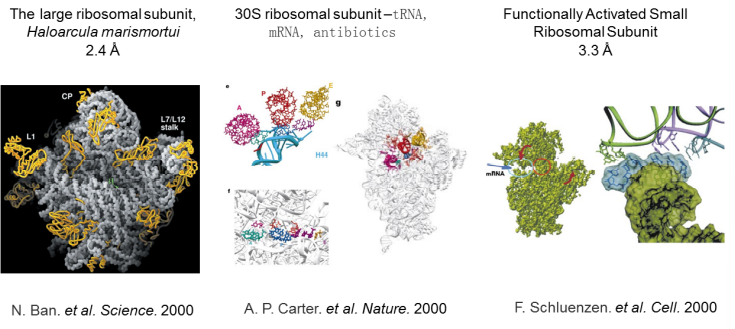

#### Cryo-EM structures of EF-Tu/GTP/aminoacyl tRNA/70S ribosome

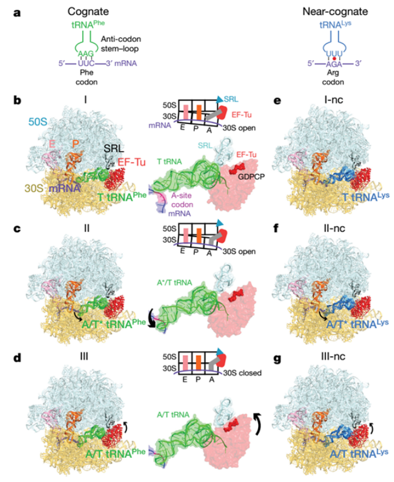

+   Ternary complex on the ribosome with an open 30S subunit; the anticodon and codon are not paired 
+   The anticodon base pairs with the codon 
+   Ternary complex on the ribosome with a closed 30S subunit;EF-Tu docks at the SRL

