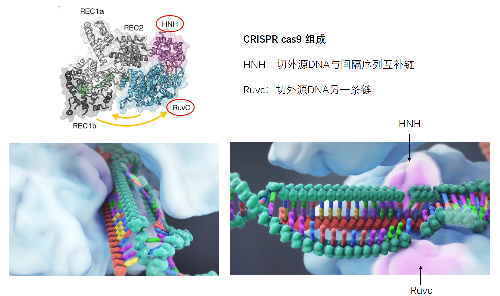
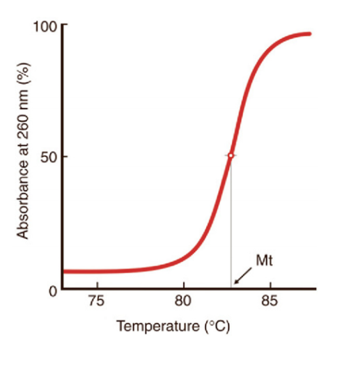

[TOC]

# Hydrolysis of nucleic acid（核酸水解）

+   The nucleic acid can be broken down into the free bases, phosphoric acid, and(deoxy) ribose during hydrolysis.

+   The glycosidic bonds(糖苷键) and phosphodiester bond(磷酸二酯键) in nucleic acid can be broken down by acids(酸), alkali(碱), enzymes(酶).

+   Effect of acid(酸)
    +   RNA and DNA are insoluble in cold acid. DNA is more sensitive to acid hydrolysis than RNA.
    +   In a neutral pH range, pH 5 to 9, DNA molecules are quite stable.
        However, if the pH becomes too acidic or alkaline,DNA molecules are prone to destabilization.
    +   At pH 5 or lower, DNA is liable to depurination(去嘌呤化) (i.e. the loss of purine bases from DNA).The phosphodiester bonds of DNA break which causes the base pairs of DNA to break off.
        +   Depurination in DNA is a chemical reaction of purine deoxyribonucleosides，deoxyadenosine and deoxyguanosine，in which the β-N-glycosidic bond（糖苷键）is hydrolytically cleaved releasing a nucleic base，adenine or guanine.
            
        +   The electrophilic attack of acid on N7 gives rise to depurination by hydrolysis
            
    +   Treatment with 1N HCI at 60 ℃ for 10 minutes will not hydrolyze RNA but can depurinate DNA. This is used in Feulgen staining procedure and makes it DNA specific staining.
    +   At pH<1, however, both DNA and RNA break down into the free bases, phosphoric acid, and(deoxy) ribose.
+   Effect of alkali（碱）
    +   At pH 9 or higher，negatively-charged ions remove hydrogen ions from the base pairs of DNA，thereby breaking the hydrogen bonds between and causing the DNA strands to denature. While less damaging in comparison to acidic pH levels，high alkaline pH levels can still result in depurination.
    +   RNA is hydrolyzed rapidly under alkaline conditions，but DNA is not. RNA can be easily hydrolyzed at alkali pH as it contains 2'-OH
        
    +   Schematic of RNA degradation under extreme alkaline(碱性的)pH conditions
        +   
+   Effect of enzymes(酶)
    +   Nucleases(核酸酶) are a class of enzymes called hydrolases(水解酶)
    +   Break nucleic acids into smaller subunits called nucleotides by hydrolyzing the phosphodiester bonds(磷酸二酯键) present between them
        
    +   Classification of Nucleases 
    +   Based on substrate preference,they can be grouped into DNases(脱氧核糖核酸酶) and RNases(核糖核酸酶).
    +   Based on their site of action along the nucleic acid strand,nucleases can be grouped into exonucleases(外切核酸酶) and endonucleases(内切核酸酶)
    +   Restriction enzyme(Restriction endonuclease 限制性内切酶),is an enzyme that cleaves DNA into fragments at or near specific recognition sites within molecules known as **restriction sites**.
    +   Production of blunt ends and sticky ends.

## Restriction endonucleases are very useful in recombinant DNA technology

+   Recombinant DNA technology has been exploited in order to provide selective improvements in various specialties that include crop agriculture, pharmaceutics, gene therapy, vaccine design and bioremediation.
+   The most common application of recombinant DNA is in basic research, identify, map and sequence genes, and to determine their function

## The CRISPR/Cas9 system for genomic engineering

**Clustered Regularly Interspaced Short Palindromic Repeats**

>CRISPR是细菌染色体的一部分

+   外源基因的捕获

+   crRNA 的形成

+   DSB 染色体双链断裂
    +   双链断裂之后一般有两种方式修复 DSB
        +   NHEJ 非同源末端链接
            +   此过程不需要同源序列当模板，容易造成碱基的随机插入和缺失，导致基因功能性缺失，利用这个特点可以实现基因的敲除
            +   
        +   HR 同源重组
            +   这种方式需要同源序列当模板，能够实现真正意义上的修复
                这个过程只发生在细胞周期的S或G2期
            +   

## Acid-base properties of the nucleic acid (核酸酸碱性质)

+   Nucleic acid bases(碱基), nucleosides(核苷) and nucleotides(核苷酸)can all be dissociated. Under certain conditions,zwitterion(兼性离子) can be formed,which is an amphoteric electrolyte(两性电解质) with an isoelectric point(等电点).

## Ultraviolet absorption properties of the nucleic acid（核酸紫外吸收性质）

+   Nucleic acids absorb ultraviolet(UV) light due to **conjugated double bonds**(共轭双键) in their purine and pyrimidine rings; the sugar-phosphate backbone does not contribute to absorption.

+   The wavelength of **maximum absorption for both DNA and RNA is 260nm.**

+   The absorption properties of DNA can be used for detection,quantification and assessment of purity.
+   The standard nucleic acid quantitation method is UV spectrophotometry (紫外分光光度计法)

+   Measures DNA, RNA(A260) and Proteins(A280) concentrations and sample purity (A260:A280).
    +   
    +   A ratio 260/280 of~1.8 is generally accepted as"pure"for DNA; 
    +   A ratio of ~2.0 is generally accepted as "pure"for RNA.
    +   Similarly, absorbance at 230 nm is accepted as being the result of other contamination; 
    +   Expected 260/230 values are commonly in the range of 2.0-2.2.

## Nucleic acid denaturation and renaturation (核酸的变性和复性)

+   Nucleic acid denaturation (核酸的变性) occurs when hydrogen bonding between nucleotides is disrupted, and results in the separation of previously annealed strands.
+   Denatured DNA can be obtained in high temperatures, high concentration of denaturant (urea, methylmercuric hydroxide, etc.) or at extreme pH values.
+   For example,denaturation(变性) of DNA due to high temperatures results in the disruption of Watson and Crick base pairs and the separation of the double stranded helix into two single strands.

+   DNA denaturation can be followed spectrophotometrically by measuring the absorption of UV light at 260 nm 
+   In its native state,DNA absorbs less UV light than the separate polynucleotide chains,a phenomenon that is called hypochromic effect(减色效应).
+   If a DNA dispersion is slowly heated and its UV light absorption isfollowwed,the temperature/absorbency relationship is an indicator of DNA denaturation

+   As the temperature augments，an increase of absorption(hyperchromic effect(增色效应) ) occurs.
+   When a given temperature is reached，the optical density does not further increase，which shows that DNA chains are completely separated and the molecules are maximally denatured.

#### Melting Temperature($T_m$)(熔解温度)

The temperature at which half of the DNA is denatured(corresponding to the midpoint or in flection of the curve)is known as the DNA melting temperature($T_m$)

+   The Tm is characteristic for each DNA under defined conditions of pH and salt concentration, it ranges from 80 to 100℃ for DNA isolated from different organisms.
+   Determining the value of Tm is useful to estimate the base composition of DNA.
    $A=T, G\equiv C$

#### Correlations of Melting Temperature ($T_m$) with G + C Content

AT base pairs have two hydrogen bonds and GC pairs have three.
Therefore, there is more energy in the GC bond. Consequently, the higher the GC content of a molecule, the higher the melting temperature (more energy is necessary to make the helix-coil transition)

>   pH, 序列, 离子浓度

### The DNA renaturaion (复性)

The DNA denaturation process is reversible under controlled conditions of pH and ionic strength. If the temperature is slowly decreased in the solution where the DNA had been denatured, the DNA chains will spontaneously reanneal and the original double helix structure is restored.

If a hot solution of denatured DNA is **cooled slowly**, the hydrogen bonds between complementary bases and the **original dsDNA** are restored-the process is called **annealing**(退火)

If a hot solution is **cooled rapidly**，hydrogen bonds between bases are formed in a random way. Various either **intramolecular or intermolecular aggregates** are formed.

---

+   This process of DNA renaturation(复性) is also a kinetic one.
+   The reaction is a second order rate, dependent upon the concentration of DNA.
+   The renaturation rate of DNA is an excellent indicator of the sequence complexity and the size of the DNA.

