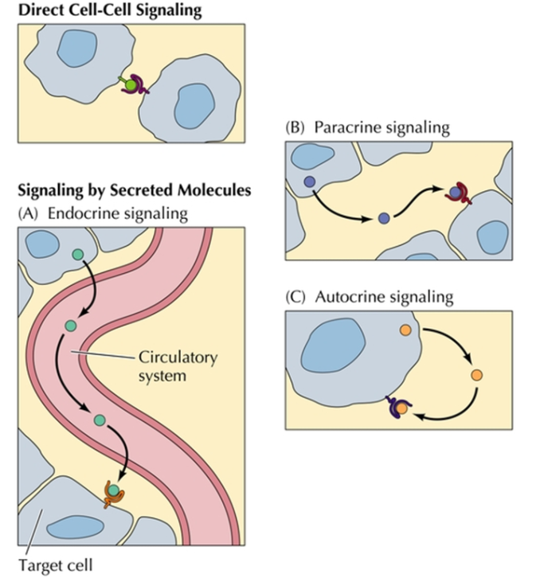
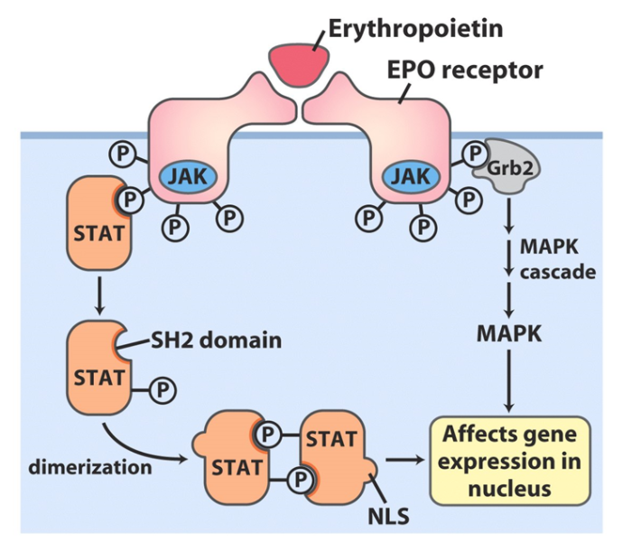

[toc]

# Hormone and Signal Transduction 激素和信号传导

Biosignaling is Fundamental to Life

Cells constantly receive and act on signals from the internal and external environments 细胞持续接受来自内外环境的信号，并做出响应

## Classification of hormone 激素的分类

## Characteristics of hormone 激素的特点

+   Hormone(激素), a chemical substance, synthesized in small amounts by an endocrine tissue(内分泌组织) that is carried in the blood(体液) to another tissue or diffuses to a nearby cell, where it acts as a messenger to regulate the function of the target tissue or organ 激素是一种化学物质，由内分泌组织小量合成，通过洗液运输到其他组织或扩散到附近的细胞，作为信号调节靶细胞（组织） 的功能
+   Hormones are used to communicate between organs and tissues 激素用于器官、组织间信息交流

>   可被代谢

### Four categories of chemical signaling found in multicellular organisms 多细胞生物的四类化学信号调节方式

+   自分泌 脂溶 作用于膜上受体  级联 速度快
    +   甾醇类
    +   一氧化碳 气体类
    +   

## Six basic mechanisms for signal transduction 信号传导的六种基本机制

### Signal Transduction 信号转导

+   The process that a signal which represents information is detected by specific receptors and converted to a cellular response is called signal transduction(信号转导). 信号分子呈递信息并被特定受体检测并转化为细胞响应的过程称为信号转导
+   Signal transduction always involves a chemical process. 信号转到总是涉及化学过程
+   Even though the number of different biological signaling is large, organisms use just a few evolutionary conserved mechanisms to detect extracellular(胞外) signals and transduce them into intracellular(胞内) changes. 尽管几种不同生物信号的差异很大，

### Basic signaling pathway

### General features of signal transduction

#### Specificity(特异性) of signal transduction

Signal molecule fits binding site on its complementary receptor; other signals do not fit.

#### Amplification(级联放大性) of signal transduction

When enzymes activate enzymes, the number of affected molecules increases geometrically in an enzyme cascade.

#### Desensitization(脱敏)of signal transduction

Receptor activation triggers a feedback circuit that shuts off the receptor or removes it from the cell surface.

#### Integration(整合,相互作用) of signal transduction

Organisms are able to receive multiple signals and produce a unified response appropriate to their needs.

When two signals have opposite effects on a metabolic characteristic such as the concentration of a second messenger X, or the membrane potential Vo, the regulatory outcome m results from the integrated input from both receptors.

##### Multiple signals are needed to maintain cell activity

##### Multiple levels of cell signaling

## Six basic mechanisms for signal transduction (信号转导的六种基本机制)

### Gated ion channels (门控离子通道)

+   lon channels not continuously open
    +   静息状态下关闭
+   Can switch between open and closed state by changing conformation
    通过改变构型实现开关
+   Conformation change regulated by conditions inside and outside cell
    通过胞内外条件调节构型转变

>   +   感受电势差
>   +   与信号分子结合
>   +   机械

#### The Nicotinic acetylcholine receptor(烟碱型乙酰胆碱受体) is a ligand-gated ion channels

+   Acetylcholine binds to an acetylcholine receptor.
+   This forces a conformational change in the receptor, causing its ion channel to open.
+   Allows $Na^{+}$, $Ca^{2+}$, and $K^+$ to pass through its channel with equal ease, but other

### Receptor enzymes (酶联受体)

Commonly, the receptor enzyme is a protein kinase(激酶) that phosphorylates Tyr residues in specific target proteins.

#### Production of Insulin

Insulin is involved in regulating gene expression and glucose metabolism
A链21氨基酸, B链30氨基酸

##### Activation of gene expression by insulin (胰岛素)

>   级联放大性

##### Insulin(胰岛素) activates glycogen synthase kinase-3(GSK3) signaling pathway

>   +   促进葡萄糖向胞内转运
>   +   促进生成糖原的反应, 降低糖原分解的反应

#### Receptor Tyrosine kinase

>   RLK 柴继杰

### Receptors with no intrinsic enzyme activity

The receptor binds to a kinase to transmit signals

Regulation of the formation of erythrocytes by erythropoietin (EPO) (促红细胞生成素)

### Steroid receptors (甾醇受体)

+   Nuclear receptors are a class of proteins found within cells that are responsible for sensing steroid(类固醇)and thyroid hormones(甲状腺激素)and certain other molecules 
    +   Steroid receptors 
    +   Thyroid hormone receptor 
+   Nuclear receptors have the ability to directly bind to DNA and regulate the expression of adjacent genes;hence these receptors are classified as transcription factors.
+   Steroid receptors(甾醇受体)are either located in the cytosol and move to the cell nucleus upon activation,or remain in the nucleus waiting for the steroid hormone to enter and activate them 
+   Activated hormone-receptor complex bind regulatory regions of target gene in nuclear to regulate the gene expression

### G proteins (G蛋白偶联受体) :star:

+   The G protein-coupled signaling pathway represents one of the best established paradigms for signal transduction.It consists of three essential components:
    	1. A plasma membrane receptor(G protein-coupling receptor,GPCR)with 7 transmembrane helical segments
     	2. A guanosine nucleotide-binding protein(G protein)
     	3. A plasma membrane enzyme that generates an intracellular second messenger(第二信使).

#### G protein-coupled signaling pathway

+   Membrane receptor(GPCR)
+   Heterotrimeric G proteins($G_{\alpha}$,$G_\beta$,$G_\gamma$)
+   Activated membrane proteins(Eg: adenylate cyclase(腺苷酸环化酶),calcium channel)produce the second messengers(第二信使)

>   Second messengers
>
>   +   CAMP( AMP)
>   +   $Ca^{2+}$
>   +   IP3(肌醇3磷酸)
>   +   DAG(二酰甘油)
>   +   CGMP(化GMP)

#### CAMP pathway 腺苷酸环化酶途径

сAMP pathway: $G_{\alpha}$—AC—сAMP —PКA

#### CAMP-dependent protein kinase (PKA)

#### Calcium/calmodulin kinase pathway(钙/钙调蛋白激酶途径)

+   Second messengers(第二信使)
    +   Inositol Trisphosphate 
    +   DAG(二酰甘油)
    +   (IP3)(肌醇3磷酸)
    +   Ca^{2+}
+   Hormones(catecholamines,vasodilator Il,antidiuretic,etc.)bind to receptors on the cell membrane to activate G protein.
+   A second broad class of GPCRs are coupled through a G protein to a plasma membrane phospholipase C(PLC)(磷脂酶C) that catalyzes cleavage of the membrane phospholipid phosphatidylinositol 4,5-bisphosphate,or PIP2

### Adhesion receptors (粘附受体)

