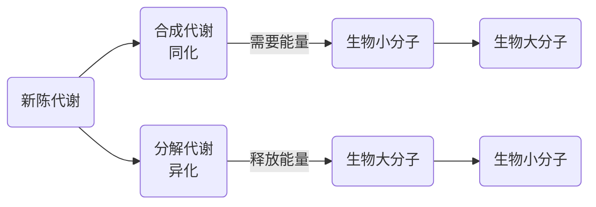

[TOC]

# 新陈代谢的基本概念

新陈代谢是体内化学反应的总称。 

体内的化学反应通常由酶催化，一系列的连续反应构成代谢途径，代谢途径的个别步骤称作中间代谢，个别步骤的产物称作中间产物。 

##  新陈代谢的主要作用

### 合成代谢

获取营养物质，并将其转化为自身所需的物质。 

### 分解代谢

分解营养物质提供生命活动所需的能量。 

### 两用代谢途径

是合成代谢和分解代谢共同利用的代谢环节。 

## 新陈代谢途径及其调节控制和信息代谢

### 分解代谢的三个阶段

Overview of catabolism. Complex metabolites such as carbohydrates, proteins, and lipids are degraded first to their monomeric units, chiefly glucose, amino acids, fatty acids, and glycerol, and then to the common intermediate, `acetyl-CoA`.The acetyl group is oxidized to $CO_2$ via the citric acid cycle with concomitant reduction of $\mathrm{NAD}^+$ and $\mathrm{FAD}$ to $\mathrm{NADH}$ and $\mathrm{FADH}_2$. Reoxidation of NADH and $\mathrm{FADH}_2$ by $O_2$ during electron transport and oxidative phosphorylation yields $H_2O$ and $ATP$

### 生物能的来源

---

### 代谢途径(网络） 

# 代谢通路的特征

## Forms of metabolic pathways (Linear, cyclic, spiral)

## Metabolism Proceeds by Discrete Steps

+   Multiple-step pathways permit control of energy input and output.
    多步反应通路控制能量的输入与输出
+   Catabolic multi-step pathways provide energy in smaller stepwise amounts that can be used by the cell.
    
+   Each enzyme in a multi-step pathway usually catalyzes only one single step in the pathway.
    多部反应通路中的每种酶只催化多步反应中的一步
+   Control points occur in multistep pathways.
    多部反应通路的控制点

## Metabolic pathways are regulated

+   Metabolism is highly regulated to permit organisms to respond to changing conditions
+   Three principal ways of regulation
    三种基本调节通路
    1.   The amount of enzymes
         酶量
         +   Enzyme synthesis & degradation 
             酶的合成与分解
         +   transcription  -   gene expression
             转录 - 基因表达
    2.   The enzyme catalytic activities
         酶催化活性
         +   Allosteric regulation 
         +   Reversable covalent modification –(de)phopsphorylation 
             可逆共价修饰 - 磷酸化(去磷酸化)
    3.   The accessibility & supply of substrates
         +   Feedback inhibition:  Product of a pathway controls the rate of its own synthesis by inhibiting an early step (usually the first “committed” step (unique to the pathway)
             反馈抑制: 
             +   
         +   Feed-forward activation: Metabolite early in the pathway activates an enzyme in the down stream of the pathway
             前馈激活: 
             +   

### 分解代谢和合成代谢的调控

### 代谢途径的细胞区室化 

### 代谢途径的类型

+   Compartmentation of metabolic processes permits:
    +   separate pools of metabolites within a cell
    +   simultaneous operation of opposing metabolic paths
    +   high local concentrations of metabolites
    +   coordinated regulation of enzymes
+   Example: fatty acid synthesis enzymes (cytosol), fatty acid breakdown enzymes (mitochondria)

