[TOC]

# 新陈代谢的基本概念

新陈代谢是体内化学反应的总称。 

体内的化学反应通常由酶催化，一系列的连续反应构成代谢途径，代谢途径的个别步骤称作中间代谢，个别步骤的产物称作中间产物。 

##  新陈代谢的主要作用

### 合成代谢

获取营养物质，并将其转化为自身所需的物质。 

### 分解代谢

分解营养物质提供生命活动所需的能量。 

### 两用代谢途径

是合成代谢和分解代谢共同利用的代谢环节。 

## 新陈代谢途径及其调节控制和信息代谢

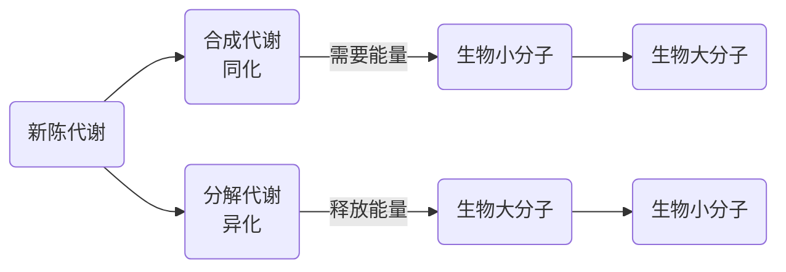
```mermaid
graph LR
	A(新陈代谢) --> B(合成代谢<br>同化) --需要能量--> D(生物小分子) --> E(生物大分子)
	A --> F(分解代谢<br>异化) --释放能量--> G(生物大分子) -->H(生物小分子)
```

### 分解代谢的三个阶段

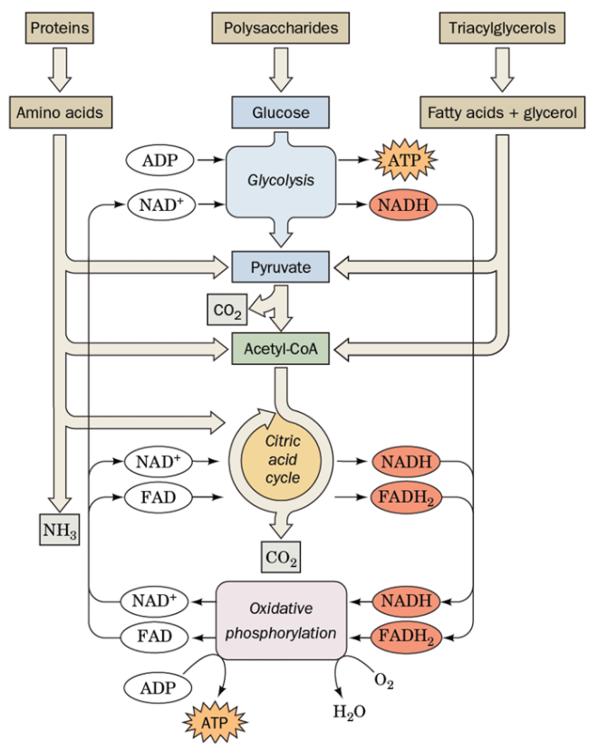

Overview of catabolism. Complex metabolites such as carbohydrates, proteins, and lipids are degraded first to their monomeric units, chiefly glucose, amino acids, fatty acids, and glycerol, and then to the common intermediate, `acetyl-CoA`.The acetyl group is oxidized to $CO_2$ via the citric acid cycle with concomitant reduction of $\mathrm{NAD}^+$ and $\mathrm{FAD}$ to $\mathrm{NADH}$ and $\mathrm{FADH}_2$. Reoxidation of NADH and $\mathrm{FADH}_2$ by $O_2$ during electron transport and oxidative phosphorylation yields $H_2O$ and $ATP$

### 生物能的来源

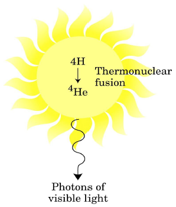

---

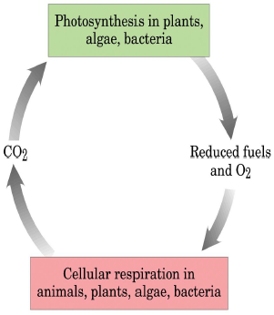

### 代谢途径(网络） 

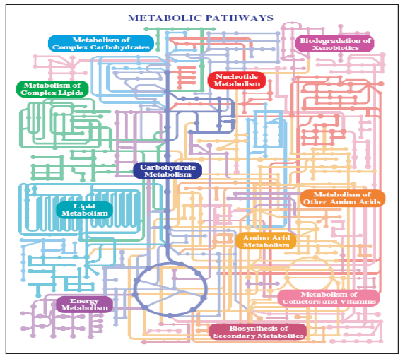

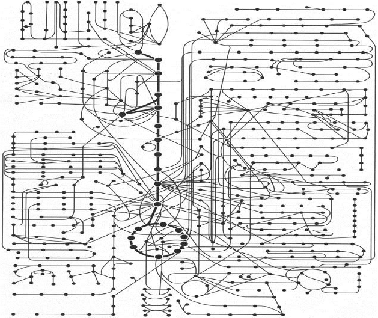

# 代谢通路的特征

## Forms of metabolic pathways (Linear, cyclic, spiral)

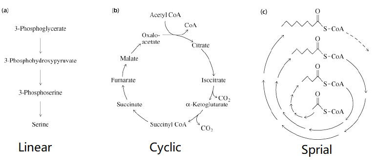

## Metabolism Proceeds by Discrete Steps

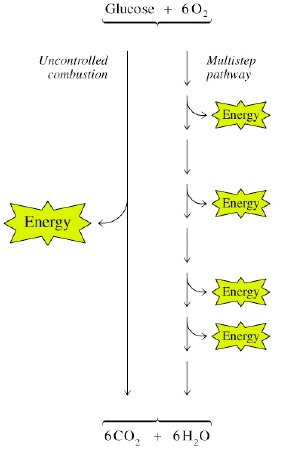

+   Multiple-step pathways permit control of energy input and output.
    多步反应通路控制能量的输入与输出
+   Catabolic multi-step pathways provide energy in smaller stepwise amounts that can be used by the cell.
    
+   Each enzyme in a multi-step pathway usually catalyzes only one single step in the pathway.
    多部反应通路中的每种酶只催化多步反应中的一步
+   Control points occur in multistep pathways.
    多部反应通路的控制点

## Metabolic pathways are regulated

+   Metabolism is highly regulated to permit organisms to respond to changing conditions
+   Three principal ways of regulation
    三种基本调节通路
    1.   The amount of enzymes
         酶量
         +   Enzyme synthesis & degradation 
             酶的合成与分解
         +   transcription  -   gene expression
             转录 - 基因表达
    2.   The enzyme catalytic activities
         酶催化活性
         +   Allosteric regulation 
         +   Reversable covalent modification –(de)phopsphorylation 
             可逆共价修饰 - 磷酸化(去磷酸化)
    3.   The accessibility & supply of substrates
         +   Feedback inhibition:  Product of a pathway controls the rate of its own synthesis by inhibiting an early step (usually the first “committed” step (unique to the pathway)
             反馈抑制: 
             +   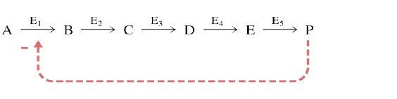
         +   Feed-forward activation: Metabolite early in the pathway activates an enzyme in the down stream of the pathway
             前馈激活: 
             +   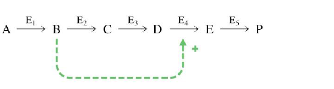

### 分解代谢和合成代谢的调控

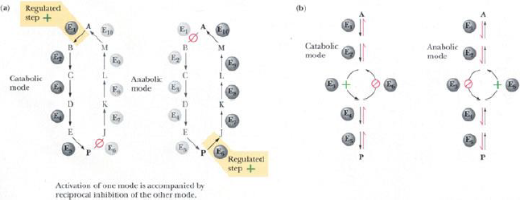

### 代谢途径的细胞区室化 

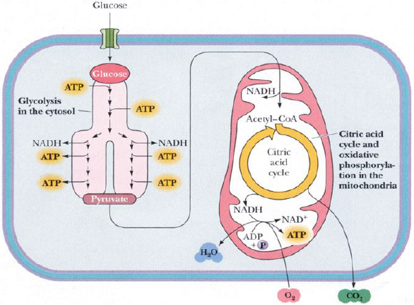

### 代谢途径的类型

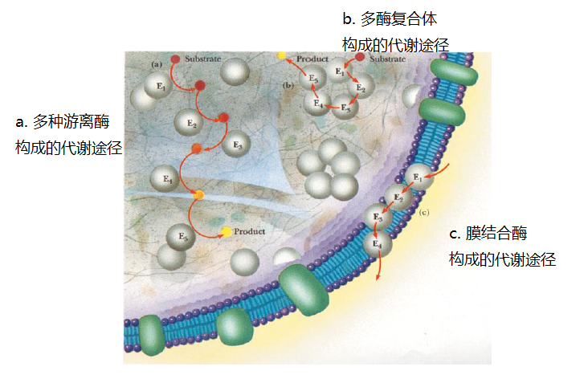

+   Compartmentation of metabolic processes permits:
    +   separate pools of metabolites within a cell
    +   simultaneous operation of opposing metabolic paths
    +   high local concentrations of metabolites
    +   coordinated regulation of enzymes
+   Example: fatty acid synthesis enzymes (cytosol), fatty acid breakdown enzymes (mitochondria)

# 代谢反应中涉及的一些辅酶

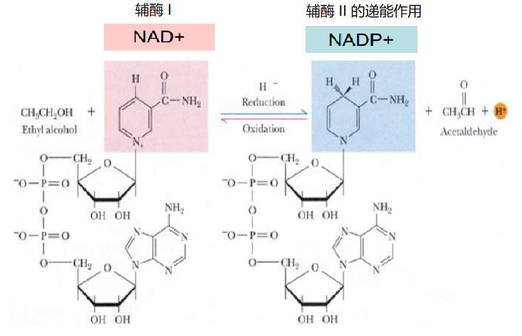

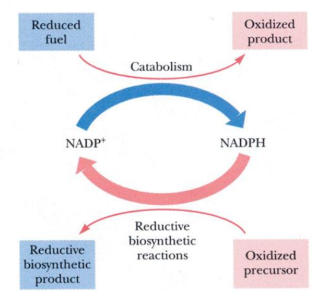

## $NAD^+$ 和 $NADP^+$ 的结构

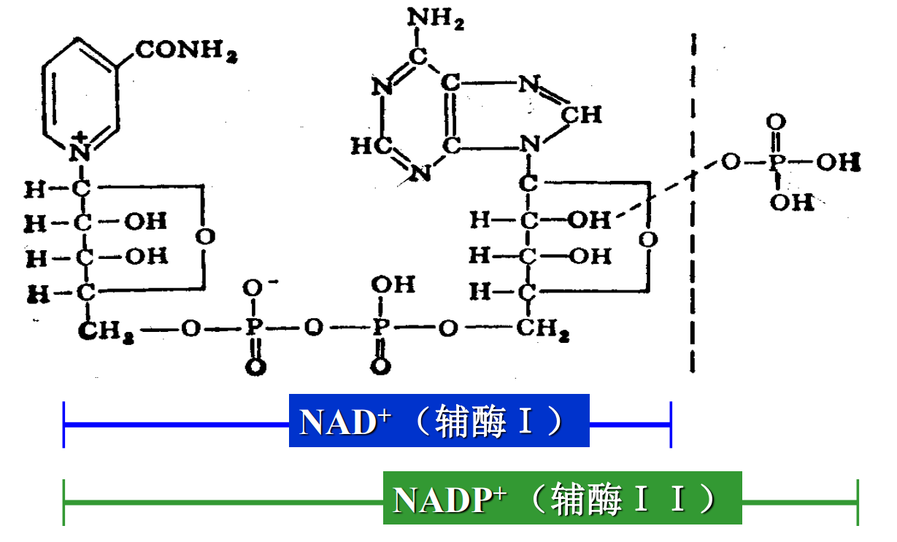

## FMN 和 FAM 的递能作用

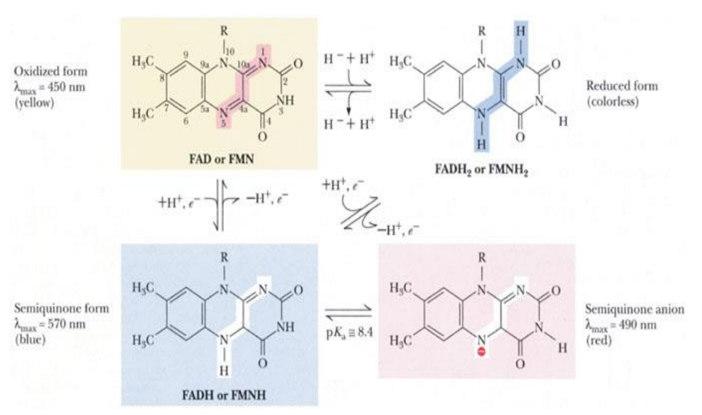

## 黄素腺嘌呤二核苷酸 ($FAD/FADH_2$)

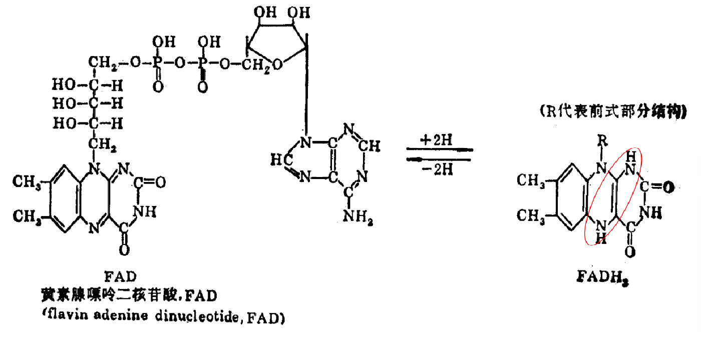

活性位点: 异咯嗪的$1, 5 N$ 位具有活泼的双键其氧化还原反应.

## Why are two different electron carriers, NAD+ and FAD, involved in metabolism?

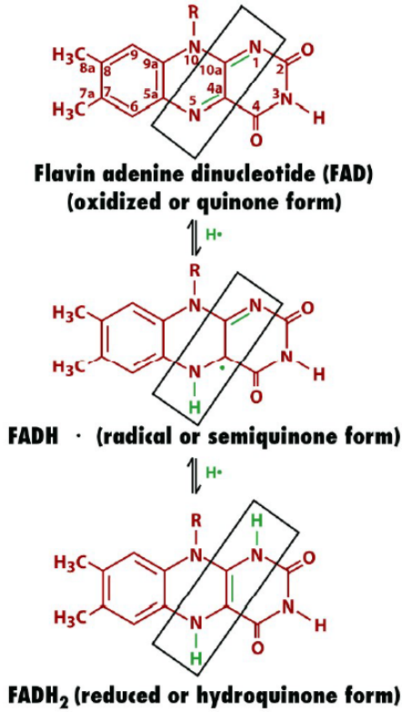

The flavin-containing coenzyme is involved in one-electron transfers as well as two-electron transfers, whereas $NAD^+$ is involved only in two-electron transfers. In addition, $FAD$ has a higher standard reduction potential than $NAD^+$ that is, a lower $\Delta G\degree$, and can therefore be reduced by reactants with insufficient free energy to reduce $NAD^+$.

## Energy in NADH is used to produce ATP

Most $NADH$ formed in metabolic reactions in  aerobic cells is oxidized by the respiratory electron-transport chain for $ATP$ synthesis from $ADP$ + $Pi$

The same with $FADH_2$

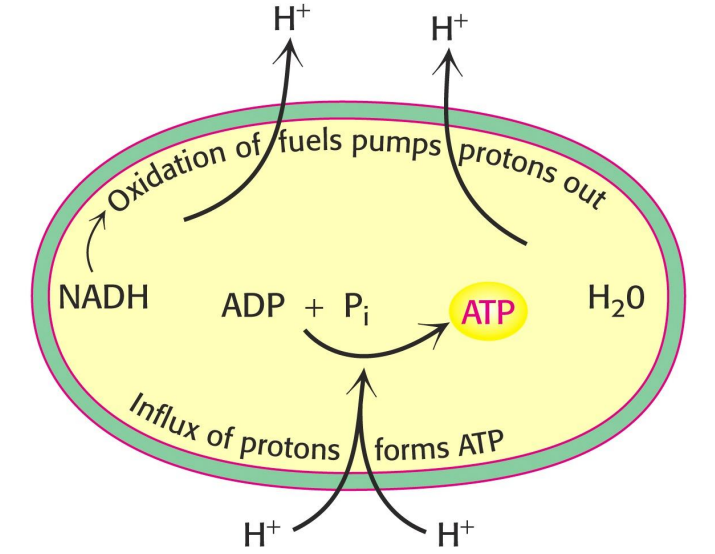

## 辅酶A在能量代谢中的作用

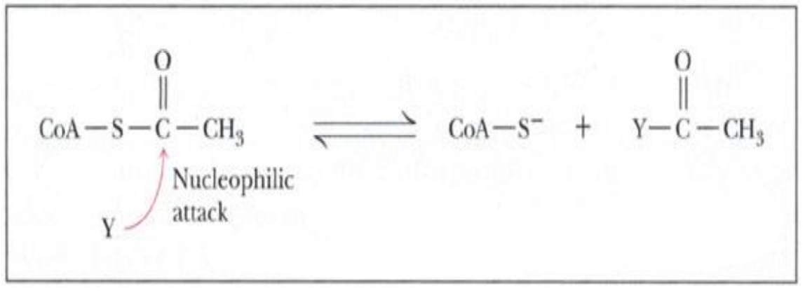

>   亲核攻击

# 辅酶A (CoA) 的结构

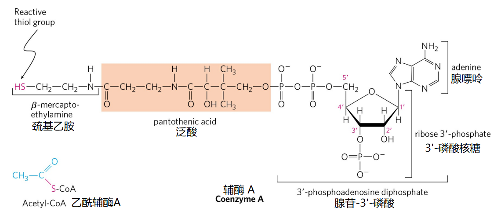

# 代谢中常见的有机反应类型

## 酶的催化机制

+   酸碱催化
+   共价催化
+   金属离子催化
+   静电催化

酶催化反应的实现, 通常是经过反应部位的接近和取向的效应, 形成过渡态而发生的.

## 共价键的断裂方式

有机化学反应常涉及共价键的断裂.

+ 共价键断裂时, 若两个电子分开, 称作均裂断裂, 产生不稳定基团, 常见于氧化还原反应. 
+ 若两个电子不分开,称作异裂断裂, 如 $C-H$ 键断裂,电子对通常留在碳原子一侧(碳原子的电负性大于氢原子), 形成碳负离子和氢离子, 富电子的碳负 离子为亲核基团, 容易与缺电子的亲电基团发生反应.
+ 若有氢负离子的受体存在, $C-H$ 键断 裂时电子有可能留在氢原子一侧形成碳正离子和氢负离子, 缺电子的亲电基团容易与富电子的碳负离子(为亲核基团) 发生反应.

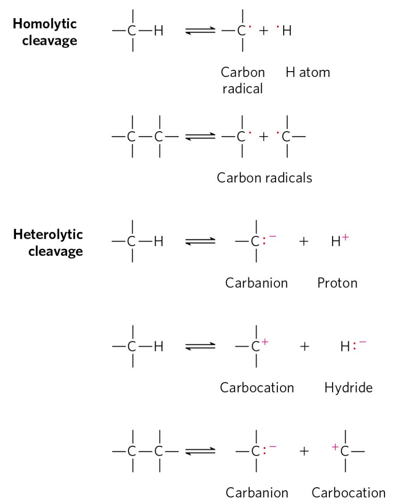

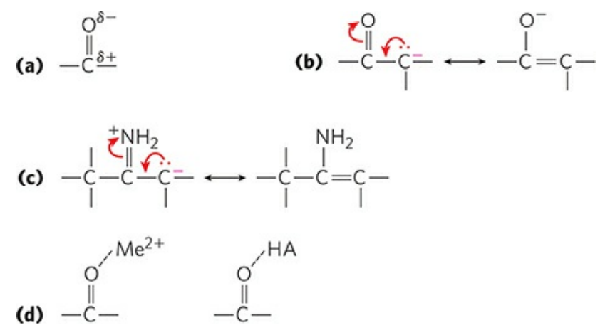

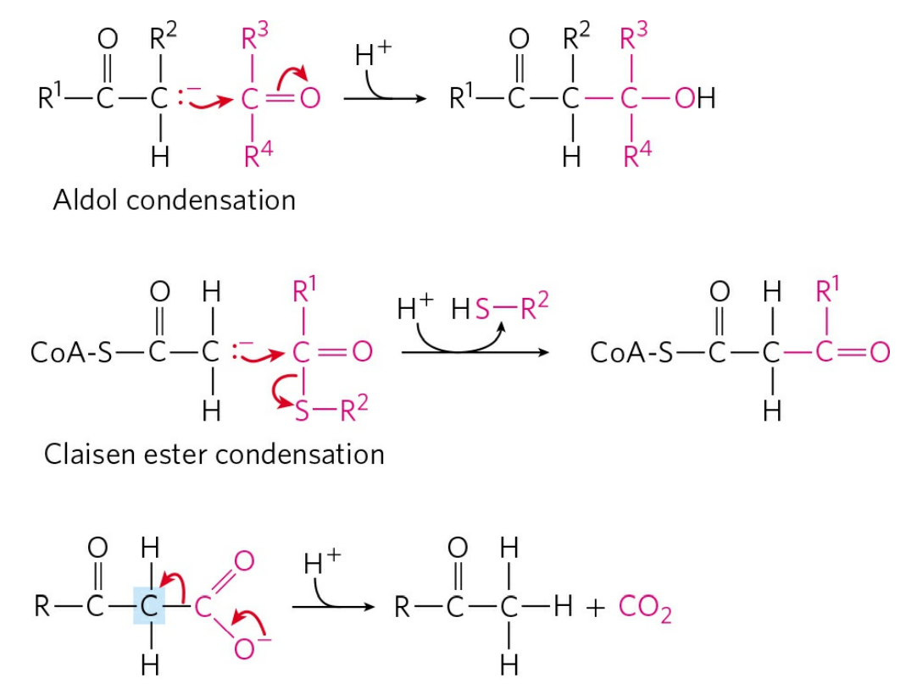

## 生物化学中的反应类型

+   氧化还原反应
+   基团转移反应
+   消除, 异构化和重拍反应
+   $C-C$ 键的形成或断裂反应

### 基团转移反应 (group-transfer reaction)

在生物化学反应中, 通常为亲电基团从一个亲核体转移到另一个亲核体, 常见的转移基团有酰基, 磷酰基和葡萄糖基等.

#### 磷酰基转移 Phosphoryl Group Transfers and ATP

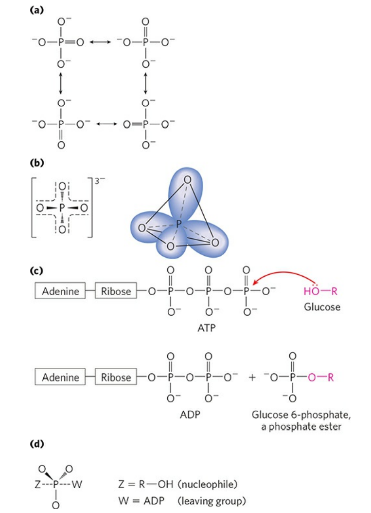

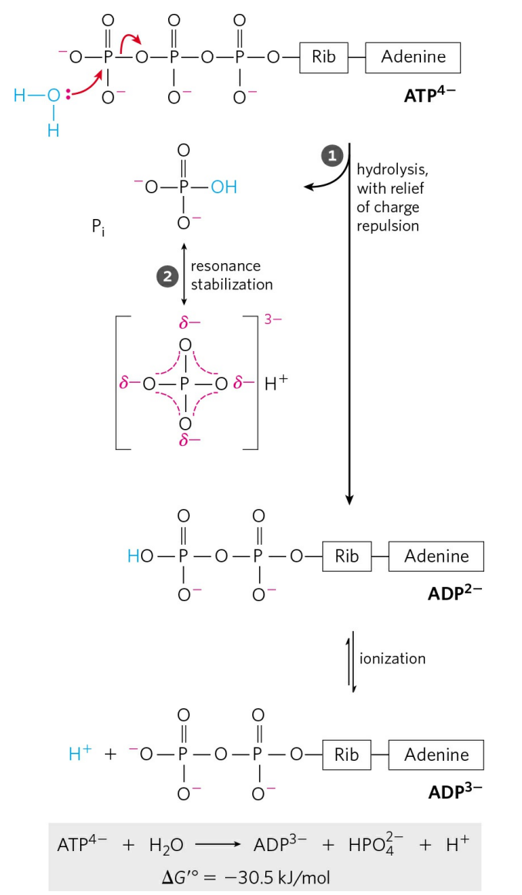

#### 生物氧化还原反应 Biological Oxidation-Reduction Reactions

氧化反应和还原反应的实质是电子的得失, 在生物化学反应中十分普遍, 从代谢物转移的电子, 通过一系列的传递体转移到氧, 并伴随能量的释放.

#### 消除反应 Elimination

+   反式消除 (trans elimination)

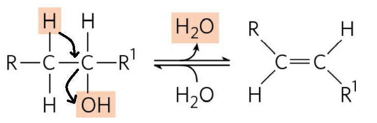

+   顺式消除 (cis elimination)  :star:

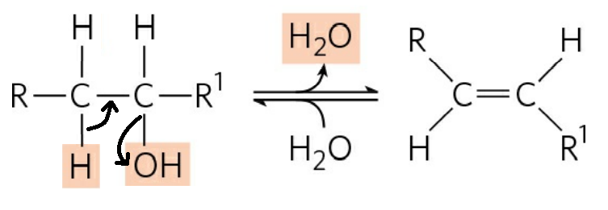

#### 异构化作用

在生物化学中, 常见的异构化反应是双键移位. 如酮糖-醛糖互变.

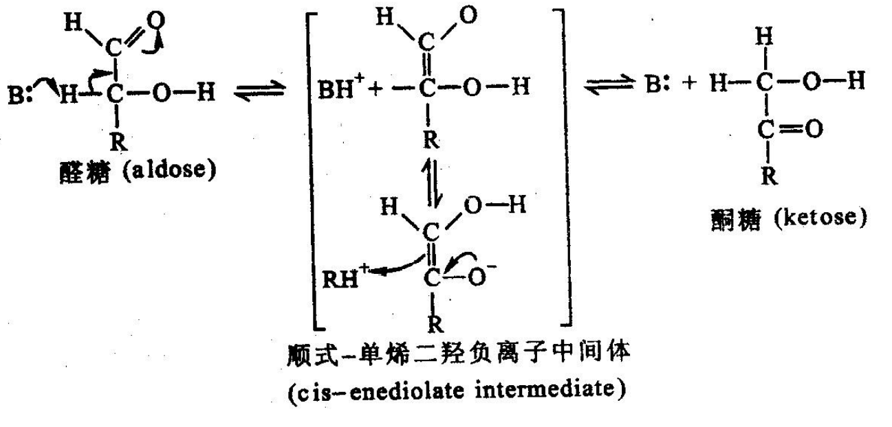

#### 分子重排反应

重排反应伴随碳-碳键的断裂和重新生成, 使碳骨架发生变化.

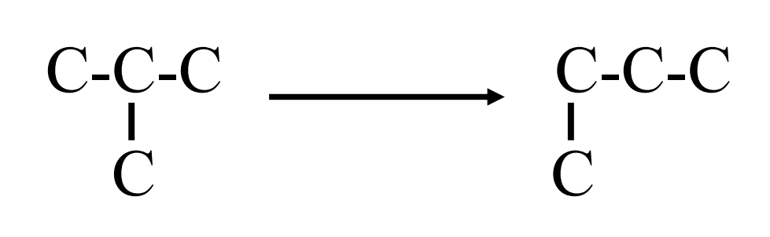

#### $C-C$ 的形成与断裂反应

+   分解代谢和合成代谢以碳-碳键的形成与断裂为基础, 常见的有
    +   羟醛缩合反应和羟醛裂解反应 
        +   例: 果糖$-1,6-$二磷酸 裂解为 二羟丙酮磷酸 和 甘油醛$-3-$磷酸
    +   克莱森酯缩合反应 
        +   例: 柠檬酸合酶催化的反应
    +   $\beta-$酮酸的氧化脱羧反应 
        +   例: 异柠檬酸的氧化脱羧

# 代谢分析方法 Metabolic methodology

+   Enzyme inhibitor 酶抑制剂
+   Metabolic deficiency mutant 代谢缺陷突变体
+   Isotope tracing 同位素示踪
+   Manometric method 气体测量法
+   Nuclear magnetic resonance (NMR) 
+   Metabolomics (代谢组学)及多学科综合研究

## Enzyme inhibitor 酶抑制剂

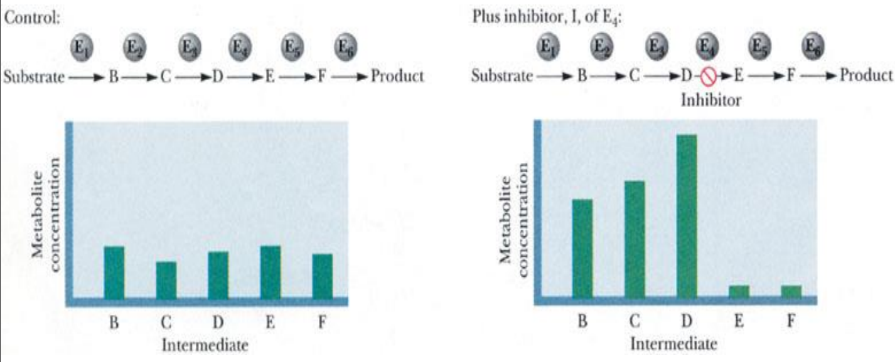

## Metabolic deficiency mutant 代谢缺陷突变体

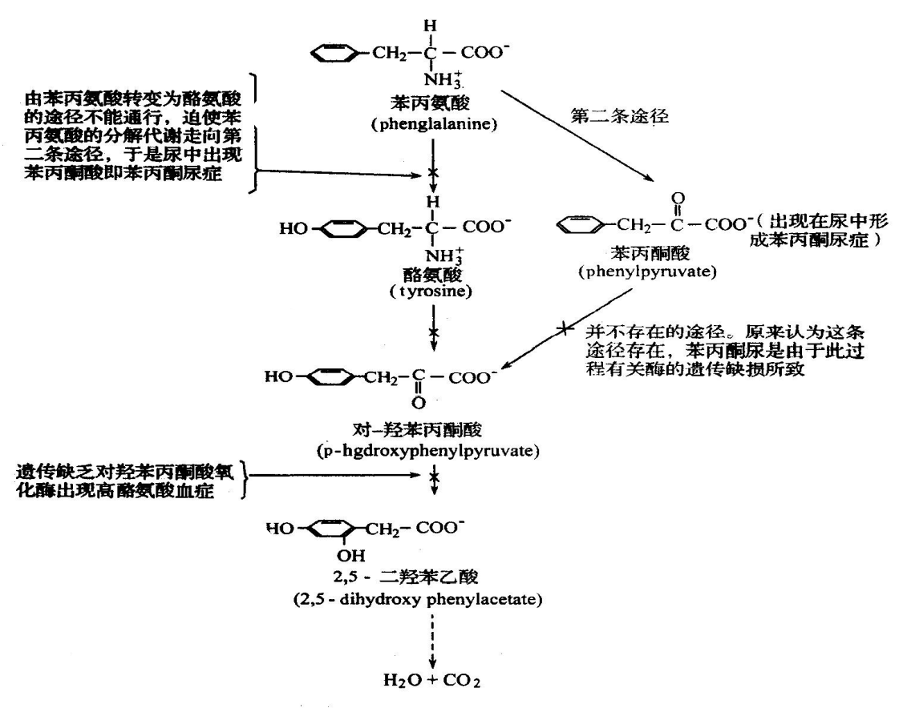

微生物的营养缺陷型可以分为若干种亚 型,每种亚型由一种酶的缺陷造成,对比研 究可以搞清代谢途径。如途径$A\bar\omega$ $B\bar\omega$ $C\bar\omega$  $D\bar\omega$ 中 $B\bar\omega$ $C\bar\omega$ 的酶缺失,则 A 和 B 会堆积, $C\bar\omega~D$ 的酶缺失,则 A, B和 C 会堆积.

## Isotope tracing 同位素示踪

用 $^{14}C$ 标记 $CO_2$, 培养绿藻, 提取液进行双向纸层析, 放射自显影, 发现放射性最早出现在 $3-$磷酸甘油酸(PGA), 后出现在其他中间物.

## Nuclear magnetic resonance (NMR)

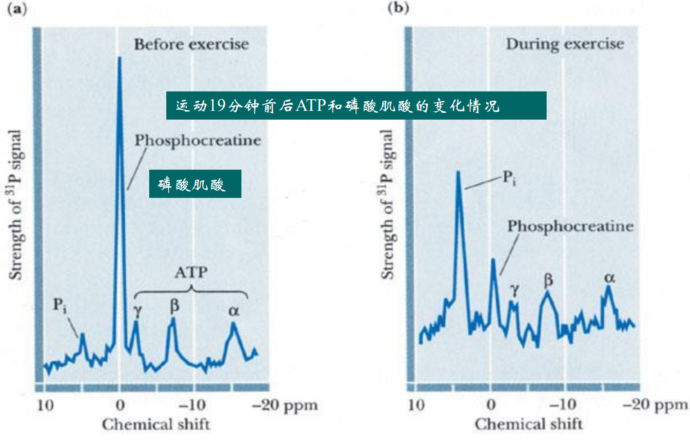
