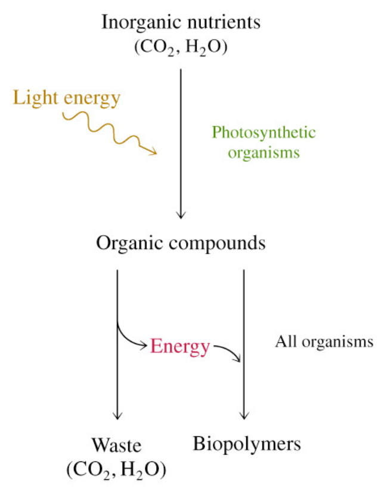

# 热力学定律 (The laws of thermodynamics)

## 1st Law of  Thermodynamics

+   Energy is conserved. e.g. it can  neither be created or destroyed. 

+   The total energy of a system  and surroundings is constant. 

---

>   If the First Law of Thermodynamics is true, how  can biological processes be carried out?
>
>   Although energy cannot be created or  destroyed, it can take on different forms, such  as heat or chemical energy. Thus, the energy  can be stored as chemical bond energy, which  can be used to do work. 

## 2nd Law of  Thermodynamics

Entropy tends to increase

Entropy= The level of randomness or disorder in a system

>   Entropy in a local area can be decreased, but only at  the expense of increased entropy in the larger area, or  universe.

