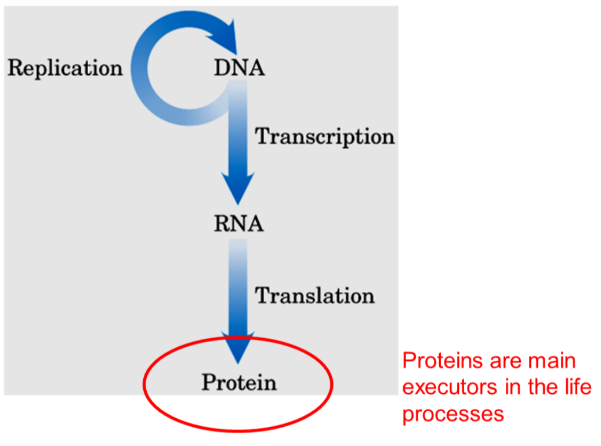
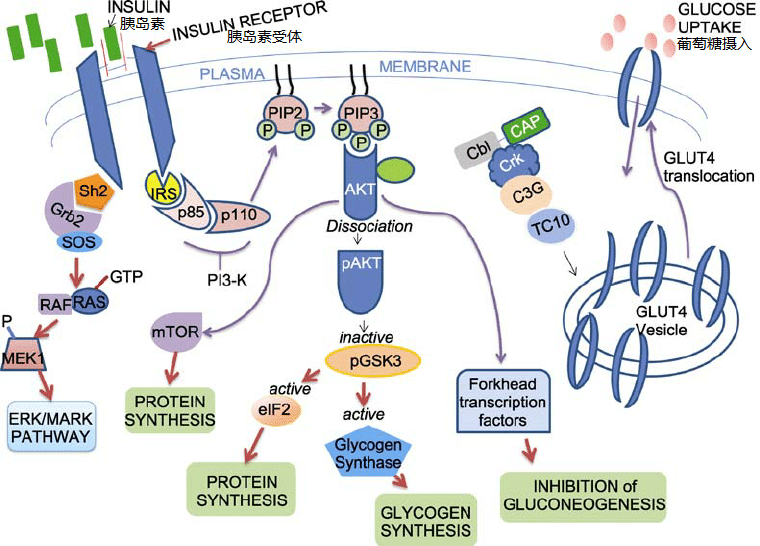
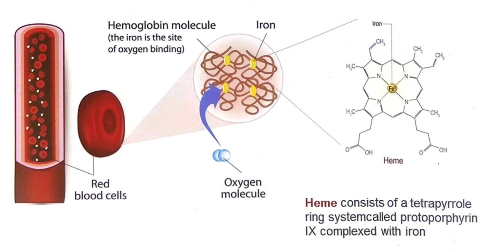
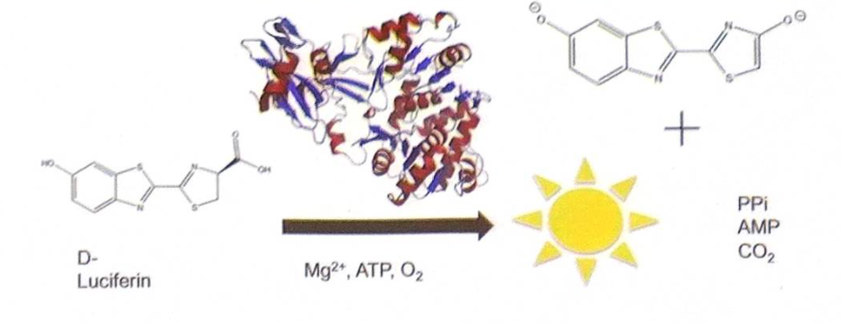
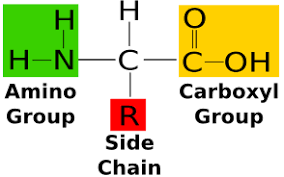
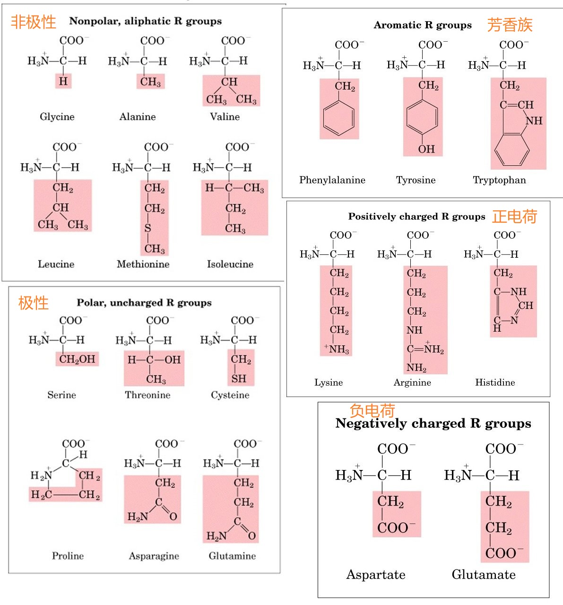

> 中心法则

# 激素蛋白 Hormonal Proteins

+ Insulin 胰岛素是一种重要的激素 控制体内葡萄糖水平

# 转运蛋白 Transport Proteins

+ Hemoglobin 血红蛋白
    + 
    + 红细胞中携带氧气($or \ CO_2$)的蛋白
+ Immunoglobulins 免疫球蛋白
    + $a.k.a.$抗体 Antibodies
    + 特异性识别并与抗原分子结合
+ Ferritins 铁蛋白
  + 重要的储铁蛋白

# 酶 Enzyme
+ Luciferase 荧光素酶
    + 
    + 氧化荧光素,副产物为光
+ GFP Green fluorescent peotein

# 收缩蛋白

Actin肌动蛋白 & Myosin 肌球蛋白

# 结构蛋白
+ Collagen 胶原蛋白 & Elastin 弹力蛋白
    + 结缔组织的纤维成分
+ Keratin 角蛋白

# 受体蛋白 Rrceptor Proteins

+ G protein-coupled receptors   GPCRs   G蛋白偶联受体
    + 鸟苷酸结合蛋白

# 氨基酸 Amino Acids

+   蛋白质的基本单元,通过肽键(peptide bond)连接
+   自然界中有约300中氨基酸,只有20中出现在蛋白质中

## 基本结构

### Configuration构型 : Enantiomer对映体

主要是L型

## 分类

通过R基分类

### 非极性脂[肪]族氨基酸

+ 甘氨酸 Glycine
+ 丙氨酸 Alanine
+ 脯氨酸 Proline 
    + 五元环 刚性构象 无法旋转 一般出现在二级结构相邻的位置
+ 缬氨酸 Valine
+ 亮氨酸 Leucine
+ 异亮氨酸 Isoleucine
+ 甲硫氨酸 Methionine
    + 甲基供体 甲基化修饰

> 侧链是中性烷基
> 就从`Gly`到`Ile`疏水性增加
> 一般位于蛋白质分子内部

### 酸性氨基酸

+ Aspartate
+ Glutamate

### 碱性氨基酸
+ Lysine
+ Arginine 碱性最强的氨基酸  胍基
+ Histidine 咪唑

> + Lys侧链氨基pKa是10.53，生理条件下带一个正电荷；侧链有4个C，柔性大，氨基的反应活性大
> + Arg是碱性最强的氨基酸，pKa是12.48，生理条件下完全质子化
> + His的咪唑基pKa

### 芳香族氨基酸
相对非极性（疏水）
+ 苯丙氨酸 Phenylalanine
+ 酪氨酸 Tyrosine
+ 色氨酸 Tryptophan

#### 光吸收性
$Lambert-Beer$

#### 共轭$\pi$电子体系

### 极性不带电氨基酸
水中更易溶
+ Serine
+ Threonine
+ Cysteine 侧链是巯基 巯基具有氧化还原性 二硫键的生成与断开是可逆的
+ Asparagine
+ Glutamine

> + Ser的羟基是极性集团，易形成氢键，频繁出现在酶的活性中心
> + Thr的羟基是仲醇，具有亲水性，形成氢键的能力较弱
> + Cys含巯基，2个Cys形成二硫键，利于稳定蛋白质结构

催化三联体