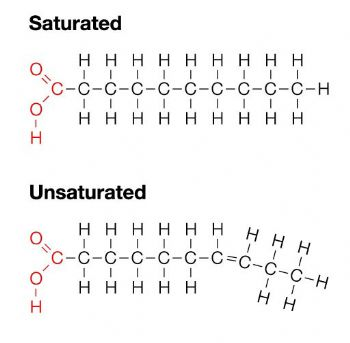
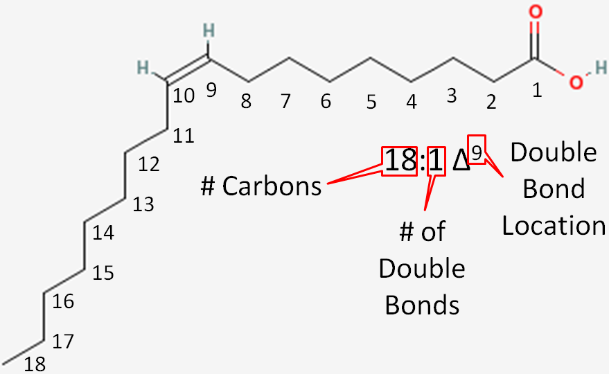
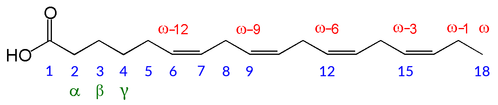
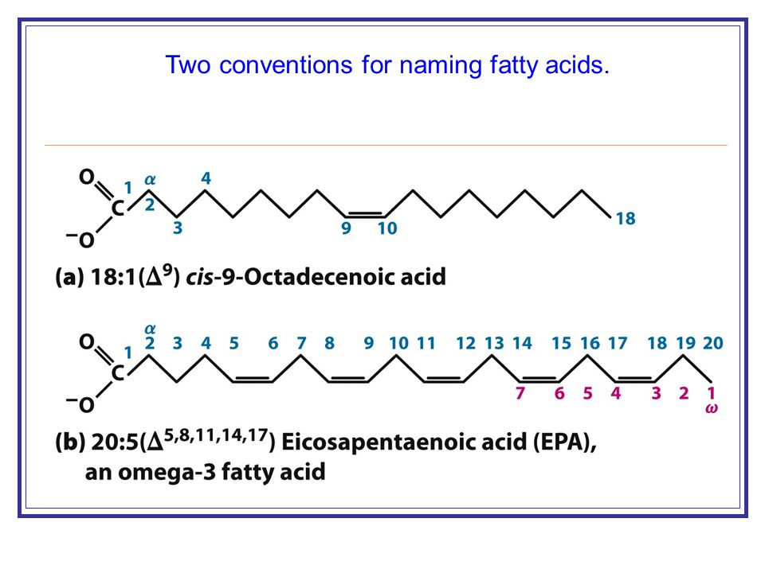
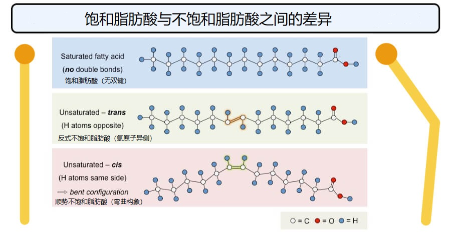
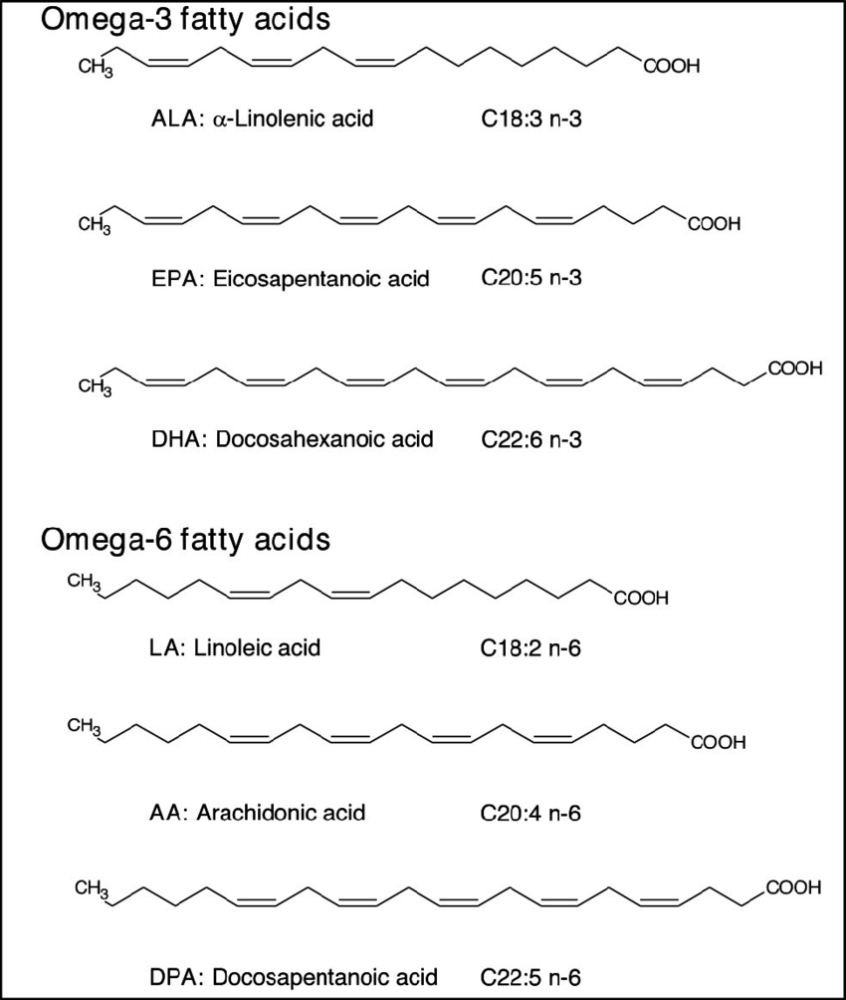
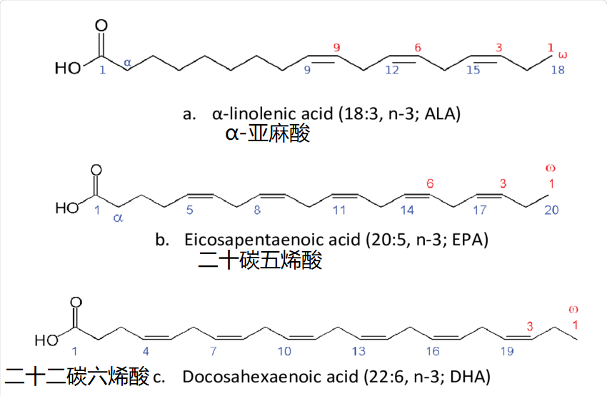
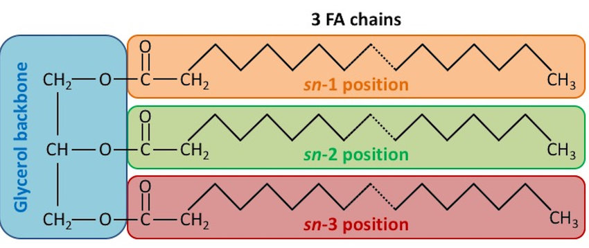
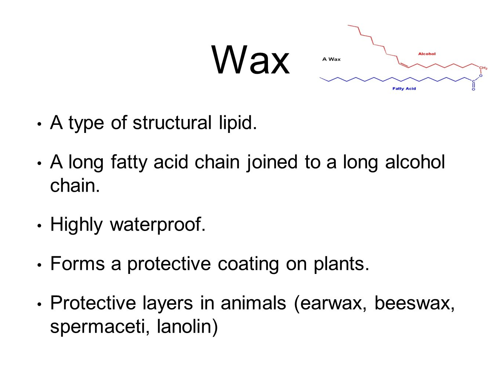

# 定义

含多重官能团的化合物，特点是疏水
脂肪酸与醇(主要是丙三醇)缩合形成脂质

脂质能够通过有机溶剂提取

# 功能

+ 储存能量
+ 膜结构
+ 保护器官
+ 产生激素
+ 信号分子

## 贮存脂质

贮存脂质主要包含脂(fats)，油(oils)，蜡(wax)

脂由脂肪酸和丙三醇形成

### 脂肪酸 Fatty Acid

脂肪酸是含有4~36个碳

饱和脂肪酸
	
不饱和脂肪酸
	单不饱和
	多不饱和

$\omega \& \Delta$
十八碳二烯酸 表示方法
$\omega$,$\Delta$表示编号方向

碳链长度：12-24个碳之间

顺反异构$\longleftrightarrow$光敏感
视黄醇(VA)
视黄醛
$\beta-$胡萝卜素

GPCR

#### 物理性质
头部亲水
尾部疏水

#### 必须脂肪酸
人或动物无法自身合成

主要来源：植物
DHA二十二碳六烯酸Docosahexaenoic acid

Omega-3
Omega-6

> 碳链增长  2个碳

人类能通过ALA合成EPA,DHA

## 三酰甘油 Tricylglycerols

人体脂肪最重要的组成成分

### 主要作用
#### 储存能量

动物：adipose tissue

植物：子叶

#### 保温

## 蜡 Wax

## 结构脂质
bilayer

### 甘油磷脂 Glycerophospholipids
#### 结构
命名： 磷脂酰(phosphatiyl-) P387
> 不同环境条件下，膜组分变化

#### 降解磷脂的酶 Phospholipases

### 半乳糖脂 Galctolipids  硫脂 Sulfolipids

###  鞘脂 Sphingolipids
#### 神经酰胺 Ceramides

鞘磷脂 Sphingomyelins 鞘糖脂 Glycosphingolipids
> 鞘糖脂决定血型

### 固醇 Sterols

脂蛋白
# 分类

