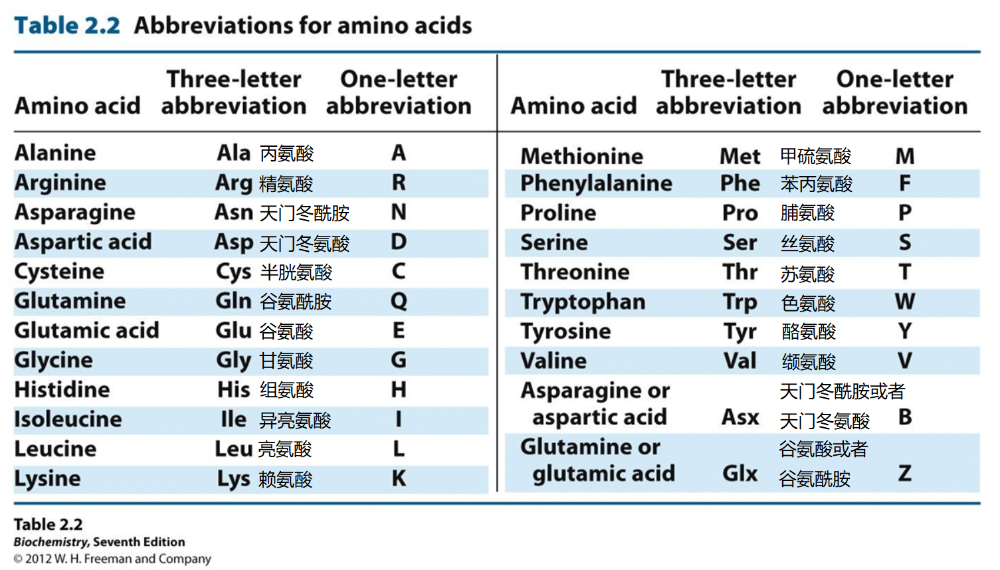

# Table of Content
[toc]

# 01 糖类与糖生物学

## 名词解释

### Biomolecule

生物分子, 生命体中的有机分子或生命活动的产物. 有 蛋白质, 核酸, 糖类, 脂类 以及它们的单体亚基这些有机分子. 

### Configuration

构象, 一个分子所采取的特定形态. 有时看作是空间结构的同义词. 它不需要共价键的断裂即可发生构象的转变.

### Hydrogen Bond

氢键, 接近裸露的氢核遇到另一个电负性大的原子产生的静电吸引. 

### Chrial Carbon Atom*

手性碳原子, 指具有 4 个不同取代基团的四面体碳原子.

### Anomers*

异头物, 一个确定的单糖由开链变成环状结构时, 羰基碳原子称为新的手性中心, 导致羰基差向异构化, 产生两个额外的立体异构体: $\alpha$ 和 $\beta$, 这种羰基碳形成的差向异构体称为异头物. 

>   

### Fehling's Test

### Glycosidic Bond

糖苷键, 一个糖半缩醛羟基与另一个分子(例如 醇, 糖, 嘌呤或嘧啶)的 羟基, 胺基 或 巯基 之间缩合形成的缩醛或缩酮键, 常见的糖醛键有 $O-$糖苷键和 $N-$糖苷键.

### Starch

淀粉, 一类多糖, 是葡萄糖残基的同聚物. 有两种形式的淀粉: 一种是直链淀粉, 是没有分支的, 只是通过 $\alpha-(1-4)$ 糖苷键的葡萄糖残基的聚合物; 另一类是支链淀粉, 是含有分支的, $\alpha-(1-4)$ 糖苷键连接的葡萄糖残基的聚合物, 支链在分支处通过 $\alpha-(1-6)$ 糖苷键与主链相连.

### Cellulose

### Glycoconjugate

塘缀合物, 糖与 蛋白质, 脂质 等生物分子以共价键结合形成的化合物. 

## 简答题

+   **维持生物大分子的力有哪些, 各有何特点?**
    +   离子相互作用
        +   带电基团之间的静电相互作用, 同性相斥异性相吸, 对环境敏感.

    +   氢键
        +   接近裸露的氢核遇到另一个电负性大的原子产生的静电吸引, 具有高度方向性, 而产生特异的结构. 

    +   范德华力
        +   包括三种较弱的经典相互作用, 有加和效应, 而作用力总和客观.

    +   疏水相互作用
        +   在介质中的疏水分子或分子基团倾向于聚集在一起的情况, 它对维持分子的三维结构有重要作用. 

+   **简述 $Monosaccharide$ 的结构特点与化学性质的特点**
+   **例举三种 $Polysaccharides$ 的主要作用及其主要区别**

# 02 脂质

## 名词解释

### Lipids

脂质, 是脂肪酸和醇形成的酯及其衍生物, 不溶于水而高溶于非极性溶剂. 

### Cholesterol

### Polyunsaturated Fatty Acid

甘油磷脂每一个可以水解的键在溶酶体中都有一种专一性的水解的酶. 这些酶叫做磷脂酶.

### Critical Micelle Concentration

临界微团浓度, 作为可溶性脂的去垢剂, 当浓度增加到临界微团浓度时, 在水中倾向形成微团, 亲水部分朝外, 疏水部分聚集在中心.

### Fluid Mosaic Model

流动镶嵌模型, 该模型认为: 膜式蛋白质和磷脂组成的动态结构; 脂双层式一种流体基质, 实质上是蛋白质的二维溶剂. 脂双层的每层中脂质分子的非极性尾部面向双层片的核心, 极性头基面向外侧, 跟每侧的水介质相互作用, 蛋白质埋在双层片中, 借脂质和蛋白质的疏水结构域之间的疏水相互作用维系在一起.

### $18:3(\Delta^{9,12,15})$

### Phospholipases

磷脂酶, 专一水解甘油磷脂的酯键和磷酸二酯键.

### Low-density Lipoprotein

低密度脂蛋白, 是从极低密度脂蛋白(VLDL) 残留物(IDL) 中进一步除去三酰甘油产生的, 富含胆固醇和胆固醇酯, 是血液中总胆固醇的主要载体.

>   极低密度脂蛋白(VLDL): 在肝细胞的 $ER$ 中形成, 其功能是从肝转运内源的三酰甘油(肝所需之外的多余部分)和在肝包装的胆固醇到肌肉和脂肪等靶组织.
>
>   高密度脂蛋白(HDL): 是以称为新生 HDL 的前体形式在肝和小肠中合成的, 含蛋白质, 磷脂和胆固醇, 但无胆固醇酯.

### Fluorescence Recovery after Photobleaching*

光漂白荧光恢复法, 研究膜流动性的一种方法. 首先用荧光物质标记膜蛋白或膜脂, 然后用激光束照射细胞表面某一区域, 使被照射区域的荧光淬灭变暗形成一个漂白斑. 由于膜的流动性, 漂白斑周围的荧光物质随着膜蛋白或膜脂的流动逐渐将漂白斑覆盖, 使淬灭区域的亮度逐渐增加, 最后恢复到与周围的荧光光强度相等.

## 简答题

+   阐述 $Triacylglycerol$, $Glycerophospholipid$, $Sphingolipid $三种脂质结构上的区别, 并就每种脂列举 2 种功能, 或相关的生化事件. 
+   简述 $Membrane~Protein$ 的结构和功能特点. 

# 03 氨基酸, 肽和蛋白质

## 名词解释

### Amino Acids

### Disulfide Bond

二硫键, ：两个巯基氧化形成二硫键, 通常在两个半胱氨酸之间形成, 它在蛋白质的三维结构的形成上有着重要作用. 

### pI

等电点, 氨基酸处于净电荷为 0 时的特征 pH

### Peptide Bond

由一分子氨基酸的羧基和另一分子氨基酸的氨基脱水缩合而成的结构. 

### Dihedral Angles

### lon-exchange Chromatography

### Ramachandran Plot

拉氏构象图, 根据蛋白质中非共价键合原子间的最小接触距离, 确定了哪些二面角 ($\Phi,\Psi$) 所确定的两个相邻肽单位的构象是允许的, 哪些是不允许的, 并且以 $\Phi$ 为横坐标, 以 $\Psi$ 为纵坐标在坐标图上标出, 该坐标图称拉氏构象图(简化版: 以二面角的 $\Phi$ 和 $\Psi$ 为横纵坐标, 将其所确定的而且被实际所允许的构象在坐标图上标出的坐标图。

## 简答题

+   **写出酸性氨基酸, 碱性氨基酸, 方向性氨基酸的英文名称, 三字母缩写, 单字母缩写, 化学结构式.** 
    +   
    +   

+   **简述 $\alpha-helix$, $\beta-conformaiton$, $\beta-turn$ 二级结构的特点.** 
    +   $\alpha-helix$
        +   螺旋的 $C_\alpha$ 具有相同的二面角, 右手螺旋
        +   每圈 3.6 个氨基酸, 高度 $0.54 nm$
        +   每个氨基酸绕轴旋转 $100\degree$, 沿轴上升 $0.15nm$
        +   氨基酸侧链向外
        +   相邻螺圈间形成氢键, 取向与中心轴平行
        +   $C=O$ 氧与它后面的第 4 个残基的 $N-H$ 氢

    +   $\beta-sheet$
        +   $2-3$ 个残基也可以形成，成对出现
        +   可以序列不连续，但空间靠近
        +   主链仍能以氢键形式参与其他相互作用
        +   $\beta$ strand也可以是分子间的

    +   $ \beta-turn$
        +   2-3个残基也可以形成，成对出现
        +   可以序列不连续，但空间靠近
        +   主链仍能以氢键形式参与其他相互作用
        +   $\beta$ strand也可以是分子间的

+   **结构决定功能, 请谈谈你是如何理解肌红蛋白和血红蛋白功能上的差别的.** 

# 04 酶学

## 名词解释

### Enzyme

酶, 酶是加快化学反应速度的生物催化剂, 大多数酶是蛋白质, 还有一些 RNA 也是酶.

### Coenzyme

辅酶, 是一类可以将化学基团从一个酶转移到另一个酶上的有机小分子, 与酶较为松散地结合, 对于特定酶的活性发挥是必要的. 

### Prosthetic Group

辅基. 辅基是与酶紧密或共价结合的有机分子或金属铁, 以辅助化学反应, 辅基与酶蛋白的结合不能通过透析或超滤的方法除去, 在酶促反应中, 辅基不能离开酶蛋白.

### Multienzyme Complex

多酶复合体, 是由非共价催化代谢途径的两个或多个顺序步骤的酶组成的离散而稳定的结构.

### Enzyme Activity

酶活力, 是以每分钟转化(或形成)底物的微摩尔数表示的酶催化反应速率的单位来测量的. 酶活性$=$单位时间内转化底物的摩尔数$=$速率$×$反应体积.

### Specific Activity

比活力, 为每毫克蛋白质所具有的酶活力单位数, 一般用酶活力单位$/mg $ 蛋白质表示. 酶的比活力在酶学研究中用来衡量酶的纯度, 对于同一种酶来说, 比活力越大, 酶的纯度越高. 利用比活力的大小可以用来比较酶制剂中单位质量蛋白质的催化能力, 是表示酶的纯度高低的一个重要指标.

### Ribozyme

核酶, 即核糖核酸酶, 是一种 RNA 分子, 能够进行特定的生化反应, 类似于蛋白质酶的作用. 核酶具有较稳定的空间结构, 不易受到 RNA 酶的攻击.核酶在切断 mRNA 后, 又可从杂交链上解脱下来, 重新结合和切割其它的 mRNA 分子.

### Abzyme

抗体酶, 常被称为催化抗体, 是一种具有催化活性的单克隆抗体.

### Enzyme Kinetics

酶动力学, 是研究酶结合底物能力和催化反应速率的科学. 它能提出底物到产物之间可能历程与机理, 获取反应速率和影响此速率的诸因素, 以满足酶反应过程开发和生物反应器设计的需要.

### $K_m$

米氏常数, 是酶促反应达最大速度($V_m$)一半时的底物($S$)的浓度. 它是酶的一个特征性物理量, 其大小与酶的性质有关.

### $K_{cat}$

催化常数, 是在底物浓度处于饱和状态下, 一个酶 (或一个酶活性部位) 催化一个反应有多快的测量. 催化常数等于最大反应速度除以总的酶浓度 ($\large\frac{V_{max}}{[E]_{total}}$), 或者是每摩尔酶活性部位每秒钟转化为产物的底物的摩尔数.

### Suicide Inactivators

自杀性抑制剂, 是一类特殊的不可逆抑制剂, 它们劫持了正常的酶反应机制, 使酶失活.

### Noncompetitive Inhibition

非竞争性抑制, 是指有些抑制物往往与酶的非活性部位相结合, 形成抑制物一酶的络合物后会进一步再与底物结合; 或是酶与底物结合成底物$-$酶络合物后, 其中有部分再与抑制物结合. 虽然 底物, 抑制物和酶 的结合无竞争性, 但两者与酶结合所形成的中间络合物不能直接生成产物, 导致了酶催化反应速率的降低.

### Synergistic Effects

协同效应, 是两个或多个过程相互作用产生的效果大于这些过程单独使用时产生的累积效果的结果. 大多数酶结合几种催化策略来提高反应速率.

### the Catalytic Triad

催化三联体, 通常指在水解酶和转移酶的活性位点中心同时作用的三个氨基酸残基. 用于共价催化的亲核残基一般是 酸$-$碱$-$亲核三联体. 残基会形成一个电荷中继网络, 以极化和活化亲核试剂, 来攻击底物形成共价中间体, 然后中间体水解, 再生出游离的酶.

### Restriction Enzymes

限制性内切酶, 是可以识别并附着特定的核苷酸序列, 并对每条链中特定部位的两个脱氧核糖核苷酸之间的磷酸二酯键进行切割的一类酶. 根据限制酶的结构, 辅因子的需求切位与作用方式, 可将限制酶分为三种类型, 分别是 $Type ~I, ~~Type ~II, ~~Type ~III$.

### Hexokinase

己糖激酶, 是一种转移酶, 专一性不强, 受 葡萄糖$-6-$磷酸 和 ADP 的抑制, $K_m$ 小, 亲和性强, 可以针对多种六碳糖进行作用.

### lysozyme

溶菌酶, 是一种能水解细菌中黏多糖的碱性酶. 溶菌酶主要通过破坏细胞壁中的 $N-$乙酰胞壁酸和 $N-$乙酰氨基葡萄糖之间的 $\beta-1,4$ 糖苷键, 使细胞壁不溶性黏多糖分解成可溶性糖肽, 导致细胞壁破裂内容物逸出而使细菌溶解.

### Allosteric Regulation

别构调节. 酶分子的非催化部位与某些化合物可逆地非共价结合后发生构象的改变, 进而改变酶活性状态,称为酶的别构调节.

### Isoenzymes

同工酶, 广义指生物体内催化相同反应而分子结构不同的酶. 狭义指因编码基因不同而产生的多种分子结构的酶称为同工酶. 最典型的同工酶是乳酸脱氢酶(LDH).

## 简答题

+   **酶有哪些一般特性? 普通催化剂和酶有什么相似性?**
    +   酶最显著的两个特征是高效性和对底物的专一性, 酶反应所需条件温和, 但酶本身容易失活, 且有些催化过程需要辅因子的参与.
    +   催化剂和酶反应都是通过降低活化能来提高化学反应的速率, 且正向和反向反应的速率都增加, 但对反应的平衡常数没有影响. 两者与底物的结合都是暂时性的.
+   **请简述酶的分离纯化策略.** 
    +   
+   **简述影响酶催化反应速率的因素.** 
    1.   底物浓度: 底物浓度较低时, 反应速率随底物浓度增加而加快, 但当底物浓度达到一定限度时, 反应速率达到最大值后将不再改变. 
    2.   酶浓度: 在无其他因素干扰时, 酶促反应速率与酶浓度成正比.
    3.   温度: 在一定温度范围内, 反应速率随温度的升高而加快, 每一种酶都有其最适温度.
    4.   pH: 每一种酶只在一定限度的 pH 范围内才表现出活性.
    5.   抑制剂和激活剂.
+   **为什么酶的催化能力高于非酶催化剂?**
    1.   邻近和定向效应: 邻近效应是指酶与底物结合形成中间复合物后, 使底物和底物之间, 酶的催化基团与底物之间结合于同一分子而使有效浓度得以极大地升高, 从而使反应速率大大增加;定向效应则是指反应物的反应基团之间和酶的催化基团与底物的反应基团之间的正确取位产生的效应.
    2.   底物形变和诱导契合: 底物的结合导致底物和酶的扭曲, 使化学反应更容易. 酶与过渡态结构的结合比底物更紧密. 
    3.   协同效应: 大多数酶结合几种催化策略来提高反应速率.
    4.   活性部位的微环境: 酶活性位点内部的微环境通常与水溶液中的外部环境有很大的不同. 非极性环境中两个带电基团之间的静电相互作用比极性环境中高. 疏水微环境有利于酶的作用.
+   **简述不同丝氨酸蛋白酶的底物特征.** 
    +   胰凝乳蛋白酶更喜欢一种芳香族侧链上的残留羰基碳原子是肽键的一部分; 胰蛋白酶更喜欢带正电的赖氨酸或 Arg 残留在这个位置弹性蛋白酶更喜欢小疏水性氨基酸.

---

+   **简述酶的活性中心组成和特征.** 

+   **简述酶具有高效性的成因.** 

+   **用稳态理论推导米氏方程, 描述 $K_m,K_{cat},\large\frac{K_{cat}}{K_m}$ 等常数意义.** 

    +   定义酶的总浓度 $\left[E_{t}\right]$
        $$
        \left[E_{t}\right]=[E]+[E S]
        $$
        $E S$ 的生成速率为
        $$
        k_{1}[E][S]=k_{1}\left(\left[E_{t}\right]-[E S]\right)[S]
        $$
        $ES$ 的分解速率为
        $$
        k_{-1}[E S]+k_{2}[E S]
        $$
        根据稳态假说, 当反应处于稳态时,  $E S$ 的生成与分解速率相等, 即
        $$
        k_{1}\left(\left[E_{t}\right]-[E S]\right)[S]=k_{-1}[E S]+k_{2}[E S]
        $$
        移项后, 得到关于 $[E S]$ 的方程
        $$
        [E S]=\frac{k_{1}\left[E_{t}\right][S]}{k_{1}[S]+k_{-1}+k_{2}}
        $$
        右边的分式分子分母同时除以 $k_{1}$, 可得
        $$
        [E S]=\frac{\left[E_{t}\right][S]}{[S]+\frac{k_{-1}+k_{2}}{k_{1}}}
        $$
        此时将 $\large\frac{k_{-1}+k_{2}}{k_{1}}$ 定义为米氏常数(Michaelis constant, $\mathrm{K}_{\mathrm{m}}$ ), 因此方程可写为
        $$
        [E S]=\frac{\left[E_{t}\right][S]}{K_{m}+[S]}
        $$
        产物的生成速率取决于 $[ES]$, 即
        $$
        v=k_{2}[E S]
        $$
        所以原方程又可以改写为
        $$
        v=\frac{k_{2}\left[E_{t}\right][S]}{K_{m}+[S]}
        $$
        当酶分子达到饱和, 所有酶分子都结合上底物, 即 $\left[E_{t}\right]=[E S]$ 时, 反应速率达到最大 
        此时最大反应速率 $V_{\max }=k_{2}\left[E_{t}\right]$. 所以原方程又可写为
        $$
        v=\frac{V_{\max }[S]}{K_{m}+[S]}
        $$

+   **影响酶促反应动力学速率因素有哪些**

# 05 核酸

## 名词解释

### Nucleotides

核苷酸, 是一类由嘌呤碱或嘧啶碱, 核糖或脱氧核糖以及磷酸三种物质组成的化合物, 核苷酸主要参与构成核酸. 

### Deoxyribonucleic Acid

脱氧核糖核酸(DNA), DNA 携带有合成 RNA 和蛋白质所必需的遗传信息,是生物体发育和正常运作必不可少的生物大分子. DNA 由脱氧核苷酸组成, 脱氧核苷酸则由碱基, 脱氧核糖和磷酸构成, 其中碱基包括腺嘌呤(A), 鸟嘌呤(G), 胸腺嘧啶(T)和胞嘧啶(C).

### Ribonucleic Acid

核糖核酸(RNA), 存在于生物细胞以及部分 病毒, 类病毒 中的遗传信息载体. RNA 是由核糖核苷酸经磷酸二酯键缩合而成的长链状分子. 一个核糖核苷酸分子由 磷酸, 核糖, 碱基 构成. RNA 的碱基主要有 A (腺嘌呤), G (鸟嘌呤), C (胞嘧啶), U (尿嘧啶), 其中, U 取代了 DNA 中的 T. 核糖核酸在体内的作用主要是引导蛋白质的合成. 

### Adenosine Triphosphate

腺嘌呤核苷三磷酸(ATP), 是由 腺嘌呤, 核糖和 3 个磷酸基团 连接而成, 水解时释放出能量较多, 是生物体内最直接的能量来源. 

### Adenylate Cyclase

腺苷酸环化酶, 是膜整合蛋白, 能够将 $ATP$ 转变成 $cAMP$, 引起细胞的信号应答, 是 $G$ 蛋白偶联系统中的效应物. 腺苷酸环化酶广泛分布于哺乳动物的细胞膜中. 

### Watson-Crick Model

1953 年提出的 DNA 双螺旋结构模型. 两条多聚核苷酸 链相互反平行盘绕成直径为 $2~nm$ 的双螺旋，互补碱基对 $A-T$, $G-C$ 由氢键联结位于螺旋内部, 其平面垂直于螺旋轴, 两相邻平面间距为 $0.34~nm$；每 $10$ 个碱基对构成一段完整的右螺旋结构. 

### Palindromes Sequence

回文序列, 指的是双链 DNA 或 RNA 分子中的特定的核苷酸片段, 该片段在其中一条链上按 $5'$ 到 $3'$ 读取的序列与其互补链上按相同的 $5'$ 到 $3'$ 读取的序列一致. 回文序列广泛存在于各种生物体基因组中, 主要和转录终止有关, 也是限制性内切酶酶切位点, 还参与 DNA 复制等生命活动.

### Triple-stranded DNA

DNA 三股螺旋, 通常发生在 DNA 复制, 重组和转录 的起始位点或调节位点.

### DNA Supercoiling

DNA 超螺旋, 由于双螺旋 DNA 的弯曲, 正超螺旋或负超螺旋而造成的 DNA 分子的进一步扭曲所形成的 DNA 的三级结构. 有两种: 当 DNA 分子沿轴扭转的方向与通常双螺旋的方向相反时, 造成双螺旋的欠旋而形成负超螺旋; 方向相同时则形成正超螺旋. 生物体内一般以负超螺旋结构存在.

### Nucleosome

核小体, 核小体是染色质的基本结构单位, 由 DNA 和 $H1, H2A, H2B,H3$ 和 $H4$ 等 $5$ 种组蛋白构成. 两分子的 $H2A, H2B, H3$ 和 $H4$ 形成一个组蛋白八聚体, 约 $200~bp$ 的 DNA 分子盘绕在组蛋白八聚体构成的核心结构外面 $1.75$ 圈形成了一个核小体的核心颗粒.

### Topoisomerases

拓扑异构酶, 是存在于细胞核内的一类酶, 他们能够催化 DNA 链的断裂和结合, 从而控制 DNA 的拓扑状态, 拓扑异构酶参与了超螺旋结构模板的调节. 

### Messenger RNAs

mRNAs, 信使 RNA, 是由 DNA 的一条链作为模板转录而来的, 携带遗传信息能指导蛋白质合成的一类单链核糖核酸. mRNA 虽然只占细胞总 RNA 的 $2\%\sim5\%$, 但种类最多, 并且代谢十分活跃, 是半衰期最短的一种 RNA, 合成后数分钟至数小时即被分解.

### Transfer RNAs

转移 RNA, 是一种由 $76-90$ 个核苷酸所组成的 RNA, 其 $3'$ 端可以在 氨酰$-tRNA$ 合成酶催化之下, 接附特定种类的氨基酸. 转译的过程中, tRNA 可借由自身的反密码子识别 mRNA 上的密码子, 将该密码子对应的氨基酸转运至核糖体合成中的多肽链上. 

### Ribosomal RNAs

rRNAs, 核糖体 RNA, 是细胞内含量最多的一类 RNA, 也是相对分子质量最大的一类 RNA, 它与蛋白质结合而形成核糖体, 其功能是在 mRNA 的指导下将氨基酸合成为肽链. 

### Monocistronic

单顺反子, 真核生物基因转录产物, 在一条 mRNA 中只含有一个翻译起始点和一个终止点, 编码一个基因片段.

### Glycosidic Bonds

糖苷键, 是指特定类型的化学键, 糖的半缩醛型与醇反应形成的共价键称为糖苷键. 糖苷键连接糖苷分子中的非糖部分(即苷元)与糖基, 或者糖基与糖基. 糖苷键容易被酸水解, 但不易被碱裂解.

### Nucleases

核酸酶, 能够将聚核苷酸链的磷酸二酯键切断的酶. 核酸酶属于水解酶, 作用于磷酸二酯键的 $P-O$ 位置. 核酸酶是在核酸分解的第一步中作用于水解核苷酸之间的磷酸二酯键的一种核酸.

### Restriction Endonuclease

限制性内切酶, 是可以识别并附着特定的核苷酸序列, 并对每条链中特定部位的两个脱氧核糖核苷酸之间的磷酸二酯键进行切割的一类酶. 根据 限制酶的结构, 辅因子的需求切位与作用方式, 可将限制酶分为三种类型, 分别是 $Type ~I, ~Type ~II, ~Type ~III$.

### Hypochromic Effect

减色效应, 若变性 DNA 复性形成双螺旋结构后, 其 $260~nm$ 紫外吸收会降低, 这种现象叫减色效应.

### $T_m$ 值

## 简答题

+   简述 DNA 螺旋的三种主要类型及相关特征. 
    +   DNA 可以根据其化学微环境(如离子强度和相对湿度) 恢复不同的形态, 其中 b 型(沃森-克里克结构) , a 型和 z 型是最主要的三种类型. 它们的相关特征如下表所示. 
        
+   简述拓扑异构酶 $I$ 和 $II$ 功能上的区别. 
    +   $I$ 型拓扑异构酶只破坏一条 DNA 链, 它的功能不需要 $ATP$, 主要负责放松由于过度缠绕或缠绕不足而产生的 DNA 双螺旋结构的压力.
    +   $II $ 型拓扑异构酶破坏 DNA 的两条链, 它的活动需要 $ATP$, 能够将环状 DNA 的连接数改变 $\pm2$. 
+   简述成熟的真核 mRNA 的加工方式. 
    +   $5'$ 端加帽: $5'$ 帽(RNA $7-$甲基鸟苷帽 或 RNA $m7G$ 帽)就是一个经修饰的鸟嘌呤核苷酸, 在转录开始不久后就被添加到新产生的真核 mRNA 的「前」即 $5'$ 末端. $5'$ 帽由末端 $7-$甲基鸟苷残基组成, 它通过 $5'-5'-$三磷酸键与第一转录出的核苷酸连接. 它的存在对于核糖体的识别和对 mRNA 的保护至关重要.
    +   $3'$ 端加尾: 是指聚腺苷酰基部分与 mRNA 分子的共价连接. 在真核生物中, 大多数 mRNA 分子在 $3'$ 末端被多聚腺苷酸化. Poly A 尾巴和与其结合的蛋白质有助于保护 mRNA 免于被核酸外切酶降解. $3'$ 端加尾对于转录终止, 从细胞核输出 mRNA 和翻译也很重要.  原核生物中的 mRNA 也常被 $3'$ 端加尾,但此时的 poly(A) 尾巴促进而不是防止核酸外切酶对 mRNA 的降解.
+   简述两种核酸分子杂交实验原理及作用. 
    +   Southern Blotting: Southern 印迹杂交是进行基因组 DNA 特定序列定位的通用方法. 其基本原理是, 具有一定同源性的两条核酸单链在一定的条件下, 可按碱基互补的原则特异性地杂交形成双链. 一般利用琼脂糖凝胶电泳分离经限制性内切酶消化的 DNA 片段, 将胶上的 DNA 变性并在原位将单链 DNA 片段转移至尼龙膜或其他固相支持物上, 经干烤或者紫外线照射固定, 再与相对应结构的标记探针进行杂交, 用放射自显影或酶反应显色, 从而检测特定 DNA 分子的含量. 
    +   Northern Blotting: Northern 杂交是利用 DNA 可以与 RNA 进行分子杂交来检测特异性 RNA 的技术, 首先将 RNA 混合物按它们的大小和分子量通过琼脂糖凝胶电泳进行分离, 分离出来的 RNA 转至尼龙膜或硝酸纤维素膜上, 再与放射性标记的探针杂交, 通过杂交结果可以对表达量进行定性或定量. Northern 杂交技术应用于特定性状基因在 mRNA 水平上的动态表达研究. 
+   简述三种分离核酸的凝胶电泳方式. 
    +   根据分子的电荷和长度, 有以下三种分离核酸的电泳方式
        +   琼脂糖凝胶电泳, 脉冲电场凝胶电泳(PFGE), 聚丙烯酰氨凝胶电泳(PAGE).
    +   琼脂糖凝胶电泳: 一种按大小分离 DNA 或 RNA 分子的方法, 这是通过用电场移动带负电荷的核酸分子通过琼脂糖基质来实现的, 孔径是通过调节凝胶中琼脂糖的浓度来确定的(通常为 $0.4-4\%$), 短分子比长分子迁移得远. 
    +   脉冲电场凝胶电泳(PFGE): 与传统琼脂糖凝胶电泳相比, PFGE 允许分离更大的 DNA 片段. 在传统凝胶中, 电流是单向施加的(从上到下). 但在 PFGE 中, 电流的方向是按一定的间隔改变的. 
    +   聚丙烯酰氨凝胶电泳(PAGE): 是以聚丙烯酰胺凝胶作为支持介质的一种常用电泳技术, 用于分离蛋白质和寡核苷酸. 在 DNA 的非变性聚丙烯酰胺凝胶电泳中, DNA 呈双链状态泳动, 其迁移率会受碱基组成和序列的影响. 

