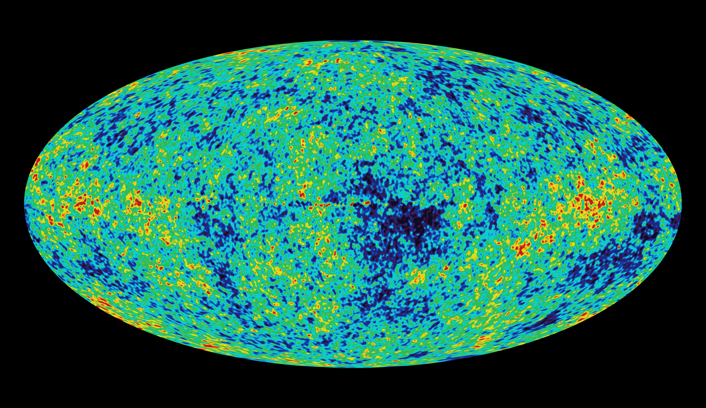

> 第 12 组  张子栋 梁国相 邱一埕 孙启政

---

# 历史

+ 1925 年 AT&T 收购西方电子(Western Electric), 共同成立贝尔电话实验室公司
+ 1984 年 按照美国政府分拆 AT&T 协议, 分割出 Bellcore
+ 1996 年 贝尔实验室脱离 AT&T, 成为朗讯科技(Lucent)
+ 2006 年 朗讯与阿尔卡特(Alcatel) 合并为阿尔卡特-朗讯(Alcatel-Lucent), 贝尔实验室归属阿尔卡特-朗讯
+ 2016 年 诺基亚(NOKIA) 完成对阿尔卡特-朗讯的收购, 贝尔实验室更为现名

---
layout: cover
---

# 成就
---
layout: image-side
image: slides.assets/WMAP_image_of_the_CMB_anisotropy.jpg
---
# 1933 年 

##### 卡尔·央斯基

发现银河中心持续发射无线电波 创建射电天文学

> 利用无线电技术测得宇宙微波背景辐射资料转换成的图像

---
layout: image-side
image: slides.assets/Replica-of-first-transistor.jpg
---
# 1947 年 
##### 约翰·巴丁	威廉·肖克利	华特·布拉顿
+ 发明晶体管(半导体三极管)
+ 1956 年获诺贝尔物理学奖

---

# 1948 年 
##### 克劳德·香农

+ 发表论文《通信的数学原理》, 奠定现代通信理论的基础

 

$$
\begin{array}{c}
\Huge H(X)=-\sum p_i\log p_i
\end{array}
$$

 

+ 信息用于消除不确定性

---
layout: image-side
image: slides.assets/118037-76.jpg
---

# 1958 年 

##### 查尔斯·汤斯 阿瑟·肖洛

+ 激光
+ 获得 1964 年和 1981 年的诺贝尔物理学奖

---

# 1964 年 
##### 阿诺·彭齐亚斯	罗伯特·威尔逊

+ 发现宇宙微波背景辐射 获得 1978 年诺贝尔物理学奖

---

# 1969 年

##### 乔治·埃尔伍德·史密斯	威拉德·博伊尔

+ 发明电荷耦合组件 获得 2009 年诺贝尔物理学奖
+ CCD 用于条码读取器、摄影机、扫描仪、复印机

 

##### 肯·汤普逊	丹尼斯·里奇

+ UNIX 操作系统

 

##### 丹尼斯·里奇 肯·汤普逊

+ C 语言
  + 1983 年 比雅尼·斯特劳斯特鲁普为扩展 C 语言而开发出 C++ 语言

<!-- CCD 在老式相机中使用的很多，现在的相机都是用索尼的 CMOS -->

---
layout: image-side
image: slides.assets/maxresdefault.jpg
---

# 1987 年

##### 亚瑟·阿什金
+ 光镊效应
+ 2018 年诺贝尔物理学奖

---
layout: image-side
image: slides.assets/nobel_prize.jpg
---

# 奖项
 

+ 获得 9 次诺贝尔奖
+ 获得 5 次图灵奖

 

---
layout: cover
---
# Thanks
> reference: https://en.wikipedia.org/wiki/Bell_Labs
