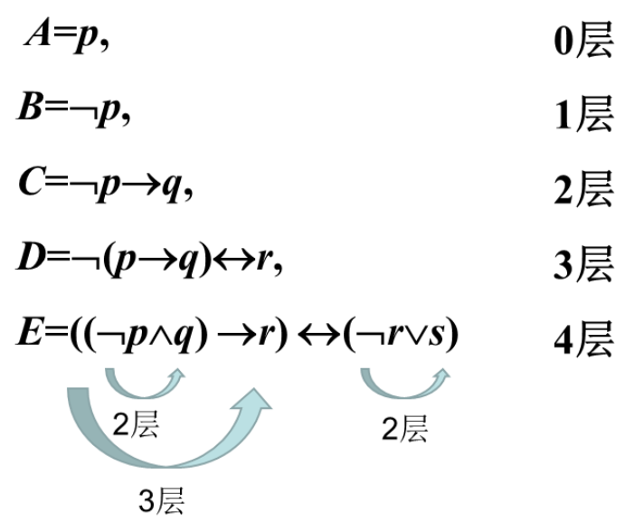

# 命题变项与合式公式
## 命题变项
> 命题常项或命题常元
> 命题变项或命题变元：取值为1或0的变元（不是命题）
>
> 常项与变项均用 $p,q,r,\cdots p_i,q_i,r_i\cdots$ 等表示 $p\to q$ 中, $p$ , $q$ 代表具体的命题,是命题常项;
> $p $, $q$ 也可以代表不确定的命题,成为命题变相.
> 就像 $x+y=0$ 中, $x$ , $y$ 为变量一样.

常项与变项
+ 常数与代数

$p\to q$

## 合式公式
将命题变项用**联结词**和**圆括号**按照一定的逻辑关系联结起来的符号串称为**合式公式**

### 合式公式的递归定义
+ 单个命题变项和命题常项是合式公式，称作原子命题公式
+ 若 $A$ 是合式公式，则 $(\urcorner A)$ 也是
+ 若 $A,B$ 是合式公式，则$(A\wedge B),(A\vee B),(A\to B),(A\leftrightarrow B)$也是
+ 只有有限次地应用以上三种形成的符号串才是合式公式

#### 几点说明

##### 对象语言

描述研究对象的语言，某个具体的公式

##### 元语言

描述对象语言的语言，表示任意的合式公式

##### 外层括号可以省去

$(\urcorner A),(A\wedge B)$单独出现时,括号可以去掉为 $\urcorner A,A\wedge B$

##### 下列不是公式

$pq\to r,\quad p\to(r\to q$

## 合式公式的层次

+   若公式 $A$ 是单个命题变项,则称 $A$ 为 $0$ 层公式.
+   称 $A$ 是 $n+1(n\geq 0)$ 层公式是指下面情况之一
    1.   $A=\urcorner B$, $B$ 是 $n$ 层公式
    2.   $A=B\wedge C$,其中 $B,C$ 分别为 $i$ 层和 $j$ 层公式,且 $n=\mathrm{max}(i,j)$
    3.   $A=B\vee C$,其中 $B,C$ 的层次及 $n$ 同($2.$)
    4.   $A=B\to C$,其中 $B,C$ 的层次及 $n$ 同($2.$)
    5.   $A=B\leftrightarrow C$,其中 $B,C$ 的层次及 $n$ 同($2.$)

+   若公式 $A$ 的层次为 $k$ ,则称 $A$ 为 $k$ 层公式.

## 公式赋值

设 $p_1,p_2,\cdots,p_n$ 是出现在公式 $A$ 中的全部命题变项，给 $p_1,p_2,\cdots,p_n$ 各指定一个真值，称为对 $A$ 的一个赋值或解释，若使 $A$ 为 $1$，则称这组值为 $A$ 的成真赋值；若使$A$为$0$，则称这组值为$A$的成假赋值
若$A=(p\to q)\to r,$赋值为$110$（命题变项的顺序为字母的字典顺序），$p=1,q=1,r=0$

### 几点说明

1.   $A$ 中仅出现 $p_1,p_2,\cdots,p_n,$ 给 $A$ 赋值 $\alpha=\alpha_1\alpha_2\cdots\alpha_n$ 是指$p_1=\alpha_1,p_2=\alpha_2,\cdots,p_n=\alpha_n,\alpha_i=0$ 或 $1,\alpha_i$ 之间不加标点符号

2.   $A$ 中仅出现 $p,q,r,\cdots,$给 $A$ 赋值 $\alpha_1\alpha_2\alpha_3\cdots$ 是指 $p=\alpha_1, q=\alpha_2, r=\alpha_3\cdots$

3.   含 $n$ 个命题变项的公式有 $2^n$ 个赋值.

     >   如公式$\urcorner(p\to q)\leftrightarrow r$
     >   $000,010,101,110$ 是的成真赋值, $001,011,100,111$ 是成假赋值.

## 真值表

将命题公式 $A$ 在所有赋值下取值的情况列成表，称作 $A$ 的真值表

### 构造真值表的步骤

+ 找出公式中所含的全部命题变项$p_1,p_2,\cdots,p_n$（若无下角标，则按字母顺序排列），列出$2^n$个全部赋值，从$00\cdots0$开始，按二进制加法，每次加$1$，直到$11\cdots1$为止
+ 按从低到高的顺序写出公式的各个层次
+ 对每个赋值依次计算各层次的真值，直到最后计算出公式的真值为止

## 公式类型

+ 若 $A$ 在它的任何赋值下均为真，则称 $A$ 为重言式或永真式
+ 若 $A$ 在它的任何赋值下均为假，则称 $A$ 为矛盾式或永假式
+ 若 $A$ 不是矛盾式，则称 $A$ 是可满足式

>   +   可满足式:至少存在一个成真赋值
>   +   重言式是可满足式,但反之不真

## 真值表的用途

+ 求出公式的全部成真赋值与成假赋值
+ 判断公式的类型
    + 若真值表最后一列全为1,则为重言式
    + 若真值表最后一列全为0,则为矛盾式
    + 若真值表最后一列至少存在一个1,则为可满足式

 

