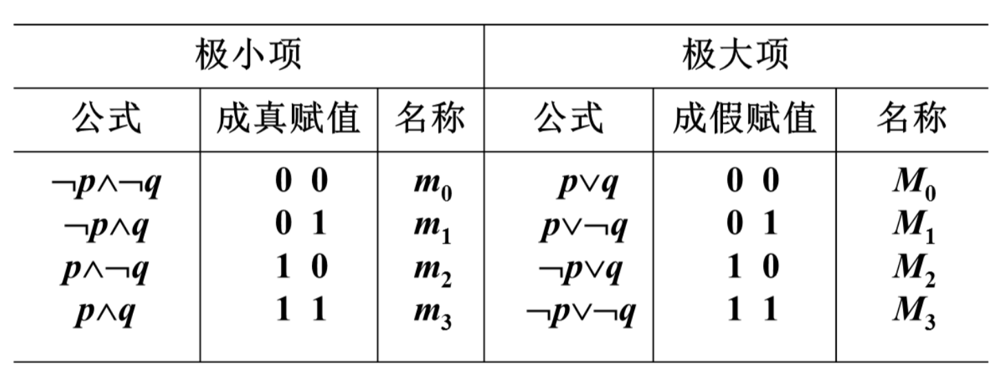
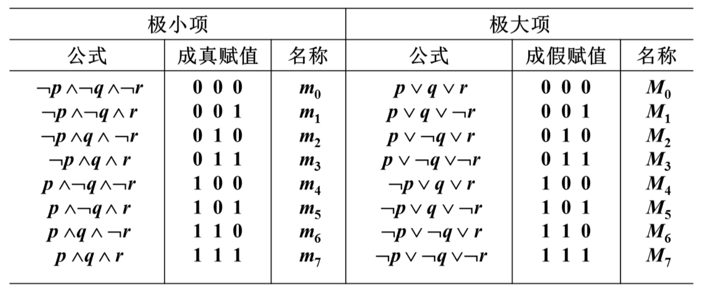

[TOC]

# 析取范式与合取范式

### 文字

命题变项及其否定的总称

### 简单析取式

有限个文字构成的析取式
### 简单合取式
有限个文字构成的合取式
+ 一个简单析取式是重言式当且仅当它同时含某个命题变项 $p$ 及它的否定式 $\urcorner p$
+ 一个简单合取式是矛盾式当且仅当它同时含某个命题变项 $p$ 及它的否定式 $\urcorner p$

### 析取范式

由有限个简单合取式组成的析取式

### 合取范式

由有限个简单析取式组成的合取式

### 范式

析取范式与合取范式的总称

> 单个文字既是简单析取式,又是简单合取式
>
> 形如 $ p \wedge \neg {q} \wedge {r}, \neg {p} \vee {q} \vee \neg {r}$ 的公式既是析取范式,又是合取范式 (只有一种联结词)

+   一个析取范式是矛盾式当且仅当它的每个简单合取式都是矛盾式
+   一个合取范式是重言式当且仅当它的每个简单析取式都是重言式
+   任何命题公式都存在与之等值的析取范式与合取范式

求公式A的范式的步骤

(1) 消去 $A$ 中的 $\rightarrow, \leftrightarrow$ (若存在）
$$
\begin{aligned}
&{A} \rightarrow {B} \Leftrightarrow \neg {A} \vee {B} \\
&{A} \leftrightarrow {B} \Leftrightarrow(\neg {A} \vee {B}) \wedge({A} \vee \neg {B})
\end{aligned}
$$
(2) 否定联结词 $\neg$ 的内移或消去
$$
\begin{aligned}
&\neg \neg {A} \Leftrightarrow {A} \\
&\neg({A} \vee {B}) \Leftrightarrow \neg {A} \wedge \neg {B} \\
&\neg({A} \wedge {B}) \Leftrightarrow \neg {A} \vee \neg {B}
\end{aligned}
$$
(3) 使用分配律
$$
{A} \vee({B} \wedge {C}) \Leftrightarrow({A} \vee {B}) \wedge({A} \vee {C}) \quad 求合取范式 \\{A} \wedge({B} \vee {C}) \Leftrightarrow({A} \wedge {B}) \vee({A} \wedge {C}) \quad 求析取范式
$$

---

例题

$(1)(p \rightarrow \neg q) \rightarrow r$
$\Leftrightarrow(\neg p \vee \neg q) \rightarrow r$
$\Leftrightarrow \neg(\neg {p} \vee \neg {q}) \vee {r}$
$\Leftrightarrow({p} \wedge {q}) \vee {r}\qquad$       析取范式
$\Leftrightarrow({p} \vee {r}) \wedge({q} \vee {r}) \quad$ 合取范式

---

## 极小项与极大项

在含有 $n$ 个命题变项的简单合取式(简单析取式)中,若每个命题变项均以文字的形式在其中出现且仅出现一次,而且第个文字出现在左起第 $i$ 位上 $(1\leq i\leq n)$ ,称这样的简单合取式(简单析取式)为极小项(极大项)

>   例如
>
>   $\neg {p} \wedge {q} \wedge {r} \quad$ 	  极小项
>
>   $\neg p \vee \neg q \vee \neg {r} \quad$ 极大项
>
>   $\neg {p} \wedge {p} \wedge {q}$ 		  不是极小项 

### 几点说明

1. ${n}$ 个命题变项有 $2^{n}$ 个极小项和 $2^{n}$ 个极大项
2. $2^{n}$ 个极小项（极大项）均互不等值
3. 每一个极小项只有一个成真赋值, 每一个极大项只有一 个成假赋值。
4. ${m}_{{i}}$ : 第 ${i}$ 个极小项   其中 $i$ 是该成真赋值的十进制表示 
    $M_{i}$ : 第 $i$ 个极大项   其中 $i$ 是该成假赋值的十进制表示

### 两个命题的极小项与极大项

### 三个命题的极小项与极大项

+   $m_{i} \text { 与 } M_{i} \text { 的关系: } \neg m_{i} \Leftrightarrow M_{i}, \quad \neg M_{i} \Leftrightarrow m_{i}$

## 主析取范式与主合取范式

### 主析取范式

由极小项构成的析取范式

### 主合取范式

由极大项构成的合取范式

例如, $n=3$, 命题变项为 $p, {q}, {r}$ 时
$(\neg {p} \wedge \neg {q} \wedge {r}) \vee(\neg {p} \wedge {q} \wedge {r}) \Leftrightarrow {m}_{1} \vee {m}_{3} \ \ \ \,\Longrightarrow$ 主析取范式
$({p} \vee {q} \vee \neg {r}) \wedge(\neg {p} \vee \neg {q} \vee \neg {r}) \Leftrightarrow {M}_{1} \wedge {M}_{7}\Longrightarrow$ 主合取范式

### 主范式的存在唯一定理

任何命题公式都存在与之等值的主析取范式和主合取范式,并且是唯一的.

### 求公式主析取范式的步骤

设公式 $A$ 含命题变项 $p_{1}, p_{2}, \ldots, p_{n}$

1.   求 ${A}$ 的析取范式 ${A}^{\prime}={B}_{1} \vee {B}_{{2}} \vee \ldots \vee {B}_{s}$, 其中 ${B}_{j}$ 是简单合取式 $j=1,2, \ldots, {s}$
2.   若某个 $B_{j}$ 既不含 $p_{i}$, 又不含 $\neg p_{i}$, 则将 $B_{j}$ 展开成
     ${B}_{j} \Leftrightarrow {B}_{j} \wedge\left({p}_{i} \vee \neg {p}_{i}\right) \Leftrightarrow\left({B}_{j} \wedge {p}_{i}\right) \vee\left({B}_{j} \wedge \neg {p}_{i}\right)$
     重复这个过程,直到所有简单合取式都是长度为 $n$ 的极小项为止
3.   消去重复出现的极小项, 即用 $m_{i}$ 代替 ${m}_{i} \vee {m}_{i}$
4.   将极小项按下标从小到大排列

### 求公式的主合取范式的步骤

设公式 $A$ 含命题变项 $p_{1}, p_{2}, \ldots, p_{n}$

1.   求 $A$ 的合取范式 $A^{\prime}=B_{1} \wedge B_{2} \wedge \ldots \wedge B_{s}$, 其中 $B_{j}$ 是简单析取式 $j=1,2, \ldots, s$
2.   若某个 ${B}_{j}$ 既不含 $p_{i}$, 又不含 $\neg p_{i}$, 则将 $B_{j}$ 展开成
     ${B}_{j} \Leftrightarrow {B}_{j} \vee\left({p}_{i} \wedge \neg p_{i}\right) \Leftrightarrow\left({B}_{j} \vee {p}_{i}\right) \wedge\left({B}_{j} \vee \neg {p}_{i}\right)$
     重复这个过程,直到所有简单析取式都是长度为 $n$ 的极大项为止
3.   消去重复出现的极大项, 即用 ${M}_{i}$ 代替 ${M}_{i} \wedge {M}_{{i}}$
4.   将极大项按下标从小到大排列

### 主范式的应用

1.   求公式的成真、成假赋值
     设公式 $A$ 含 $n$ 个命题变项, $A$ 的主析取范式有 $s$ 个极小项,则 $A$ 有 $s$ 个成真赋值,它们是极小项下标的二进制表示，其余 $2^n-S$ 个赋值都是成假赋值

