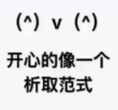
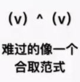

### 文字

命题变项及其否定的总称

### 简单析取式

有限个文字构成的析取式
### 简单合取式
有限个文字构成的合取式
+ 一个简单析取式是重言式当且仅当它同时含某个命题变项 $p$ 及它的否定式 $\urcorner p$
+ 一个简单合取式是矛盾式当且仅当它同时含某个命题变项 $p$ 及它的否定式 $\urcorner p$

### 析取范式

由有限个简单合取式组成的析取式

### 合取范式

由有限个简单析取式组成的合取式

### 范式

析取范式与合取范式的总称

> 单个文字既是简单析取式,又是简单合取式
>
> 形如 $ p \wedge \neg {q} \wedge {r}, \neg {p} \vee {q} \vee \neg {r}$ 的公式既是析取范式,又是合取范式

+   一个析取范式是矛盾式当且仅当它的每个简单合取式都是矛盾式
+   一个合取范式是重言式当且仅当它的每个简单析取式都是重言式
+   任何命题公式都存在与之等值的析取范式与合取范式

求公式A的范式的步骤

(1) 消去 $A$ 中的 $\rightarrow, \leftrightarrow$ (若存在）
$$
\begin{aligned}
&{A} \rightarrow {B} \Leftrightarrow \neg {A} \vee {B} \\
&{A} \leftrightarrow {B} \Leftrightarrow(\neg {A} \vee {B}) \wedge({A} \vee \neg {B})
\end{aligned}
$$
(2) 否定联结词 $\neg$ 的内移或消去
$$
\begin{aligned}
&\neg \neg {A} \Leftrightarrow {A} \\
&\neg({A} \vee {B}) \Leftrightarrow \neg {A} \wedge \neg {B} \\
&\neg({A} \wedge {B}) \Leftrightarrow \neg {A} \vee \neg {B}
\end{aligned}
$$
(3) 使用分配律
$$
{A} \vee({B} \wedge {C}) \Leftrightarrow({A} \vee {B}) \wedge({A} \vee {C}) \quad 求合取范式 \\{A} \wedge({B} \vee {C}) \Leftrightarrow({A} \wedge {B}) \vee({A} \wedge {C}) \quad 求析取范式
$$

