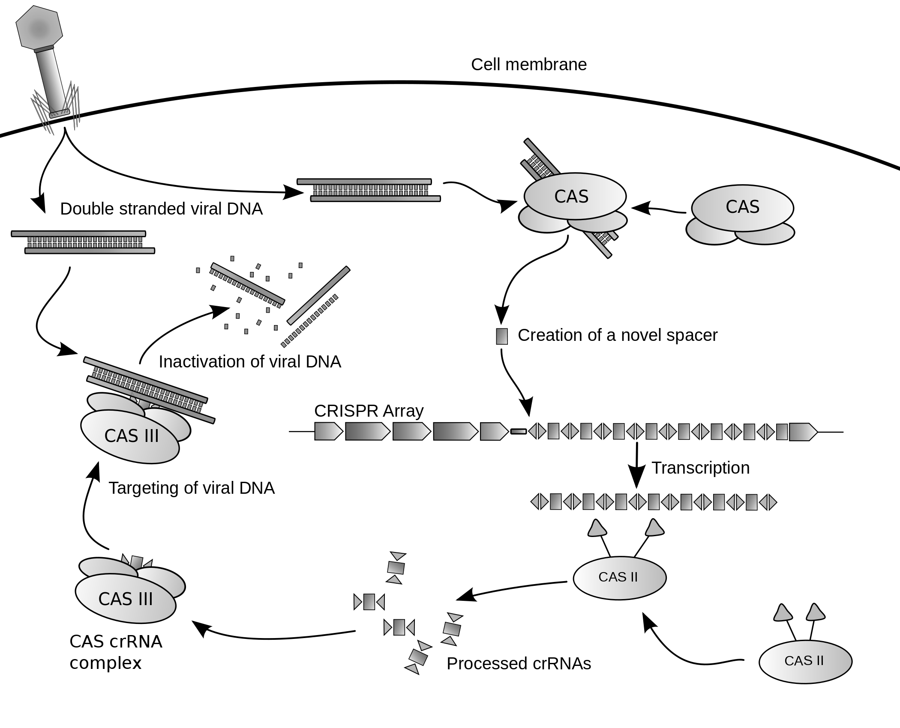
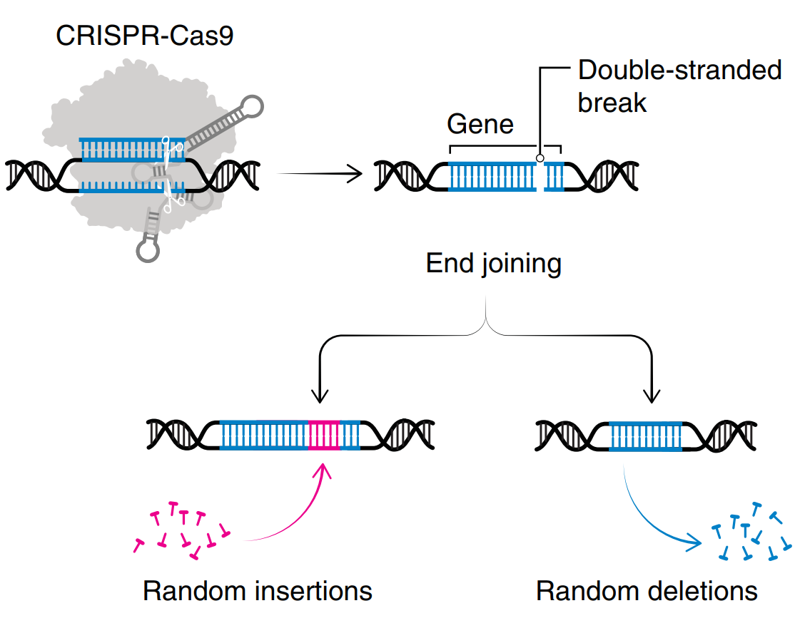

# CRISPR decade

<b>张子栋</b>

<b>目录</b>

[toc]

## CRISPR 原理

### 细菌/古菌中的免疫系统

​	CRISPR-Cas 系统是原核生物的一种天然免疫系统。某些细菌在遭到病毒入侵后，能够把病毒基因的一小段存储到自身的 DNA 里一个称为 CRISPR 的存储空间。当再次遇到病毒入侵时，细菌能够根据存写的片段识别病毒，将病毒的 DNA 切断而使之失效。

​	Cas 基因位于 CRISPR 基因附近或分散于基因组其他地方，该基因编码的蛋白均可与CRISPR序列区域共同发生作用。因此，该基因被命名为 CRISPR 关联基因（CRISPR associated，Cas）。被最为广泛应用的 CRISPR 系统是 II 型 CRISPR-Cas 系统，也就是 CRISPR-Cas9 系统。

### CRISPR 位点结构

​	CRISPR基因序列主要由前导序列（leader）、重复序列（repeat）和间隔序列（spacer）构成。此外还有 CRISPR 关联基因，该基因编码的蛋白均可与 CRISPR 序列区域共同发生作用。

1. 前导序列：富含 AT 碱基，位于 CRISPR 基因上游，被认为是 CRISPR 序列的启动子。
2. 重复序列：长度约 20–50 bp 碱基且包含 5–7 bp 回文序列，短而保守。转录产物可以形成发卡结构，稳定 RNA 的整体二级结构。
3. 间隔序列：是被细菌俘获的外源 DNA 序列。当这些外源遗传物质再次入侵时，CRISPR/Cas 系统就会予以精确打击。

### CRISPR-Cas9 作用原理

#### 外源 DNA 的俘获

1. Cas1 和 Cas2 编码的蛋白将扫描入侵的 DNA，并识别出 PAM 区域，然后将临近 PAM 的 DNA 序列作为候选的原型间隔序列。
   1. Cas1/2 识别的不是原间隔序列本身，而是处在原间隔序列下游的前间隔序列邻近基序（PAM），由于 PAM 序列在病毒 DNA 序列上，所以 CRISPR 系统不会切除细菌本身的 DNA.
   2. 前间隔序列邻近基序由 2-6 个碱基组成，对于 CRISPR-cas9 系统，PAM 序列通常为 $5’-NGG-3’$.
   3. Cas1 和 Cas2 蛋白是负责新间隔序列获得的核心蛋白，另外研究发现 Type II CRISPR/Cas 系统中 Csn2 蛋白对新的间隔序列的获取也也是必需的。
2. Cas1/2 蛋白复合物将原间隔序列从外源 DNA 中剪切下来，并在其他酶的协助下将原间隔序列插入临近 CRISPR 序列前导区的下游。
3. DNA 会进行修复，将打开的双链缺口闭合。一段新的间隔序列就被添加到了基因组的 CRISPR 序列之中。

#### CRISPR 基因座的表达

​	CRISPR 序列在前导区的调控下转录产生 pre-crRNA（crRNA 前体），同时与 pre-crRNA 序列互补的 tracrRNA（反式激活 crRNA）也被转录出来。pre-crRNA 通过碱基互补配对与 tracrRNA 形成双链 RNA 并与 Cas9 编码的蛋白组装成一个复合体。它将根据入侵者的类型，选取对应间隔序列 RNA，并在核糖核酸酶 III（RNase III）的协助下对其进行剪切，最终形成一段短小的 crRNA（包含单一种类的间隔序列RNA以及部分重复序列区）。

​	随后 crRNA，Cas9 以及 tracrRNA 组成最终的复合物，为下一步剪切做好准备。

#### CRISPR/Cas 系统的靶向干扰

​	crRNA，Cas9 以及 tracrRNA 组成最终的复合物将扫描整个外源 DNA 序列，并识别出与 crRNA 互补的原间隔序列。这时，复合物将定位到 PAM/原间隔序列的区域，DNA 双链被解开，形成 R-Loop。crRNA 将与互补链杂交，而另一条链则保持游离状态。

​	随后，Cas9 蛋白精确的平端切割位点位于 PAM 上游 3 个核苷酸位置，形成平末端产物。Cas9 蛋白的 HNH 结构域负责切割与 crRNA 互补配对的那一条DNA链，而 RuvC 结构域负责切割另外一条非互补 DNA 链。最终在 Cas9 的作用下 DNA 双链断裂（DSB），外源 DNA 的表达被沉默。

## CRISPR 技术的发展

### CRISPR 诱导基因敲除

​	Cas9 可以对靶基因组进行剪切，形成 DNA 的双链断裂。在通常情况下，细胞会采用高效的非同源末端连接方式（NHEJ）对断裂的 DNA 进行修复。但是，在修复过程中通常会发生碱基插入或缺失的错配现象，造成移码突变，（移码突变：是指DNA分子由于某位点碱基的缺失或插入，引起阅读框变化，造成下游的一系列密码改变，使原来编码某种肽链的基因变成编码另一种完全不同的肽链序列。）使靶标基因失去功能，从而实现基因敲除。为了提高 CRISPR 系统的特异性，可将 Cas9 的一个结构域进行突变，形成只能对 DNA 单链进行切割造成 DNA 缺口的 Cas9 nickase 核酸酶。因此想要形成双链断裂的效果可以设计两条 sgRNA 序列，分别靶向 DNA 互补的两条链，这样两条 sgRNA 特异性的结合靶标序列，即可形成 DNA 断裂，并在修复过程中通过移码突变实现基因敲除。

### CRISPR screen

​	利用 CRISPR-Cas9 进行基因编辑可以**产生大量的基因突变细胞**，因此**利用这些突变细胞可以确认表型的变化是否是由基因或者遗传因素导致的**。基因组筛选的传统方法是 shRNA 技术，但是 shRNA 有其局限性：具有很高的脱靶效应以及无法抑制全部基因而形成假阴性的结果。CRISRP-Cas9 系统的基因组筛选功能具有**高特异性**和**不可逆性**的优势，在基因组筛选中得到了广泛的应用。目前 CRISPR 的基因组筛选功能应用于筛选对表型有调节作用的相关基因，如对化疗药物或者毒素产生抑制的基因、影响肿瘤迁移的基因以及构建病毒筛选文库对潜在基因进行大范围筛选等。

### 同步多位点编辑

​	将多个 sgRNA 质粒转入到细胞中，可同时对多个基因进行编辑，具有基因组功能筛选作用。多重编辑的应用包括：使用双 Cas9nickases 提高基因敲除的准确率、大范围的基因组缺失及同时编辑不同的基因。通常情况下，一个质粒上可以构建 2～7 个不同的 sgRNA 进行多重 CRISPR 基因编辑。

### 碱基编辑

​	主要通过将 nCas9 或 dCas9 蛋白与催化碱基脱氨反应的酶融合，sgRNA 将融合蛋白导向靶位点进而对单个碱基进行化学修饰，该系统已支持 $C\to T$、$A\to G$、$C\to G$、$A\to I$和 $C\to U$ 转换，极大地拓宽了研究人员探究基因内突变影响的能力，并可以通过纠正点突变来治疗遗传疾病。此外， BE 可以在分裂细胞和非分裂细胞中引入修饰，相对于仅限于分裂细胞的 HDR 来说具有优势，消除 DSB 也是 CRISPR 实现精准编辑的重要一步。

## CRISRP 面临的挑战

### 提高编辑准确性

​	在下一个十年，需要解决几个关键挑战。首先是提高编辑准确性，**减少脱靶效应**。截至目前，已陆续**开发出多种高保真 Cas 变体**如 SpCas9-HF1、evoCas9、HiFiCas9 和 Cas9_R63A/Q768A 等，这些工作时富有成效的，如今临床上使用的 CRISPR Therapeutics/Vertex 和 Intellia sgRNA 都没有 FAD 可检测到的脱靶位点。然而，由于脱氨酶、逆转录酶和转录调节因子等效应域的不依赖于 Cas9 的行为，也可能导致编辑不准确。此外，提高编辑精确度**还需要更好地了解 DNA 修复过程**，最近开发了**机器学习工具来预测修复结果**，但尚未在体内得到证实，其他方法比如可以提高HDR效率并抑制 NHEJ，或控制细胞周期以促进 HDR 修复等，前面提到的 BE 和 PE 也是两种规避 DSB 的精确编辑策略。需要注意，对于 BE 而言，旁观者编辑（bystander editing）是相当普遍的现象，在最近对 21 种不同的 BE 系统的研究中，大约一半的可靶向致病点突变在编辑窗口中有旁观者，减小编辑窗口的大小可以提高精度，但由于 PAM 限制，也同时限制了可以定位的基因组位点。目前正在采用包括结构引导诱变、定向进化和计算辅助设计在内的多种策略来增加 CRISPR-Cas9 的靶向范围并减少 BE 的旁观者效应。

### 体外编辑器的递送

​	第二个关键挑战是体内外编辑器的递送，即需要确保**高递送效率**、**目标特异性**和**安全性**。当前的递送策略**主要分为体内和体外**两种类型，离体方法通常仅限于可以在培养基中存活和扩增并保留功能的细胞类型，如造血干细胞和祖细胞等，体内方法就可以使 CRISPR 治疗更广泛的遗传疾病，两个显著成功的例子分别是首次使用靶向脂质纳米颗粒（LNP）递送将 CRISPR 系统体内递送至肝脏进行转甲状腺素蛋白淀粉样变性的治疗，以及将含有 RNA 引导酶的腺相关病毒载体直接注射到眼睛中对 Leber 先天性黑 10 型进行治疗。体内递送CRISPR编辑系统仍然是个艰巨的挑战。递送系统需要避免载荷降解，被血管细胞通过吞噬作用排出，有效触达靶细胞并通过内吞作用释放载荷，载荷释放后需要进入细胞核并且与靶点结合。所有这些中间步骤需要创新和工程化改进来解决。

​	其中一个方向是控制载体的大小，这驱使研究人员发现更小的CRISPR编辑器，让它们更容易有效递送。另一个挑战是防止编辑系统被脱靶细胞吞噬并且编辑脱靶细胞。将与特定靶点结合的靶向分子与CRISPR编辑系统偶联可以解决这一挑战。

​	目前哺乳动物系统内的递送方法大致可以分为**物理递送**（显微注射和电穿孔）、**基于病毒的递送**（腺相关病毒、腺病毒和慢病毒）和**基于合成材料的递送**（LNP、阳离子聚合物以及金纳米颗粒）。然而，物理方法仅限于体外递送，几种病毒分别存在低包装容量、免疫原性等问题，而合成材料也具有材料体积大和离子性质的限制，最近细胞外囊泡和病毒样颗粒（VLP）正在成为有前景的递送方式，有可能实现基于病毒策略的高递送效率，而无需担心病毒基因组整合的安全问题，另外，使用不同的包膜糖蛋白可以编辑 VLP 的细胞向性以靶向特定细胞类型。

## CRISRP 当前和未来的应用方向

​	目前已至少有 8 项 FDA 批准的基于 CRISPR 的镰状细胞病和相关血液病疗法的临床试验正在进行或即将开展。除了临床应用，CRISPR 对农业和畜牧业也产生重要影响，例如营养价值更高的番茄和两种经过编辑的鱼已获批在日本销售，通过多重编辑敲除和激活不同基因在小麦种引入抗病性并提高产量等。未来十年，基因组编辑研究和应用将继续加速，并将越来越多地与机器学习、活细胞成像和 DNA 测序等技术实现交叉。