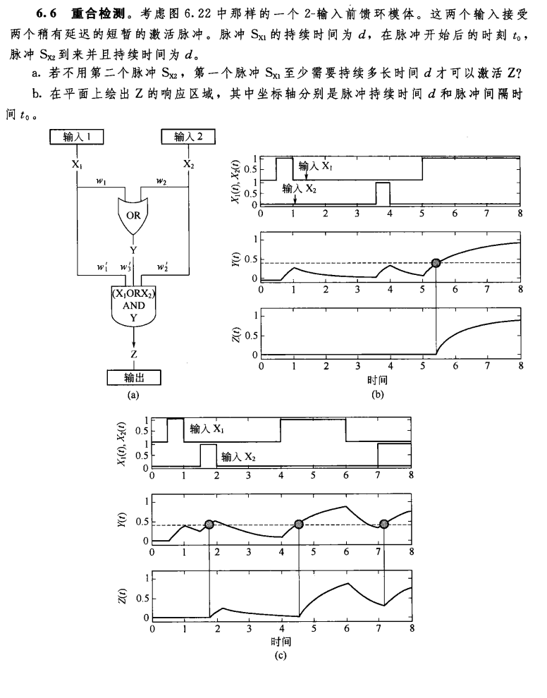

# 系统生物学作业

生信 2001 张子栋 2020317210101

**6.1 调节-反馈网络模体中的记忆**	转录因子 $X$ 激活转录因子 $Y_1$ 和 $Y_2$，$Y_1$ 和 $Y_2$ 彼此相互激活。在 $Y_1$ 和 $Y_2$ 启动子上的输入函数是一个或门（当 $X$ 或 $Y_1$ 结合到启动子上时 $Y_2$ 被激活)。在时刻 $t=0$，$X$ 从初始浓度 $X=0$ 开始生成。在初始时刻，$Y_1=Y_2=0$。生成率 $\beta=1$，降解率 $\alpha=1$。激活阔值 $K=0.5$。在时刻 $t=3$，$X$ 产物的生成终止。

​	a. 画出 $X$、$Y_1$ 和 $Y_2$ 的动力学曲线。在 $X$ 降解开始后 $Y_1$ 和 $Y_2$ 的变化如何?

​	b. 考虑同样的问题，但是现在 $Y_1$ 和 $Y_2$ 是相互抑制的，$X$ 激活 $Y_1$ 并抑制 $Y_2$。在时
刻 $t=0$，$X$ 开始生成，初始浓度分别为 $X=0$、$Y=0$ 和 $Y=1$。在时刻 $t=3$，$X$ 产物
的生成终止。画出此系统的动力学曲线。$X$ 降解后会发生什么?

a. 转录因子关系：

时刻 $t=0$，$X$ 从零生成，时刻 $t=3$ 终止生成。初始时刻，$Y_1=Y_2=0$，$\beta=1$，$\alpha=1$，$k=0.5$。

$X$ 动力学方程：
$$
\begin{cases}
\frac{\mathrm{d}X}{\mathrm{d}t}=1-X & 0\le t <3\\
\frac{\mathrm{d}X}{\mathrm{d}t}=-X&t\ge 3
\end{cases}
$$

$Y_1,~Y_2$ 动力学方程：
$$
\begin{cases}
\frac{\mathrm{d}Y_1}{\mathrm{d}t}=\theta(X>K\text{ OR }Y_2>k)-Y_1 \\
\frac{\mathrm{d}Y_2}{\mathrm{d}t}=\theta(X>K\text{ OR }Y_1>k)-Y_2 
\end{cases}
$$
$Y_1,~Y_2$ 初始浓度均为 $0$，当 $X$ 达激活 $K$ 时，$Y_1,~Y_2$ 开始合成且浓度曲线变化一致。

解 $X$ 微分方程，带入 $X(0)=0$：
$$
\begin{cases}
X(t)=1-e^{-t} & 0\le t<3\\
X(t)=\left(1-e^{-3}\right)e^{-t} & t \ge 3
\end{cases}
$$
当 $X$ 浓度达到 $K=0.5$ 时，$1-e^{-t}=0.5,~t=\ln 2$，$Y_1,~Y_2$ 浓度随时间变化函数为：
$$
\begin{cases}
0&0<t<\ln 2\\
1-e^{-t} & t\ge \ln 2
\end{cases}
$$
$X,~Y_1,~Y_2$ 动力学曲线如下：

b. 转录因子关系图：

.svg)

X 的动力学过程与 a. 一致，$Y_1,~Y_2$ 的动力学方程为：
$$
\begin{cases}
\frac{\mathrm{d}Y_1}{\mathrm{d}t}=\beta\theta\left(X>K\text{ OR }Y_2<K\right )-\alpha Y_1=\theta\left(X>0.5\text{ OR }Y_2<0.5\right)-Y_1\\
\frac{\mathrm{d}Y_2}{\mathrm{d}t}=\beta\theta\left(X>K\text{ AND }Y_1<K\right )-\alpha Y_2=\theta\left(X<0.5\text{ AND }Y_1<0.5\right)-Y_2\\
\end{cases}
$$

$X=0,~Y_1=0,~Y_2=1$，当 $X$ 达对 $Y_1$ 的激活阈值 $K$ 时，$Y_1$ 开始生成，同时对 $Y_2$ 起抑制作用。$Y_2$ 的浓度逐渐减小，此时 $t=\ln 2$

$Y_1$ 浓度随时间变化函数为：
$$
\begin{cases}
Y(t)=0 &t<\ln 2\\
Y_1(t)=1-e^{-t} &t \ge \ln 2
\end{cases}
$$
$Y_2$ 浓度随时间变化函数为：
$$
\begin{cases}
Y(t)=0 &t<\ln 2\\
Y_1(t)=e^{-t} &t \ge \ln 2
\end{cases}
$$
$X,~Y_1,~Y_2$ 动力学曲线如下：

a. 不用第二个脉冲 $S_{X2}$，仅 $S_{X1}$，由于 $Z$ 是 $X_1$ 或 $X_2$ 和 $Y$ 的逻辑 AND 门，因此 $S_{X1}$ 不仅要激活 $Y$ 的合成，还要使，$Y$  浓度达到对 $Z$ 的阈值 $K_{yz}$。假设 $Y$ 的生成速率为 $\beta_1$，稀释/降解速率为 $\alpha$。
$$
\begin{aligned}
Y(t)&=\frac{\beta_1}{\alpha}\left(1-e^{-\alpha t}\right)\\
&=K_{yz}\\
e^{-\alpha t}&=1-\frac{k_{yz}\alpha}{\beta_1}\\
-\alpha t &= \ln\left(\frac{\beta_1-k_{yz}\alpha}{\beta_1}\right)\\
t&=\frac{\ln \beta_1-\ln(\beta_1-K_{yz}\alpha)}{\alpha}\\
&=d
\end{aligned}
$$
即不用第二个脉冲 $S_{X2}$，至少需要时间 $d=\frac{\ln \beta_1-\ln(\beta_1-K_{yz}\alpha)}{\alpha}$ 可以激活 Z。

b. 

第一阶段，只有信号 $S_1$，持续时间为 d，Y 浓度由 0 上升至 $K_1$
$$
Y(d)=\frac{\beta_1}{\alpha}\left(1-e^{-\alpha d}\right)=K_1
$$
第二阶段，无信号，间隔时间 $t_0$，浓度指数衰减至 $K'$
$$
Y(t_0)=K_1e^{-\alpha t_0}=K'
$$
第三阶段，$S_{X2}$ 出现，持续时间 d，浓度上升至 $K_2$
$$
Y(t_2)=\frac{\beta_2}{\alpha}+\left(\left(K_1 e^{-\alpha t_0}-\frac{\beta_2}{\alpha}\right)e^{-\alpha t_1}\right)\\
带入：
\begin{cases}
Y(t_2)=K_2\\
t_1=t_2=d\\
K_2> K_{yz}
\end{cases}\\
\begin{aligned}
\frac{\beta_2}{\alpha}+\left(K_1e^{-\alpha t_0}-\frac{\beta_2}{\alpha}\right)e^{-\alpha d} &>K_{yz}\\
\frac{\beta_2}{\alpha}+\left(\frac{\beta_2}{\alpha}\left(1-e^{-\alpha d}\right)e^{-\alpha t_0}-\frac{\beta_2}{\alpha}\right)e^{-\alpha d} &>K_{yz}\\
\frac{\beta_2}{\alpha}e^{-\alpha d}-\frac{\beta_1}{\alpha}e^{-\alpha(2d+t_0)}-\frac{\beta_2}{\alpha}e^{\alpha d} &> K_{yz}-\frac{\beta_2}{\alpha}
\end{aligned}
$$
以 $d$ 为横坐标，时间间隔 $t_0$ 为纵坐标，假设 $\frac{\beta_1}{\alpha}=2,~\frac{\beta_2}{\alpha}=3,~K_{yz}=1$
$$
2e^{-x}-\alpha e^{-(2x+y)}-3e^{-x}>1-2
$$

