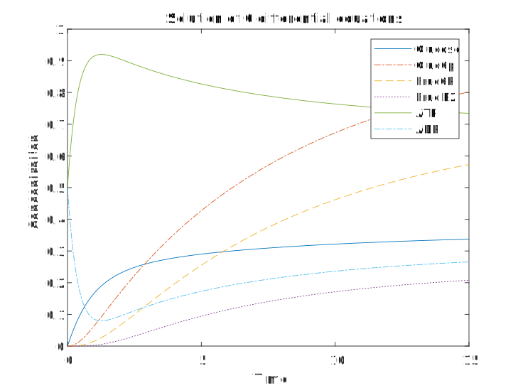
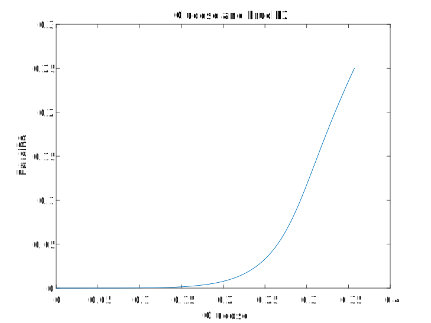

# 系统生物学作业

<center>生信 2001 张子栋 2020317210101</center>

使用 MATLAB 求解：

定义函数文件：

```matlab
function dxdt = myfun(t,x)
k1 = 0.25; k2 = 1; k3 = 1; k4 = 1; k5 = 1; k6 = 1; k7 = 2.5;
dxdt = [k1 - x(1) * k2 * x(5); 
        x(1) * k2 * x(5) - k3 * x(2) + k3 * x(3); 
        k3 * x(2) - k3 * x(3) - k4 * x(5) * x(3) + k5 * x(4); 
        k4 * x(5) * x(3) - k5 * x(4) - k6 * x(4); 
        k7 * x(6) - k2 * x(1) * x(5) - k4 * x(5) * x(3); 
        k4 * x(5) * x(3) + k2 * x(1) * x(5) - k7 * x(6)];
end

```

在主程序中运行：

```matlab
[t,x] = ode45(@myfun,[0 15],[0 0 0 0 0.5 0.5]);
plot(t,x(:,1),'-',t,x(:,2),'-.',t,x(:,3),'--',t,x(:,4),':',t,x(:,5),'-',t,x(:,6),'-.')
xlabel('Time')
ylabel('Concentration')
title('Solution of 6 differential equations')
legend('Glucose','Gluc6p','Fruc6P','FruclP2','ATP','ADP')
```



继续运行：

```matlab
[t,x] = ode45(@myfun,[0 100],[0 0 0 0 0.5 0.5]);
plot(x(:,1),x(:,4))
xlabel('Glucose')
ylabel('FruclP2')
title(' Glucose and FruclP2')

```

