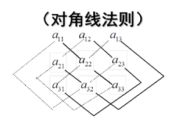

# 绪论 研究对象:矩阵(matrix)

由$m\times n$个数$a_{ij}$所排成的$m$行$n$列的举行数表称为$m\times n$阶矩阵
$$
A=
\begin{vmatrix}
  a_{11}&a_{12}&\cdots&a_{1n}\\
  a_{21}&a_{22}&\cdots&a_{2n}\\
  \cdots&\cdots&\cdots&\cdots\\
  a_{m1}&a_{m2}&\cdots&a_{mn} 
\end{vmatrix}
$$

简记为 : $A= (a_{ij})_{m\times n}$

### 1.规范线性方程组的求解

$$
\begin{cases}
x_1=2x_2=0\\
2x_1+3x_2=1
\end{cases}
$$

可化为
$$
\begin{bmatrix}
1&2\\
2&3
\end{bmatrix}
\cdot
\begin{bmatrix}
x_1\\
x_2
\end{bmatrix}
=\begin{bmatrix}
0\\1
\end{bmatrix}
\\   \ \downarrow\quad \quad  \ \ \,\,\,
\downarrow\qquad\quad\downarrow\\
得矩阵方程\,\,\,\,\,A \quad \cdot\,\,\quad X\,\,\,\,=\,\,\,\,\, B \qquad\qquad\,\,\,\,
$$

### 2.借用矩阵研究二次型(quadratic forms)

二次型是一类特殊的多元多项式函数$f(x_1,x_2,\cdots,x_n)$
满足
$$
f(kx_1,kx_2,\cdots,kx_n)=k^2f(x_1,x_2,\cdots,x_n)
$$
其中k为任意数

# 行列式

### 定义

​		由$1,2,\cdots,n$组成的一个有序数组成为一个$n$级排列

注:所有不同$n$级排列的总数是$n!=1\cdot 2\cdots (n-1)n=P_n$;

​	例如3级排列有:$123,132,213,231,312,321$共6个

# 逆序数

### 标准次序

​	$n$个不同的自然数,规定由小到大为标准次序

### 逆序

&emsp;在一个排列中,如果一对数的前后位置与标准次序相反,即前面的数大于后面的数,则称这对数为一个逆序​ 
&emsp;一个排列中逆序的总数成为这个排列的逆序数

### 奇排列与偶排列
&emsp;逆序数为奇数的排列称为奇排列 
&emsp;逆序数为偶数的排列称为偶排列   
****
求解 $\left\{\begin{array}{l}a_{11} x_{1}+a_{12} x_{2}=b_{1} \\ a_{21} x_{1}+a_{22} x_{2}=b_{2}\end{array}\right.$  
当 $a_{11} a_{22}-a_{12} a_{21} \neq 0$ 时   
$\Large x_{1}=\frac{b_{1} a_{22}-a_{12} b_{2}}{a_{11} a_{22}-a_{12} a_{21}} \quad x_{2}=\frac{a_{11} b_{2}-b_{1} a_{21}}{a_{11} a_{22}-a_{12} a_{21}}$
>高斯消元法
****

求 $\large\left\{\begin{array}{l}a_{11} x_{1}+a_{12} x_{2}+a_{13} x_{3}=b_{1} \\ a_{21} x_{1}+a_{22} x_{2}+a_{23} x_{3}=b_{2} \\ a_{31} x_{1}+a_{32} x_{2}+a_{33} x_{3}=b_{3}\end{array}\right.$  
$\LARGE x_{1}=\frac{b_{1} a_{22} a_{33}+a_{12} a_{23} b_{3}+a_{13} b_{2} a_{32}-b_{1} a_{23} a_{32}-a_{12} b_{2} a_{33}-a_{13} a_{22} b_{3}}{a_{11} a_{22} a_{33}+a_{12} a_{23} a_{31}+a_{13} a_{21} a_{32}-a_{11} a_{23} a_{32}-a_{12} a_{21} a_{33}-a_{13} a_{22} a_{31}}$  
$\LARGE x_{2}=\frac{a_{11} b_{2} a_{33}+b_{1} a_{23} a_{31}+a_{13} a_{21} b_{3}-a_{11} a_{23} b_{3}-b_{1} a_{21} a_{33}-a_{13} b_{2} a_{31}}{a_{11} a_{22} a_{33}+a_{12} a_{23} a_{31}+a_{13} a_{21} a_{32}-a_{11} a_{23} a_{32}-a_{12} a_{21} a_{33}-a_{13} a_{22} a_{31}}$  
$\LARGE x_{3}=\frac{a_{11} a_{22} b_{3}+a_{12} b_{2} a_{31}+b_{1} a_{21} a_{32}-a_{11} b_{2} a_{32}-a_{12} a_{21} b_{3}-b_{1} a_{22} a_{31}}{a_{11} a_{22} a_{33}+a_{12} a_{23} a_{31}+a_{13} a_{21} a_{32}-a_{11} a_{23} a_{32}-a_{12} a_{21} a_{33}-a_{13} a_{22} a_{31}}$

****
# 二阶行列式

### 定义

$\begin{vmatrix}
a_{11}&a_{12}\\
a_{21}&a_{22}
\end{vmatrix}=a_{11}a_{22}-a_{12}a_{21}\quad$**(对角线法则)** 
$a_{ij}$称为行列式的额第$i$行第$j$列的元素 

****
$$
\begin{array}{l}
\text { 求解 }\left\{\begin{array}{l}
a_{11} x_{1}+a_{12} x_{2}=b_{1} \\
a_{21} x_{1}+a_{22} x_{2}=b_{2}
\end{array}\right. \\
a_{11} a_{22}-a_{12} a_{21} \neq 0 \text { 时， } D=\begin{vmatrix}
a_{11} & a_{12} \\
a_{21} & a_{22}
\end{vmatrix} =a_{11} a_{22}-a_{12} a_{21} \neq 0
\end{array}
$$

$$
\begin{aligned}
&x_{1}=\frac{b_{1} a_{22}-a_{12} b_{2}}{a_{11} a_{22}-a_{12} a_{21}}=\frac{\left|\begin{array}{ll}
b_{1} & a_{12} \\
b_{2} & a_{22}
\end{array}\right|}{\left|\begin{array}{ll}
a_{11} & a_{12} \\
a_{21} & a_{22}
\end{array}\right|}=\frac{D_{1}}{D}\\
&x_{2}=\frac{a_{11} b_{2}-b_{1} a_{21}}{a_{11} a_{22}-a_{12} a_{21}}=\frac{\left|\begin{array}{ll}
a_{11} & b_{1} \\
a_{21} & b_{2}
\end{array}\right|}{\left|\begin{array}{ll}
a_{11} & a_{12} \\
a_{21} & a_{22}
\end{array}\right|}=\frac{D_{2}}{D}
\end{aligned}
$$
****
# 三阶行列式
定义
$\begin{vmatrix}
  a_{11}&a_{12}&a_{13}\\
  a_{21}&a_{22}&a_{23}\\
  a_{31}&a_{32}&a_{33}
\end{vmatrix}=a_{11}a_{22}a_{33}+a_{12}a_{23}a_{31}+a_{13}a_{21}a_{32}-a_{11}a_{23}a_{32}-a_{12}a_{21}a_{33}-a_{13}a_{22}a_{31}$  
  
例1 : $\begin{vmatrix}
  2&-1&1\\
  1&2&3\\
  0&-3&-1
\end{vmatrix}$=10

****
### 克拉默法则

$$
\begin{aligned}
&\text { 求解 }\left\{\begin{array}{l}
a_{11} x_{1}+a_{12} x_{2}+a_{13} x_{3}=b_{1} \\
a_{21} x_{1}+a_{22} x_{2}+a_{23} x_{3}=b_{2} \\
a_{31} x_{1}+a_{32} x_{2}+a_{33} x_{3}=b_{3}
\end{array}\right.\\
&\text { 当系数行列式 } \boldsymbol{D}=\left|\begin{array}{lll}
\boldsymbol{a}_{11} & \boldsymbol{a}_{12} & \boldsymbol{a}_{13} \\
\boldsymbol{a}_{21} & \boldsymbol{a}_{22} & \boldsymbol{a}_{23} \\
\boldsymbol{a}_{31} & \boldsymbol{a}_{32} & \boldsymbol{a}_{33}
\end{array}\right| \neq \mathbf{0} \text { 时， }\\
&\text { 方程组有唯一解，且 }\\
&x_{1}=\frac{D_{1}}{D} \quad x_{2}=\frac{D_{2}}{D} \quad x_{3}=\frac{D_{3}}{D}\\
其中 \\
\end{aligned}\\
D_1=\begin{vmatrix}
b_1&a_{12}&a_{13}\\
b_2&a_{22}&a_{23}\\
b_3&a_{32}&a_{33}
\end{vmatrix}\qquad
D_2=\begin{vmatrix}
a_{11}&b_1&a_{13}\\
a_{12}&b_2&a_{23}\\
a_{13}&b_3&a_{33}
\end{vmatrix}\qquad
D_=\begin{vmatrix}
a_{11}&a_{12}&b_1\\
a_{12}&a_{22}&b_2\\
a_{13}&a_{23}&b_3
\end{vmatrix}\qquad
$$

>  $D_i = $将$D$的第$i$列换成$\begin{vmatrix}b_1\\b_2\\b_3\end{vmatrix}$

# $n$阶行列式的定义

对$n$元线性方程组
$$
\begin{cases}
  a_{11}x_1+a_{12}x_2+\cdots+a_{1n}x_n=b_1\\
  a_{21}x_1+a_{22}x_2+\cdots+a_{2n}x_n=b_2\\
  \qquad\qquad\qquad\cdots\cdots\\
  a_{n1}x_1+a_{n2}x_2+\cdots+a_{nn}x_n=b_n
\end{cases}
$$
其解是否有类似的形式?  
1.二阶行列式 
$\begin{vmatrix}
a_{11}&a_{12}\\
a_{21}&a_{22}
\end{vmatrix}=a_{11}a_{22}-a_{12}a_{21}\quad$  
2.三阶行列式$\begin{vmatrix}
  a_{11}&a_{12}&a_{13}\\
  a_{21}&a_{22}&a_{23}\\
  a_{31}&a_{32}&a_{33}
\end{vmatrix}=a_{11}a_{22}a_{33}+a_{12}a_{23}a_{31}+a_{13}a_{21}a_{32}-a_{11}a_{23}a_{32}-a_{12}a_{21}a_{33}-a_{13}a_{22}a_{31}$

>特点: 
>1.项数 共$n!$项 
>2.项的构成 展开式中 的每一项都是取自行列式不同行不同列的$n$个元素之积 
>3.符号规律 三个正项过的列标构成的排列为$123,231,312,$他们都是偶排列;三个负项的列标构成的排列为$321,213,132,$他们都是奇排列 

三阶行列式可以写为
$$
\displaystyle
\begin{vmatrix}
  a_{11}&a_{12}&a_{13}\\
  a_{21}&a_{22}&a_{23}\\
  a_{31}&a_{32}&a_{33}
\end{vmatrix}=\sum(-1)^{t(p_1p_2p_3)}a_{1p_1}a_{2p_2}a_{3p_3}\\
$$
类似地,定义n阶行列式: 
$$
\displaystyle 
\begin{vmatrix}
  a_{11}&a_{12}&\cdots&a_{1n}\\
  a_{21}&a_{22}&\cdots&a_{2n}\\
  \cdots&\cdots&\cdots&\cdots\\
  a_{n1}&a_{n2}&\cdots&a_{nn}\\
\end{vmatrix}=\sum(-1)^{t(p_1p_2\cdots p_n)}a_{1p_1}a_{2p_2}\cdots a_{3p_n}\\
​
$$

# 特殊行列式

## 对角形行列式

$$
\begin{aligned}
  \begin{vmatrix}
d_1&0&\cdots&0\\
0&d_2&\cdots&0\\
\cdots&\cdots&\cdots&\cdots\\
0&\cdots&0&d_n
\end{vmatrix}&=d_1d_2\cdots d_n\\
\\
\begin{vmatrix}
0&\cdots&0&d_1\\
0&\cdots&d_2&0\\
\cdots&\cdots&\cdots&\cdots\\
d_n&\cdots&0&0
\end{vmatrix}&=(-1)^{\frac{n(n-1)}{2}}d_1d_2\cdots d_n
\end{aligned}
$$
****
## 三角形行列式

$$
\begin{aligned}
  \begin{vmatrix}
  a_{11}&a_{12}&\cdots&a_{1n}\\
  0&a_{22}&\cdots&a_{2n}\\
  \cdots&\cdots&\cdots&\cdots\\
  0&0&\cdots&a_{nn}
\end{vmatrix}=a_{11}a_{22}\cdots a_{nn}\\
\\
\begin{vmatrix}
  a_{11}&0&\cdots&0\\
  a_{12}&a_{22}&\cdots&0\\
  \cdots&\cdots&\cdots&\cdots\\
  a_{n1}&a_{n2}&\cdots&a_{nn}
\end{vmatrix}=a_{11}a_{22}\cdots a_{nn}
\end{aligned}
$$

# 行列式的性质

##　性质１

​	行列式的转置，其值不变，即$|A|=|A^T|$

## 性质２

​	互换行列式的两行，行列式**变号**，即$|A|=-|B|$

### 推论一

+  若行列式的某两行相同,则$|A|=0$

##　性质３

​	行列式某一行的公因子可以提到行列式外面
$$
例:\\
\begin{vmatrix}
a_{11}&a_{12}\\
ka_{21}&ka_{22}
\end{vmatrix}=k\begin{vmatrix}
a_{11}&a_{12}\\
a_{21}&a_{22}
\end{vmatrix}
$$

### 推论二

+  若行列式的某一行元素全为0,则该行列式等于0

## 性质４

​	若行列式的某两行的对应元素成比例,则该行列式等于0

>  性质3+推论一

性质５

​	若$A$的某一行的元素均可表示为两数之和,则$A$可按下式表示为两个行列式的和:
$$
\begin{vmatrix}
a_{11}&a_{12}\\
a_{21}+b_{21}&a_{22}+b_{22}
\end{vmatrix}=\begin{vmatrix}
a_{11}&a_{12}\\
a_{21}&a_{22}
\end{vmatrix}+\begin{vmatrix}
a_{11}&a_{12}\\
b_{21}&b_{22}
\end{vmatrix}
$$

## 性质６:heavy_exclamation_mark: 

​	若将行列式的某一行的倍数加到另一行,行列式不变

>  拆分成两个行列式的和，一个行列式是原行列式，另一个行列式有两行相同(等于0)

$$
\begin{vmatrix}
a_{11}&a_{12}\\
a_{21}+ka_{11}&a_{22}+ka_{12}
\end{vmatrix}=\begin{vmatrix}
a_{11}&a_{12}\\
a_{21}&a_{22}
\end{vmatrix}
$$

## 性质７　（按行展开）$\rightarrow$定义行列式

$$
\begin{aligned}
\begin{vmatrix}
  a_{11}&a_{12}&a_{13}\\
  a_{21}&a_{22}&a_{23}\\
  a_{31}&a_{32}&a_{33}
\end{vmatrix}&=a_{11}a_{22}a_{33}+a_{12}a_{23}a_{31}+a_{13}a_{21}a_{32}-a_{11}a_{23}a_{32}-a_{12}a_{21}a_{33}-a_{13}a_{22}a_{31}\\
&=a_{11}(a_{22}a_{33}-a_{32}a_{23})+a_{12}(a_{21}a_{33}-a_{31}a_{23})+a_{13}(a_{21}a_{32}-a_{31}a_{22})\\
&=a_{11}\begin{vmatrix}
a_{11}&a_{12}\\
a_{21}&a_{22}
\end{vmatrix}-
a_{12}\begin{vmatrix}
a_{21}&a_{23}\\
a_{31}&a_{33}
\end{vmatrix}+
a_{13}\begin{vmatrix}
a_{21}&a_{22}\\
a_{31}&a_{32}
\end{vmatrix}
\end{aligned} 
$$

+  余子式、代数余子式

   >  $n$阶行列式中花去$a_{ij}$所在行得到的$(n-1)$阶行列式称为$a_{ij}$的余子式,记作$M_{ij}$

$M_{ij}(i = 1,2,\cdots ,n)$称为元素$a_{ij}$的余子式

$A_{ij}=(-1)^{i+j}M_{ij}$称为元素$a_{ij}$的代数余子式

即:行列式等于它的任一行(列)的元素与其对应的代数余子式的乘积之和 $D=a_{i1}A_{i1}+a_{i2}A_{i2}+\cdots+a_{in}A_{in}$(按第$i$行展开)

​		故上式$=a_{11}A_{11}+a_{12}A_{12}+a_{13}A_{13}$

### 推论三

​	行列式的某一行(列)元素与另一行(列)的对应元素的代数余子式的乘积之和为0
$$
a_{i1}A_{j1}+a_{i1}A_{j2}+\cdots +a_{in}A_{jn}=\begin{cases}
D,(i=j)\\
0,(i\neq j)
\end{cases}\\
例:a_{11}A_{21}+a_{12}A_{22}+a_{13}A_{23}=0
$$

>  还原成一个行列式之后,有两行元素相同$\rightarrow$行列式等于0

# 行列式的计算

## 符号约定

+  交换$i,j$两行,记作$r_i\leftrightarrow r_j$

+  数$k$称第$i$行,记作$kr_i$
+  第$j$行的$k$倍加到第$i$行上,记作$r_i+kr_i$

## 定理:上(下)三角行列式等于其主对角线上元素乘积

+  证明:

+  $$
   \begin{aligned}
   |A|&=\begin{vmatrix}
   a_{11}&0&\cdots&0\\
   a_{21}&a_{22}&\cdots&0\\
   \cdots&\cdots&\cdots&\cdots\\
   a_{n1}&a_{n2}&\cdots&a_{nn}\\
   \end{vmatrix}\\
   &=a_{11}(-1)^{1+1}
   \begin{vmatrix}
   a_{22}&\cdots&0\\
   \cdots&\cdots&\cdots\\
   a_{n2}&\cdots&a_{nn}
   \end{vmatrix}\qquad\rightarrow按照r_1展开\\
   &=\cdots\qquad\qquad\qquad\qquad\qquad\qquad\,\,\,\,\rightarrow重复多次\\
   &=a_{11}a_{22}\cdots a_{nn}
   \end{aligned}
   $$

# 练习

### 例1 转化为三角行列式

​	计算行列式$D=\begin{vmatrix}1&2&-1&0\\2&4&1&2\\-1&0&2&1\\-3&-4&2&3\end{vmatrix}$

解1: 将D化为上三角行列式
$$
\begin{aligned}
D\begin{cases}
r_2-2r_1\\
r_3+r_1\\
r_4+r_1
\end{cases}\quad\rightarrow\quad&=
\begin{vmatrix}
1&2&-1&0\\
0&0&3&2\\
0&2&1&1\\
0&2&-1&3
\end{vmatrix}\\\\
r_4+3r_3\quad\rightarrow\quad&=
\begin{vmatrix}
1&2&-1&0\\
0&0&3&2\\
0&2&1&1\\
0&0&-2&2
\end{vmatrix}\\\\
r_2\leftrightarrow r_3\quad\rightarrow\quad&=
-\begin{vmatrix}
1&2&-1&0\\
0&2&1&1\\
0&0&3&2\\
0&0&-2&2
\end{vmatrix}\\\\
r_4+\frac{2}{3}r_3\quad\rightarrow\quad&=
-\begin{vmatrix}
1&2&-1&0\\
0&0&3&2\\
0&2&1&1\\
0&0&0&\frac{10}{3}
\end{vmatrix}\\\\
&=-(1\times2\times3\times\frac{10}{3})\\
&=-20\\
\end{aligned}
$$
解2：按行展开法 
$$
\begin{aligned}
D&=\begin{vmatrix}
1&2&-1&0\\
0&0&3&2\\
0&2&-11&3\\
0&2&-1&3
\end{vmatrix}\\
&=1\times(-1)^{1+1}
\begin{vmatrix}
0&3&2\\
2&1&1\\
2&-1&3
\end{vmatrix}\\
r_3-r_2\qquad\rightarrow\qquad&=
\begin{vmatrix}
0&3&2\\
2&1&1\\
0&-2&2
\end{vmatrix}\\
&=2\cdot (-1)^{2+1}\begin{vmatrix}
3&2\\
-2&2
\end{vmatrix}\\
&=-2\times (6+4)\\
&=-20
\end{aligned}
$$

### 例2 爪形行列式

计算行列式$D=\begin{vmatrix}a_1&1&1&1\\1&a_2&0&0\\1&0&a_3&0\\1&0&0&a_4\end{vmatrix}$,其中$a_2a_3a_4\neq0$.
>爪形行列式
$$
\begin{aligned}
c_1-\frac{1}{a_2}\quad\rightarrow\quad c_2D&=\begin{vmatrix}
a_1-\frac{1}{a_2}&1&1&1\\
0&a_2&0&0\\
1&0&a_3&0\\
1&0&0&a_4
\end{vmatrix}\\
重复相同操作\quad\rightarrow\quad 
&=\begin{vmatrix}
a_1-\frac{1}{a_2}-\frac{1}{a_3}-\frac{1}{a_4} &1&1&1\\
0&a_2&0&0\\
0&0&a_3&0\\
0&0&0&a_4
\end{vmatrix}\quad\rightarrow\quad上三角行列式\\
&=(a_1-\frac{1}{a_2}-\frac{1}{a_3}-\frac{1}{a_4})a_2a_3a_4
\end{aligned}
$$

### 例3

计算行列式$D=\begin{vmatrix}a_1+1&a_2&a_3&a_4\\a_1&a_2+2&a_3&a_4\\a_1&a_2&a_3+3&a_4\\a_1&a_2&a_3&a_4+4\end{vmatrix}$
>注：可化为爪形行列式

### 例4 按行展开

计算$n$阶行列式$\begin{vmatrix}x&y&0&\cdots&0&0\\0&x&y&\cdots&0&0\\0&0&\\\cdots&\cdots&\cdots&\cdots&\cdots\\0&0&0&\cdots&x&y\\y&0&0&\cdots&0&x\end{vmatrix}$

解：按第$n$行展开
>也可以按第1列展开

$$
\begin{aligned}
D&=y\cdot (-1)^{n+1}
\begin{vmatrix}
y&0&\cdots&0&0\\
x&y&\cdots&0&0\\
0&x&\cdots&0&0\\
\cdots&\cdots&\cdots&\cdots&\cdots\\
0&0&\cdots&x&y
\end{vmatrix}+x(-1)^{n+n}
\begin{vmatrix}
x&y&\cdots&0&0\\
0&x&\cdots&0&0\\
0&0&\cdots&0&0\\
\cdots&\cdots&\cdots&\cdots&\cdots\\
0&0&\cdots&0&x
\end{vmatrix}\\
&=(-1)^{n+1}y\cdot y^{n-1}+(-1)^{n+n}x\cdot x^{n-1}\\
&=x^n-(-y)^n
\end{aligned}
$$
### 例5 制造行和/交换位置

计算$n$阶行列式
$$
(1)\begin{vmatrix}
a&b&b&\cdots&b\\
b&a&b&\cdots&b\\
b&b&a&\cdots&b\\
\cdots&\cdots&\cdots&\cdots&\cdots\\
b&b&b&\cdots&a
\end{vmatrix}\\
$$
>  制造行和

$$
(2)\begin{vmatrix}
0&a_1&0&\cdots&0\\
0&0&a_2&\cdots&0\\
0&0&0&\cdots&0\\
\cdots&\cdots&\cdots&\cdots&\cdots\\
a_n&0&0&\cdots&0
\end{vmatrix}\\
$$

>  将最后一行与上一行交换位置(共交换$(n-1)$次)

$$
(3)\begin{vmatrix}
a&0&0&\cdots&1\\
0&a&0&\cdots&0\\
0&0&a&\cdots&0\\
\cdots&\cdots&\cdots&\cdots&\cdots\\
1&0&0&\cdots&a
\end{vmatrix}\\
$$

### 例6 $Vandermond\,e$行列式

$$
V_n=
\begin{vmatrix}
1&1&1&\cdots&1\\
x_1&x_2&x_3&\cdots&x_n\\
x_1^2&x_2^2&x_3^2&\cdots&x_n^2\\
\cdots&\cdots&\cdots&\cdots&\cdots\\
x_1^n&x_2^n&x_3^n&\cdots&x_n^n
\end{vmatrix}=\prod_{1\leq j<i\leq n}(x_i-x_j)\qquad\quad(i\neq j时,x_i\neq x_j)
$$
例：计算$\begin{vmatrix}1&ax&a^2+x^2\\1&ay&a^2+y^2\\1&az&a^2+z^2\\\end{vmatrix}$

### 例7 余子式转为代数余子式
$$
D=\begin{vmatrix}
3&0&4&0\\
3&2&2&2\\
0&-7&0&0\\
5&3&2&2
\end{vmatrix}\quad求:M_{41}+M_{42}+M_{43}+M_{44}
$$

解:
$$
\begin{aligned}
&\qquad M_{41}+M_{42}+M_{43}+M_{44}\\
转换为代数余子式的形式\quad \rightarrow \quad&=-(-1)^{4+1}M_{41}+(-1)^{4+2}M_{42}-(-1)^{4+3}M_{43}+(-1)^{4+4}M_{44}\\
&=(-1)A_{41}+(1)A_{42}-(1)A_{43}+(1)A_{44}\\
&=\begin{vmatrix}
3&0&4&0\\
3&2&2&2\\
0&-7&0&0\\
-1&-1&-1&-1
\end{vmatrix}\quad\rightarrow\quad第三行有三个0\\
按第三行展开\quad\rightarrow\quad&=-7\times (-1)^{3+2}\begin{vmatrix}4&0\\2&2\end{vmatrix}\\
&=56
\end{aligned}
$$
