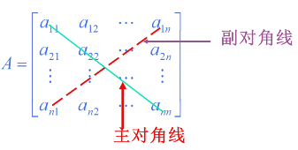

[TOC]

#  绪论 研究对象:矩阵(matrix)

由$m\times n$个数$a_{ij}$所拍成的$m$行$n$列的举行数表称为$m\times n$阶矩阵
$$
A=
\begin{pmatrix}
  a_{11}&a_{12}&\cdots&a_{1n}\\
  a_{21}&a_{22}&\cdots&a_{2n}\\
  \cdots&\cdots&\cdots&\cdots\\
  a_{m1}&a_{m2}&\cdots&a_{mn} 
\end{pmatrix}
$$

+  简记为 : $A= (a_{ij})_{m\times n}$或$A=(a_{ij})$
+  当$m=n$时,$A$称为$n$阶方阵(square matrix)

## 矩阵与行列式的区别

|      | 行列式                          | 矩阵                                                         |
| ---- | ------------------------------- | ------------------------------------------------------------ |
| 本质 | 一个数                          | 数表                                                         |
| 符号 | $\begin{vmatrix}&\end{vmatrix}$ | $\begin{pmatrix}&\end{pmatrix}\qquad\begin{bmatrix}&\end{bmatrix}$ |
| 形状 | 行数等于列数                    | 行数不一定等于列数                                           |

## 特殊形式的矩阵

### 1.行矩阵

$\begin{pmatrix}a_{11}&a_{12}&\cdots&a_{1n}\end{pmatrix}$是$1\times n$矩阵,也称为行向量

### 2.列矩阵

$\begin{pmatrix}b_{11}\\b_{21}\\\cdots\\b_{m1}\end{pmatrix}$是$m\times 1$矩阵,也称为列向量

>  行向量和列向量统称为向量

### 矩阵与向量的关系

(1)矩阵$A=(a_{ij})_{m \times n}$可以看成由$m$个$n$维向量$\alpha_{i}=\begin{pmatrix}a_{i1}&a_{i2}&\cdots&a_{in}\end{pmatrix}\qquad (i=1,2,\cdots,m)$组成,即$A=\begin{pmatrix}\alpha_1\\\alpha_2\\\cdots\\\alpha_m\end{pmatrix}$也可以看成由$n$个$m$维列向量$\beta_j=\begin{pmatrix}a_{1j}\\a_{2j}\\\cdots\\a_{mj}\end{pmatrix}\quad(j=1,2,\cdots,n)$组成 . 即$A=(\beta_1,\beta_2,\cdots,\beta_n)$

(2)向量可以用矩阵表示

### 3.零矩阵

元素全为零的矩阵称为零矩阵,记作$O$

### 4.负矩阵

矩阵$(-a_{ij})_{m\times n}$称为矩阵$A=(a_{ij})_{m\times n}$的负矩阵,记作$-A$

### 5.上(下)三角矩阵

主对角线下(上)方元素全为力$0$的方阵称为上(下)三角矩阵

### 6.方阵

行数等于列数的矩阵,$n$阶方阵表示为$A_{n\times n}$,简写为$A_n$

>  只有方阵有主对角线和副对角线的概念

### 7.对角矩阵

除主对角线上的元素外,其他元素全为零的方阵

### 8.单位矩阵

主对角线上的元素全为$1$,其他元素全为$0$的对角阵.记作$I$或$E$

如3阶单位阵$E_3$表示为:$\begin{pmatrix}1&0&0\\0&1&0\\0&0&1\end{pmatrix},$一般空白表示$0$,也写为$\begin{pmatrix}1&&\\&1&\\&&1\end{pmatrix}$

### 9.单行单列矩阵

如果一个矩阵只有一个数,一般不将矩阵$(n)$与数字$n$区分

### 10.同型矩阵

两个矩阵的行数和列数相等

## 矩阵的运算

### 矩阵的相等

定义 设$A=(a_{ij})$和$B=(b_{ij})$都是$m \times n$矩阵,如果$a_{ij}=b_{ij}(i=1,2,\cdots,m;j=1,2,\cdots,n)$,则称矩阵$A$与$B$相等,记作$A=B$

>  矩阵相等的前提是同型矩阵

+  两个$0$矩阵不一定相等(行数列数不一定相同 )

### 矩阵的线性运算

#### 1.矩阵的加法

对应位置的元素相加

定义 设$A=(a_{ij})$和$B=(b_{ij})$都是$m\times n$矩阵,则$A+B=(a_{ij}+b_{ij})$是$m\times n$矩阵
$$
\begin{aligned}
A+B&=\begin{pmatrix}
a_{11}+b_{11}&a_{12}+b_{12}&\cdots&a_{in}+b_{1n}\\
a_{21}+b_{21}&a_{22}+b_{22}&\cdots&a_{2n}+b_{2n}\\
\cdots&\cdots&\cdots&\cdots\\
a_{m1}+b_{m1}&a_{m2}+b_{m2}&\cdots&a_{mn}+b_{mn}
\end{pmatrix}\\
\rightarrow\quad A-B&=A+(-B)
\end{aligned}
$$

>  只有同型矩阵才能相加(减)

#### ２.矩阵的数乘

定义 设$A=(a_{ij})$是$m \times n$矩阵,$\lambda$是一个数,则$\lambda A=A\lambda=(\lambda a_{ij})$是$m\times n$矩阵,即用数$\lambda$乘矩阵A的每一个元素.

>  矩阵多有元素均有公因子,这个公因子朝外提一次

例1: 设$A=\begin{pmatrix}1&-1&2\\0&3&4\end{pmatrix},B=\begin{pmatrix}4&0&-3\\-1&-2&3\end{pmatrix},$求$2A+3B$

解
$$
\begin{aligned}
2A+3B&=
\begin{pmatrix}
2&-2&4\\
0&3&4
\end{pmatrix}+
\begin{pmatrix}
12&0&-9\\
-3&-6&9
\end{pmatrix}\\
&=\begin{pmatrix}
  14&-2&-5\\
  -3&-3&13
\end{pmatrix}
\end{aligned}
$$
##### 例2
$$
\begin{cases}
  a_{11}x_1+a_{12}x_2+\cdots+a_{1n}x_n=b_1\\
  a_{21}x_1+a_{22}x_2+\cdots+a_{2n}x_n=b_2\\
  \cdots\\
  a_{m1}x_1+a_{m2}x_2+\cdots+a_{mn}x_n=b_m
\end{cases}
$$
用向量表示此线性方程组
解:$\alpha_1x_1=\alpha_2x_2+\cdots+\alpha_nx_n=\beta$

>  矩阵的加法和数乘统称为矩阵的线性运算,满足:
>
>  >定理&emsp;设$A,B,C$是同型矩阵,$\lambda$和$\mu$是数,则 
>  >$(1)A+B=B+A$ 
>  >$(2)(A+B)+C=A+(B+C)$ 
>  >$(3)A+O=A$ 
>  >$(4)A+(-A)=O$ $(5)\lambda(\mu A)=(\lambda\mu)A$ $(6)(\lambda+\mu)A=\lambda A+\mu A$ $(7)\lambda(A+B)=\lambda A+\lambda B$ $(8)1A=A$

### 矩阵的乘法

定义 : 设$A=(a_{ij})$是$m\times s$矩阵,$B=(b_{ij})$是$s\times n$矩阵,规定$AB=(c_{ij})$是一个$m\times n$阶矩阵,其中,$c_{ij}=a_{i1}b_{1i}+a_{i2}b_{2j}+\cdots+a_{is}b_{sj}\qquad(i=1,2\cdots,m.\quad j=1,2,\cdots,n)$

>  注:
>
>  >  (1)只有当左矩阵$A$的列数与右矩阵的行数相同时$AB$才有意义
>  >
>  >  (2)当$AB$有意义时,结果的行数等于$A$的行数,列数等于$B$的列数
>  >
>  >  (3)当$AB$有意义时,$AB$的元素由$A$的行元素与$B$的列元素对应元素乘积之和确定

例1 设矩阵$A=\begin{pmatrix}a&b\\c&d\end{pmatrix},B=\begin{pmatrix}r_1&r_2&r_3\\s_1&s_2&s_3\end{pmatrix},$求$AB$和$BA$

解
$$
\begin{aligned}
AB&=
\begin{pmatrix}
a&b\\
c&d
\end{pmatrix}
\begin{pmatrix}
r_1&r_2&r_3\\
s_1&s_2&s_3
\end{pmatrix}\\
&=\begin{pmatrix}
ar_1+bs_1&ar_2+bs_2&ar_3+bs_3\\
cr_1+ds_1&cr_2+ds_2&cr_3+ds_3
\end{pmatrix}\\
\\
BA&=\begin{pmatrix}
r_1&r_2&r_3\\
s_1&s_2&s_3
\end{pmatrix}
\begin{pmatrix}
a&b\\
c&d
\end{pmatrix}\\
&无意义
\end{aligned}
$$

>  以下等式一般不成立
>
>  >  $AB=BA$
>  >
>  >  $(A+B)(A-B)=A^2-b^2$
>  >
>  >  $(A+B)^2=A^2+2AB+b^2$

例2$A=\begin{pmatrix}2&0\\-1&0\end{pmatrix}\quad B=\begin{pmatrix}0&0\\1&3\end{pmatrix}\quad C=\begin{pmatrix}0&0\\2&4\end{pmatrix}$,求$AB,AC$

$AB=\begin{pmatrix}0&0\\0&0\end{pmatrix}\quad AC=\begin{pmatrix}0&0\\0&0\end{pmatrix}$

>  结论
>
>  >(1)$AB=0,$不能推出$A=0$或$B=0$
>  >(2) $AB=AC,且A\neq0$不能推出$B=C$

#### 可交换矩阵

如果$AB=BA$则称矩阵$A$与$B$是可交换的,可交换的矩阵必是同阶方阵

单位矩阵$E$与任意同阶方阵可交换,即$EA=AE=A$

例:求与$A=\begin{pmatrix}1&0\\1&1\end{pmatrix}$可交换矩阵

解:设$B=\begin{pmatrix}a&b\\c&d\end{pmatrix}$
$$
\begin{aligned}
AB&=BA\\
\begin{pmatrix}
1&0\\
1&1
\end{pmatrix}
\begin{pmatrix}
a&b\\
c&d
\end{pmatrix}
&=\begin{pmatrix}
a&b\\
c&d
\end{pmatrix}
\begin{pmatrix}
1&0\\
1&1
\end{pmatrix}\\
\begin{pmatrix}
a&b\\
a+c&b+d
\end{pmatrix}
&=\begin{pmatrix}
a+b&b\\
c+d&d
\end{pmatrix}\\
\begin{cases}
a&=a+b\\
a+c&=c+d\\
b+d&=d
\end{cases}\\
\therefore B&=\begin{pmatrix}
a&0\\
c&a
\end{pmatrix}
\end{aligned}\\
a,c为任意常数
$$

#### 矩阵乘法的运算规律

定理

+  与零矩阵相乘$A_{4\times 3}O_{3\times 2}=O_{4\times2}$

+  与单位矩阵相乘$AE=A\quad BE=B$

>  $A,B$是任意矩阵

+  结合:$(AB)C=A(BC)$

+  分配:$(A+B)C=AC+BC\qquad C(A+B)=CA+CB$

+  $k(AB)=(kA)B=A(kB)$

>  k为常数

#### 方阵的幂

定义设$A$为$n$阶方阵,$k$个$A$的连乘积$AA\cdots A$称为$A$的$k$次幂,记作$A^k$,并称矩阵$P(A)=a_0I+a_1A+a_2A^2+\cdots+a_kA^k $为$A$的$k$次多项式,其中$a_i(i=0,1,\cdots,k)$是数,$I$是$n$阶单位矩阵

由定义可以推出$A^1=A,A^2=AA,\cdots,A^{k+1}=A^kA \rightarrow A^kA^l=A^{k+l},(A^k)^l=A^{kl},$其中$k,l$为正整数,但一般地,$(AB)^k\neq A^kB^k$
当$AB$可交换时,$(AB)^k=A^kB^k$

例1设$A=\begin{pmatrix}1&-1\\-1&1\end{pmatrix}$,求$A^n$
解
$$
\begin{aligned}
A^2&=\begin{pmatrix}
1&-1\\
-1&1
\end{pmatrix}
\begin{pmatrix}
1&-1\\
-1&1
\end{pmatrix}\\
&=\begin{pmatrix}
2&-2\\
-2&2
\end{pmatrix}\\
A^3&=\begin{pmatrix}
2&-2\\
-2&2
\end{pmatrix}
\begin{pmatrix}
1&-1\\
-1&1
\end{pmatrix}\\
&=\begin{pmatrix}
4&4\\
4&4
\end{pmatrix}\\
\therefore A^n&=\begin{pmatrix}
2^{n-1}&-2^{n-1}\\
-2^{n-1}&2^{n-1}
\end{pmatrix}
\end{aligned}
$$

例2 设矩阵$A=\begin{pmatrix}1\\2\\3\end{pmatrix},B=\begin{pmatrix}1&\frac{1}{2}&\frac{1}{3}\end{pmatrix},$求$AB,(AB)^n$
解
$$
\begin{aligned}
AB&=\begin{pmatrix}
1\\
2\\
3
\end{pmatrix}
\begin{pmatrix}
1&\frac{1}{2}&\frac{1}{3}
\end{pmatrix}\\
&=\begin{pmatrix}
1&\frac{1}{2}&\frac{1}{3}\\
2&1&\frac{2}{3}\\
3&\frac{3}{2}&1
\end{pmatrix}\\\\
(AB)^n&=3^{n-1}\begin{pmatrix}
1&\frac{1}{2}&\frac{1}{3}\\
2&1&\frac{2}{3}\\
3&\frac{3}{2}&1
\end{pmatrix}
\end{aligned}
$$

例3 $A=\begin{pmatrix}1\\1\\1\end{pmatrix},B=\begin{pmatrix}1&2&3\end{pmatrix}$,求$AB,BA,(AB)^2,(AB)^{10}$
$$
\begin{aligned}
AB&=\begin{pmatrix}1\\1\\1\end{pmatrix}\begin{pmatrix}1&2&3\end{pmatrix}\\
&=\begin{pmatrix}
1&2&3\\
1&2&3\\
1&2&3
\end{pmatrix}\\
\\
BA&=\begin{pmatrix}1&2&3\end{pmatrix}\begin{pmatrix}1\\1\\1\end{pmatrix}\\
&=6\\
\\
(AB)^2&=ABAB\\
&=A(BA)B\\
&=6AB\\
&=6\begin{pmatrix}
1&2&3\\
1&2&3\\
1&2&3
\end{pmatrix}\\
\\
(AB)^{10}&=6^9AB\\
&=6^{9}\begin{pmatrix}
1&2&3\\
1&2&3\\
1&2&3
\end{pmatrix}
\end{aligned}
$$

### 矩阵的转置

定义把$m\times n$矩阵$A$的行换成同序数的列得到一个$n\times m$矩阵,叫$A$的转置矩阵记作$A^T$(或$A'$)

例$A=\begin{pmatrix}1&2&3\\4&5&6\end{pmatrix}$则$A^T=\begin{pmatrix}1&4\\2&5\\3&6\end{pmatrix}$

定理 设下面的矩阵运算都有意义, 则:
$(1)(A^T)^T=A$
$(2)(A+B)^T=A^T+B^T$
$(3)(\lambda A)^T=\lambda A^T,\lambda$是一个数
$(4)(AB)^T-B^TA^T$

>  对(4)的简单解释:
>  $$
>  A,B矩阵的阶:A_{3\times 2},B_{2\times 5}\\
>  相乘后的阶(AB)_{3\times 5}\\
>  B^T_{5\times 2}A^T_{2\times3},这样才能相乘\\
>  如果是A^T_{2\times 3}B^T_{5\times 2}这样不能相乘,除非A,B是同阶方阵\\
>  \\
>  同样推广到更长的连乘:(ABCD)^T=D^TC^TB^TA^T,需要倒序
>  $$

一般,$(AB)^T\neq A^TB^T$

例 设$A=\begin{pmatrix}1&2\\3&4\end{pmatrix},B=\begin{pmatrix}2&1\\3&-1\end{pmatrix}$,求$(AB)^T$

解
$$
\begin{aligned}
  (AB)^T&=B^TA^T\\
  &=\begin{pmatrix}
    2&3\\
    1&-1
  \end{pmatrix}
  \begin{pmatrix}
    1&3\\
    2&4
  \end{pmatrix}\\
  &=\begin{pmatrix}
    8&-1\\
    18&-1
  \end{pmatrix}
\end{aligned}
$$

矩阵经转置后一般不再是原来的矩阵
+  若$A^T=A$则称A为对称阵
+  若$A^T=-A$则称A为反对称阵

>  注意
>
>  >(1)对称阵和反对称阵都是方阵
>  >(2)对称阵关于主对角线对称的元素相等,即$a_{ij}=a_{ji}$|
>  >(3)饭对称阵关于主对角线对称的元素互为相反数,即$a_{ij}=-a_{ji}$
>  >(4)反对称阵主对角线上的元素必为$0$

例1 设$A,B$是同阶对称阵,证明$A+B$也是对称阵

$\begin{array}{l}
\because A^{T}=A, B^{T}=B \\
\text { 而 }(A+B)^{T}=A^{T}+B^{T}=A+B
\end{array}$
$\therefore A+B$ 也是对称阵.

易证:若$A$是对称阵,则$A_T,kA$也是对称阵

但若$A,B$是同阶对称阵,则$AB$不一定是对称阵

例1
$$
\begin{aligned}
&\text { } \quad A=\left(\begin{array}{ll}
1 & 3 \\
3 & 2
\end{array}\right), B=\left(\begin{array}{ll}
2 & 4 \\
4 & 1
\end{array}\right)\\
&\text { 但 } A B=\left(\begin{array}{cc}
14 & 7 \\
14 & 14
\end{array}\right) \text { . }
\end{aligned}
$$
例2 设$A,B$是$n$阶方阵,且$A$为对称阵,证明$B^TAB$也是对称阵
$$
\text { 证 } \begin{aligned}
\left(\boldsymbol{B}^{T} \boldsymbol{A} \boldsymbol{B}\right)^{T} &=\boldsymbol{B}^{T} \boldsymbol{A}^{T}\left(\boldsymbol{B}^{T}\right)^{T} \\
&=\boldsymbol{B}^{T} \boldsymbol{A}^{T} \boldsymbol{B} \\
&=\boldsymbol{B}^{T} \boldsymbol{A} \boldsymbol{B}
\end{aligned}
$$
​                                                                                                       故 $B^{T} A B$ 是对称阵.

## 方阵的行列式

定义 由方阵$A$的元素构成的行列式(各元素的位置不变),称为方阵$A$的行列式,记作$|A|$或者$detA$

设$A,B$是$n$阶方阵,$\lambda$为数,则

$(1)|A^T|=|A|$

$(2)|\lambda A|=\lambda^n|A|,$其中$\lambda$是一个数

$(3)|AB|=|A||B|$

例 $A$是一个5阶方阵,$|A|=3$

$(1)|-A|=(-1)^5|A|=-3$

$(2)|aA^T|=2^5|A^T|=2^5\times 3$

$(3)||A|A|=|3A|=3^5|A|=3^6$

$(4)||||A|A|A|A|=|||3A|A|A|=||3^6A|A|=|3^{30}|A|A|=|3^{31}A|=3^{155}|A|=3^{156}$

## 矩阵的应用

### 线性方程组

设线性方程组为
$$
\large \begin{cases}
a_{11}x_1+a_{12}x_2+\cdots+a_{1n}x_n=b_1\\
a_{21}x_1+a_{22}x_2+\cdots+a_{2n}x_n=b_2\\
\cdots\\
a_{m1}x_1+a_{m2}x_2+\cdots+a_{mn}x_n=b_m\\
\end{cases}\\
\\
记:\qquad\qquad\qquad\qquad\qquad\qquad\qquad\\
A=\begin{pmatrix}
a_{11}&a_{11}&\cdots&a_{1n}\\
a_{21}&a_{22}&\cdots&a_{1n}\\
\cdots&\cdots&\cdots&\cdots\\
a_{m1}&a_{m2}&\cdots&a_{mn}
\end{pmatrix},
X=\begin{pmatrix}
x_1\\
x_2\\
\cdots\\
x_n
\end{pmatrix},
b=\begin{pmatrix}
b_1\\
b_2\\
\cdots\\
b_m
\end{pmatrix}
$$
则方程组可写为矩阵形式:
$AX=b$

>  $A$ : 系数矩阵
>  $X$ : 未知量向量
>  $b$ : 常数向量

### 线性变换

变量替换是常用的数学方法之一,例如$x=r\cos\theta$

## 可逆矩阵

定义 设$A$为$n$阶方阵.若存在$n$阶方阵$B$使$AB=BA=E$成立,则称$A$是可逆矩阵 ,或说$A$可逆,并称$B$是$A$的逆矩阵,记作$A^{-1}$($A$逆),即$B^{-1}=A$

>  注 
>
>  1.若$A$可逆,则$B$也可逆,且$B^{-1}=A$
>
>  2.若$A$可逆,则逆矩阵是唯一的
>  $AC=CA=E\\B=BE=BAC=EC=C$

## 伴随矩阵

定义 设$A=(a_{ij})$为$n$阶方阵,由元素$a_{ij}(i,j=1,2,\cdots,n)$的代数余子式$A_{ij}$组成的方阵$A^*=\begin{pmatrix}
  A_{11}&A_{21}&\cdots&A_{n1}\\
  A_{12}&A_{22}&\cdots&A_{n2}\\
  \cdots&\cdots&\cdots&\cdots\\
  A_{1n}&A_{2n}&\cdots&A_{nn}
\end{pmatrix}$

按行求代数余子式,按列放成矩阵

+  只有方阵才有伴随矩阵,任意方阵都有伴随矩阵

例：$A=\begin{pmatrix}1&1&1\\2&1&3\\1&1&4\end{pmatrix}$求出所有元素的代数余子式

解 
$$
\begin{matrix}
A_{11}=1 \quad A_{12}=-5 \quad A_{13}=1\\
A_{21}=-3\quad A_{22}=3 \quad A_{23}=0\\
A_{31}=2 \quad A_{32}=-1 \quad A_{33}=-1
\end{matrix}
$$
按行求的代数余子式放到对应列,构成矩阵,叫做原矩阵的伴随矩阵
$$
A^*=\begin{pmatrix}
1&-3&2\\
-5&3&-1\\
1&0&-1
\end{pmatrix}
$$

### 定理:

1.$AA^*=A^*A=|A|E$
$$
\begin{aligned}
AA^*&=
\begin{pmatrix}
a_{11}&a_{11}&\cdots&a_{1n}\\
a_{21}&a_{22}&\cdots&a_{1n}\\
\cdots&\cdots&\cdots&\cdots\\
a_{m1}&a_{m2}&\cdots&a_{mn}
\end{pmatrix}
\begin{pmatrix}
  A_{11}&A_{21}&\cdots&A_{n1}\\
  A_{12}&A_{22}&\cdots&A_{n2}\\
  \cdots&\cdots&\cdots&\cdots\\
  A_{1n}&A_{2n}&\cdots&A_{nn}
\end{pmatrix}\\
&=\begin{pmatrix}
|A|&0&\cdots&0\\
0&|A|&\cdots&0\\
\cdots&\cdots&\cdots&\cdots\\
0&0&\cdots&|A|
\end{pmatrix}\\
&=|A|E
\end{aligned}
$$

>  $a_{i1}A_{j1}+a_{i1}A_{j2}+\cdots +a_{in}A_{jn}=\begin{cases}
>  D,(i=j)\\
>  0,(i\neq j)
>  \end{cases}\\$

+  推论$\begin{aligned}|AA^*|&=\begin{vmatrix}|A|E\end{vmatrix}\\|A|\cdot|A^*|&=|A|^n\\\end{aligned}$
   $\qquad\qquad|A^*|=|A|^{n-1}$

2.$A^{-1}=\dfrac{1}{\left| A\right| }A^{\ast }\longrightarrow$ $A^{\ast }=\left| A\right| A^{-1}$

3.$(A^*)^*=\left| A\right| ^{n-2}A$

证明:
$\begin{aligned}\because \left( A\right) ^{\ast }&=\left| A\right| A^{-1}\\
\left( A^{\ast }\right) ^{\ast }&=\left| A^{\ast }\right| \left( A^{\ast }\right) ^{-1}\\
\because \left| A^{\ast }\right| &=\left| A\right| ^{n-1},\left( A^{\ast }\right) ^{-1}=\dfrac{1}{\left| A\right| }A\\
\left( A^{\ast }\right) ^{\ast }&=\left| A\right| ^{n-1}\cdot \dfrac{1}{\left| A\right| }\cdot A\\
\end{aligned}$

4.$|A^*|=|A|^{n-1}$
证明:

$\begin{aligned}\left( \left( A^{\ast }\right) ^{\ast }\right) ^{\ast }&=\left| A^{\ast }\right| ^{n-2}\cdot A^{\ast }\\
&=\left| A\right| ^{\left( n-1\right) \left( n-2\right) }\cdot \left| A\right| A^{-1}\\
&=\left| A\right| ^{n^{2}-3n+3}\cdot A^{-1}\end{aligned}$

**任何方阵都有伴随矩阵**:
$A=(5),A^*=?$

由公式:$AA^*=A^*A=|A|E$
$$
(5)A^*=|5|(1)\\
\therefore A^*=|1|=1
$$

## 逆矩阵

定义 : $A$是$n$阶方阵,存在$n$阶方阵$B$,使得$AB=BA=E$,则$A$的逆矩阵$A^{-1}=B$

+  逆矩阵满足:
   +  未必所有方阵都可逆,例如零矩阵$O$
   +  如果一个方阵可逆,那么它的逆矩阵是唯一的,例如:假设$A$的逆矩阵是$B_1$和$B_2$则$AB_1=B_1A=E,AB_2=B_2A=E,B_1=B_1E=B_1(AB_2)=(B_1A)B_2=B_2$
   +  如果方阵$A$可逆,则$AB=BA=E$
   +  如果$A$可逆,那么$A^{-1}$可逆,$\left( A^{-1}\right) ^{-1}=A$$\quad$证明:$AA^{-1}=A^{-1}A=E$
   +  如果$A,B$均可逆,那么$AB$可逆,并且$\left( AB\right) ^{-1}=B^{-1}A^{-1}\quad$证明:$\begin{aligned}\left( AB\right) -1B^{-1}&=A E A^{-1}\\
      &=AA^{-1}\\
      &=E\end{aligned}$
      (类似转置:$\left( AB\right) ^{T}=B^{T}A^{T}$)
      推论:如果有多个矩阵:$\left( ABCD\right) ^{-1}=D^{-1}C^{-1}B^{-1}A^{-1}$
   +  如果$A$可逆,那么$A^T$可逆,$\left( A^{T}\right) ^{-1}=\left( A^{-1}\right) ^{T}\quad$证明:$A^{T}\left( A^{-1}\right) ^{T}=\left( A^{-1}A\right) ^{T}=E^{T}=E$
      如果$k\neq0$则$\left( kA\right) ^{-1}=\dfrac{1}{k}A^{-1}\quad$证明:$kA\cdot \dfrac{1}{k}A^{-1}=E$
   +  如果$A$可逆,则$\left| A^{-1}\right| =\left| A\right| ^{-1}$$\left( AB\right) ^{-1}=B^{-1}A^{-1}\quad$ 证明:$\because AA^{-1}=E\therefore \left| A\right| \left| A^{-1}\right| =\left| E\right| =1,1\left| A^{-1}\right| =\dfrac{1}{\left| A\right| }=\left| A\right| ^{-1}$
   +  如果$A$可逆,则$A^*$可逆,并且$\left( A^{\ast }\right) ^{-1}=\dfrac{1}{\left| A\right| }A$    证明:$\because AA^{\ast }=\left| A\right| E\therefore \left( \dfrac{1}{\left| A\right| }A\right) \cdot A^{\ast }=E\therefore \left( A^{\ast }\right) ^{-1}=\dfrac{1}{\left| A\right| }A$

### 如何判断方阵可逆

定义 : 如果$|A|\neq 0$,则称$|A|$为非奇异方阵/非退化方阵/满秩
如果$|A|=0$,则称$|A|$为奇异方阵/退化方阵/降秩

### 怎么求逆矩阵

①伴随矩阵法:

定理:$A$可逆的充分必要逆$A^{-1}=\frac{1}{|A|}A^*$
证明:
$$
\begin{aligned}
充分:|A|\neq 0 \quad AA^*&=A^*A=|A|E\\
A(\frac{1}{|A|}A^*)&=(\frac{1}{|A|}A^*)A=E\quad (|A|\neq 0)\\
\therefore A^{_1}&=\frac{1}{|A|}A^*\\
必要:若A可逆\quad|A\cdot A^{-1}|&=|E|\\
|A||A^{-1}|&=1\\
|A|&\neq0
\end{aligned}
$$
推论:$AB=E( BA= E) $,则$A$可逆,$A^{-1}=B$

②初等变换法

例:$A=\begin{pmatrix}
1 & 1 & 1 \\2 & 1 & 3 \\1 & 1 & 4\end{pmatrix}$,$|A|\neq 0$,求$A^*$

例:$A+B=AB$,证明$(1)A-E$可逆

>  (1)凑成$\left( A-E\right) \left( ?\right) =E$的形式,求"?"

$$
证明:AB-A-B=0\\
AB-A-B+E=E\\
\left( A-E\right) B-\left( A-E\right) =E\\
\left( A-E\right) B-\left( A-E\right) E=E\\
\left( A-E\right) \left( B-E\right) =E\\
\therefore \left( A-E\right) ^{-1}=B-E
$$

## 矩阵方程

例:$A=\begin{pmatrix}
4 & 2 & 3 \\
1 & 1 & 0 \\
-1 & 2 & 3
\end{pmatrix},AX=A+2X,$求$X$

解:
$$
\begin{aligned}AX-2X&=A\\
\left( A-2E\right)X &=A\\
\because|A-2E|&\neq0\quad//一定要先证明(A-2E)可逆\\
X&=\left( A-2E\right) ^{-1}A\quad//一定要注意乘法的左右\\
\left( A-2E\right) ^{-1}&=\dfrac{1}{\left| A-2E\right| }
\left( A^{-2}E\right) ^{\ast }
\end{aligned}
$$

## 分块矩阵

用一组横线和纵线将矩阵$A$分割成若干个小矩阵,每个小矩阵称为$A$的子块,以子块为元素的形式上的矩阵称为分块矩阵

### 标准型

$D=\begin{pmatrix}1&&&&&\\&\ddots&&&&\\&&1&&&\\&&&0&&\\&&&&\ddots&\\&&&&&0\end{pmatrix}_{m\times n}$

>  特征:从左上角开始的一串1,其他地方全是0
>  (全是0也行,全是1也行)

标准型不一定是方阵

标准型分块:
$D=\begin{pmatrix}1&&&&&\\&\ddots&&&&\\&&1&&&\\&&&0&&\\&&&&\ddots&\\&&&&&0\end{pmatrix}_{m\times n}=\begin{pmatrix}E&O\\O&O\end{pmatrix}$

>  注意,分块之后的$O$指的是矩阵,他们的阶不一定相等

### 分块矩阵的加法

要求子块形状一致
$\begin{pmatrix}
A_{1} & A_{2} \\
A_{3} & A_{4}
\end{pmatrix}+\begin{pmatrix}
B_{1} & B_{2} \\
B_{3} & B_{4}
\end{pmatrix}=\begin{pmatrix}
A_{1}+B_{1} & A_{2}+B_{2} \\
A_{3}+B_{3} & A_{4}+B_{4}
\end{pmatrix}$

### 分块矩阵的数乘

$k\begin{pmatrix}
A_{1} & A_{2} \\
A_{3} & A_{4}
\end{pmatrix}=\begin{pmatrix}
kA_{1} & kA_{2} \\
kA_{3} & kA_{4}
\end{pmatrix}$

### 分块矩阵的乘法

$\begin{pmatrix}
A_{1} & A_{2} \\
A_{3} & A_{4}
\end{pmatrix}\begin{pmatrix}
B_{1} & B_{2} \\
B_{3} & B_{4}
\end{pmatrix}=\begin{pmatrix}
A_{1}B_{1}+A_{2}B_{3} & A_{1}B_{2}+A_{2}B_{4} \\
A_{3}B_{1}+A_{4}B_{3} & A_{3}B_{2}+A_{4}B_{4}
\end{pmatrix}$

>  前提条件:要求子块之间可以相乘

例:已有$A_{m\times n},B_{n}\times s,B=\left( B_{1},B_{2},B_{3},\ldots ,B_{t}\right) $,求$AB$

>  如何理解?
>  B的分块,是按列分的
>  但是每个子块不一定只有一列,因为不一定有$n=s$

解:$\begin{aligned}AB&=A\left( B_{1},B_{2},B_{3},\ldots ,B_{t}\right) \\
&=\left( AB_{1},AB_{2},AB_{3},\ldots ,AB_{t}\right) \end{aligned}$

>  这里不是直接把外面的$A$直接成进去,而是把$A$自己看作一个子块
>  按照分块矩阵的乘法进行的计算	

例$A=\begin{pmatrix}A_1&&&\\&A_2&&\\&&\ddots&\\&&&A_k\end{pmatrix},B=\begin{pmatrix}B_1&&&\\&B_2&&\\&&\ddots&\\&&&B_k\end{pmatrix},AB=\begin{pmatrix}A_1B_1&&&\\&A_2B_2&&\\&&\ddots&\\&&&A_kB_k\end{pmatrix}$

### 分块矩阵的转置

$A=\begin{pmatrix}A_1&A_2&A_3\\A_4&A_5&A_6\end{pmatrix}$

+  把子块视作元素，求转置
+  对每个子块求转置
   $A^T=\begin{pmatrix}A_1^T&A_4^T\\A_2^T&A_5^T\\A_3^T&A_6^T\end{pmatrix}$

例:$H=\begin{pmatrix}A&C\\O&B\end{pmatrix},A,B分别是m阶n阶可逆矩阵$,证明:$H$可逆,并求$H$的逆矩阵

>  $H$的形状:$\begin{pmatrix}A_{m\times m}&C_{m\times n}\\O_{n\times m}&B_{n\times n}\end{pmatrix}_{(m+n)\times(m+n)}$

证明:
$$
\begin{aligned}
先求H的行列式\qquad\qquad\qquad\qquad\\
取后n行(O矩阵所在行)按Laplace展开:|H|&=|O|\cdot (-1)^{1+2}\cdot |C|+|B|\cdot(-1)^{1+1}\cdot|A|\\
&=|B|\cdot|A|\\
&\because A,B可逆\\
\therefore|H|&=|B|\cdot|A|\neq 0\\
设H^{-1}&=\begin{pmatrix}
X_1&X_3\\
X_4&X_2
\end{pmatrix}\\
\therefore HH^{-1}&=
\begin{pmatrix}
  A&C\\
  O&B
\end{pmatrix}
\begin{pmatrix}
X_1&X_3\\
X_4&X_2
\end{pmatrix}\\
&=\begin{pmatrix}
  AX_1+CX_4&AX_3+CX_2\\
  BX_4&BX_2
\end{pmatrix}\\
&=\begin{pmatrix}
  E&O\\
  O&E
\end{pmatrix}\\
\begin{cases}
  AX_1+CX_4&=E\quad\longrightarrow X_1=A^{-1}\\
  AX_3+CX_2&=O\quad \longrightarrow AX_3=-CB^{-1}\quad\longrightarrow X_3=-A^{-1}CB^{-1}\\
  BX_4&=O\quad\longrightarrow B^{-1}BX_4=B^{-1}O\quad\longrightarrow X_4=O\\
  BX_2&=E\quad\longrightarrow X_2=B^{-1}
\end{cases}\\
\begin{cases}
X_1=A^{-1}\\
X_3=-A^{-1}CB^{-1}\\
X_4=O\\
X_2=B^{-1}
\end{cases}\\
\therefore H^{-1}=\begin{pmatrix}
A^{-1}&-A^{-1}CB^{-1}\\
O&B^{-1}
\end{pmatrix}
\end{aligned}
$$

### 分块矩阵的逆矩阵

(1) 设 $A$ 是 $m \times m$ 可逆矩阵， $B$ 是 $m \times n$ 矩阵， $C$ 是 $n \times m$ 矩阵， $D$ 是 $n \times n$矩阵, $D-C A^{-1} B$ 是 $n \times n$ 可逆矩阵，则有
$$
\left[\begin{array}{cc}
A & B \\
C & D
\end{array}\right]^{-1}=\left[\begin{array}{cc}
A^{-1}+A^{-1} B\left(D-C A^{-1} B\right)^{-1} C A^{-1} & -A^{-1} B\left(D-C A^{-1} B\right)^{-1} \\
-\left(D-C A^{-1} B\right)^{-1} C A^{-1} & \left(D-C A^{-1} B\right)^{-1}
\end{array}\right]=
$$
当 $A=I$ 时有
$$
\left[\begin{array}{ll}
I & B \\
C & D
\end{array}\right]^{-1}=\left[\begin{array}{cc}
I+B(D-C B)^{-1} C & -B(D-C B)^{-1} \\
-(D-C B)^{-1} C & (D-C B)^{-1}
\end{array}\right]
$$
当 $B=O$ 时有
$$
\left[\begin{array}{ll}
A & O \\
C & D
\end{array}\right]^{-1}=\left[\begin{array}{cc}
A^{-1} & O \\
-D^{-1} C A^{-1} & D^{-1}
\end{array}\right]
$$
当 $C=O$ 时有
$$
\left[\begin{array}{cc}
A & B \\
O & D
\end{array}\right]^{-1}=\left[\begin{array}{cc}
A^{-1} & -A^{-1} B D^{-1} \\
O & D^{-1}
\end{array}\right]
$$
当 $D=\mathrm{O}$ 时有
$$
\left[\begin{array}{cc}
A & B \\
C & O
\end{array}\right]^{-1}=\left[\begin{array}{cc}
A^{-1}-A^{-1} B\left(C A^{-1} B\right)^{-1} C A^{-1} & A^{-1} B\left(C A^{-1} B\right)^{-1} \\
\left(C A^{-1} B\right)^{-1} C A^{-1} & -\left(C A^{-1} B\right)^{-1}
\end{array}\right]
$$
(2) 设 $A$ 是 $m \times n$ 矩阵， $B$ 是 $m \times m$ 可逆矩阵，C 是 $n \times n$ 矩阵, $D$ 是 $n \times m$矩阵, $C-D B^{-1} A$ 是 $n \times n$ 可逆矩阵，则有
$$
\left[\begin{array}{cc}
A & B \\
C & D
\end{array}\right]^{-1}=\left[\begin{array}{cc}
-\left(C-D B^{-1} A\right)^{-1} D B^{-1} & \left(C-D B^{-1} A\right)^{-1} \\
B^{-1}+B^{-1} A\left(C-D B^{-1} A\right)^{-1} D B^{-1} & -B^{-1} A\left(C-D B^{-1} A\right)^{-1}
\end{array}\right]
$$
当 $A=O$ 时有
$$
\left[\begin{array}{ll}
\mathrm{O} & B \\
C & D
\end{array}\right]^{-1}=\left[\begin{array}{cc}
-C^{-1} D B^{-1} & C^{-1} \\
B^{-1} & O
\end{array}\right]
$$
当 $B=I$ 时有
$$
\left[\begin{array}{ll}
A & I \\
C & D
\end{array}\right]^{-1}=\left[\begin{array}{cc}
-(C-D A)^{-1} D & (C-D A)^{-1} \\
I+A(C-D A)^{-1} D & -A(C-D A)^{-1}
\end{array}\right]
$$
$$
\left[\begin{array}{cc}
A & B \\
O & D
\end{array}\right]^{-1}=\left[\begin{array}{cc}
\left(D B^{-1} A\right)^{-1} D B^{-1} & -\left(D B^{-1} A\right)^{-1} \\
B^{-1}-B^{-1} A\left(D B^{-1} A\right)^{-1} D B^{-1} & B^{-1} A\left(D B^{-1} A\right)^{-1}
\end{array}\right]
$$
当 $D=\mathrm{O}$ 时有
$$
\left[\begin{array}{ll}
A & B \\
C & O
\end{array}\right]^{-1}=\left[\begin{array}{cc}
O & C^{-1} \\
B^{-1} & -B^{-1} A C^{-1}
\end{array}\right]
$$
(3) 设 $A$ 是 $m \times n$ 矩阵， $B$ 是 $m \times m$ 矩阵， $C$ 是 $n \times n$ 可计矩阵， $D$ 是 $n \times m$矩阵, $B-A C^{-1} D$ 是 $m \times m$ 可逆矩阵，则有
$$
\left[\begin{array}{cc}
A & B \\
C & D
\end{array}\right]^{-1}=\left[\begin{array}{cc}
-C^{-1} D\left(B-A C^{-1} D\right)^{-1} & C^{-1}+C^{-1} D\left(B-A C^{-1} D\right)^{-1} A C^{-1} \\
\left(B-A C^{-1} D\right)^{-1} & -\left(B-A C^{-1} D\right)^{-1} A C^{-1}
\end{array}\right]
$$
当 $A=O$ 时有
$$
\left[\begin{array}{cc}
O & B \\
C & D
\end{array}\right]^{-1}=\left[\begin{array}{cc}
-C^{-1} D B^{-1} & C^{-1} \\
B^{-1} & O
\end{array}\right]
$$
当 $B=O$ 时有
$$
\left[\begin{array}{cc}
A & 0 \\
C & D
\end{array}\right]^{-1}=\left[\begin{array}{cc}
C^{-1} D\left(A C^{-1} D\right)^{-1} & C^{-1}-C^{-1} D\left(A C^{-1} D\right)^{-1} A C^{-1} \\
-\left(A C^{-1} D\right)^{-1} & \left(A C^{-1} D\right)^{-1} A C^{-1}
\end{array}\right]
$$
$$
\left[\begin{array}{cc}
A & B \\
I & D
\end{array}\right]^{-1}=\left[\begin{array}{cc}
-D(B-A D)^{-1} & I+D(B-A D)^{-1} A \\
(B-A D)^{-1} & -(B-A D)^{-1} A
\end{array}\right]
$$
当 $D=\mathrm{O}$ 时有
$$
\left[\begin{array}{cc}
A & B \\
C & O
\end{array}\right]^{-1}=\left[\begin{array}{cc}
0 & C^{-1} \\
B^{-1} & -B^{-1} A C^{-1}
\end{array}\right]
$$
(4) 设 $A$ 是 $m \times m$ 矩阵, $B$ 是 $m \times n$ 矩阵, $C$ 是 $n \times m$ 矩阵, $D$ 是 $n \times n$ 可逆矩阵， $A-B D^{-1} C$ 是 $m \times m$ 可逆矩阵，则有
$$
\left[\begin{array}{cc}
A & B \\
C & D
\end{array}\right]^{-1}=\left[\begin{array}{cc}
\left(A-B D^{-1} C\right)^{-1} & -\left(A-B D^{-1} C\right)^{-1} B D^{-1} \\
-D^{-1} C\left(A-B D^{-1} C\right)^{-1} & D^{-1}+D^{-1} C\left(A-B D^{-1} C\right)^{-1} B D^{-1}
\end{array}\right]=
$$
当 $A=O$ 时有
$$
\left[\begin{array}{cc}
O & B \\
C & D
\end{array}\right]^{-1}=\left[\begin{array}{cc}
-\left(B D^{-1} C\right)^{-1} & \left(B D^{-1} C\right)^{-1} B D^{-1} \\
D^{-1} C\left(B D^{-1} C\right)^{-1} & D^{-1}-D^{-1} C\left(B D^{-1} C\right)^{-1} B D^{-1}
\end{array}\right]
$$
当 $B=O$ 时有
$$
\left[\begin{array}{ll}
A & O \\
C & D
\end{array}\right]^{-1}=\left[\begin{array}{cc}
A^{-1} & O \\
-D^{-1} C A^{-1} & D^{-1}
\end{array}\right]
$$
当 $C=O$ 时有
$$
\left[\begin{array}{cc}
A & B \\
O & D
\end{array}\right]^{-1}=\left[\begin{array}{cc}
A^{-1} & -A^{-1} B D^{-1} \\
O & D^{-1}
\end{array}\right]
$$
当 $D=I$ 时有
$$
\left[\begin{array}{cc}
A & B \\
C & I
\end{array}\right]^{-1}=\left[\begin{array}{cc}
(A-B C)^{-1} & -(A-B C)^{-1} B \\
-C(A-B C)^{-1} & I+C(A-B C)^{-1} B
\end{array}\right]
$$

## 初等变换

+  交换两行(列)
+  用数$k$乘某一行(列)$(k\neq 0)$
+  某一行(列)的$l$倍加到另一行(列)

定理:任何矩阵都能通过初等变换化为标准型

+  等价:$A$经初等变换得到$B$,则$A\sim B$
   +  反身性:$A\sim A$
   +  对称性:$A\sim B\rightarrow B\sim A$
   +  传递性:$A\sim B,B\sim C\rightarrow A\sim C$

## 初等方阵

定义 : 对$E$做一次初等变换得到的矩阵,叫做初等方阵

+  交换两行 : $i,j行交换\rightarrow E{(i,j)}$
+  用数$k$乘某一行 : $第i行乘k\rightarrow E(i(k)),k\neq 0$
+  某一行的$l$倍加到另一行 : $第j行的l倍加到第i行\rightarrow E(i,j(l))$

>  以上三种初等方阵的行列式:
>
>  +  $|E(i,j)|=-1$
>  +  $|E(i(k))|=k$
>  +  $|E(i,j(l))|=1$

>  三种初等方阵都可逆
>
>  +  $E(i,j)^{-1}=E(i,j)$
>  +  $E(i(k))^{-1}=E(i(\frac{1}{k}))$
>  +  $E(i,j(l))^{-1}=E(i,j(-l))$
>
>  初等方阵的逆矩阵也是初等方阵
>  初等方阵的转置也是初等方阵

定理1 : 设$A$是一个$m\times n$矩阵,对A进行一次初等行变化,相当于在A的左边乘相应的$m$阶初等方阵;对$A$进行一次初等列变换,相当于在A的右边乘相应的$n$阶初等方阵

定理2 : 对于任意矩阵$A$,存在初等矩阵$P_1,P_2,\cdots,P_s;Q_1,Q_2,\cdots,Q_t$,使得$P_s\cdots P_2P_1AQ_1Q_2\cdots Q_t$为标准型

>  因为任何矩阵都能通过初等变换化为标准型,左乘$P$表示初等行变换,右乘$Q$表示初等列变换

定理3 : 矩阵$A$可逆的充分必要条件是矩阵$A$的标准型为$E$

>  证明:
>  必要:$假设A的标准型为D,则有P_s\cdots P_2P_1AQ_1Q_2\cdots Q_t=D\\两边同时取行列式|P_s|\cdots |P_2||P_1||A||Q_1||Q_2|\cdots |Q_t|=|D|\quad(Q和P都是方阵,可以直接取行列式;\\因为假设A可逆,P,Q为初等方阵(初等方阵都可逆),所以它们的行列式都不等于0)\\因为等号左边的元素都不等于0,所以右边的|D|也不等于0,又因为D是标准型,所以D为单位阵\\(标准型特征:特征:从左上角开始的一串1,其他地方全是0
>  全是0也行,全是1也行)$
>
>  充分:
>  $假设A的标准型为E,则P_s\cdots P_2P_1AQ_1Q_2\cdots Q_t=E\\两边同时取行列式:|P_s|\cdots |P_2||P_1||A||Q_1||Q_2|\cdots |Q_t|=|E|,\因为单位阵的行列式不等于0,所以左边的元素都不等于0,即|A|\neq0,所以A可逆$

定理4 : 任何可逆方阵都可以表示为有限个初等方阵的乘积

>  证明:
>
>  $P_s\cdots P_2P_1AQ_1Q_2\cdots Q_t=E\\A=P_s^{-1}\cdots P_2^{-1}P_1^{-1}EQ_1^{-1}Q_2^{-1}\cdots Q_t^{-1}\\A=P_s^{-1}\cdots P_2^{-1}P_1^{-1}Q_1^{-1}Q_2^{-1}\cdots Q_t^{-1}$

## 求逆矩阵的第二种方法

方法一:伴随矩阵法$A^{-1}=\frac{1}{|A|}A^*$

### 初等变换法求逆矩阵

#### 初等行变换法求逆矩阵

>  使用初等行变化法求逆矩阵时,只能使用初等行变化

设$A$可逆,则$A^{-1}$可逆
$A^{-1}$可表示为
$$
\begin{aligned}
Q_{1}Q_{2}\cdots Q_{t}&=A^{-1}\\
Q_{1}Q_{2}\cdots Q_{3}E&=A^{-1}\\
Q_{1}Q_{2}\cdots Q_{t}&=A^{-1}\qquad\cdots 同时右乘A\\
Q_{1}Q_{2}\cdots Q_{t}A&=A^{-1}A\\
Q_{1}Q_{2}\cdots Q_{t}A&=E\\
综上\\
Q_{1}Q_{2}\cdots Q_{3}E&=A^{-1}\\
Q_{1}Q_{2}\cdots Q_{t}A&=E
\end{aligned}
$$

>  单独看$A$和$E$,对$A$做初等行变换,同时对$E$做同样的初等行变换,当$A$变成$E$时,$E$就变成了$A^{-1}$

例题 求$\begin{pmatrix} 1 & 0 & 1 \\ 2 & 1 & 0 \\ -3 & 2 & -5 \end{pmatrix}$的逆矩阵

解:
$$
\begin{aligned}
(A,E)&=\begin{pmatrix}
1 & 0 & 1 & \vdots  & 1 & 0 & 0 \\
2 & 1 & 0 & \vdots & 0 & 1 & 0 \\
-3 & 2 & -5 & \vdots  & 0 & 0 & 1
\end{pmatrix}\\
(2,1(-1)),(3,1(3))\qquad&\rightarrow
\begin{pmatrix}
1 & 0 & 1 & \vdots  & 1 & 0 & 0 \\
0 & 1 & -2 & \vdots & -2 & 1 & 0 \\
0 & 2 & -2 & \vdots  & 3 & 0 & 1
\end{pmatrix}\\
(3,2(-1))\qquad&\rightarrow
\begin{pmatrix}
1 & 0 & 1 & \vdots  & 1 & 0 & 0 \\
0 & 1 & -2 & \vdots  & -2 & 1 & 0 \\
0 & 0 & 2 & \vdots  & 7 & -2 & 1
\end{pmatrix}\\
(1,3(-\frac{1}{2})),(2,3)\qquad&\rightarrow
\begin{pmatrix}
1 & 0 & 0 & \vdots  & -\frac{5}{2} & 1 & -\frac{1}{2} \\
0 & 1 & 0 & \vdots  & 5 & -1 & 1 \\
0 & 0 & 2 & \vdots  & 7 & -2 & 1
\end{pmatrix}\\
(3(\frac{1}{2}))\qquad&\rightarrow
\begin{pmatrix}
1 & 0 & 0 & \vdots  & -\frac{5}{2} & 1 & -\frac{1}{2} \\
0 & 1 & 0 & \vdots  & 5 & -1 & 1 \\
0 & 0 & 1 & \vdots  & \frac{7}{2} & -1 & \frac{1}{2}
\end{pmatrix}
\end{aligned}
$$

>  虚线右边的矩阵就是要求的$A^{-1}$

#### 注意:

>  +  处理的时候先将第一列化成单位阵的形式,再处理后面的每一列
>  +  写的时候一行写完,不要先写左边矩阵,再写右边矩阵
>  +  第一行处理好后,不要让第一行加/减到其他行,因为第一行第一列的1会跟着加到其他行变好了的0上
>  +  变换的时候,每一步的矩阵之间用箭头连接,不能用等号
>  +  只做初等行变换
>  +  如果左边无法化成单位阵,说明$A$不可逆

>  做完最好验证一下,求得的逆矩阵与原来的矩阵相乘是否等于单位阵

# 矩阵的秩($rank$)

## $k$阶子式

对于一个矩阵,任取$k$行$k$列,构成的行列式叫做$k$阶子式

例如$\begin{pmatrix}
1 & 1 & 1 & 1 \\
2 & 3 & 4 & 5 \\
6 & 1 & 4 & 9
\end{pmatrix}$的一个$2$阶子式为$\begin{vmatrix}1&1\\4&5\end{vmatrix}$

## 定义

对于一个行列式,找出它的所有阶的所有子式,其中非零子式的最高阶数叫做矩阵的秩

$A$的秩为$r$记作$r(A)=r$

### 规定:

$O$矩阵的秩为$0$

+  如果$A$是一个$m\times n$的矩阵,那么$0\leq r(A)\leq min\{m,n\}$

+  如果$A$是一个$m\times n$的矩阵,如果$r(A)=m,$则称$A$矩阵行满秩;如果$r(A)=n,$则称矩阵$A$列满秩

+  如果$r(A)=min\{m,n\}$,称$A$满秩矩阵 ; 如果$r(A),min\{m,n\}$,称$A$降秩矩阵

+  如果$A$是方阵,则$A$满秩的充分必要条件是$A$可逆

   >  证明:
   >  如果$A_{n\times n},r(A)=n,$则$A$的$n$阶子式$\neq0$,则$|A|\neq0$

### 定理1

$r(A)=r$的充要条件是$A$有一个$r$阶子式不为$0$,所有$r+1$阶子式全为$0$

>  $A_{6\times 8},r(A)=3,$则$A$有一个$3$阶子式不为$0$,所有$4$阶子式都为$0$,且$5,6$阶子式也都为$0$(按行展开)

例 : 求$\begin{pmatrix}1&0&0&0\\0&1&0&0\\0&0&0&0\end{pmatrix}$的秩

>  $r=2$

## :star:阶梯型矩阵

+  若有零行,零行 在非零行的下面
+  左起首非零元左边$0$个数随行数增加而严格增加

### :star::star:行简化阶梯型

+  是阶梯型矩阵
+  非零行的首非零元是1
+  首非零元所在列的其余全部元素都是$0$

>  例如:$\begin{pmatrix}1&0&0&4\\0&1&0&5\\0&0&1&4\\0&0&0&0\end{pmatrix}$

>  首非零元有几个数,矩阵的秩就是几

+  $r(A)=$非零行的行数
+  初等变换不改变矩阵的秩

例 : 求$\begin{pmatrix}1&-1&2&1&0\\2&-2&4&-2&0\\3&0&6&-1&1\\0&3&0&0&1\end{pmatrix}$的秩

解 : 
$$
\begin{aligned}
&\begin{pmatrix}
1&-1&2&1&0\\
2&-2&4&-2&0\\
3&0&6&-1&1\\
0&3&0&0&1
\end{pmatrix}\\
(2,1(-1)),(3,1(-1))\qquad\to\qquad
&\begin{pmatrix}
1&-1&2&1&0\\
0&0&0&-4&0\\
0&3&0&-4&1\\
0&3&0&0&1
\end{pmatrix}\\
(2,3)\qquad\to\qquad
&\begin{pmatrix}
1&-1&2&1&0\\
0&3&0&-4&1\\
0&0&0&-4&0\\
0&3&0&0&1
\end{pmatrix}\\
(4,2(-1))\qquad\to\qquad
&\begin{pmatrix}
1&-1&2&1&0\\
0&3&0&-4&1\\
0&0&0&-4&0\\
0&0&0&4&0
\end{pmatrix}\\
(4,3(1))\qquad\to\qquad
&\begin{pmatrix}
1&-1&2&1&0\\
0&3&0&-4&1\\
0&0&0&-4&0\\
0&0&0&0&0
\end{pmatrix}\\
\end{aligned}
$$

例:$A=\begin{pmatrix}k&1&1&1\\1&k&1&1\\1&1&k&1\\1&1&1&k\end{pmatrix},r(A)=3,$求$k$

解 : 

>  $r(A)=3,则A的4阶子式全为0,|A|=0$

$$
\begin{aligned}
制造行和:  |A|&=\begin{vmatrix}
  k&1&1&1\\
  1&k&1&1\\
  1&1&k&1\\
  1&1&1&k
\end{vmatrix}\\
&=
\begin{vmatrix}
k+3&1&1&1\\
k+3&k&1&1\\
k+3&1&k&1\\
k+3&1&1&k
\end{vmatrix}\\
&=(k+3)\begin{vmatrix}
1&&&\\
1&k-1&&\\
1&&k-1&\\
1&&&k-1
\end{vmatrix}\\
&=(k+3)(k-1^3)\\
&\therefore k=1 or -3\\
带入1,r(A)&=1\therefore k=-3
\end{aligned}
$$

### 性质

+  $r(A)=r(A^T)$

+  任意矩阵乘可逆矩阵,秩不变

+  如果$A_{m\times n},P是m阶可逆方阵,Q是n阶可逆方阵$,则$r(A)=r(PA)=r(AQ)=r(PAQ)$

   >  可逆矩阵可以表示为一些初等矩阵的乘积
   >
   >  $A$左乘初等矩阵表示做初等行变换,$A$右乘初等矩阵表示做初等列变化
   >  初等变换不改变矩阵的秩