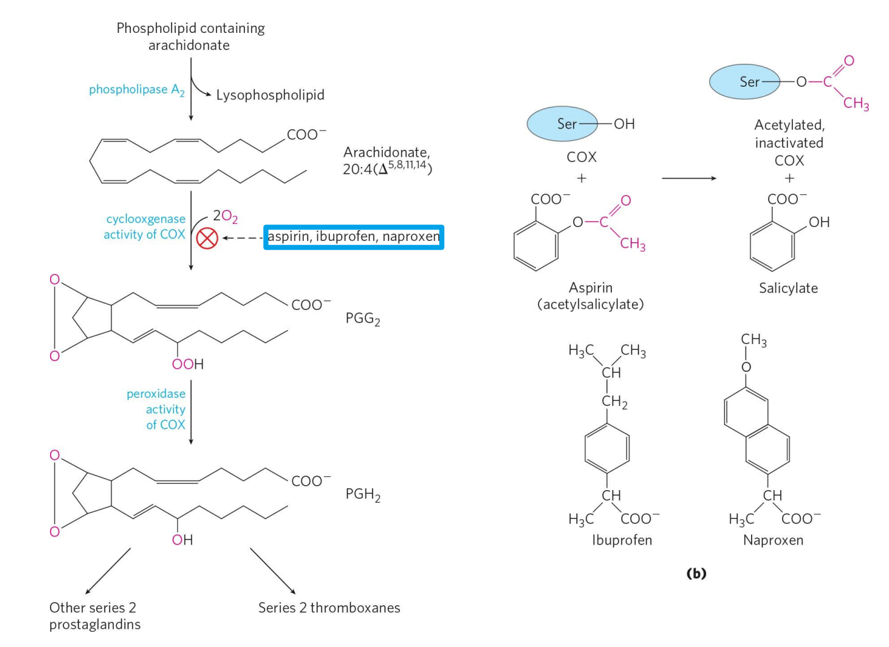

# 非甾体类抗炎药

[toc]

> + 本文链接 
>   + [MarkdownNotes/非甾体类抗炎药.md at main · Bluuur/MarkdownNotes (github.com)](https://github.com/Bluuur/MarkdownNotes/blob/main/药物化学/非甾体类抗炎药.md)
>   + [药物化学/非甾体类抗炎药.md · blur/MarkdownNotes - 码云 - 开源中国 (gitee.com)](https://gitee.com/bluur/MarkdownNotes/blob/main/药物化学/非甾体类抗炎药.md)

非甾体抗炎药（英语：Non-Steroidal Anti-Inflammatory Drug；缩写：NSAID），也译作非类固醇抗炎药。

## 概述

非甾体表示非糖皮质激素。糖皮质激素是另一种抗炎药物。在1950年代，糖皮质激素损伤了许多患者，所以新的药物中不含糖皮质激素便成为一个非常重要的信息。于是「NSAID」这一概念于1960年被发明。是一类具有解热镇痛效果的药物，在施用较高剂量时也具有消炎作用。

+ 镇痛 reduces pain
+ 消炎 decreases inflammation
+ 退烧 decreases fever
+ 防血栓 prevents blood clots

## 作用原理

炎症是机体对抗感染或误认代谢物为致敏原的一种免疫反应，使到血管扩张，增加血管通透性，增强环氧合酶(例如 COX-2)的作用。

花生四烯酸是前列腺素的前体，而构成细胞膜的磷脂又是花生四烯酸的前体，催化花生四烯酸向前列腺素转化的是环氧合酶，目前认为人体内的环氧合酶共有两大类：COX-1 和 COX-2；COX-1 主要存在于正常的细胞中，而COX-2则主要在炎性环境中存在。

非甾体抗炎药可以抑制环氧合酶的活性，减少前列腺素的合成，减轻炎性反应，此外还可以抑制磷酸二酯酶的活性，以提高细胞内 cAMP 的浓度，稳定溶酶体膜减少溶酶体的释放而抑制炎症反应。这种作用机制是与含甾体的抗炎药物糖皮质激素有着根本的区别。

非甾体抗炎药对环氧合酶的抑制作用是可逆的，抑制反应是一个平衡反应，药效与血药浓度密切相关，但有一个例外就是阿司匹林（乙酰水杨酸），其乙酰基会不可逆地结合环氧合酶活性中心的丝氨酸，不可逆地抑制环氧合酶活性。

## 不良反应

非甾体类抗炎药常见不良反应包括胃肠道、肾脏、肝心血管毒性和过敏反应等。

### 胃是如何受伤的*

甾体抗炎药的作用机理主要是抑制环氧酶，由于环氧酶1主要分布于血管、胃和肾，而由环氧酶催化生成的前列腺素有具有保护消化道粘膜的作用，因此非甾体抗炎药抑制环氧酶的作用会降低前列腺素对消化道粘膜的保护作用；另外，大部分的非甾体抗炎药在结构上都属于弱酸，有一定的酸性，对消化道刺激较强。两种作用合一，产生其最主要的不良反应：消化性溃疡。对有消化性溃疡病史或有严重疾病、高龄等危险因素者，可在服用NSAID的同时，预防性地同时服用抗溃疡药如H2受体拮抗剂、氢离子泵阻断剂[6]。

非甾体抗炎药的作用机理主要是抑制环氧酶，由于环氧酶 1 主要分布于血管、胃和肾，而由环氧酶催化生成的前列腺素有具有保护消化道粘膜的作用，因此非甾体抗炎药抑制环氧酶的作用会降低前列腺素对消化道粘膜的保护作用；另外，大部分的非甾体抗炎药在结构上都属于弱酸，有一定的酸性，对消化道刺激较强。两种作用合一，产生其最主要的不良反应：消化性溃疡。对有消化性溃疡病史或有严重疾病、高龄等危险因素者，可在服用NSAID的同时，预防性地同时服用抗溃疡药如 H2 受体拮抗剂、氢离子泵阻断剂。
## 常用药物

+ 阿司匹林，常用于头痛及发热
+ 布洛芬，常用于头痛及发热
+ 吲哚美辛
+ 双氯芬酸，常用于骨膜炎，关节炎，痛风等各类炎症
+ COX-2 抑制剂
  + 塞来昔布，商品名西乐葆，常用于骨关节炎，关节炎，急性痛症，痛风等各类炎症。
  + Etoricoxib，商品名万克适、安痛易，常用于骨膜炎、关节炎、痛风等各类炎症。
  + 美洛昔康

## 复方药

+ NSAID 与阿片类止痛药
  + 洛芬待因缓释片 可普芬
+ NSAID 与咖啡因
  + 咖啡因作用原理
  + 提高药效但伤胃

## 合理用药

+ 正确诊断，防止滥用。
  + 用于解热一般限定服用 3 d.
  + 用于止痛一般限定服用 5 d.

+ 不能联合用药
  + 同时只能使用一种，一面副作用累积发生

+ 最低剂量，最短疗程
+ 避免危险因素对用药的影响
  + 患溃疡病、高血要等疾病不宜使用

+ 加用胃黏膜保护剂
  + 减轻胃肠道直接刺激

无成瘾性*

## 研发方向

### 原始 COX 抑制剂

以往 COX 抑制剂是没有选择性的（即是他们抑制所有类型的COX），有严重不良的副作用，如消化性溃疡和消化不良等 。这可能是由于非甾体消炎止痛药「双重袭击」所致。除直接刺激胃粘膜（许多非甾体抗炎药是酸）之外，同时亦抑制了有保护胃肠道的前列腺素的合成。

### 新一代的 NSAIDs

选择性抑制是新一代的 NSAIDs 的主要特点。因为环氧化酶-2特别会引起组织发炎，新的 COX - 2 抑制剂必须要减少胃的刺激，减轻了消化性溃疡风险。环氧合酶-2选择 性抑制剂尚有其他副作用，风险是增加了肾衰竭，也有可能增加心脏病发作，血栓和中风的机会。一些经过改进的COX-2选择性非甾体消炎止痛药，如塞来昔布 （celecoxib）和 etoricoxib ，仍然广泛用在市场上。

### 一氧化氮释放型非甾体类抗炎药

一氧化氮（NO）参与调节多种生理功能，不仅在参与凋节血管张力方面有重要作用，还可抑制单核细胞及血小板粘附，血管平滑肌增殖，参与免疫反应，炎症反应等。更重要的是，一氧化氮也是一个胃肠粘膜防卫的重要介质，其在胃肠道的保护作 用上与PGs基本相同，且两者有协同作用。因此如果能在 NSAIDs 上引入一个能产生 NO 的部分，它们的抗炎、镇痛活性均比其母体药物强，而对胃及肾的不良发应大大 降低。

### 双重性抑制剂

传统的NSAIDs药物大多只能使 COX 的活性受到抑制，而花生四烯酸除经过环氧化酶（COX）代谢途径产生许多炎症介质外，亦可通过 5-脂氧酶（5-LOX）代谢途径产生大量白三烯等致炎物质。单纯制约其中一条代谢途径将引起大量的花生四烯酸进入其 它代谢途径，从而造成炎症介质发展。

## 参考

+ [Nonsteroidal anti-inflammatory drug - Wikipedia](https://en.wikipedia.org/wiki/Nonsteroidal_anti-inflammatory_drug)
+ Lehninger Principles of Biochemistry 7th-W. H. Freeman (2017) P2178-2180
+ [NSAIDs for pain relief - WebMD](https://www.webmd.com/arthritis/features/pain-relief-how-nsaids-work)
+ [How does caffeine keep us awake? - Hanan Qasim - YouTube](https://www.youtube.com/watch?v=foLf5Bi9qXs)

## 外部链接

+ [止痛药使用指北](https://mp.weixin.qq.com/s?__biz=MzkwMjI5ODE0Ng==&mid=2247483910&idx=1&sn=3f6729b9e98c549de9c934639914ffa2&chksm=c0a6ed4bf7d1645dabae1bcb12387240c72d1fe356fe85facdc9fac18b4c4dcde7cea53eb1d5&mpshare=1&scene=23&srcid=10062hqQhsTMwFlD0kUWHee3&sharer_sharetime=1665022564016&sharer_shareid=c1b763b2b3be72bb815b87135903edbd#rd)
