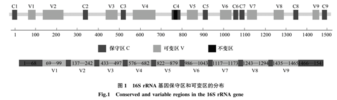
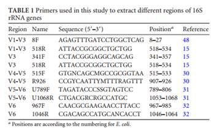
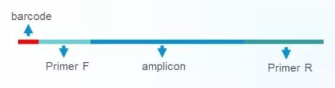

# 16S rRNA 测序鉴定细菌

对于微生物组学的研究，最常见的就是对微生物群落结构多样性的研究。也就是通过第二代高通量测序技术（Roche454 高通量测序、Illumina MiSeq 高通量测序等）对 16S rDNA / 18S rDNA / ITS等序列进行测序，获得样品中的微生物群落组成以及相对丰度。

## 16S rRNA

16S rRNA 即 16S ribosomal RNA，是原核核糖体 30S 小亚基的组成部分。

16S 中的 "S" 是一个沉降系数，亦即反映生物大分子在离心场中向下沉降速度的一个指标，值越高，说明分子越大。此外还有 5S, 23S rRNA。

16S rRNA 基因是细菌上编码 rRNA 相对应的 DNA 序列，存在于所有原核微生物的基因组中。种类少，含量大。

16S rRNA 具有高度的保守性和特异性以及该基因序列足够长（包含约 50 个功能域）。

随着 PCR 技术的出现及核酸研究技术的不断完善，16S rRNA 基因检测技术已成为病原菌检测和鉴定的一种强有力工具。数据库的不断完善，应用该技术可以实现对病原菌进行快速、微量、准确简便地分类鉴定和检测。

该技术主要有三个步骤：

+ 基因组 DNA 的获得，
+ 16S rRNA 基因片段的获得
+ 进行 16S rRNA 基因序列的分析

## 16S 测序区域

这与 16S rRNA 基因的特殊结构有关，其基因结构示意图如下图。基因全长 1500 bp 左右，基因序列包括间隔分布的保守区和可变区，对于细菌一般包括 8 个保守区（C1-C8）和 9 个可变区（V1-V9）。

不同种类的细菌有相同的保守区序列和不同的可变区序列，因此可以根据保守区序列设计引物来扩增环境样品中所有细菌 16S rRNA 基因，而根据可变区序列来区分不同种类的细菌。

传统方法中最常用的引物是 27F 和 1492R，几乎能扩增出完整的 16S rRNA 基因全长，由于目前二代高通量测序的读长限制，该引物不适用于高通量测序平台，但被广泛用于纯菌的分子鉴定。考虑到目前主流高通量测序平台读长的限制，只能对 16S rDNA 的某一段可变区进行测序。有的文献中选择测单 V 区（V3/V4/V6），有的测双 V 区（V3-V4 区或 V4-V5 区），还有的选择三 V 区（V1-V3 区、V5-V7 区或 V7-V9 区）进行 16S rDNA 测序。

### 测序区域的选择

长度越长越准确嘛，但是出于经济实惠的角度考虑，测双 V 甚至单 V 区也已经足够。一般而言，环境微生物组学常用的，也是认可度比较高的测序区域是 V3-V4，V4-V5，或者单测 V4 区。

中科院 周宁一，2013 年在 AEM 杂志发表文章（IntragenomicHeterogeneity of 16S rRNA Genes Causes Overestimation of Prokaryotic Diversity），研究比较了 16S 不同区域的测序结果，所选择的引物如下：

研究结果显示，V4-V5区域是最佳的测序区域，造成的基因组内异质性最小。

## 扩增子结构

+ Barcode
  + 样品标签，用于混池测序后区分序列来自哪个样本
+ Primer
  + 在 16S/ITS/18S 保守区设计的引物，用于扩增 rDNA 的部分高变区
+ Amplicon
  + 扩增的部分 rDNA