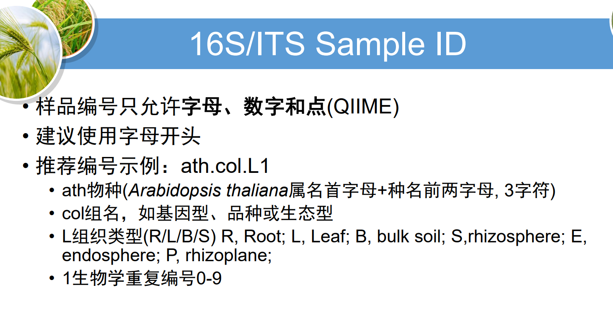
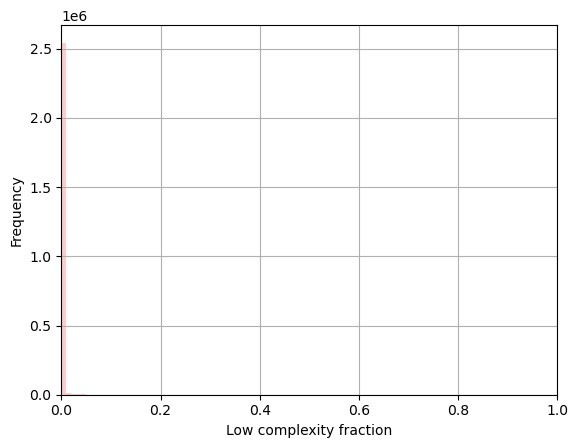
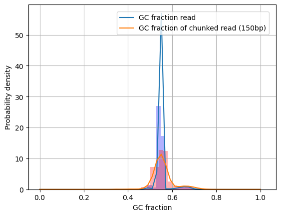
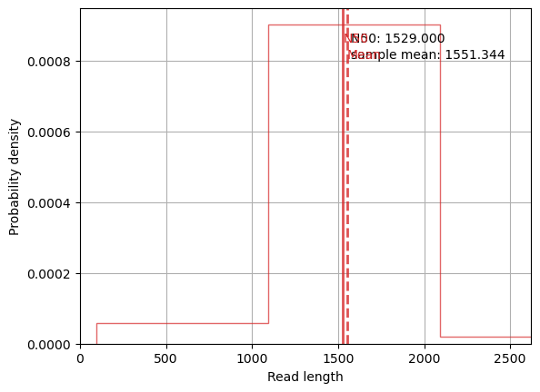
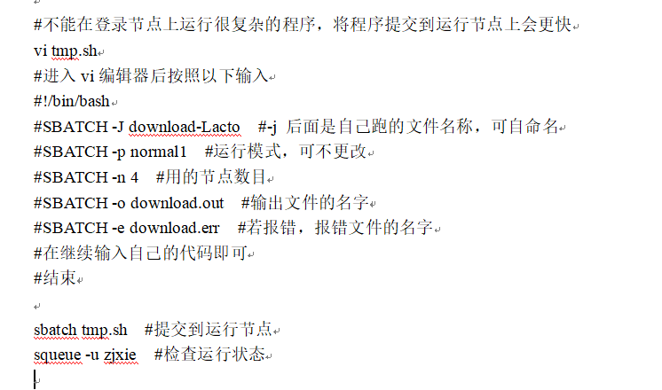

| 样品 ID     | 培养基       | 组织类型&编号 | F 引物 |
| ----------- | ------------ | ------------- | ------ |
| S3P01 _ _ _ | TSB          | 根际 3        | F72    |
| S2P02 _ _ _ | 10% TSB + PA | 根际 2        | F73    |
| S4P03 _ _ _ | 10% TSB      | 根际 4        | F74    |
| E1P04 _ _ _ | 10% TSB + PA | 根内 1        | F75    |
| S4P05 _ _ _ | TSB          | 根际 4        | F76    |
| S5P06 _ _ _ | TSB          | 根际 5        | F77    |
| S1P07 _ _ _ | 10% TSB + PA | 根际 1        | F78    |
| E2P08 _ _ _ | 10% TSB + PA | 根内 2        | F79    |
| S3P09 _ _ _ | 10% TSB + PA | 根际 3        | F80    |
| E1P10 _ _ _ | TSB          | 根内 1        | F81    |
| S1P11 _ _ _ | TSB          | 根际 1        | F82    |
| E5P12 _ _ _ | 10% TSB      | 根内 5        | F83    |
| E2P13 _ _ _ | 10% TSB      | 根内 2        | F84    |
| E5P14 _ _ _ | TSB          | 根内 5        | F85    |
| E6P15 _ _ _ | 10% TSB      | 根内 6        | F86    |
| E3P16 _ _ _ | 10% TSB      | 根内 3        | F87    |
| S1P17 _ _ _ | 10% TSB      | 根际 1        | F88    |
| S3P18 _ _ _ | 10% TSB      | 根际 3        | F89    |
| E3P19 _ _ _ | 10% TSB      | 根内 1        | F90    |
| S2P20 _ _ _ | 10% TSB      | 根际 2        | F91    |
| E4P21 _ _ _ | TSB          | 根内 4        | F92    |
| E4P22 _ _ _ | 10% TSB      | 根内 4        | F93    |
| S5P23 _ _ _ | 10% TSB      | 根际 5        | F94    |
| S2P24 _ _ _ | TSB          | 根际 2        | F95    |
| E2P25 _ _ _ | TSB          | 根内 2        | F96    |
| S4P26 _ _ _ | 10% TSB      | 根际 4        | F97    |
| E3P27 _ _ _ | TSB          | 根内 3        | F98    |
| E3P28 _ _ _ | 10% TSB + PA | 根内 3        | F99    |

+ S1：组织类型及编号（S：rhyzosphere，根际；E：endosphere，根内）。
+ P01：板号，共 28 板。
+ _ _ _：如 A01，表示 96 孔板第一行(A)第一列(01)。

---

测序结果的**low complexity fraction**频率分布在比较小的比例处，可能说明测序结果中存在着较多的**低复杂度区域**³。低复杂度区域（LCR）是指基因组中的一些区域，其序列具有较低的复杂度和信息含量³。这些区域通常由重复单元、富含某些碱基或缺乏多样性的序列组成³。LCR在许多重要的生物学过程中发挥作用，但我们对它们的序列、特征、关系和功能缺乏统一的认识³。

源: 与必应的对话， 2023/9/19
(1) A unified view of low complexity regions (LCRs) across species. https://elifesciences.org/articles/77058.
(2) Low Complexity Doubly Fractional OTFS Channel Estimation Based on L .... https://ieeexplore.ieee.org/document/10118773/.
(3) 4.5: Sizes of genomes - The C‑value paradox - Biology LibreTexts. https://bio.libretexts.org/Bookshelves/Genetics/Working_with_Molecular_Genetics_%28Hardison%29/Unit_I%3A_Genes_Nucleic_Acids_Genomes_and_Chromosomes/4%3A_Genomes_and_Chromosomes/4.5%3A_Sizes_of_genomes_-_The_Cvalue_paradox.
(4) A Low-Complexity OTFS Channel Estimation Method for Fractional Delay .... https://ieeexplore.ieee.org/document/10122554/.
(5) undefined. https://ieeexplore.ieee.org/servlet/opac?punumber=10118584.

低复杂度区域（LCR）是指基因组中的一些区域，其序列具有较低的复杂度和信息含量。这些区域通常由重复单元、富含某些碱基或缺乏多样性的序列组成。LCR在许多重要的生物学过程中发挥作用，但我们对它们的序列、特征、关系和功能缺乏统一的认识。

---

在测序中，**chunked read** 是指将长的DNA序列分成若干个小块，每个小块的长度通常在100到1000个碱基对之间¹. 这些小块被称为“**chunked reads**”或“**short reads**”，它们是测序仪单次测序所得到的碱基序列，也就是一连串的ATCGGGTA之类的¹. 由于**chunked reads**长度较短，因此需要将它们组装成更长的序列，以便进行后续的分析¹.

---

