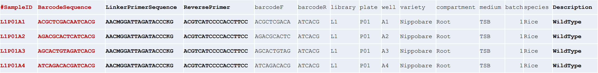

# 大豆根系微生物基因鉴定与基因功能预测分析流程

[toc]


以下过程均在 ` Ubuntu 18.04 bionic(on the Windows Subsystem for Linux)` 系统下完成。

本文连接：[大豆根系微生物基因鉴定与基因功能预测分析流程 at main · Bluuur/MarkdownNotes (github.com)](https://github.com/Bluuur/MarkdownNotes/blob/main/项目育人/大豆根系微生物基因鉴定与基因功能预测分析流程.md)

All Rights Reserve (C) 2023 Zidong Zh.

<a rel="license" href="http://creativecommons.org/licenses/by-nc/4.0/"></a><br />This work is licensed under a <a rel="license" href="http://creativecommons.org/licenses/by-nc/4.0/">Creative Commons Attribution-NonCommercial 4.0 International License</a>.


## 准备环境与输入文件

### 环境配置

#### Miniconda 安装

```bash
# 创建用于存放 Miniconda 的目录
mkdir miniconda 
# 下载指定版本的 Miniconda 安装脚本
wget https://repo.anaconda.com/miniconda/Miniconda3-py37_4.10.3-Linux-x86_64.sh 
# 运行安装脚本
bash Miniconda3-latest-Linux-x86_64.sh
# 完成安装后初始化 conda 环境
~/miniconda3/condabin/conda init
```

#### 解压 culturome 虚拟环境

```bash
# 创建虚拟环境目录
mkdir ~/miniconda/envs/culturome
cd ~/miniconda/envs/culturome
# 下载虚拟环境
wget https://bailab.genetics.ac.cn/db/conda/culturome.tar.gz
# 解压虚拟环境
tar -xzvf culturome.tar.gz
# 激活 culturome 环境
conda activate culturome
conda unpack
rm culturome.tar.gz
```

#### 下载 Culturome Pipeline^[1]^

```bash
# 创建用于存放 Culturome Pipeline 的目录
mkdir /mnt/c/microbiome 
cd /mnt/c/microbiome
# clone 仓库
git clone git@github.com:YongxinLiu/Culturome.git 
# 添加执行权限
chmod +x Culturome/script/* 
# 设置环境变量便于使用命令脚本
echo export PATH=`pwd`/Culturome/script:\$PATH >>  ~/.bashrc 
echo export PATH=~/Culturome/script:\$PATH >>  ~/.bashrc 
# 搭建项目结构
wd=/mnt/d/culture
mkdir -p $wd && cd $wd
db=/mnt/c/microbiome/Culturome
mkdir -p seq temp result
```

#### 安装 PICRUST2

​	PICRUST2 运行需 16 GB 以上内存，建议在服务器上运行。

```bash
# 下载并解压
wget https://github.com/picrust/picrust2/archive/v2.5.2.tar.gz
tar xvzf  v2.5.2.tar.gz
cd picrust2-2.5.2/
# 安装
conda env create -f picrust2-env.yaml
conda activate picrust2
pip install --editable .
# 检验安装
pytest
```

#### 安装 VSEARCH

以下命令需在 culturome 虚拟环境下运行。

```bash
conda install -c bioconda vsearch
```


### 准备输入文件

#### 准备测序数据

双端测序数据存放位置：

```
/mnt/d/culturome/seq/
├── BeanRoot_1.clean.fq.gz
└── BeanRoot_2.clean.fa.gz
```

#### 编写样本信息（Metadata mapping file）

​	使用 R 手动编写并导出符合 QIMME2 要求（http://qiime.org/documentation/file_formats.html ；访问于 2023 年 9 月）的 Metadata mapping file。



+ 第一列（SampleID）和第二列（Barcode）为开展分析必需。
+ 第三列（LinkerPrimerSequence）、第四列（ReversePrimer）和最后列为使用 QIIME2 分析必需。
+ 其他列为自定义字段。

​	生成的 Metadata mapping file 存放位置：

```
/mnt/d/culturome/result
├── en_mapping.txt
└── rhi_mapping.txt
```

#### 检验 Metadata mapping file

```bash
cd /mnt/d/culturome/result
mkdir validateMappingFile
validate_mapping_file.py -m en_mapping.txt -o validateMappingFile
validate_mapping_file.py -m rhi_mapping.txt -o validateMappingFile
```

+ 输出 `No errors or warnings were found in mapping file.` 则 Mapping file 无误。
+ 如果有错误，会在结果输出目录 `validateMappingFile` 下的 HTML 文件中高亮显示。

## 测序数据到扩增子

### 质量检测 

使用 FastQC 进行质量检测。

```bash
fastqc -o fastqc.test/ -t 4 seq.fastq.gz
```


### 双端序列合并

​	`time` 统计计算时间， `rush` 指定并行任务数量。

```bash
time echo BeanRoot | rush -j 3 \
	'vsearch -fastq_mergepairs \
	seq/BeanRoot_1.fq -reverse seq/BeanRoot_2.fq \
	-fastqout temp/BeanRoot.fq'
```

### 样本拆分

#### 提取 Barcodes

​	从数据中提取 Barcodes，用于序列孔来源识别。从此步骤开始分根内、根际分别运行。

```bash
# 创建中间结果目录
mkdir -p /temp/en /temp/rhi

# 根内 en
time echo BeanRoot |rush -j 3 \
	'extract_barcodes.py \
		-f temp/BeanRoot.fq -m result/en_mapping.txt \
		-c barcode_paired_stitched \
		--bc1_len 7 --bc2_len 7 \
		-a --rev_comp_bc2 \
		-o temp/en'
		
# 根际 rhi
time echo BeanRoot | rush -j 3 \
	'extract_barcodes.py \
		-f temp/BeanRoot.fq -m result/rhi_mapping.txt \
		-c barcode_paired_stitched \
		--bc1_len 7 --bc2_len 7 \
		-a --rev_comp_bc2 \
		-o temp/rhi'
```

#### 序列按来源命名

​	利用 Barcodes 与 Mapping file，将每条序列重命名为板和孔位置。

```bash
# 根内 en
time echo BeanRoot | rush -j 3 \
    'split_libraries_fastq.py \
        -i temp/en/reads.fastq \
        -b temp/en/barcodes.fastq \
        -m result/en_mapping.txt \
        -q 19 --max_barcode_errors 0 \
        --barcode_type 14 --phred_offset 33 \
        -o temp/en'

# 根际 rhi
time echo BeanRoot | rush -j 3 \
    'split_libraries_fastq.py \
        -i temp/rhi/reads.fastq \
        -b temp/rhi/barcodes.fastq \
        -m result/rhi_mapping.txt \
        -q 19 --max_barcode_errors 0 \
        --barcode_type 14 --phred_offset 33 \
        -o temp/rhi'
```

#### 修改序列 ID 格式

​	将序列 ID 修改为 VSEARCH 要求格式。

```bash
# 根内 en
cut -f 1 -d ' ' temp/en/seqs.fna | sed 's/_/./' >> temp/en/en_qc.fa

# 根际 rhi
cut -f 1 -d ' ' temp/rhi/seqs.fna | sed 's/_/./' >> temp/rhi/rhi_qc.fa
```

### 统计每板每孔中测序读长

```bash
# 创建此步分析结果目录
mkdir -p result/split/rhi result/split/en

# 绘制柱状图
## 根内 en
tail -n+16 temp/en/split_library_log.txt | \
	head -n-4 > result/split/en/en.txt

Rscript /mnt/c/microbiome/Culturome/script/stat_split_bar.R \
    -i result/en_mapping.txt \
    -d result/split/en/en.txt \
    -o result/split/en
    
## 根际 rhi
tail -n+16 temp/rhi/split_library_log.txt | \
	head -n-4 > result/split/rhi/rhi.txt

Rscript /mnt/c/microbiome/Culturome/script/stat_split_bar.R \
    -i result/rhi_mapping.txt \
    -d result/split/rhi/rhi.txt \
    -o result/split/rhi
```

+ 每个孔的测序数量 `result/split/*/*.txt.well.pdf/png`
+ 每个孔的测序数量直方图 `result/split/*/*.txt.histogram.pdf/png`
+ 每个板的测序数量柱状图 `result/split/*/*.txt.plate.pdf/png`

### 切除引物序列

```bash
# 根内 en
time vsearch --fastx_filter temp/en/en_qc.fa \
    --fastq_stripleft 19 --fastq_stripright 18 \
    --fastaout temp/en/en_filtered.fa

# 根际 rhi
time vsearch --fastx_filter temp/rhi/rhi_qc.fa \
    --fastq_stripleft 19 --fastq_stripright 18 \
    --fastaout temp/rhi/rhi_filtered.fa
```

## 代表性序列鉴定和物种注释

### 挑选代表序列

#### 去除冗余序列

​	计算每个序列出现的频率，去除小于 10 的读长。

```bash
# 根内 en
time vsearch --derep_fulllength temp/en/en_filtered.fa \
    --relabel Uni --minuniquesize 10 --sizeout \
    --output temp/en/en_uniques.fa

# 根际 rhi
time vsearch --derep_fulllength temp/rhi/rhi_filtered.fa \
    --relabel Uni --minuniquesize 10 --sizeout \
    --output temp/rhi/rhi_uniques.fa
```

#### 鉴定 ASV

采用 UNOISE 算法（unoise3）去噪，鉴定 ASV。

```bash
# 根内 en
vsearch --cluster_unoise temp/en/en_uniques.fa --minsize 10 \
	--centroids temp/en/en_Zotus.fa

# 根际 rhi
vsearch --cluster_unoise temp/rhi/rhi_uniques.fa --minsize 10 \
	--centroids temp/rhi/rhi_Zotus.fa
```

#### 从头去除嵌合体

```bash
# 根内 en
vsearch --uchime3_denovo temp/en/en_Zotus.fa --relabel ASV_ \
	--nonchimeras result/en_ASV.fa

# 根际 rhi
vsearch --uchime3_denovo temp/rhi/rhi_Zotus.fa --relabel ASV_ \
	--nonchimeras result/rhi_ASV.fa    
```

### 构建 ASV 表

​	比对读长到 ASV 进行定量。
```bash
# 根内 en
time vsearch --usearch_global temp/en/en_filtered.fa \
    --db result/en_ASV.fa \
    --otutabout temp/en/en_ASV_table.txt \
    --id 0.97
# 根际 rhi
time vsearch --usearch_global temp/rhi/rhi_filtered.fa \
    --db result/rhi_ASV.fa \
    --otutabout temp/rhi/rhi_ASV_table.txt \
    --id 0.97
```

### 假阳性率控制

```bash
# 计算样阴、阳性对照的数据量，确定过滤假阳性的阈值
## 根内 en
Rscript /mnt/c/microbiome/Culturome/script/negative_threshold.R \
    --input temp/en/en_ASV_table.txt \
    --metadata result/en_mapping.txt \
    --threshold 1 \
    --negative A12 --positive B12 \
    --output result/en_fdr.txt
        
## 根际 rhi
Rscript /mnt/c/microbiome/Culturome/script/negative_threshold.R \
    --input temp/rhi/rhi_ASV_table.txt \
    --metadata result/rhi_mapping.txt \
    --threshold 1 \
    --negative A12 --positive B12 \
    --output result/rhi_fdr.txt
```

```bash
# 过滤潜在假阳性孔
## 根内 en
Rscript /mnt/c/microbiome/Culturome/script/otutab_trim.R \
    --input temp/en/en_ASV_table.txt \
    --min_sample_size `cat result/en_fdr.txt` \
    --output result/en_ASV_table.txt
    
sed -i '1 s/#OTU ID/OTUID/' result/en_ASV_table.txt


## 根际 rhi
Rscript /mnt/c/microbiome/Culturome/script/otutab_trim.R \
    --input temp/rhi/rhi_ASV_table.txt \
    --min_sample_size `cat result/rhi_fdr.txt` \
    --output result/rhi_ASV_table.txt
    
sed -i '1 s/#OTU ID/OTUID/' result/rhi_ASV_table.txt
```


### 物种注释

```bash
# 基于RDP训练集16，置信度阈值0.6.
## 根内 en
vsearch --sintax result/en_ASV.fa \
    --db /mnt/c/microbiome/Culturome/db/rdp_16s_v16_sp.fa \
    --tabbedout temp/en/en_ASV.fa.tax \
    --sintax_cutoff 0.6
        
## 根际 rhi
vsearch --sintax result/rhi_ASV.fa \
    --db /mnt/c/microbiome/Culturome/db/rdp_16s_v16_sp.fa \
    --tabbedout temp/rhi/rhi_ASV.fa.tax \
    --sintax_cutoff 0.6
```

```bash
# 制作2列，8列的物种注释表
## 根内 en
cut -f 1,4 temp/en/en_ASV.fa.tax | \
    sed 's/\td/\tk/;s/:/__/g;s/,/;/g;s/"//g;s/\/Chloroplast//' \
    > result/en_taxonomy_2.txt
    
awk 'BEGIN{OFS=FS="\t"} {delete a; a["k"]="Unassigned";a["p"]="Unassigned";a["c"]="Unassigned";a["o"]="Unassigned";a["f"]="Unassigned";a["g"]="Unassigned";a["s"]="Unassigned"; split($2,x,";");for(i in x){split(x[i],b,"__");a[b[1]]=b[2];} print $1,a["k"],a["p"],a["c"],a["o"],a["f"],a["g"],a["s"];}' \
    result/en_taxonomy_2.txt | \
    sed '1 i #OTU ID\tKingdom\tPhylum\tClass\tOrder\tFamily\tGenus\tSpecies' | \
    sed 's/#//g;s/ //g' > \
    result/en_taxonomy_8.txt
    
    
## 根际 rhi
cut -f 1,4 temp/rhi/rhi_ASV.fa.tax | \
    sed 's/\td/\tk/;s/:/__/g;s/,/;/g;s/"//g;s/\/Chloroplast//' \
    > result/rhi_taxonomy_2.txt

awk 'BEGIN{OFS=FS="\t"} {delete a; a["k"]="Unassigned";a["p"]="Unassigned";a["c"]="Unassigned";a["o"]="Unassigned";a["f"]="Unassigned";a["g"]="Unassigned";a["s"]="Unassigned"; split($2,x,";");for(i in x){split(x[i],b,"__");a[b[1]]=b[2];} print $1,a["k"],a["p"],a["c"],a["o"],a["f"],a["g"],a["s"];}' \
    result/rhi_taxonomy_2.txt | \
    sed '1 i #OTU ID\tKingdom\tPhylum\tClass\tOrder\tFamily\tGenus\tSpecies' | \
    sed 's/#//g;s/ //g' > \
    result/rhi_taxonomy_8.txt
```

```bash
# ASV表按属合并
## 根内 en
awk 'BEGIN{FS=OFS="\t"} NR==FNR{a[$1]=$7} NR>FNR{print $0,a[$1]}' \
    result/en_taxonomy_8.txt result/en_ASV_table.txt | \
    sed '/\t$/d' | \
    sed '1 s/Genus/KO/' > \
    result/en_ASV_table7.txt

Rscript /mnt/c/microbiome/Culturome/script/mat_gene2ko.R \
    -i result/en_ASV_table7.txt \
    -n 100 \
    -o result/en_genus


## 根际 rhi
awk 'BEGIN{FS=OFS="\t"} NR==FNR{a[$1]=$7} NR>FNR{print $0,a[$1]}' \
    result/rhi_taxonomy_8.txt result/rhi_ASV_table.txt | \
    sed '/\t$/d' | \
    sed '1 s/Genus/KO/' > \
    result/rhi_ASV_table7.txt

Rscript /mnt/c/microbiome/Culturome/script/mat_gene2ko.R \
    -i result/rhi_ASV_table7.txt \
    -n 100 \
    -o result/rhi_genus
```


## 物种树展示菌种分布

### 培养菌物种树绘制

```bash
 # 准备 graphlan 输入文件
 ## 根内 en
 Rscript /mnt/c/microbiome/Culturome/script/graphlan_prepare.R \
     --input result/en_ASV_table.txt \
     --taxonomy result/en_taxonomy_8.txt \
     --abundance 0 --number 150 \
     --output result/en_graphlan/ 
     
## 根际 rhi 
Rscript /mnt/c/microbiome/Culturome/script/graphlan_prepare.R \
    --input result/rhi_ASV_table.txt \
    --taxonomy result/rhi_taxonomy_8.txt \
    --abundance 0 --number 150 \
    --output result/rhi_graphlan/ 
    
# 绘图
bash graphlan_plot.sh -i /mnt/c/microbiome/Culturome -o result/en_graphlan
bash graphlan_plot.sh -i /mnt/c/microbiome/Culturome -o result/rhi_graphlan
```

## 功能预测

### PICRUSt2 功能预测

​	以下命令在服务器上运行。

```bash
# 根内
picrust2_pipeline.py -s result/en_ASV.fa -i result/en_ASV_tab.txt -o picrust2_result/en -p 4

# 根际
picrust2_pipeline.py -s result/en_ASV.fa -i result/en_ASV_tab.txt -o picrust2_result/en -p 4
```

### 结果注释

+ 核心输出结果
  + `EC_metagenome_out` 目录
    + 非分层的预测宏基因组 EC 数量 `pred_metagenome_unstrat.tsv`
    + 基于预测 16S 拷贝数校正的特征表 `seqtab_norm.tsv`
    + 每个样本的 NSTI 权重 `weighted_nsti.tsv`
  + `KO_metagenome_out`
    + 和 `EC_metagenome_out` 类似, 但为宏基因组 KO 表
  + `pathways_out`
  + 包括预测的通路丰度和覆盖度，基于 EC 数量丰度，一般仅有 400 多行。

在结果目录下运行以下命令：

```bash
add_descriptions.py -i EC_metagenome_out/pred_metagenome_unstrat.tsv.gz -m EC \
      -o EC_metagenome_out/pred_metagenome_unstrat_descrip.tsv.gz
  
add_descriptions.py -i KO_metagenome_out/pred_metagenome_unstrat.tsv.gz -m KO \
      -o KO_metagenome_out/pred_metagenome_unstrat_descrip.tsv.gz

add_descriptions.py -i pathways_out/path_abun_unstrat.tsv.gz -m METACYC \
      -o pathways_out/path_abun_unstrat_descrip.tsv.gz
```


### 结果可视化

​	使用 R 包 `ggpicrust2` 进行结果可视化。

```R
library(readr)
library(ggpicrust2)
library(tibble)
library(tidyverse)
library(ggprism)
library(patchwork)

# If you want to analyze KEGG pathway abundance instead of KO within the pathway, turn ko_to_kegg to TRUE.
# KEGG pathways typically have more explainable descriptions.

# Load metadata as a tibble
# data(metadata)
metadata <- read_delim("path/to/your/metadata.txt", delim = "\t", escape_double = FALSE, trim_ws = TRUE) 

# Load KEGG pathway abundance
# data(kegg_abundance)
kegg_abundance <- ko2kegg_abundance("path/to/your/pred_metagenome_unstrat.tsv") 

# Perform pathway differential abundance analysis (DAA) using ALDEx2 method
# Please change group to "your_group_column" if you are not using example dataset
daa_results_df <- pathway_daa(abundance = kegg_abundance, metadata = metadata, group = "Environment", daa_method = "ALDEx2", select = NULL, reference = NULL) 

# Filter results for ALDEx2_Welch's t test method
# Please check the unique(daa_results_df$method) and choose one
daa_sub_method_results_df <- daa_results_df[daa_results_df$method == "ALDEx2_Wilcoxon rank test", ]

# Annotate pathway results using KO to KEGG conversion
daa_annotated_sub_method_results_df <- pathway_annotation(pathway = "KO", daa_results_df = daa_sub_method_results_df, ko_to_kegg = TRUE)

# Generate pathway error bar plot
# Please change Group to metadata$your_group_column if you are not using example dataset
p <- pathway_errorbar(abundance = kegg_abundance, daa_results_df = daa_annotated_sub_method_results_df, Group = metadata$Environment, p_values_threshold = 0.05, order = "pathway_class", select = NULL, ko_to_kegg = TRUE, p_value_bar = TRUE, colors = NULL, x_lab = "pathway_name")

# If you want to analyze EC, MetaCyc, and KO without conversions, turn ko_to_kegg to FALSE.

# Load metadata as a tibble
# data(metadata)
metadata <- read_delim("path/to/your/metadata.txt", delim = "\t", escape_double = FALSE, trim_ws = TRUE)

# Load KO abundance as a data.frame
# data(ko_abundance)
ko_abundance <- read.delim("path/to/your/pred_metagenome_unstrat.tsv")

# Perform pathway DAA using ALDEx2 method
# Please change column_to_rownames() to the feature column if you are not using example dataset
# Please change group to "your_group_column" if you are not using example dataset
daa_results_df <- pathway_daa(abundance = ko_abundance %>% column_to_rownames("#NAME"), metadata = metadata, group = "Environment", daa_method = "ALDEx2", select = NULL, reference = NULL)

# Filter results for ALDEx2_Kruskal-Wallace test method
daa_sub_method_results_df <- daa_results_df[daa_results_df$method == "ALDEx2_Wilcoxon rank test", ]

# Annotate pathway results without KO to KEGG conversion
daa_annotated_sub_method_results_df <- pathway_annotation(pathway = "KO", daa_results_df = daa_sub_method_results_df, ko_to_kegg = FALSE)

# Generate pathway error bar plot
# Please change column_to_rownames() to the feature column
# Please change Group to metadata$your_group_column if you are not using example dataset
p <- pathway_errorbar(abundance = ko_abundance %>% column_to_rownames("#NAME"), daa_results_df = daa_annotated_sub_method_results_df, Group = metadata$Environment, p_values_threshold = 0.05, order = "group",
select = daa_annotated_sub_method_results_df %>% arrange(p_adjust) %>% slice(1:20) %>% dplyr::select(feature) %>% pull(), 
ko_to_kegg = FALSE, 
p_value_bar = TRUE, 
colors = NULL, 
x_lab = "description")

# Workflow for MetaCyc Pathway and EC

# Load MetaCyc pathway abundance and metadata
data("metacyc_abundance")
data("metadata")

# Perform pathway DAA using LinDA method
# Please change column_to_rownames() to the feature column if you are not using example dataset
# Please change group to "your_group_column" if you are not using example dataset
metacyc_daa_results_df <- pathway_daa(abundance = metacyc_abundance %>% column_to_rownames("pathway"), metadata = metadata, group = "Environment", daa_method = "LinDA")

# Annotate MetaCyc pathway results without KO to KEGG conversion
metacyc_daa_annotated_results_df <- pathway_annotation(pathway = "MetaCyc", daa_results_df = metacyc_daa_results_df, ko_to_kegg = FALSE)

# Generate pathway error bar plot
# Please change column_to_rownames() to the feature column
# Please change Group to metadata$your_group_column if you are not using example dataset
pathway_errorbar(abundance = metacyc_abundance %>% column_to_rownames("pathway"), daa_results_df = metacyc_daa_annotated_results_df, Group = metadata$Environment, ko_to_kegg = FALSE, p_values_threshold = 0.05, order = "group", select = NULL, p_value_bar = TRUE, colors = NULL, x_lab = "description")

# Generate pathway heatmap
# Please change column_to_rownames() to the feature column if you are not using example dataset
# Please change group to "your_group_column" if you are not using example dataset
feature_with_p_0.05 <- metacyc_daa_results_df %>% filter(p_adjust < 0.05)
pathway_heatmap(abundance = metacyc_abundance %>% filter(pathway %in% feature_with_p_0.05$feature) %>% column_to_rownames("pathway"), metadata = metadata, group = "Environment")

# Generate pathway PCA plot
# Please change column_to_rownames() to the feature column if you are not using example dataset
# Please change group to "your_group_column" if you are not using example dataset
pathway_pca(abundance = metacyc_abundance %>% column_to_rownames("pathway"), metadata = metadata, group = "Environment")

# Run pathway DAA for multiple methods
# Please change column_to_rownames() to the feature column if you are not using example dataset
# Please change group to "your_group_column" if you are not using example dataset
methods <- c("ALDEx2", "DESeq2", "edgeR")
daa_results_list <- lapply(methods, function(method) {
  pathway_daa(abundance = metacyc_abundance %>% column_to_rownames("pathway"), metadata = metadata, group = "Environment", daa_method = method)
})

# Compare results across different methods
comparison_results <- compare_daa_results(daa_results_list = daa_results_list, method_names = c("ALDEx2_Welch's t test", "ALDEx2_Wilcoxon rank test", "DESeq2", "edgeR"))
```

## 参考文献

Jingying Zhang, Yong-Xin Liu, Xiaoxuan Guo, Yuan Qin, Ruben Garrido-Oter, Paul Schulze-Lefert, Yang Bai. 2021. High-throughput cultivation  and identification of bacteria from the plant root microbiota. Nature Protocols 16: 988-1012. https://doi.org/10.1038/s41596-020-00444-7

Douglas, G.M., Maffei, V.J., Zaneveld, J.R. et al. PICRUSt2 for prediction of metagenome functions. Nat Biotechnol 38, 685–688 (2020). https://doi.org/10.1038/s41587-020-0548-6

Chen Yang and others. (2023). ggpicrust2: an R package for PICRUSt2 predicted functional profile analysis and visualization. Bioinformatics, btad470. https://doi.org/10.1093/bioinformatics/btad470
