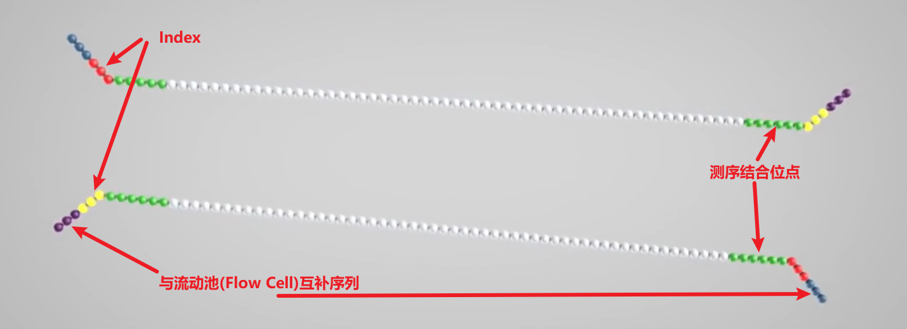
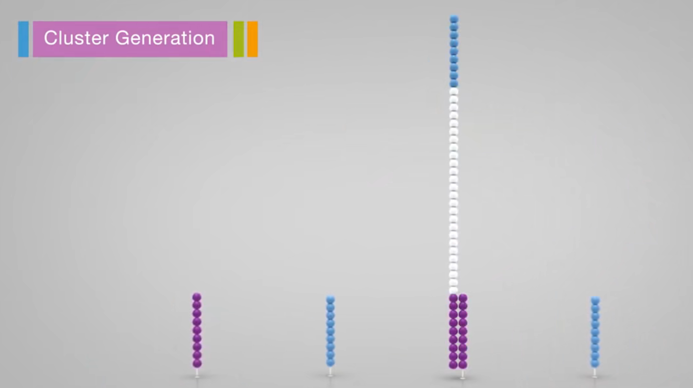
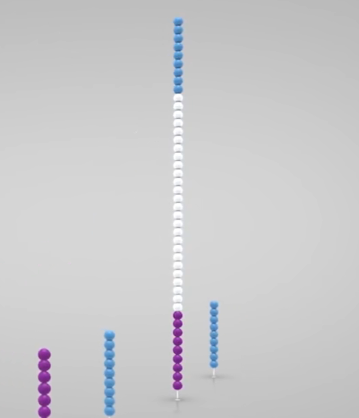
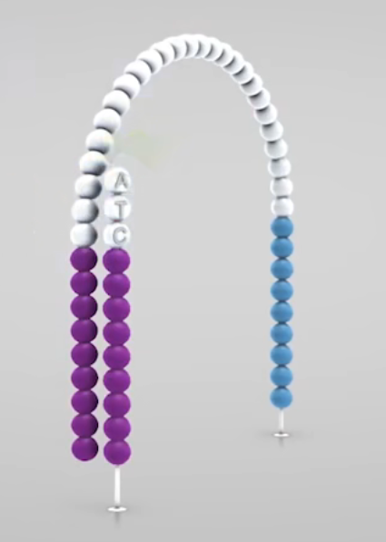

# 测序原理

## 第一代测序 Sanger 测序

第一代 DNA 测序技术用的是1975 年由桑格（Sanger）和考尔森（Coulson）开创的链终止法或者是 1976-1977 年由马克西姆（Maxam）和吉尔伯特（Gilbert）发明的化学法（链降解）。

在 1977 年，桑格测定了第一个基因组序列，是噬菌体 X174 的，全长 5375 个碱基。自此，人类获得了窥探生命遗传差异本质的能力，并以此为开端步入基因组学时代。

研究人员在 Sanger 法的多年实践之中不断对其进行改进。在2001年，完成的首个人类基因组图谱就是以改进了的 Sanger 法为其测序基础，Sanger 法核心原理是：由于 $ddNTP$ 的 $2’$ 和 $3’$ 都不含羟基，其在 DNA 的合成过程中不能形成磷酸二酯键，因此可以用来中断 DNA 合成反应，在 4 个 DNA 合成反应体系中分别加入一定比例带有放射性同位素标记的 ddNTP（分为：ddATP, ddCTP, ddGTP 和 ddTTP），通过凝胶电泳和放射自显影后可以根据电泳带的位置确定待测分子的 DNA 序列。

通过 4 组添加不同 ddNTP 的反应，可以合成起始位置相同，最后一个碱基已知的不同长度的 DNA 片段，通过电泳技术将其分开后，可以根据最后一个碱基信息拼接整个序列的信息。

由于小片段在前，大片段在后，因此我们需要逆向读取序列。

## 二代测序原理 Illumina Sequencing By S

+ 样本准备 Sample Prep

  + 提取样品 DNA，通过超声波随机打断
  + 使用酶将两端补平，使用 Klenow 酶在 $3'$ 端加一个 A 碱基（用于连接接头(adaptors)序列）
  + 添加特定接头序列
    + 测序结合位点 Sequencing binding site
    + 标签 Index / Barcode
      + 区分每个样品及正负链

    + 与流动池寡核苷酸互补区域 Regions complementary to the Flowcell oligos
    + 

  + 通过以上方法获得的 DNA 片段集合叫做 DNA 文库(DNA library)

+ 成簇 Cluster Generation

  + 即 DNA 被扩增的过程，在流动池(Flowcell)中完成，是一片带有 8 条通道(lanes)的玻璃载玻，每个通道内表面附有两种 DNA 引物(流动池序列)

  1. 引物与 DNA 片段的接头序列互补配对
     
  2. 通过聚合酶合成杂交片段后，加入 $\mathrm{NaOH}$ 使 DNA 双链变性，洗去原始模板链
     
  3. 桥式扩增
     
  4. 反向链被切断洗去，仅留下正向链。封锁 $3'$ 端防止特异性结合重新形成单链桥

+ 测序 Sequencing

  1. 在 Flowcell 中加入荧光标记的 $dNTP$ 和酶，由引物开始合成子链。
     由于 $dNTP \ 3'$ 端存在叠氮基会阻碍子链延伸，使得每个循环只能测得一个碱基。
     合成完一个碱基后，Flowcell 通入液体洗去多余的 $dNTP$ 和酶，使用显微镜激光扫描荧光信号。
     
  2. 加入化学试剂将叠氮基团与荧光基团切除，然后 Flowcell 再通入荧光标记的 $dNTP$ 和酶，由引物起始开始合成一个碱基。不断重复这个过程，完成第一次读取。
  3. 第一次读取完成后，洗去复制出的链
  4. 加入 Index 片段引物并测序，得到 index 序列
  5. 模板链 $3'$ 端去保护，完成双末端测序（得到 index，同时反向合成链）
     
  6. 变形后切除并洗去正向链，然后测序反向链

+ 数据分析 Data Analysis

  + 测序完成后会产生数百万个 reads，基于在样品准备时构建的 index 分类来自不同样本的序列。对于每个样品来说，具有相似延伸的碱基被聚在一起。正向和反向 read 配对生成连续序列。这些序列通过与参考基因组匹配后，实现完整序列的构建。

---

第二代测序技术的局限

读长短成了下一代测序平台的致命伤，这主要是由于 DNA 簇中存在的光学信号移相造成的。另外，由于需要序列扩增，不同长度的片段也不容易实现均一扩增。

# 全基因组测序

（1）逐步克隆法
 逐步克隆法是比较传统的测序策略，是在高通量测序之前主要采用的方法。这个方法涉及到了物理图谱和遗传图谱，首先来简单了解一下这两个概念。
 遗传图谱是指利用了 DNA 重组的原理，找到基因和多态性 DNA 路标的相对关系。最常用的图谱叫做序列标签位点（sequence tagged site，STS）图谱。一般来说，每个 STS 序列在基因组上都是唯一的，每隔 100 kb 左右设立一个 STS，可以是随机取的，也可以是表达序列。
 接着要构建大片段的插入基因组文库（BAC 文库）。将物种的所有基因打断成为大概 200 kb 左右的大片段 DNA，再与载体连接，转化克隆菌株。每一个菌落都带有相同的大片段 DNA 。将每个菌落在 STS - PCR 反应池中检验。检测不同的片段和 STS 的连锁情况。再进行测序得到它们之间的物理距离，通过 STS 进行拼接成为不同的 contig。但是由于STS通常不能覆盖整个基因组，需要后续的延伸形成将不同的 contig 连接起来。
 通常以这种方法得到的序列质量很好，但是很繁琐，构建图谱这一步就使得在一些物种的应用上受到限制。但是它对于计算机的要求比较低，需要具备一定的遗传知识。可以应用于人，线虫等物种。
 （2）全基因组鸟枪法
 这种方法的思路很简单，将基因组打断测序，由重叠序列进行拼接，这是高通量测序出现以后的主要测序策略。但是它对于拼接算法的要求很高，拼接质量也不如上个方法好，但是胜在速度快。可以应用于果蝇，拟南芥，水稻等物种。
 该方法一般需要经历以下的步骤：
 基因组特征预测，包括基因组大小，杂合度，倍性，重复性等等-全基因组测序-序列测序的质量评估和控制-基因组拼接-拼接质量评估。

