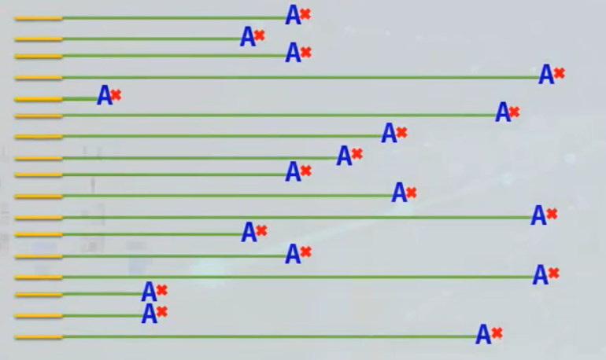
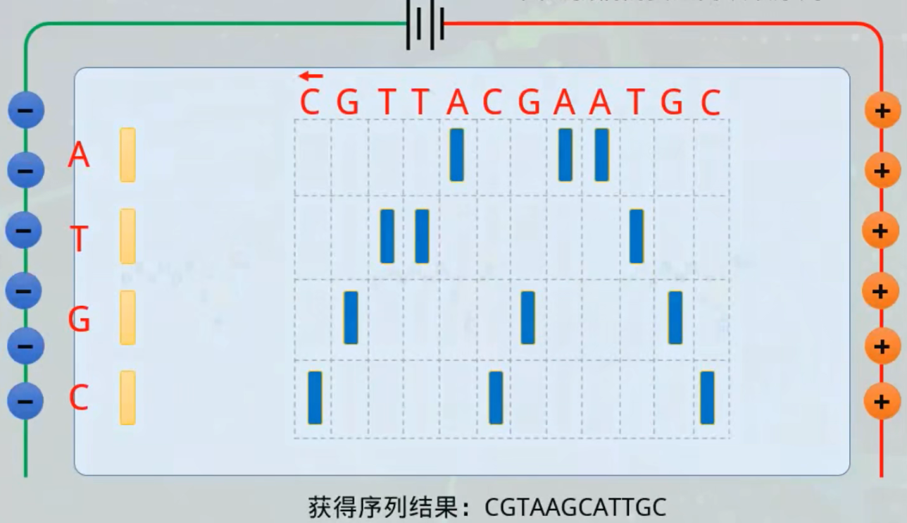
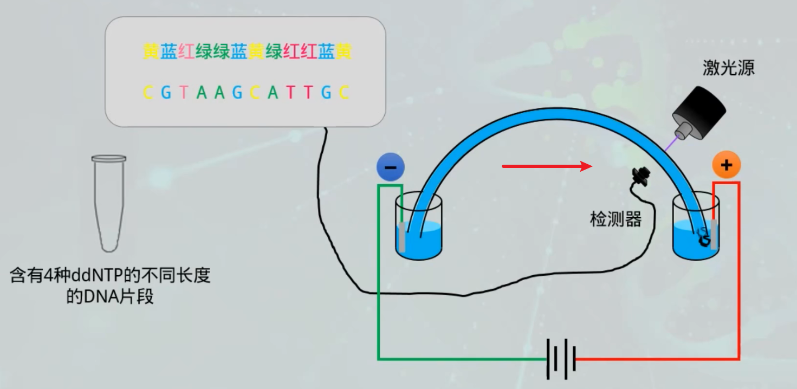

# 测序原理

## 第一代测序 Sanger 测序

第一代 DNA 测序技术用的是1975 年由桑格（Sanger）和考尔森（Coulson）开创的链终止法或者是 1976-1977 年由马克西姆（Maxam）和吉尔伯特（Gilbert）发明的化学法（链降解）。

在 1977 年，桑格测定了第一个基因组序列，是噬菌体 X174 的，全长 5375 个碱基。自此，人类获得了窥探生命遗传差异本质的能力，并以此为开端步入基因组学时代。

研究人员在 Sanger 法的多年实践之中不断对其进行改进。在2001年，完成的首个人类基因组图谱就是以改进了的 Sanger 法为其测序基础，Sanger 法核心原理是：由于 $ddNTP$ 的 $2’$ 和 $3’$ 都不含羟基，其在 DNA 的合成过程中不能形成磷酸二酯键，因此可以用来中断 DNA 合成反应，在 4 个 DNA 合成反应体系中分别加入一定比例带有放射性同位素标记的 ddNTP（分为：ddATP, ddCTP, ddGTP 和 ddTTP），通过凝胶电泳和放射自显影后可以根据电泳带的位置确定待测分子的 DNA 序列。

通过 4 组添加不同 ddNTP 的反应，可以合成其实位置相同，最后一个碱基已知的不同长度的 DNA 片段，通过电泳技术将其分开后，可以根据最后一个碱基信息拼接整个序列的信息。

由于小片段在前，大片段在后，因此我们需要逆向读取序列。

## 二代测序原理 Illumina Sequencing

+ **样本准备 Sample Prep**
+ **成簇 Cluster Generation**
+ **测序 Sequencing**
+ **数据分析 Data Analysis**

