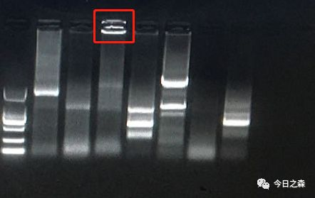
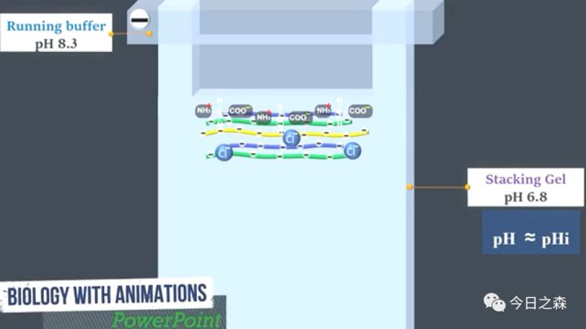
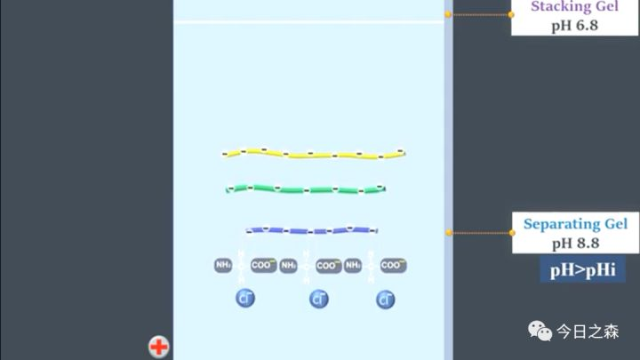
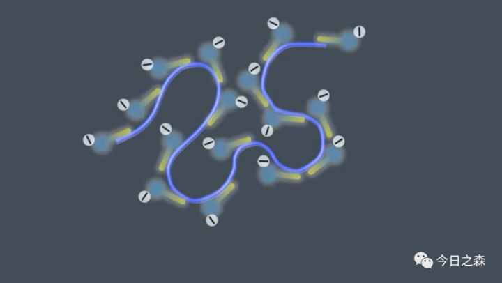

# 1 琼脂糖凝胶电泳

## **1.1 琼脂糖凝胶电泳原理**

琼脂糖凝胶电泳是用琼脂糖作支持介质的一种电泳方法。其分析原理与其他支持物电泳最主要区别是:它兼有「分子筛」和「电泳」的双重作用

琼脂糖凝胶具有网络结构，分子通过时会受到阻力，大分子物质受到的阻力大，因此在凝胶电泳中，带电颗粒的分离不仅取决于净电荷的性质和数量，而且还取决于分子大小。

DNA 在碱性条件下（缓冲液pH8.0）带负电荷，在电场中通过凝胶介质向正极移动，不同DNA片段由于分子和构型不同，在电场中的泳动速率也不同。核酸染料可嵌入DNA分子碱基对间形成荧光络合物，经紫外线照射后，可分出不同的区带。

## **1.2 用途**

核酸的分离和纯化

## **1.3 核酸染料**

+ **EB（溴化乙锭）染料**

EB是极易渗透细胞膜与胞内DNA嵌合的小分子，它具有平面共轭大环结构，是典型的DNA 分子插入试剂，菲啶环插入到DNA分子的碱基对之间，与DNA嵌合形成稳定的复合物，并影响DNA 的复制，破坏正常的遗传生理现象。EB作为诱变性的化合物，它在人体中诱导突变的机制是不可逆转的。

+ **GoldView染料**

在紫外透射光下双链DNA呈现绿色荧光，也可用于RNA染色。

但荧光基团在紫外灯下非常容易淬灭，一般5-10min条带就会消失。

Goldview就是[吖啶橙](https://www.zhihu.com/search?q=吖啶橙&search_source=Entity&hybrid_search_source=Entity&hybrid_search_extra={"sourceType"%3A"article"%2C"sourceId"%3A"360574327"})，也就是传说中的AO，有一种传统的细胞凋亡试验，采用的染料正是吖啶橙，也就是AO/EB染色试验，EB无法穿透完整的细胞膜，而AO可以穿过细胞膜染上细胞核，以此来区分凋亡和未凋亡的细胞。这个实验其实告诉我们的是，由于AO会穿过细胞膜，所以虽然GoldView 被说的多么不具有毒性，我们还是要谨慎待之。

+ **GelRed 和 GelGreen染料**

GelRed 和GelGreen 是两种集高灵敏、低毒性和超稳定于一身的极佳的荧光核酸凝胶染色试剂。其水溶染色剂通过美国环保局安全认定，废弃物可直接倒入下水道，而不会造成任何环境污染。GelRed 和 GelGreen 的特殊化学结构使其难以穿透细胞膜进入细胞，正是这一特性降低了染料的细胞毒性。不过也正是因为如此，其价格相对较高。

+ SYBR Green 和 SYBR Gold

稳定性差，也有毒性。它属于花箐素类核酸染料，花箐类染料不是无毒的，而只是低毒的， 电泳级别的是经过修饰的，修饰有三种：

1. 加入卤素。
2. 插入环羟基。
3. 加入稳定剂。

SYBR Green I 染色的凝胶样品荧光信号强，背景信号低。SYBR Green 和S YBR Gold 相对于 EB 的稳定性要差很多。SYBR 系列的染料也能进入细胞染色线粒体以及核内的 DNA，从而产生危害。SYBR Green I 已被证实在紫外光下将会产生强诱变能力，使 DNA 或其他物质发生突变。

**注意事项：不论使用哪种核酸染料，其或多或少都有对身体存在潜在的危害。因此，时刻带好手套和口罩操作就显得很重要。**

## **1.4 常见问题**

+ **加样孔有荧光**

下图红框部分就是一个典型的加样孔有荧光的例子。发生这种现象可能的原因如下：

**分析：由于蛋白质几乎不会被核酸染料染色，能出现荧光，则一定含有核酸。**

**多数情况下是DNA 与残留的蛋白质结合后，电泳不能出孔而在孔中产生荧光。此外还可能由其它杂质残留引起。**

+ **其他常见问题**

**包括降解等其他问题。总的来说，既然琼脂糖凝胶电泳的目的是核酸的分离和纯化，因此，只要从源头尽量认真操作，仔细提取核酸（DNA/RNA)，即可避免大多数不必要的问题。**

# **2 蛋白电泳**

**十二烷基硫酸钠聚丙烯酰胺凝胶电泳**（英语：sodium dodecyl sulfate polyacrylamide gel electrophoresis，简称**SDS-PAGE**）是胶体电泳的一种，常用于生物化学、鉴识科学、遗传学和分子生物学等领域的分析技术，此项技术的原理，是利用蛋白质分子量大小的不同，使其在电泳胶中分离，是最常用的蛋白质分析技术之一。

在 SDS-PAGE 中使用的凝胶是聚丙烯酰胺（polyacrylamide），使蛋白质呈线性化的试剂是 SDS。因此得名 SDS-PAGE。

将蛋白质溶液与 SDS（十二烷基硫酸钠）混合，SDS 为界面活性剂会破坏蛋白质的二级结构使其变性，并包覆变性蛋白质，使其带有一致的负电荷（大约每两个氨基酸一个 SDS）和一致的形状（长条形）。如果没有 SDS 使其负电荷一致，可能会使有相近分子量的蛋白质，分布于不同的位置，此种电泳法为原态胶体电泳（Native-PAGE）。进行电泳时，分子量较小的较容易落下，相反的分子量较大的则卡在起点附近。虽然较大的电压可以缩短实验的时间，却会得到较模糊的结果，因此实验可能长达数个小时。

### **2.1.1 浓缩胶的作用**

浓缩胶的目的是将需要分离的蛋白质混合物聚集在浓缩胶和分离胶的分界线上。因此，所有的蛋白质首先被压缩累积在分界线上，然后，在大约同一时间进入分离凝胶，无论蛋白质的大小是多少。

2 种分子与此有关：

+ 来自 Tris-Gly 电泳缓冲液的 $Gly$ 分子
+ 具备牵引作用的来自 Tris-HCL 电泳缓冲液的氯化物离子

当施加电压后，$Gly$ 分子（最简单的氨基酸）和 $Cl^-$开始通过凝胶向正极迁移。由于 $Gly$ 分子在浓缩胶中以两性离子的形式存在，其电泳迁移速率非常慢。$Cl^-$ 比 $Gly$ 分子迁移得更快，产生了不平衡的正反离子区域，从而在 $Cl^-$ 和 $Gly$ 离子之间形成了很大的电压梯度。在 $Gly$ 分子（最慢的）和 $Cl^-$ （最快的）之间存在样本混合物中的所有蛋白质。样品分子在氯化物和 $Gly$ 之间中间迁移，逐渐被压缩成非常薄而清晰的蛋白层，方便后面更好的蛋白分离。

在这个阶段，样本蛋白分子处于两种离子（后面的 $Gly$ 和前面的 $Cl^-$）之间，在浓缩胶和分离胶之间形成薄薄的一层。

当蛋白分子到达分离胶界面时发生了什么？

当到达分离胶时，pH 值增大，孔径急剧减小。在更高的 pH 值下，$Gly$ 分子不再以两性离子的形式存在，它们在这个阶段就会电离，并开始比在浓缩胶中时迁移得更快。$Cl^-$ 很快就会向阳极迁移。因此，一旦蛋白质不堆积，Gly 分子很快难以束缚样品蛋白质分子，蛋白质分子开始在电流的作用下按照分子量大小自由的分离。

**2.2 SDS-PAGE 中主要试剂的作用**

+ **丙烯酰胺**

与为蛋白质电泳提供载体，其凝固的好坏直接关系到电泳成功与否，与促凝剂及环境密切相关。

+ **$β-$巯基乙醇**

β-巯基乙醇作为还原剂添加入样品中，可以还原（分解）存在于蛋白质的肽链上半胱氨酸残基之间的二硫键(S-S键)。S-S键使蛋白质折叠形成二级结构。因为蛋白的构象会干扰电泳的迁移率。所以，当电泳时，消除蛋白构象对迁移率的干扰非常重要。β-巯基乙醇还原蛋白的二硫键为游离的-SH，样本中所有的蛋白都变成线性的一级结构，使其电泳迁移率只与蛋白分子量有关。

+ **十二烷基硫酸钠（SDS）**

在制备 SDS-PAGE 样品时，将 SDS 混合在样品缓冲液中。[蛋白样本](https://www.zhihu.com/search?q=蛋白样本&search_source=Entity&hybrid_search_source=Entity&hybrid_search_extra={"sourceType"%3A"article"%2C"sourceId"%3A"360574327"})用 $β-$巯基乙醇处理后解聚成单一线性；用 SDS 处理后，所有蛋白质均只带负电荷。SDS 可以使所有的蛋白质分子均匀的带上负电荷。因此，当施加电压时，所有的蛋白质都向凝胶的正极迁移。因为，不同大小的蛋白质得到的负电荷与其分子量成正比，它们只因为分子量大小的不同而分离开，而不是因为带电荷的多少或者蛋白构象。在凝胶中也存在 SDS，这是为了确保所有的蛋白质在整个凝胶中保持荷载负电荷。

**作为阳离子去污剂，作用有四：去蛋白质电荷、解离蛋白质之间的氢键、取消蛋白分子内的疏水作用、去多肽折叠。**

+ **过硫酸铵（APS）**

过硫酸铵是提供形成自由基的硫酸盐基团的。这些用于自由基生成的硫酸盐由过硫酸铵提供

+ **TEMED (N, N, N', N'-tetramethylethylenediamine)**

凝胶的聚合是通过自由基机制发生的。TEMED(N，N，N，N-四甲基乙二胺)作为催化剂，生成硫酸盐自由基。

## **注意事项：**

**丙烯酰胺：有毒，进入人体后，会在体内与DNA上的鸟嘌呤结合形成复合物，导致遗传物质损伤和基因突变。**

**过硫酸铵（APS）：对黏膜、上呼吸道组织、眼睛和皮肤具有极大的危害性。眼、皮肤接触可引起强烈刺激、疼痛甚至灼伤，吸入可致命。**

**TEMED：具有腐蚀性、挥发性、强神经毒性。**

**SDS：对粘膜和上呼吸道有刺激作用，对眼和皮肤有刺激作用，可引起呼吸系统过敏性反应。**

**$β-$巯基乙醇和 DTT：有毒。**

**因此，蛋白胶的制作需在通风橱操作，并戴好手套和口罩等防护装备。**

**生命安全无小事，大家还需谨慎为好。**

## **2.3 常见问题**

**Q：“微笑”(两边翘起中间凹下)形带原因?**

A：主要是由于凝胶的中间部分凝固不均匀所致，多出现于较厚的凝胶中。

处理办法：待其充分凝固再作后续实验。

**Q：“皱眉”(两边向下中间鼓起)形带原因?**

A：主要出现在蛋白质垂直电泳槽中，一般是两板之间的底部间隙气泡未排除干净。

处理办法：可在两板间加入适量缓冲液，以排除气泡。

**Q：为什么带出现拖尾现象?**

A：主要是样品融解效果不佳或分离胶浓度过大引起的。

处理办法

+ 加样前离心
+ 选择适当的样品缓冲液，加适量样品促溶剂
+ 电泳缓冲液时间过长，重新配制
+ 降低凝胶浓度

**Q：为什么带出现纹理现象?**

A：主要是样品不溶性颗粒引起的。

处理办法

+ 加样前离心
+ 加适量样品促溶剂

**Q：什么是「鬼带」，如何处理?**

A：「鬼带」就是在跑大分子构象复杂的蛋白质分子时，常会出现在泳道顶端（有时在浓缩胶中）的一些大分子未知条带或加样孔底部有沉淀，主要由于还原剂在加热的过程中被氧化而失去活性，致使原来被解离的蛋白质分子重新折叠结合和亚基重新缔合，聚合成大分子，其分子量要比目标条带大，有时不能进入分离胶。但它却于目标条带有相同的免疫学活性，在 WB 反应中可见其能与目标条带对应的抗体作用。

处理办法：

+ 在加热煮沸后，再添加适量的 DTT 或 $\beta-$巯基乙醇，以补充不足的还原剂
+ 可加适量 EDTA 来阻止还原剂的氧化

**Q：为什么溴酚蓝不能起到指示作用?**

A：我们在实验中常会遇到溴酚蓝已跑出板底，但蛋白质却还未跑下来的现象。主要与缓冲液和分离胶的浓度有关。

处理办法：

+ 更换正确 pH 值的 Buffer
+ 降低分离胶的浓度。

**Q：为什么电泳的条带很粗?**

A：电泳中条带很粗是常见的事，主要是未浓缩好的原因。

处理办法：

+ 适当增加浓缩胶的长度
+ 保证浓缩胶贮液的 pH 正确（6.7）
+ 适当降低电压;

**Q：为什么电泳电压很高而电流却很低呢?**

A：这种现象一般初学者易出现。比如电压 $50\ V$ 以上，可电流却在 $5\ mA$ 以下。主要是由于电泳槽没有正确装配，电流未形成通路。

包括：

1. 内外槽装反
2. 外槽液过少
3. 电泳槽底部的绝缘体未去掉（比如倒胶用的橡胶皮）。

处理办法：电泳槽正确装配即可。

**Q：浓缩胶与分离胶断裂、板间有气泡对电泳有影响吗?**

A：这主要出现在初学者中，一般对电泳不会有太大的影响。

前者主要原因是拔梳子用力不均匀或过猛所致

后者是由于在解除制胶的夹子后，板未压紧而致空气进入引起的。