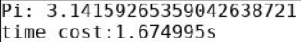
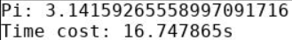

# 高性能并行计算第 3 次作业

姓名: 张子栋			学号: 2020317210101

**代码地址**:`/home/2020317210101/work3`
 `https://github.com/Bluuur/MarkdownNotes/tree/main/高性能并行计算/Code3`

### 题目 1

使用 MPI 广播改写 Pi 计算程序

```C
//
// Created by ZidongZh on 2022/10/6.
//

#include<stdio.h>
#include<mpi.h>

int main(int argc, char *argv[]) {
    double x;
    double sum;
    double h;
    double pi;
    double tick;
    double tack;

    int rank;
    int size;
    long long n;
    MPI_Init(&argc, &argv);
    MPI_Comm_rank(MPI_COMM_WORLD, &rank);
    MPI_Comm_size(MPI_COMM_WORLD, &size);

    n = 0;
    if (0 == rank) {
        printf("Please enter n:");
        scanf("%d", &n);
        tick = MPI_Wtime();
    }

    MPI_Bcast(&n, 1, MPI_INT, 0, MPI_COMM_WORLD);

    h = 1.0 / (double) n;
    sum = 0.0;

    int i;
    for (i = rank + 1; i <= n; i += size) {
        x = h * ((double) i - 0.5);
        sum += (4 / (1 + x * x));
    }
    sum *= h;

    MPI_Reduce(&sum, &pi, 1, MPI_DOUBLE, MPI_SUM, 0, MPI_COMM_WORLD);

    if (rank == 0) {
        tack = MPI_Wtime();
        printf("Pi: %0.20f\ntime cost:%fs\n", pi, tack - tick);
    }
    return 0;
}
```

### 运行结果



### 题目 2

reduce

```C
//
// Created by ZidongZh on 2022/10/6.
//

#include<stdio.h>
#include "mpi.h"

int main(int argc, char *argv[]) {
    static int NUM_STEPS = 1000000000;

    int rank;
    int size;

    double pi;
    double step;
    double x;
    double sum;
    double start;
    double finish;

    MPI_Init(&argc, &argv);
    MPI_Comm_rank(MPI_COMM_WORLD, &rank);
    MPI_Comm_size(MPI_COMM_WORLD, &size);
    MPI_Bcast(&NUM_STEPS, 1, MPI_INT, 0, MPI_COMM_WORLD);

    step = 1.0 / (double) NUM_STEPS;
    sum = 0.0;

    if (rank == 0) {
        start = MPI_Wtime();
    }

    int i;
    for (i = rank; i < NUM_STEPS; i += size) {
        x = step * ((double) i - 0.5);
        sum += 4.0 / (1.0 + x * x);
    }

    sum = step * sum;

    MPI_Reduce(&sum, &pi, 1, MPI_DOUBLE, MPI_SUM, 0, MPI_COMM_WORLD);

    if (rank == 0) {
        finish = MPI_Wtime();
        printf("Pi: %.20f\nTime cost: %fs\n", pi, finish - start);
    }

    MPI_Finalize();
    return 0;
}

```

### 运行结果

