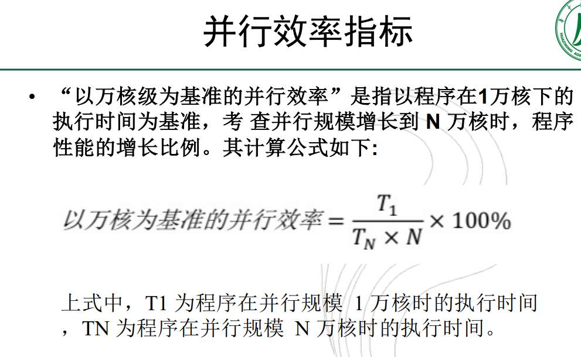
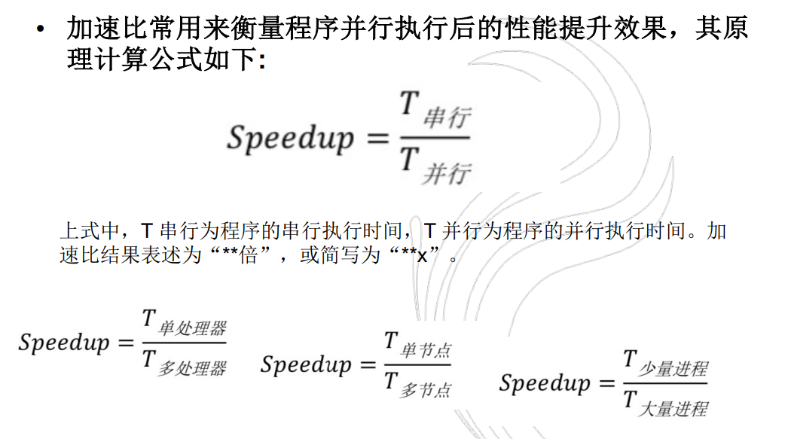

# 高性能并行计算

## 填空

1. `gcc` 编译 OpenMP 程序

   + ```shell
     gcc -fopenmp filename.c # 编译
     
     export OPM_NUM_THREADS=4 # 设置环境变量 线程数
     ./a.out # 运行可执行文件
     ```

2. MPI 的概念 `PPT238`

   + Massage Passing Interface
     + 是消息传递函数库的标准规范, 由 MPI 论坛开发, 支持 Fortran 和 C
       + 一种新的库描述, 不是一种语言, 共有上百个函数调用接口, 在 Fortran 和 C 语言中可以直接对这些函数进行调用.
       + MPI 是一种标准或规范的代表, 而不是特指某一个对它的具体实现
       + MPI 是一种消息传递编程模型, 并称为这种编程模型的代表和事实上的标准.

3. 日本的超算

   + 日本曾经排名第一的超级计算机 「地球模拟器」 用于气象预报
   + 中国「神威」「银河 III」「曙光」在中央气象台
   + 中国国家超级计算中心
     + 天津 天河一号
     + 深圳 曙光 6000
     + 长沙 天河一号
     + 济南 神威蓝光
     + 广州 天河二号
     + 无锡 神威 太湖之光

4. 并行效率计算

   + 
     
   + 加速比
     + 

5. OpenMP

   + OpenMP 应用编程接口 API 是在共享存储体系结构上的一个编程模型
   + 包含三个基本 API
     + 编译制导(Compiler Directive)
     + 运行库例程 (Runtime Library)
     + 环境变量(Environment  Variables)
   + 支持增量并行化(Incremental Parallelization)
   + 是 C/C++ 和 Fortran 等的应用编程接口
   + OpenMP 不包含的性质
     + 不是建立在分布式存储系统上的
     + 不是所有的环境下都是一样的
     + 不能保证让多数共享存储器均能有效利用

6. 云计算服务

   + 云计算是通过网络按需提供可动态伸缩的廉价计算服务。
   + 云计算是一种商业计算模型。它将计算任务分布在大量计算机构成的资源池上，使各种应用系统能够根据需要获取计算力、存储空间和信息服务。
   + 分为三类
     + 软件即服务 SaaS
     + 平台即服务 PaaS
     + 硬件即服务 IaaS

7. 最早集群

   + 贝奥武夫机群（Beowulf cluster），又称贝奥伍尔夫集群，是一种高性能的并行计算机集群结构，特点是使用廉价的个人电脑硬件组装以达到最优的性能/价格比。得名于古英语著名史诗《貝奧武夫》。于1994年最早在NASA为Donald Becker等人开发，是目前科学计算中流行的一类并行计算机。
   + 集群
     + 量产的商业处理器和内存
       + 处理器的性能至关重要
     + 同样有远程内存访存延迟
     + 需要消息传递
       + 最小化通讯开销
     + 全部是量产的商业部件
     + 各机器可以有独立的 OS
     + 各机器有独立 IO

8. 进程/线程

   + 进程
     + 一段程序的执行过程
     + 是一个具有一定独立功能的程序关于某次数据集合的一次运行活动，它是操作系统分配资源的基本单元
     + 进程是一个实体。每一个进程都有它自己的地址空间，一般情况下，包括文本区域（text region）、数据区域（data region）和堆栈（stack region）。文本区域存储处理器执行的代码；数据区域存储变量和进程执行期间使用的动态分配的内存；堆栈区域存储着活动过程中调用的指令和本地变量。
     + 进程是一个「执行中的程序」。程序是一个没有生命的实体，只有处理器赋予程序生命时，它才能成为一个活动的实体，我们称其为进程。
   + 线程
     + 通常在一个进程中可以包含若干个线程，当然一个进程中至少有一个线程，不然没有存在的意义。
     + 线程可以利用进程所拥有的资源，在引入线程的操作系统中，通常都是把进程作为分配资源的基本单位，而把线程作为独立运行和独立调度的基本单位，由于线程比进程更小，基本上不拥有系统资源，故对它的调度所付出的开销就会小得多，能更高效的提高系统多个程序间并发执行的程度。
   + 进程和线程的主要差别在于它们是不同的操作系统资源管理方式。进程有独立的地址空间，一个进程崩溃后，在保护模式下不会对其它进程产生影响，而线程只是一个进程中的不同执行路径。线程有自己的堆栈和局部变量，但线程之间没有单独的地址空间，一个线程死掉就等于整个进程死掉，所以多进程的程序要比多线程的程序健壮，但在进程切换时，耗费资源较大，效率要差一些。

9. 编译模式区别

   + 编译指导指令
     + `critical`：每次允许一个线程执行
     + `single`：只由一个线程执行一次
     + `automic`：功能类似critical，不过所属指令为简单的表达式，这样减少开销
     + `master`：仅由主线程执行

10. OpenMP 函数相关参数

    1. `omp_set_num_threads`：设置线程数，用在程序中
    2. `omp_get_num_threads`：获取线程总数
    3. `omp_get_thread_num`：获取当前线程序号id
    4. `OMP_NUM_THREADS`：环境变量级别的线程总数限定，优先级最低，`omp_set_num_threads` 是程序级别的，优先级较高；子句 `num_threads(i)` 是block级别，优先级最高

11. 计算单位

    | 计算单位 |   大小    |
    | :------: | :-------: |
    |   Kilo   |  $10^3$   |
    |   Mega   |  $10^6$   |
    |   Giga   | $10^{9}$  |
    |   Tera   | $10^{12}$ |
    |   Peta   |  $10^15$  |
    |   Exa    | $10^{18}$ |
    |  Zetta   | $10^{21}$ |

    


## 选择

1. MPI greeting

   + ```C
     #include <stdio.h>
     #include "mpi.h"
     
     main (int argc, char* argv[]) {
         int numprocs, myid, source;
         MPI_Status status;
         char message[100];
         
         // 启动 MPI 环境, 标志并代码开始
         MPI_Init(&argc, &argv);
         // 获得当前通信域中的进程数目，数目保存在变量 myid 中。
         MPI_Comm_rank(MPI_COMM_WORLD, &myid);
         // 获取进程数目
         MPI_Comm_size(MPI_COMM_WORLD, &numprocs);
         
         if (myid != 0) {
             strcpy(message, "Hello World!");
             
             // 发送消息
             MPI_Send(message, strlen(message) + 1, MPI_CHAR, 0, 99, MPI_COMM_WORLD);
             
             for (source = 1; source < numprocs; source++) {
                 // 接收消息
                 MPI_Recv(message, 100, MPI_CHAR, source, 99, MPI_COMM_WORLD, &status);
                 printf("%d\n", message);
             }
         }
         // 从 MPI 环境中退出
         MPI_Finalize();
     }
     ```

   + MPI 初始化 `int MPI_Init(int *argc, char **argv)`

     + MPI 程序的第一个调用, 完成 MPI 程序的所有初始化工作, 所有 MPI 程序的第一条可执行语句.

     + 启动 MPI 环境, 标志并行代码开始.

     + 并行代码前, 除 `MPI_Initialize()` 的第一个 MPI 函数

     + 要求 `main` 函数必须带参数运行, 否则出错

   + `MPI_COMM_WORLD` 通信空间（通信子）

   + 发送消息 `int MPI_Send(void *buf, int count, MPI_Datatype datatype, int dest, int tag, MPI_Comm comm)`

     + `buf` 要发送内容的首地址

     + `count` 发送的元素数目

     + `datatype` 要发送的数据类型

       + C 语言中的数据类型，会与 MPI 的数据类型绑定

       + |   MPI(C 语言绑定)   | C 语言中的数据类型 |
         | :-----------------: | :----------------: |
         |     `MPI_BYTE`      |                    |
         |    `MPI_DOUBLE`     |      `double`      |
         |     `MPI_FLOAT`     |      `float`       |
         |      `MPI_INT`      |       `int`        |
         | `MPI_UNSIGNED_CHAR` |  `unsigned char`   |
         |     `MPI_CHAR`      |   `signed char`    |

     + 消息信封 `<源/目标地址(source/dest), 消息标签(tag), 通信空间(MPI_Comm)>` 表示接收/发送消息的地址

       + `source` / `dest` 指源/目标进程的进程号, 即从函数 `MPI_Comm_rank` 获得的 `rank` 值

   + 接收消息 `int MPI_Recv(void *buf, int count, MPI_Datatype datatype, int source, int tag, MPI_Comm comm, MPI_Status *status)`

     + `status` 返回状态
       + 在 C 语言中, 状态变量至少包括
         + `MPI_SOURCE`
         + `MPI-TAG`
         + `MPI_ERROR`
       + `status` 通过 `MPI_Status status;` 语句生成

   + MPI 结束 `int MPI_Finalize(void)`

     + MPI 程序的最后一个调用, 结束 MPI 程序的运行, 是 MPI 程序的最后一条可执行语句
     + 标志并行代码的结束, 结束除主进程以外的其他进程
     + 之后的代码仍然可以在主进程(rank = 0)运行 

2. MPI 编程初始化

   + 见上一条

3. 指令集 Intel

   + 复杂指令集
     + X86
       + Intel
       + AMD
   + 精简指令集
     + ARM
     + RISC-V
     + Alpha

4. 并行计算的用处

   + 天气预报
   + 核武器模拟
   + 国防安全
   + 天体物理模拟
   + 地球物理勘探
   + 物质结构分析
   + 生物信息学

5. 峰值计算的单位换算

## 简答

1. OpenMP 的结构,并行 1-100 的求和 for 循环
2. 并行域的数值分析 `private` `lastprivate` `firstprivate`
3. OpenMP Fork-Join 并行执行模型

## 代码和改错

1. 并行 pi (并行域), 代码改错

2. padding 解决伪共享

3. MPI 的编译和运行

   + ```shell
     mpif77 hello.f #两个都可以, 默认生成 a.out 的可执行文件
     mpicc hello.c
     ```

     ```shell
     mpif77 -o hello hello.f #两个都可以, 生成 hello 可执行文件
     mpicc -o hello hello.c
     ```

     ```shell
     mpirun -np 4 a.out #运行, 指定线程数为4
     ```

4. 改错
   ```C
   #include <stdio.h>
   #include "mpi.h"
   
   main (int argc, char *argv[]) {
       MPI_Init(&argc, &argv);
       printf("Hello, world!\n");
       MPI_Finalize();
   }
   ```

   

## 讨论

1. 广播的作用效果及实现 3x3 矩阵分享 (用广播, 1号发给其他线程 )
2. 高性能的理解, 前景 在生信和大数据的应用关系, 以及是否量子计算取代传统计算